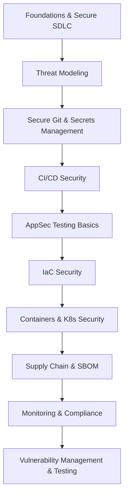

# 🔐 Introduction to DevSecOps: Principles, Practices & Secure Delivery

Welcome to the **Introduction to DevSecOps Course**, where you will learn how to integrate security seamlessly into modern software development and operations.  
This course is designed for bachelor-level students who want to build a strong foundation in DevSecOps culture, practices, and tooling.  

Through **hands-on labs and focused lectures**, you’ll gain experience with secure coding, automated testing, infrastructure-as-code, container security, and vulnerability management — the same approaches used by leading engineering teams worldwide.

---

## 📚 Course Roadmap

Practical modules designed for incremental skill development:

| #  | Module                                    | Key Topics & Technologies                                                                 |
|----|-------------------------------------------|------------------------------------------------------------------------------------------|
| 1  | **Foundations & Secure SDLC**             | DevSecOps principles, shift-left culture, OWASP Top 10, secure coding practices           |
| 2  | **Threat Modeling & Security Requirements** | STRIDE, attack surfaces, risk analysis, integrating requirements into agile workflows     |
| 3  | **Secure Git & Secrets Management**       | Git security, signed commits, secret scanning, vaulting secrets                           |
| 4  | **CI/CD Security & Build Hardening**      | Secure pipelines, artifact integrity, quality gates                                       |
| 5  | **Application Security Testing Basics**   | SAST, DAST, SCA, tool integration into pipelines                                          |
| 6  | **Infrastructure-as-Code Security**       | Terraform/Ansible, misconfiguration scanning, policy-as-code                              |
| 7  | **Containers & Kubernetes Security**      | Docker/K8s fundamentals, image scanning, RBAC, PodSecurity, runtime protection            |
| 8  | **Software Supply Chain Security & SBOM** | Dependency risk, SBOM generation (CycloneDX/SPDX), artifact signing, provenance           |
| 9  | **Monitoring, Compliance & Improvement**  | Logging/metrics, KPIs (MTTR, vuln age), GDPR/NIST/ISO basics, maturity models             |
| 10 | **Vulnerability Management & Testing**    | Lifecycle (discovery → triage → remediation → reporting), CVSS, SAST/DAST/SCA workflows   |

---

## 🖼 Module Flow Diagram

---

## 🛠 Lab-Based Learning Experience

**80% of your grade comes from hands-on labs** — each one builds practical security skills:

1. **Lab Structure**

   * Realistic, task-oriented challenges with clear goals
   * Safe environments using containers, local VMs, or cloud credits

2. **Submission Workflow**

   * Fork course repository → Create lab branch → Complete tasks
   * Push to fork → Open Pull Request → Receive feedback & evaluation

3. **Grading Advantage**

   * **Perfect Labs (10/10)**: Exam exemption + bonus points toward A
   * **On-Time (≥6/10)**: Guaranteed pass (C or higher)
   * **Late**: Maximum 6/10

---

## 📊 Evaluation Framework

*Transparent assessment for skill validation*

### Grade Composition

* Labs (10 × 8 points each): **80%**
* Final Exam (comprehensive): **20%**

### Performance Tiers

* **A (90-100)**: Mastery with innovative solutions
* **B (75-89)**: Consistent completion, minor improvement needed
* **C (60-74)**: Basic competency, some gaps
* **D (0-59)**: Fundamental gaps, re-attempt required

---

## ✅ Success Path

> *"Complete all labs with ≥6/10 to pass. Perfect lab submissions grant exam exemption and bonus points toward an A."*
