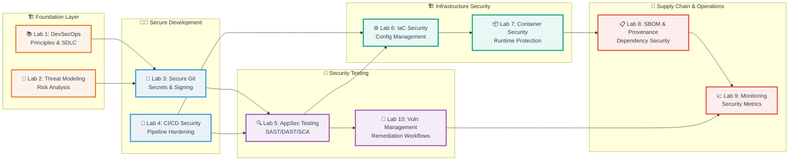

# 🔐 Introduction to DevSecOps: Principles, Practices & Secure Delivery

[](#-lab-based-learning-experience)
[](#-evaluation-framework)
[](#-lab-based-learning-experience)
[](#-course-roadmap)

Welcome to the **Introduction to DevSecOps Course**, where you will learn to **integrate security seamlessly into modern software development and operations**.  
This course is designed to provide a comprehensive understanding of DevSecOps culture, practices, and tooling for building secure software systems.  
Through **hands-on labs and focused lectures**, you'll gain experience with secure coding, automated testing, infrastructure-as-code security, container hardening, and vulnerability management — the same approaches used by leading engineering teams worldwide.

---

## 📚 Course Roadmap

**10-module intensive course** with practical labs designed for incremental skill development:

> **Note:** Labs 11-12 are **optional bonus labs** for extra credit. Complete them to boost your grade or explore advanced security hardening techniques!

| Lab | Module                                      | Key Topics & Technologies                                                                 |
|-----|---------------------------------------------|------------------------------------------------------------------------------------------|
| 1   | **Foundations & Secure SDLC**               | DevSecOps principles, shift-left culture, OWASP Top 10, secure coding practices           |
| 2   | **Threat Modeling & Security Requirements** | STRIDE analysis, attack surfaces, risk assessment, agile security integration             |
| 3   | **Secure Git & Secrets Management**         | Git security, signed commits, secret scanning, vault integration, secure workflows        |
| 4   | **CI/CD Security & Build Hardening**        | Secure pipelines, artifact integrity, quality gates, SBOM generation, SCA integration     |
| 5   | **Application Security Testing**            | SAST, DAST, IAST, security tool integration, automated testing pipelines                  |
| 6   | **Infrastructure-as-Code Security**         | Terraform/Pulumi/Ansible scanning, misconfiguration detection, policy-as-code            |
| 7   | **Container & Kubernetes Security**         | Docker/K8s fundamentals, image scanning, RBAC, PodSecurity, runtime protection           |
| 8   | **Software Supply Chain Security**          | Dependency analysis, SBOM (CycloneDX/SPDX), artifact signing, provenance verification    |
| 9   | **Monitoring, Compliance & Improvement**    | Security metrics, KPIs (MTTR, vuln age), GDPR/NIST/ISO basics, maturity models          |
| 10  | **Vulnerability Management & Response**     | Discovery, triage, remediation workflows, CVSS scoring, security testing orchestration    |
| —   | **🎁 Bonus: Reverse Proxy Hardening**      | Nginx security headers, TLS termination, rate limiting, timeout configuration             |
| —   | **🎁 Bonus: VM-backed Container Isolation** | Kata Containers, runtime comparison, isolation testing, security/performance tradeoffs    |

---

## 🗒️ Lecture Slide Overview

Index extracted from `lectures/lec*.md`. Each lecture links to its source file and shows an approximate slide count.

<details>
<summary>📌 Lecture 1 - DevSecOps Foundations & Secure SDLC (48 slides)</summary>

- 📍 Slide 1 – 🌍 What is DevSecOps?
- 📍 Slide 2 – 🔄 Why Security in DevOps Matters
- 📍 Slide 3 – 🧑‍🤝‍🧑 DevOps Culture & Security Culture
- 📍 Slide 4 – 🕰️ The “Shift-Left” Philosophy
- 📍 Slide 5 – 📊 Industry Reports & Trends
- 📍 Slide 6 – 🏗️ What is the Secure Software Development Life Cycle (Secure SDLC)?
- 📍 Slide 7 – 📜 History of SDLC Models
- 📍 Slide 8 – 🧩 Secure SDLC Phases (Overview)
- 📍 Slide 9 – ⚖️ Traditional SDLC vs Secure SDLC
- 📍 Slide 10 – 🧮 Key Standards & Frameworks
- 📍 Slide 11 – 🏆 Introduction to OWASP
- 📍 Slide 12 – 📈 Evolution of OWASP Top 10
- 📍 Slide 13 – 🔥 OWASP Top 10 (2021) Categories
- 📍 Slide 14 – ⚡ Real Incidents Mapped to OWASP Top 10
- 📍 Slide 15 – 🌐 What Are Vulnerabilities?
- 📍 Slide 16 – 💉 SQL Injection (SQLi)
- 📍 Slide 17 – 📜 Cross-Site Scripting (XSS)
- 📍 Slide 18 – 🔑 Authentication & Session Vulnerabilities
- 📍 Slide 19 – 🛑 Cross-Site Request Forgery (CSRF)
- 📍 Slide 20 – 🗄️ Insecure Deserialization & Logic Bugs
- 📍 Slide 21 – ☁️ Misconfigurations (Cloud, Servers, Containers)
- 📍 Slide 22 – 🧩 Case Study Examples for Vulnerabilities
- 📍 Slide 23 – 🔒 Security as Code
- 📍 Slide 24 – ⚙️ Security Champions & Roles in Teams
- 📍 Slide 25 – 🧪 Security by Design
- 📍 Slide 26 – 🛠️ Tooling Ecosystem Overview (High-Level)
- 📍 Slide 27 – 📚 Knowledge Sources
- 📍 Slide 28 – 💻 What is Secure Coding?
- 📍 Slide 29 – 📐 Secure Coding Guidelines
- 📍 Slide 30 – 🧑‍💻 Common Coding Mistakes
- 📍 Slide 31 – 📊 Languages & Secure Coding
- 📍 Slide 32 – 🔍 Code Review & Pair Programming
- 📍 Slide 33 – 🧭 What is MITRE ATT\&CK?
- 📍 Slide 34 – 📊 MITRE ATT\&CK Matrix
- 📍 Slide 35 – 🛠️ Examples of ATT\&CK Techniques
- 📍 Slide 36 – 🌐 What is MITRE ATLAS?
- 📍 Slide 37 – 🤖 AI-Specific Threat Examples
- 📍 Slide 38 – 🔗 Using ATT\&CK/ATLAS in DevSecOps
- 📍 Slide 39 – 🏢 Case Study: Equifax Breach (2017)
- 📍 Slide 40 – ☁️ Case Study: Capital One Breach (2019)
- 📍 Slide 41 – 🐍 Case Study: Log4Shell (2021)
- 📍 Slide 42 – 💳 Case Study: Heartbleed (2014)
- 📍 Slide 43 – 📡 Case Study: SolarWinds (2020)
- 📍 Slide 44 – 📖 Recommended Books
- 📍 Slide 45 – 🎓 Certifications & Training
- 📍 Slide 46 – 🛡️ Maturity Models for DevSecOps
- 📍 Slide 47 – 📈 KPIs & Metrics for DevSecOps
- 📍 Slide 48 – 🚀 Future of DevSecOps

</details>

<details>
<summary>📌 Lecture 2 - Threat Modeling & Security Requirements (30 slides)</summary>

- 📍 Slide 1 – 🧭 What Is Threat Modeling?
- 📍 Slide 2 – 📈 Why It Matters (Outcomes & Fresh Stats)
- 📍 Slide 3 – 🏷️ Assets, Threats, Vulnerabilities, Risk (Clear Terms)
- 📍 Slide 4 – 🧱 Trust Boundaries & 🔐 Data Sensitivity
- 📍 Slide 5 – 🌐 Attack Surface 101 (What Expands It?)
- 📍 Slide 6 – 🔁 Where Threat Modeling Fits (SDLC & Agile)
- 📍 Slide 7 – 🗺️ Data Flow Diagrams (DFDs) Essentials
- 📍 Slide 8 – 🧭 Scoping & Assumptions
- 📍 Slide 9 – 🧩 STRIDE Framework Intro
- 📍 Slide 10 – 🪪 S = Spoofing
- 📍 Slide 11 – 🧪 T = Tampering
- 📍 Slide 12 – 🧾 STRIDE Letters in Practice (Setup)
- 📍 Slide 13 – 🧾 R = Repudiation
- 📍 Slide 14 – 🔐 I = Information Disclosure
- 📍 Slide 15 – 🛑 D = Denial of Service (DoS)
- 📍 Slide 16 – 🧰 E = Elevation of Privilege (EoP)
- 📍 Slide 17 – 🕵️‍♀️ LINDDUN Overview
- 📍 Slide 18 – 📚 LINDDUN Methods & Aids
- 📍 Slide 19 – 🧪 LINDDUN Use Cases
- 📍 Slide 20 – 🏛️ PASTA Overview
- 📍 Slide 21 – 🧪 PASTA 7 Stages in Detail
- 📍 Slide 22 – 📊 PASTA Case Study
- 📍 Slide 23 – 🚀 VAST Overview
- 📍 Slide 24 – 🔌 VAST Integrations & Use Cases
- 📍 Slide 25 – 💹 FAIR Overview
- 📍 Slide 26 – 🧮 FAIR in Practice
- 📍 Slide 27 – 🧱 Threagile Overview
- 📍 Slide 28 – 🧰 Threagile Workflow & Use Cases
- 📍 Slide 29 – 🐉 OWASP Threat Dragon Overview
- 📍 Slide 30 – 🧪 Threat Dragon Workflow & Use Cases

</details>

<details>
<summary>📌 Lecture 3 - Secure Git & Secrets Management (40 slides)</summary>

- 📍 Slide 1 – 🌍 Brief History of Git
- 📍 Slide 2 – 🔐 Why Git Security is Important
- 📍 Slide 3 – 🗃️ Version Control System (VCS) Basics Recap
- 📍 Slide 4 – 🚨 Common Git-Related Security Incidents
- 📍 Slide 5 – 🧾 Commit Identity Basics
- 📍 Slide 6 – 🖊️ Signed Commits Explained
- 📍 Slide 7 – 🔑 PGP/GPG Keys in Git
- 📍 Slide 8 – 🪪 SSH Signing of Commits
- 📍 Slide 9 – 🛡️ Verification of Commits in Platforms
- 📍 Slide 10 – ⚖️ GPG vs SSH Commit Signing
- 📍 Slide 11 – 🏢 Organizational Enforcement of Signed Commits
- 📍 Slide 12 – ❌ What Are “Secrets”?
- 📍 Slide 13 – 🔓 How Secrets Leak into Git Repositories
- 📍 Slide 14 – 📂 Examples of Leaked Secrets in Public Repos
- 📍 Slide 15 – 📉 Impact of Secret Leaks
- 📍 Slide 16 – ⚠️ Why Deleting from Git History Is Not Enough
- 📍 Slide 17 – 🔍 Manual vs Automated Secret Scanning
- 📍 Slide 18 – 🛠️ GitGuardian for Secret Scanning
- 📍 Slide 19 – 🛠️ TruffleHog for Secret Scanning
- 📍 Slide 20 – 🛠️ Gitleaks for Secret Scanning
- 📍 Slide 21 – 📦 Built-in Scanners in Git Platforms
- 📍 Slide 22 – 📊 Stats & Trends of Secret Leaks
- 📍 Slide 23 – 🧰 History of Secret Storage
- 📍 Slide 24 – 🔑 Environment Variables for Secrets
- 📍 Slide 25 – 📜 Config Files & .gitignore
- 📍 Slide 26 – 🛡️ Secrets Vaulting Tools Overview
- 📍 Slide 27 – ⚡ Secret Rotation & Lifecycle Management
- 📍 Slide 28 – 🧩 Integrating Vaults with CI/CD Pipelines
- 📍 Slide 29 – 🔄 Dynamic vs Static Secrets
- 📍 Slide 30 – 🧹 Cleaning Git History of Secrets
- 📍 Slide 31 – 🚦 Pre-Commit Hooks for Preventing Leaks
- 📍 Slide 32 – 🛠️ Secrets Scanning in CI/CD Pipelines
- 📍 Slide 33 – 🕸️ Zero-Trust Approach to Git Security
- 📍 Slide 34 – 🌐 Emerging Trends: P2P & Blockchain Git
- 📍 Slide 35 – 🔮 Future of Git Security & Secret Management
- 📍 Slide 36 – 🏢 Case Study: GitHub Token Leaks
- 📍 Slide 37 – 🚨 Case Study: Supply-Chain Attacks via Repos
- 📍 Slide 38 – 📘 Industry Standards & Compliance Requirements
- 📍 Slide 39 – 📝 Best Practices Checklist for Developers
- 📍 Slide 40 – 🎯 Summary & Hands-On Practice

</details>

<details>
<summary>📌 Lecture 4 - CI/CD Security & Build Hardening (40 slides)</summary>

- 📍 Slide 1 – 🏗️ What is CI/CD? (Continuous Integration/Continuous Deployment)
- 📍 Slide 2 – 🔄 Evolution of CI/CD: From Manual Builds to Modern Pipelines
- 📍 Slide 3 – 🏛️ CI/CD Architecture Components & Trust Boundaries
- 📍 Slide 4 – ⚙️ Popular CI/CD Platforms Overview (Jenkins, GitHub Actions, GitLab CI, Azure DevOps)
- 📍 Slide 5 – 🚨 Why CI/CD Pipelines Became High-Value Attack Targets
- 📍 Slide 6 – 📊 The OWASP Top 10 CI/CD Security Risks (2024)
- 📍 Slide 7 – 🔗 Supply Chain Attacks via CI/CD: Famous Case Studies
- 📍 Slide 8 – 🔐 Authentication & Authorization in CI/CD Pipelines
- 📍 Slide 9 – 🎭 Role-Based Access Control (RBAC) for Pipeline Resources
- 📍 Slide 10 – 🔑 Service Account Security & Credential Management
- 📍 Slide 11 – 🛡️ Multi-Factor Authentication (MFA) for Pipeline Access
- 📍 Slide 12 – ⚖️ Principle of Least Privilege in CI/CD Workflows
- 📍 Slide 13 – 🕸️ Zero-Trust Approaches to Pipeline Security
- 📍 Slide 14 – 📋 Infrastructure-as-Code (IaC) for Pipeline Configuration
- 📍 Slide 15 – 🔒 Securing Pipeline Configuration Files (YAML/JSON Security)
- 📍 Slide 16 – 🏰 Build Environment Isolation & Sandboxing
- 📍 Slide 17 – 🚫 Preventing Poisoned Pipeline Execution (PPE) Attacks
- 📍 Slide 18 – 🌐 Network Segmentation for CI/CD Infrastructure
- 📍 Slide 19 – 📂 Secure Artifact Storage & Repository Management
- 📍 Slide 20 – 🧹 Container Security in Build Environments
- 📍 Slide 21 – ⏱️ Resource Limits & Denial of Service Prevention
- 📍 Slide 22 – 📦 Secure Artifact Creation & Packaging
- 📍 Slide 23 – 🔏 Digital Signing & Verification of Build Artifacts
- 📍 Slide 24 – 📋 Software Bill of Materials (SBOM) Generation
- 📍 Slide 25 – 🏷️ Container Image Signing with Cosign/Notary
- 📍 Slide 26 – 🧪 Build Reproducibility & Deterministic Builds
- 📍 Slide 27 – 🔍 Integrity Checks: Checksums, Hashes, and Verification
- 📍 Slide 28 – 📊 Artifact Provenance & Supply Chain Transparency
- 📍 Slide 29 – 🚦 Quality Gates: Definition and Implementation
- 📍 Slide 30 – 🔒 Security Gates vs. Quality Gates in CI/CD
- 📍 Slide 31 – ⚡ Automated Security Controls in Pipelines
- 📍 Slide 32 – 📈 Policy-as-Code for Build Security
- 📍 Slide 33 – 🛑 Breaking Builds on Security Policy Violations
- 📍 Slide 34 – 📊 Security Metrics & KPIs for Pipeline Health
- 📍 Slide 35 – 📚 Third-Party Dependency Security Risks
- 📍 Slide 36 – 🔍 Software Composition Analysis (SCA) in Build Pipelines
- 📍 Slide 37 – ⚠️ Vulnerability Scanning of Dependencies
- 📍 Slide 38 – 📋 License Compliance Scanning & Management
- 📍 Slide 39 – 🔄 Automated Dependency Updates & Patch Management
- 📍 Slide 40 – 🕸️ Dependency Confusion & Typosquatting Prevention

</details>

<details>
<summary>📌 Lecture 5 - Application Security Testing Basics (26 slides)</summary>

- 📍 Slide 1 – 🔍 What is Application Security Testing? (AST Overview)
- 📍 Slide 2 – 📈 Evolution of Application Security Testing
- 📍 Slide 3 – 🎯 Types of Security Vulnerabilities We're Testing For
- 📍 Slide 4 – ⚖️ Static vs. Dynamic vs. Interactive Testing Comparison
- 📍 Slide 5 – 🧩 The Testing Pyramid for Application Security
- 📍 Slide 6 – 🔬 Deep Dive into SAST: Definition and Core Concepts
- 📍 Slide 7 – 🛠️ Popular SAST Tools and Platform Overview
- 📍 Slide 8 – ⚡ SAST Strengths and Limitations
- 📍 Slide 9 – 🎯 SAST Implementation Best Practices
- 📍 Slide 10 – 🔧 Hands-on SAST: Tool Configuration and Output Analysis
- 📍 Slide 11 – 🌐 Deep Dive into DAST: Black-box Runtime Testing
- 📍 Slide 12 – 🛠️ Popular DAST Tools and Platform Overview
- 📍 Slide 13 – ⚡ DAST Strengths and Limitations
- 📍 Slide 14 – 🎯 DAST Implementation Best Practices
- 📍 Slide 15 – 🔧 Hands-on DAST: OWASP ZAP Configuration and Testing
- 📍 Slide 16 – 🧬 Deep Dive into IAST: Runtime Instrumentation Testing
- 📍 Slide 17 – 🛠️ Popular IAST Tools and Platform Overview
- 📍 Slide 18 – ⚡ IAST Strengths and Limitations
- 📍 Slide 19 – 🎯 IAST Implementation Best Practices
- 📍 Slide 20 – 🔧 Hands-on IAST: Agent-based Testing Setup
- 📍 Slide 21 – 🚀 Integrating Security Testing into CI/CD Pipelines
- 📍 Slide 22 – 📊 Tool Orchestration and Security Dashboard Creation
- 📍 Slide 23 – ⚖️ Balancing Security and Development Velocity
- 📍 Slide 24 – 🔄 Advanced Integration Patterns and GitOps
- 📍 Slide 25 – 🌟 Modern Trends and Future of Application Security Testing
- 📍 Slide 26 – 🎯 Summary & Key Takeaways

</details>

<details>
<summary>📌 Lecture 6 - Infrastructure-as-Code Security (19 slides)</summary>

- 📍 Slide 1 – 🌍 What is Infrastructure-as-Code (IaC)?
- 📍 Slide 2 – 🚨 Why IaC Security Matters
- 📍 Slide 3 – 📊 IaC Tool Landscape Overview
- 📍 Slide 4 – 🔒 Common IaC Security Risks
- 📍 Slide 5 – 🧭 IaC in the DevSecOps Pipeline
- 📍 Slide 6 – 🏗️ Terraform Deep Dive & Security Concerns
- 📍 Slide 7 – 🔑 Managing Secrets in Terraform
- 📍 Slide 8 – 🛡️ Terraform Security Best Practices
- 📍 Slide 9 – 💻 Hands-On: Secure Terraform Workflow
- 📍 Slide 10 – 🚀 Pulumi Overview & Security Model
- 📍 Slide 11 – 🧩 Pulumi Policy-as-Code (CrossGuard)
- 📍 Slide 12 – 💻 Hands-On: Secure Pulumi Deployment
- 📍 Slide 13 – ⚙️ Ansible Overview & Security Challenges
- 📍 Slide 14 – 🛡️ Ansible Security Best Practices
- 📍 Slide 15 – 💻 Hands-On: Secure Ansible Playbook
- 📍 Slide 16 – 🔍 IaC Security Scanning Tools Deep Dive
- 📍 Slide 17 – 📋 Policy-as-Code Frameworks
- 📍 Slide 18 – ☁️ Compliance & Security Standards
- 📍 Slide 19 – 🎯 Case Studies, Future Trends & Summary

</details>

<details>
<summary>📌 Lecture 7 - Container & Kubernetes Security (18 slides)</summary>

- 📍 Slide 1 – 🐳 Container Technology Overview & Evolution
- 📍 Slide 2 – 🏗️ Docker Architecture & Security Model
- 📍 Slide 3 – 📦 Container Images & Layered Filesystem
- 📍 Slide 4 – 🔍 Container Image Security Scanning
- 📍 Slide 5 – 🛡️ Container Runtime Security
- 📍 Slide 6 – 🔐 Secrets Management in Containers
- 📍 Slide 7 – 📋 Container Compliance & Hardening
- 📍 Slide 8 – ☸️ Kubernetes Architecture & Components
- 📍 Slide 9 – 🔑 Kubernetes Authentication & Authorization
- 📍 Slide 10 – 🚪 Kubernetes Admission Control & Policies
- 📍 Slide 11 – 🛡️ Pod Security & Isolation
- 📍 Slide 12 – 🔒 Kubernetes Secrets & ConfigMaps
- 📍 Slide 13 – 📊 Kubernetes Auditing & Monitoring
- 📍 Slide 14 – 🔍 Kubernetes Security Scanning
- 📍 Slide 15 – 🌐 Kubernetes Network Security
- 📍 Slide 16 – 🏗️ Secure Kubernetes CI/CD Pipelines
- 📍 Slide 17 – 🚨 Kubernetes Attack Scenarios & Defense
- 📍 Slide 18 – 🔮 Future Trends & Security Checklist

</details>

<details>
<summary>📌 Lecture 8 - Software Supply Chain Security (20 slides)</summary>

- 📍 Slide 1 – 🔗 What is Software Supply Chain Security?
- 📍 Slide 2 – 💥 Famous Supply Chain Breaches & Incidents
- 📍 Slide 3 – 🎯 Supply Chain Attack Vectors
- 📍 Slide 4 – 🛡️ Supply Chain Security Frameworks
- 📍 Slide 5 – 📊 Supply Chain Security in DevSecOps Pipeline
- 📍 Slide 6 – 🔍 Software Composition Analysis (SCA) Deep Dive
- 📍 Slide 7 – 🗂️ Vulnerability Databases & Tracking
- 📍 Slide 8 – 🛠️ Dependency Management Best Practices
- 📍 Slide 9 – 💻 Hands-On: Advanced SCA Tools
- 📍 Slide 10 – 📋 SBOM Formats: SPDX vs CycloneDX Deep Dive
- 📍 Slide 11 – 🔎 SBOM Consumption & Auditing
- 📍 Slide 12 – 📊 SBOM Diff Analysis & Change Tracking
- 📍 Slide 13 – 💻 Hands-On: SBOM-Driven Vulnerability Analysis
- 📍 Slide 14 – ✍️ Code Signing & Artifact Integrity
- 📍 Slide 15 – 🔐 Sigstore: Modern Signing Revolution
- 📍 Slide 16 – 📜 Provenance & Build Attestations
- 📍 Slide 17 – 💻 Hands-On: Signing & Provenance Verification
- 📍 Slide 18 – 🎯 SLSA Framework Implementation
- 📍 Slide 19 – 🔒 Securing the Build Pipeline
- 📍 Slide 20 – 🚀 Runtime Supply Chain Security

</details>

<details>
<summary>📌 Lecture 9 - Monitoring, Compliance & Improvement (23 slides)</summary>

- 📍 Slide 1 – 📊 Security Monitoring in DevSecOps
- 📍 Slide 2 – 🔍 What to Monitor: Logs, Metrics, Traces
- 📍 Slide 3 – 🛠️ Security Monitoring Tools & Platforms
- 📍 Slide 4 – 📈 Security Metrics vs Vanity Metrics
- 📍 Slide 5 – ⏱️ Time-Based KPIs: MTTD, MTTR, MTTA
- 📍 Slide 6 – 📊 Program Health KPIs
- 📍 Slide 7 – 💻 Hands-On: Building Security Dashboards
- 📍 Slide 8 – ⚖️ Compliance Basics for Developers
- 📍 Slide 9 – 🇪🇺 GDPR Essentials
- 📍 Slide 10 – 🏛️ NIST Cybersecurity Framework
- 📍 Slide 11 – 🌐 ISO 27001 Basics
- 📍 Slide 12 – 💳 Other Key Frameworks (Quick Overview)
- 📍 Slide 8 – ⚖️ Compliance Basics for Developers
- 📍 Slide 9 – 🇪🇺 GDPR (General Data Protection Regulation)
- 📍 Slide 10 – 🏛️ NIST Cybersecurity Framework
- 📍 Slide 11 – 🌐 ISO 27001 Information Security Management
- 📍 Slide 12 – 💳 Other Key Frameworks (Overview)
- 📍 Slide 13 – 🎯 Security Maturity Model Concepts
- 📍 Slide 14 – 🦅 OWASP SAMM (Software Assurance Maturity Model)
- 📍 Slide 15 – 📊 BSIMM (Building Security In Maturity Model)
- 📍 Slide 16 – 🚀 DevSecOps Maturity Assessment
- 📍 Slide 17 – 🔄 Feedback Loops & Security Improvement
- 📍 Slide 18 – 🤖 Compliance as Code & Automation

</details>

<details>
<summary>📌 Lecture 10 - Vulnerability Management & Response (17 slides)</summary>

- 📍 Slide 1 – 🔍 Vulnerability Discovery Methods
- 📍 Slide 2 – 🛠️ Security Testing Orchestration
- 📍 Slide 3 – 📊 Centralized Vulnerability Management
- 📍 Slide 4 – 📊 CVSS Scoring Deep Dive
- 📍 Slide 5 – ⚡ Advanced Prioritization: EPSS, KEV, SSVC
- 📍 Slide 6 – 🎯 Risk-Based Prioritization
- 📍 Slide 7 – 🚨 Triage Workflows & Decisions
- 📍 Slide 8 – 🔧 Remediation Strategies
- 📍 Slide 9 – ⏱️ SLA Management & Tracking
- 📍 Slide 10 – 🔄 Remediation Tracking & Verification
- 📍 Slide 11 – 💻 Hands-On: Automated Remediation Pipelines
- 📍 Slide 12 – 📊 Vulnerability Lifecycle Overview
- 📍 Slide 13 – 📈 Backlog Management & Health
- 📍 Slide 14 – ⚡ Velocity & Continuous Improvement
- 📍 Slide 15 – 🔥 Incident Response Framework
- 📍 Slide 16 – 👥 IR Team Roles & Escalation
- 📍 Slide 17 – 📚 Blameless Post-Mortems

</details>

---

## 🗺️ DevSecOps Learning Journey

```mermaid
graph TB
    ROOT[🔐 DevSecOps Mastery] 
    
    %% Foundation Branch
    ROOT --- FOUND[🏗️ Foundation]
    FOUND --- A[📚 Lab 1: DevSecOps Intro<br/>• Secure SDLC<br/>• Shift-Left Culture<br/>• OWASP Top 10]
    FOUND --- B[🎯 Lab 2: Threat Modeling<br/>• STRIDE Analysis<br/>• Attack Surfaces<br/>• Risk Assessment]
    
    %% Development Branch  
    ROOT --- DEV[👨‍💻 Development]
    DEV --- C[🔐 Lab 3: Secure Git<br/>• Signed Commits<br/>• Secrets Management<br/>• Secure Workflows]
    DEV --- D[🚀 Lab 4: CI/CD Security<br/>• Secure Pipelines<br/>• Build Hardening<br/>• Quality Gates]
    
    %% Testing Branch
    ROOT --- TEST[🧪 Testing]
    TEST --- E[🔍 Lab 5: AppSec Testing<br/>• SAST/DAST/SCA<br/>• Tool Integration<br/>• Automated Security]
    TEST --- J[🎯 Lab 10: Vuln Management<br/>• Discovery & Triage<br/>• CVSS Scoring<br/>• Remediation Workflows]
    
    %% Infrastructure Branch
    ROOT --- INFRA[🏗️ Infrastructure]
    INFRA --- F[⚙️ Lab 6: IaC Security<br/>• Terraform/Ansible<br/>• Config Scanning<br/>• Policy as Code]
    INFRA --- G[📦 Lab 7: Container Security<br/>• Docker/K8s Security<br/>• Image Scanning<br/>• Runtime Protection]
    
    %% Supply Chain Branch
    ROOT --- SUPPLY[🔗 Supply Chain]
    SUPPLY --- H[📋 Lab 8: SBOM & Provenance<br/>• Dependency Analysis<br/>• Artifact Signing<br/>• Supply Chain Security]
    
    %% Operations Branch
    ROOT --- OPS[📊 Operations]
    OPS --- I[📈 Lab 9: Monitoring & Compliance<br/>• Security Metrics<br/>• GDPR/NIST/ISO<br/>• Maturity Models]
    
    %% Styling
    classDef rootStyle fill:#1a1a1a,stroke:#ffffff,stroke-width:3px,color:#ffffff
    classDef branchStyle fill:#2c3e50,stroke:#e74c3c,stroke-width:2px,color:#ffffff
    classDef foundationModule fill:#fdf2e9,stroke:#e67e22,stroke-width:2px,color:#2c3e50
    classDef devModule fill:#eaf2f8,stroke:#3498db,stroke-width:2px,color:#2c3e50
    classDef testModule fill:#f4ecf7,stroke:#9b59b6,stroke-width:2px,color:#2c3e50
    classDef infraModule fill:#e8f8f5,stroke:#16a085,stroke-width:2px,color:#2c3e50
    classDef supplyModule fill:#fdedec,stroke:#e74c3c,stroke-width:2px,color:#2c3e50
    classDef opsModule fill:#fff3cd,stroke:#f1c40f,stroke-width:2px,color:#2c3e50
    
    class ROOT rootStyle
    class FOUND,DEV,TEST,INFRA,SUPPLY,OPS branchStyle
    class A,B foundationModule
    class C,D devModule
    class E,J testModule
    class F,G infraModule
    class H supplyModule
    class I opsModule
```

<details>
<summary>🌳 View Skill Tree Structure</summary>



</details>

<details>
<summary>🏗️ View Security Integration Layers</summary>



</details>

---

## 🛠 Lab-Based Learning Experience

**80% of your grade comes from 10 hands-on labs** — each designed to build real-world security skills.

### Lab Structure

* **Task-oriented security challenges** with clear objectives and deliverables
* **Safe environments** using containers, local VMs, or cloud platforms
* **Real-world workflows** mirroring professional DevSecOps practices
* **Progressive difficulty** building on previous security concepts
* **Industry-standard tools** used in production environments

### Lab Overview

<details>
<summary>📋 View All Lab Topics</summary>

**Required Labs (1-10):**

1. **Foundations & Secure SDLC** — DevSecOps principles, OWASP Top 10, shift-left security
2. **Threat Modeling** — STRIDE analysis, attack surface mapping, risk assessment
3. **Secure Git** — Signed commits, secret scanning, secure collaboration workflows
4. **CI/CD Security** — Pipeline hardening, artifact integrity, quality gates, SBOM
5. **AppSec Testing** — SAST/DAST/SCA integration, automated security testing
6. **IaC Security** — Terraform/Pulumi/Ansible scanning, policy-as-code enforcement
7. **Container Security** — Docker/Kubernetes hardening, image scanning, runtime protection
8. **Supply Chain** — SBOM generation, dependency analysis, artifact signing
9. **Monitoring & Compliance** — Security metrics, GDPR/NIST/ISO basics, maturity assessment
10. **Vulnerability Management** — Discovery, triage, remediation, CVSS scoring

**Bonus Labs (Optional):**

11. **🎁 Nginx Reverse Proxy Hardening** — Security headers (XFO, XCTO, HSTS, CSP), TLS configuration, rate limiting, timeout management
12. **🎁 Kata Containers Sandboxing** — VM-backed isolation, runtime comparison (runc vs kata), performance analysis, security tradeoffs

> **Bonus Lab Benefits:**
> - Extra credit toward final grade
> - Advanced security hardening techniques
> - Real-world operational security skills
> - Optional but highly recommended for security professionals

</details>

### Submission Workflow

```mermaid
graph LR
    A[Fork Repo] --> B[Create Branch]
    B --> C[Complete Tasks]
    C --> D[Push to Fork]
    D --> E[Open PR to Course Repo]
    E --> F[Submit PR Link via Moodle]
    F --> G[Receive Feedback]
    
    style A fill:#e8f8f5,stroke:#16a085,color:#2c3e50
    style B fill:#e8f8f5,stroke:#16a085,color:#2c3e50
    style C fill:#fef9e7,stroke:#f39c12,color:#2c3e50
    style D fill:#eaf2f8,stroke:#3498db,color:#2c3e50
    style E fill:#f4ecf7,stroke:#9b59b6,color:#2c3e50
    style F fill:#fdedec,stroke:#e74c3c,color:#2c3e50
    style G fill:#e8f6f3,stroke:#1abc9c,color:#2c3e50
```



<details>
<summary>📋 Detailed Submission Process</summary>

**Step-by-Step Guide:**

1. **Fork the course repository** to your GitHub account

2. **Clone your fork locally:**
   ```bash
   git clone https://github.com/YOUR_USERNAME/REPO_NAME.git
   cd REPO_NAME
   ```

3. **Create and work on your lab branch:**
   ```bash
   git switch -c feature/labX
   # Complete lab tasks, create submission files
   git add labs/submissionX.md
   git commit -m "docs: add labX submission"
   git push -u origin feature/labX
   ```

4. **Open PR from your fork → course repository main branch**
   - Navigate to the course repository on GitHub
   - Click "New Pull Request"
   - Select: `base: course-repo/main` ← `compare: your-fork/feature/labX`
   - Fill in the PR template with task completion checklist

5. **Copy the PR URL and submit via Moodle before deadline**

**⚠️ Important:** PRs must target the **course repository's main branch**, not your fork's main branch.

</details>

### Grading Policy

<details>
<summary>🎯 Lab Grading Breakdown</summary>

**Each lab (1-10) is worth 8 points:**

* **Perfect Submissions (8/8):**
  - All tasks completed with thorough security analysis
  - Clear documentation and understanding demonstrated
  - Security tools configured and used correctly
  - Submitted on time
  - **Benefit:** Counts toward exam exemption

* **Strong Submissions (6-7/8):**
  - All tasks completed with minor issues
  - Good security analysis and documentation
  - Minor improvements needed

* **Passing Submissions (5-6/8):**
  - Core security tasks completed
  - Basic documentation present
  - Some areas need improvement

* **Below Passing (<5/8):**
  - Incomplete security analysis
  - Insufficient documentation
  - Major gaps in understanding

**Bonus Labs (11-12):**
- Worth **10 points each**
- **Maximum 20 bonus points total** (capped to maintain grade scale)
- **Can replace the exam requirement** if both completed
- Same quality standards as required labs
- No penalty for not completing them

**Late Submissions (Required Labs Only):**
- Maximum score: 5/8
- Accepted within 1 week after deadline
- No credit after 1 week

</details>

<details>
<summary>🏆 Exam Exemption Policy</summary>

**Path 1: Bonus Labs Replace Exam**

Complete **both Lab 11 AND Lab 12** with passing scores:
- No exam requirement
- Bonus points replace the 20 exam points
- Must still complete all 10 required labs

**Path 2: Maximum Score Strategy**

Combine all components:
- Complete 10 required labs (80 pts)
- Take exam (20 pts)
- Complete bonus labs (20 pts)
- Total: 120 pts available (capped at 100 for final grade)

**Important Notes:**
- **Completing only 10 labs = 80% maximum** (B grade)
- Need exam OR bonus labs to reach A grade
- Bonus labs provide safety buffer for required lab scores
- Late required lab submissions max out at 5/8 points

</details>

---

## 📊 Evaluation Framework

### Grade Composition

| Component | Points | Details |
|-----------|--------|---------|
| **Required Labs (1-10)** | 80 points | 10 labs × 8 points each (80% of grade) |
| **Final Exam** | 20 points | Comprehensive assessment OR skip if both bonus labs completed |
| **Bonus Labs (11-12)** | +20 points max | Lab 11: 10 pts, Lab 12: 10 pts (capped at 20 total) |
| **Total Base** | 100 points | Required to pass: 60+ points |
| **Maximum Possible** | 120 points | With bonus labs (capped at 100% for final grade) |

### Performance Tiers

<details>
<summary>📈 Grading Scale</summary>

| Grade | Range   | Description                                                                 |
|-------|---------|-----------------------------------------------------------------------------|
| **A** | 90-100  | Mastery of security concepts, innovative solutions, exceptional analysis    |
| **B** | 75-89   | Consistent completion, solid security understanding, minor improvements     |
| **C** | 60-74   | Basic security competency demonstrated, needs reinforcement                 |
| **D** | 0-59    | Fundamental security gaps, re-attempt required                              |

**Grade Calculation Examples:**

**Scenario 1: Standard Path (Labs + Exam)**
```
Required Labs: 70/80 points (8 labs at 8pts, 2 at 5pts)
Exam: 18/20 points
Total: 88/100 = B+
```

**Scenario 2: Labs Only (80% Maximum)**
```
Required Labs: 80/80 points (perfect scores)
No Exam: 0/20 points
Total: 80/100 = B (cannot exceed 80% without exam/bonus)
```

**Scenario 3: Labs + Bonus (No Exam)**
```
Required Labs: 72/80 points
Bonus Lab 11: 10/10 points
Bonus Lab 12: 10/10 points
Total: 92/100 = A (bonus labs replace exam)
```

**Scenario 4: Maximum Score**
```
Required Labs: 80/80 points
Exam: 20/20 points
Bonus Labs: 20/20 points
Total: 120 points → capped at 100/100 = A+ with buffer
```

</details>

---

## ✅ Success Path

> **"Complete all 10 required labs to earn 80%. Add exam (20%) OR both bonus labs (20%) to reach higher grades. Maximum 120 points available, capped at 100% for final grade."**

<details>
<summary>💡 Tips for Success</summary>

**Lab Completion Strategy:**
1. Start each lab early - security analysis takes time
2. Read instructions thoroughly before beginning
3. Test all security tools and configurations
4. Document findings with screenshots and explanations
5. Review vulnerability reports carefully

**Security-Specific Tips:**
1. **Understand the "Why"** - Don't just run tools, understand what they detect
2. **Analyze Results** - Explain security implications, not just tool outputs
3. **Think Like an Attacker** - Consider how vulnerabilities could be exploited
4. **Prioritize Findings** - Use CVSS scores and risk assessment
5. **Remediate Properly** - Provide secure alternatives, not just "fix this"

**Documentation Best Practices:**
1. Use clear Markdown formatting with security-focused headers
2. Include both tool outputs AND your security analysis
3. Explain attack vectors and business impact
4. Screenshot critical vulnerabilities with annotations
5. Organize findings by severity (Critical, High, Medium, Low)

**Git Workflow:**
1. Always work on feature branches for security labs
2. Use descriptive commit messages (e.g., `security: add SAST scan results`)
3. Push regularly to avoid losing vulnerability reports
4. Open PRs to the course repository, not your fork
5. Review the security checklist before submitting

**Time Management:**
1. Allocate 4-6 hours per lab (security analysis is thorough)
2. Break labs into: setup, scanning, analysis, documentation
3. Use lab deadlines visible in Moodle
4. Review previous labs before starting new security modules
5. Don't rush vulnerability analysis - accuracy matters

**Getting Help:**
1. Review lab guidelines and security tool documentation
2. Check OWASP and CWE resources for vulnerability context
3. Discuss security concepts with classmates (collaboration encouraged)
4. Attend office hours with specific security questions
5. Submit questions early - security troubleshooting takes time

</details>

<details>
<summary>📅 Recommended Study Schedule</summary>

**Per-Lab Pattern:**

**Days 1-2: Setup & Understanding**
- Attend lecture on security topic
- Review lab requirements and security objectives
- Install and configure security tools
- Read documentation for scanners/analyzers

**Days 3-5: Execution & Scanning**
- Run security scans and collect results
- Perform vulnerability assessments
- Test security controls
- Capture evidence (screenshots, logs)

**Day 6: Analysis & Documentation**
- Analyze security findings
- Prioritize vulnerabilities by severity
- Research remediation strategies
- Document security insights

**Day 7: Review & Submit**
- Proofread security analysis
- Verify all evidence is included
- Review checklist for completeness
- Submit PR via Moodle

**Before Each Lab:**
1. Review previous security concepts
2. Ensure security tools are updated
3. Read entire lab instructions first
4. Identify prerequisites or installations needed

**After Each Lab:**
1. Reflect on key security learnings
2. Note security challenges for future reference
3. Review instructor feedback when provided
4. Connect vulnerabilities to real-world incidents

**Exam Preparation (if needed):**
- Review all lab security findings
- Revisit key vulnerability types
- Practice security tool commands
- Focus on understanding attack vectors, not memorization

</details>

---

## 📚 Additional Resources

<details>
<summary>🔗 Essential Links</summary>

**Course Materials:**
- [Moodle Course Page](https://moodle.innopolis.university/) - Lectures, deadlines, grades
- [Course Repository](https://github.com/your-org/devsecops-course) - Lab assignments and resources

**DevSecOps Fundamentals:**
- [OWASP DevSecOps Guideline](https://owasp.org/www-project-devsecops-guideline/)
- [NIST Secure Software Development Framework](https://csrc.nist.gov/Projects/ssdf)
- [The DevSecOps Playbook](https://www.redhat.com/en/resources/devsecops-culture-process-and-tools-ebook)

**Security Standards & Frameworks:**
- [OWASP Top 10](https://owasp.org/www-project-top-ten/)
- [CWE Top 25](https://cwe.mitre.org/top25/)
- [NIST Cybersecurity Framework](https://www.nist.gov/cyberframework)
- [CIS Controls](https://www.cisecurity.org/controls)

**Application Security Testing:**
- [OWASP Testing Guide](https://owasp.org/www-project-web-security-testing-guide/)
- [SAST vs DAST vs IAST](https://www.synopsys.com/blogs/software-security/sast-vs-dast-difference/)
- [Security Testing in CI/CD](https://owasp.org/www-project-devsecops-guideline/latest/02a-Integrate-Security-into-Development)

**Infrastructure Security:**
- [Terraform Security Best Practices](https://www.terraform.io/docs/cloud/guides/recommended-practices/index.html)
- [Kubernetes Security Best Practices](https://kubernetes.io/docs/concepts/security/)
- [Docker Security Cheat Sheet](https://cheatsheetseries.owasp.org/cheatsheets/Docker_Security_Cheat_Sheet.html)

**Vulnerability Management:**
- [CVSS Calculator](https://www.first.org/cvss/calculator/3.1)
- [National Vulnerability Database](https://nvd.nist.gov/)
- [CVE Details](https://www.cvedetails.com/)

**Supply Chain Security:**
- [SBOM Standards (SPDX/CycloneDX)](https://www.cisa.gov/sbom)
- [SLSA Framework](https://slsa.dev/)
- [Sigstore Documentation](https://docs.sigstore.dev/)

</details>

<details>
<summary>🛠️ Required Tools & Software</summary>

**Core Tools (Needed for most labs):**
- Git (version control with security features)
- Docker (containerization and security scanning)
- Text editor with Markdown support (VS Code recommended)
- Web browser (Chrome, Firefox)
- Terminal/Command line

**Security Tools (Install as needed per lab):**
- **Lab 1-2:** OWASP ZAP, threat modeling tools
- **Lab 3:** Git-secrets, Gitleaks, signed commit setup
- **Lab 4:** GitHub Actions, quality gates, SBOM generators
- **Lab 5:** SAST tools (Semgrep, Bandit), DAST tools (ZAP)
- **Lab 6:** Terraform, Checkov, KICS, Terrascan
- **Lab 7:** Docker, Trivy, Snyk, Kubernetes (kind/minikube)
- **Lab 8:** Syft, Grype, Cosign
- **Lab 9:** Prometheus, Grafana, compliance scanners
- **Lab 10:** Vulnerability management platforms

**Installation Guides:**
- Most security tools run in Docker containers (minimal setup)
- Cloud services use free tiers (no payment required)
- Tool-specific installation instructions provided in each lab

</details>

<details>
<summary>📖 Learning Resources by Topic</summary>

**Labs 1-2: DevSecOps & Threat Modeling**
- [DevSecOps Manifesto](https://www.devsecops.org/)
- [STRIDE Threat Modeling](https://learn.microsoft.com/en-us/azure/security/develop/threat-modeling-tool-threats)
- [OWASP Threat Modeling](https://owasp.org/www-community/Threat_Modeling)

**Lab 3: Secure Git**
- [Git Security Best Practices](https://www.git-scm.com/book/en/v2/Git-Tools-Signing-Your-Work)
- [Secrets Management Guide](https://owasp.org/www-project-devsecops-guideline/latest/02c-Secret-Management)
- [GitHub Security Features](https://docs.github.com/en/code-security)

**Lab 4: CI/CD Security**
- [Secure CI/CD Practices](https://www.cisa.gov/sites/default/files/publications/ESF_SECURING_THE_SOFTWARE_SUPPLY_CHAIN_DEVELOPERS.PDF)
- [GitHub Actions Security](https://docs.github.com/en/actions/security-guides)
- [SBOM Generation Guide](https://www.cisa.gov/sbom)

**Lab 5: AppSec Testing**
- [OWASP SAMM](https://owaspsamm.org/)
- [Static Analysis Tools List](https://owasp.org/www-community/Source_Code_Analysis_Tools)
- [Dynamic Analysis Guide](https://owasp.org/www-project-web-security-testing-guide/)

**Lab 6: IaC Security**
- [IaC Security Best Practices](https://owasp.org/www-project-devsecops-guideline/latest/02d-Infrastructure-as-Code-Scanning)
- [KICS Documentation](https://docs.kics.io/)
- [Checkov Documentation](https://www.checkov.io/1.Welcome/Quick%20Start.html)

**Lab 7: Container Security**
- [Docker Security Best Practices](https://docs.docker.com/develop/security-best-practices/)
- [Kubernetes Security](https://kubernetes.io/docs/concepts/security/overview/)
- [Container Security Guide](https://www.nist.gov/publications/application-container-security-guide)

**Lab 8: Supply Chain**
- [SLSA Framework](https://slsa.dev/spec/v1.0/)
- [SBOM Tool](https://github.com/kubernetes-sigs/bom)
- [Sigstore Tutorial](https://edu.chainguard.dev/open-source/sigstore/)

**Lab 9: Monitoring & Compliance**
- [Security Metrics Guide](https://www.sans.org/white-papers/55/)
- [GDPR for Developers](https://www.smashingmagazine.com/2017/07/privacy-by-design-framework/)
- [NIST SP 800-53](https://csrc.nist.gov/publications/detail/sp/800-53/rev-5/final)

**Lab 10: Vulnerability Management**
- [Vulnerability Management Lifecycle](https://owasp.org/www-community/Vulnerability_Management_Lifecycle)
- [CVSS Guide](https://www.first.org/cvss/user-guide)
- [Remediation Best Practices](https://cheatsheetseries.owasp.org/cheatsheets/Vulnerability_Disclosure_Cheat_Sheet.html)

</details>

---

## 🎓 Course Completion

Upon successful completion of this course, you will have:

✅ **Practical DevSecOps Skills** — Hands-on experience with industry-standard security tools  
✅ **Security Portfolio** — 10 documented security analysis projects showcasing your abilities  
✅ **Secure SDLC Knowledge** — Understanding of shift-left security and secure development practices  
✅ **AppSec Testing Experience** — SAST, DAST, and SCA tool integration expertise  
✅ **IaC Security Mastery** — Configuration scanning and policy-as-code enforcement skills  
✅ **Container Security** — Docker and Kubernetes hardening and scanning knowledge  
✅ **Supply Chain Awareness** — SBOM generation and dependency security analysis  
✅ **Vulnerability Management** — Discovery, triage, and remediation workflow proficiency  
✅ **Compliance Understanding** — GDPR, NIST, and ISO security framework basics  
✅ **Threat Modeling Skills** — STRIDE analysis and risk assessment capabilities  

---
