# 🔐 Introduction to DevSecOps: Principles, Practices & Secure Delivery

[](#lab-based-learning-experience)
[](#evaluation-framework)
[](#lab-based-learning-experience)
[](#course-roadmap)

Welcome to the **Introduction to DevSecOps Course**, where you will learn how to integrate security seamlessly into modern software development and operations.  
This course is designed for bachelor-level students who want to build a strong foundation in DevSecOps culture, practices, and tooling.  

Through **hands-on labs and focused lectures**, you’ll gain experience with secure coding, automated testing, infrastructure-as-code, container security, and vulnerability management — the same approaches used by leading engineering teams worldwide.

---

## 📚 Course Roadmap

Practical modules designed for incremental skill development:

| #  | Module                                    | Key Topics & Technologies                                                                 |
|----|-------------------------------------------|------------------------------------------------------------------------------------------|
| 1  | **Foundations & Secure SDLC**             | DevSecOps principles, shift-left culture, OWASP Top 10, secure coding practices           |
| 2  | **Threat Modeling & Security Requirements** | STRIDE, attack surfaces, risk analysis, integrating requirements into agile workflows     |
| 3  | **Secure Git & Secrets Management**       | Git security, signed commits, secret scanning, vaulting secrets                           |
| 4  | **CI/CD Security & Build Hardening**      | Secure pipelines, artifact integrity, quality gates, SBOM, SCA                                       |
| 5  | **Application Security Testing Basics**   | SAST, DAST, IAST, tool integration into pipelines                                          |
| 6  | **Infrastructure-as-Code Security**       | Terraform/Ansible, misconfiguration scanning, policy-as-code                              |
| 7  | **Containers & Kubernetes Security**      | Docker/K8s fundamentals, image scanning, RBAC, PodSecurity, runtime protection            |
| 8  | **Software Supply Chain Security & SBOM** | Dependency risk, SBOM generation (CycloneDX/SPDX), artifact signing, provenance           |
| 9  | **Monitoring, Compliance & Improvement**  | Logging/metrics, KPIs (MTTR, vuln age), GDPR/NIST/ISO basics, maturity models             |
| 10 | **Vulnerability Management & Testing**    | Lifecycle (discovery → triage → remediation → reporting), CVSS, SAST/DAST/SCA workflows   |

---

## 🗺️ DevSecOps Learning Journey

### 🌳 Skill Tree Structure

```mermaid
graph TB
    ROOT[🔐 DevSecOps Mastery] 
    
    %% Foundation Branch
    ROOT --- FOUND[🏗️ Foundation]
    FOUND --- A[📚 DevSecOps Intro<br/>• Secure SDLC<br/>• Shift-Left Culture<br/>• OWASP Top 10]
    FOUND --- B[🎯 Threat Modeling<br/>• STRIDE Analysis<br/>• Attack Surfaces<br/>• Risk Assessment]
    
    %% Development Branch  
    ROOT --- DEV[👨‍💻 Development]
    DEV --- C[🔐 Secure Git<br/>• Signed Commits<br/>• Secrets Management<br/>• Secure Workflows]
    DEV --- D[🚀 CI/CD Security<br/>• Secure Pipelines<br/>• Build Hardening<br/>• Quality Gates]
    
    %% Testing Branch
    ROOT --- TEST[🧪 Testing]
    TEST --- E[🔍 AppSec Testing<br/>• SAST/DAST/SCA<br/>• Tool Integration<br/>• Automated Security]
    TEST --- J[🎯 Vuln Management<br/>• Discovery & Triage<br/>• CVSS Scoring<br/>• Remediation Workflows]
    
    %% Infrastructure Branch
    ROOT --- INFRA[🏗️ Infrastructure]
    INFRA --- F[⚙️ IaC Security<br/>• Terraform/Ansible<br/>• Config Scanning<br/>• Policy as Code]
    INFRA --- G[📦 Container Security<br/>• Docker/K8s Security<br/>• Image Scanning<br/>• Runtime Protection]
    
    %% Supply Chain Branch
    ROOT --- SUPPLY[🔗 Supply Chain]
    SUPPLY --- H[📋 SBOM & Provenance<br/>• Dependency Analysis<br/>• Artifact Signing<br/>• Supply Chain Security]
    
    %% Operations Branch
    ROOT --- OPS[📊 Operations]
    OPS --- I[📈 Monitoring & Compliance<br/>• Security Metrics<br/>• GDPR/NIST/ISO<br/>• Maturity Models]
    
    %% Styling
    classDef rootStyle fill:#1a1a1a,stroke:#ffffff,stroke-width:3px,color:#ffffff
    classDef branchStyle fill:#2c3e50,stroke:#e74c3c,stroke-width:2px,color:#ffffff
    classDef foundationModule fill:#fdf2e9,stroke:#e67e22,stroke-width:2px,color:#2c3e50
    classDef devModule fill:#eaf2f8,stroke:#3498db,stroke-width:2px,color:#2c3e50
    classDef testModule fill:#f4ecf7,stroke:#9b59b6,stroke-width:2px,color:#2c3e50
    classDef infraModule fill:#e8f8f5,stroke:#16a085,stroke-width:2px,color:#2c3e50
    classDef supplyModule fill:#fdedec,stroke:#e74c3c,stroke-width:2px,color:#2c3e50
    classDef opsModule fill:#f0f3bd,stroke:#f1c40f,stroke-width:2px,color:#2c3e50
    
    class ROOT rootStyle
    class FOUND,DEV,TEST,INFRA,SUPPLY,OPS branchStyle
    class A,B foundationModule
    class C,D devModule
    class E,J testModule
    class F,G infraModule
    class H supplyModule
    class I opsModule
```


### 🏗️ Security Integration Layers

```mermaid
flowchart LR
    subgraph "🔗 Supply Chain & Operations"
        direction LR
        H[📋 SBOM & Provenance<br/>Dependency Security]
        I[📈 Monitoring & Compliance<br/>Security Metrics]
    end
    
    subgraph "🏗️ Infrastructure Security"
        direction LR
        F[⚙️ IaC Security<br/>Config Management]
        G[📦 Container Security<br/>Runtime Protection]
    end
    
    subgraph "🧪 Security Testing"
        direction LR
        E[🔍 AppSec Testing<br/>SAST/DAST/SCA]
        J[🎯 Vuln Management<br/>Remediation Workflows]
    end
    
    subgraph "👨‍💻 Secure Development"
        direction LR
        C[🔐 Secure Git<br/>Secrets & Signing]
        D[🚀 CI/CD Security<br/>Pipeline Hardening]
    end
    
    subgraph "🏗️ Foundation Layer"
        direction LR
        A[📚 DevSecOps Principles<br/>Secure SDLC]
        B[🎯 Threat Modeling<br/>Risk Analysis]
    end
    
    A --> C
    B --> C
    C --> E
    D --> E
    D --> F
    E --> F
    F --> G
    G --> H
    H --> I
    E --> J
    J --> I
    
    classDef foundation fill:#fdf2e9,stroke:#e67e22,stroke-width:3px,color:#2c3e50
    classDef development fill:#eaf2f8,stroke:#3498db,stroke-width:3px,color:#2c3e50
    classDef testing fill:#f4ecf7,stroke:#9b59b6,stroke-width:3px,color:#2c3e50
    classDef infrastructure fill:#e8f8f5,stroke:#16a085,stroke-width:3px,color:#2c3e50
    classDef operations fill:#fdedec,stroke:#e74c3c,stroke-width:3px,color:#2c3e50
    
    class A,B foundation
    class C,D development
    class E,J testing
    class F,G infrastructure
    class H,I operations
```


---

## 🛠 Lab-Based Learning Experience

**80% of your grade comes from hands-on labs** — each one builds practical security skills:

1. **Lab Structure**

   * Realistic, task-oriented challenges with clear goals
   * Safe environments using containers, local VMs, or cloud credits

2. **Submission Workflow**

   * Fork course repository → Create lab branch → Complete tasks
   * Push to fork → Open PR to **course repo main branch** → Copy PR URL
   * **Submit PR link via Moodle before deadline** → Receive feedback & evaluation

3. **Detailed Submission Process**

   ```bash
   # 1. Fork the course repository to your GitHub account
   # 2. Clone your fork locally
   git clone https://github.com/YOUR_USERNAME/REPO_NAME.git
   cd REPO_NAME
   
   # 3. Create and work on your lab branch
   git switch -c feature/labX
   # Complete lab tasks, create submission files
   git add labs/submissionX.md
   git commit -m "docs: add labX submission"
   git push -u origin feature/labX
   
   # 4. Open PR from your fork → course repository main branch
   # 5. Copy the PR URL and submit via Moodle before deadline
   ```

   **Important:** PRs must target the **course repository's main branch**, not your fork's main branch.

4. **Grading Advantage**

   * **Perfect Lab Submissions (10/10)**: Exam exemption + bonus points
   * **On-Time Submissions (≥6/10)**: Guaranteed pass (C or higher)
   * **Late Submissions**: Maximum 6/10

---

## 📊 Evaluation Framework

*Transparent assessment for skill validation*

### Grade Composition

* Labs (10 × 8 points each): **80%**
* Final Exam (comprehensive): **20%**

### Performance Tiers

* **A (90-100)**: Mastery with innovative solutions
* **B (75-89)**: Consistent completion, minor improvement needed
* **C (60-74)**: Basic competency, some gaps
* **D (0-59)**: Fundamental gaps, re-attempt required

---

## ✅ Success Path

> *"Complete all labs with ≥6/10 to pass. Perfect lab submissions grant exam exemption and bonus points toward an A."*
