```mermaid
flowchart LR
    subgraph "🔗 Supply Chain & Operations"
        direction LR
        H[📋 Lab 8: SBOM & Provenance<br/>Dependency Security]
        I[📈 Lab 9: Monitoring<br/>Security Metrics]
    end
    
    subgraph "🏗️ Infrastructure Security"
        direction LR
        F[⚙️ Lab 6: IaC Security<br/>Config Management]
        G[📦 Lab 7: Container Security<br/>Runtime Protection]
    end
    
    subgraph "🧪 Security Testing"
        direction LR
        E[🔍 Lab 5: AppSec Testing<br/>SAST/DAST/SCA]
        J[🎯 Lab 10: Vuln Management<br/>Remediation Workflows]
    end
    
    subgraph "👨‍💻 Secure Development"
        direction LR
        C[🔐 Lab 3: Secure Git<br/>Secrets & Signing]
        D[🚀 Lab 4: CI/CD Security<br/>Pipeline Hardening]
    end
    
    subgraph "🏗️ Foundation Layer"
        direction LR
        A[📚 Lab 1: DevSecOps<br/>Principles & SDLC]
        B[🎯 Lab 2: Threat Modeling<br/>Risk Analysis]
    end
    
    A --> C
    B --> C
    C --> E
    D --> E
    D --> F
    E --> F
    F --> G
    G --> H
    H --> I
    E --> J
    J --> I
    
    classDef foundation fill:#fdf2e9,stroke:#e67e22,stroke-width:3px,color:#2c3e50
    classDef development fill:#eaf2f8,stroke:#3498db,stroke-width:3px,color:#2c3e50
    classDef testing fill:#f4ecf7,stroke:#9b59b6,stroke-width:3px,color:#2c3e50
    classDef infrastructure fill:#e8f8f5,stroke:#16a085,stroke-width:3px,color:#2c3e50
    classDef operations fill:#fdedec,stroke:#e74c3c,stroke-width:3px,color:#2c3e50
    
    class A,B foundation
    class C,D development
    class E,J testing
    class F,G infrastructure
    class H,I operations
```

# 🔐 Introduction to DevSecOps: Principles, Practices & Secure Delivery

[](#-lab-based-learning-experience)
[](#-evaluation-framework)
[](#-lab-based-learning-experience)
[](#-course-roadmap)

Welcome to the **Introduction to DevSecOps Course**, where you will learn to **integrate security seamlessly into modern software development and operations**.  
This course is designed to provide a comprehensive understanding of DevSecOps culture, practices, and tooling for building secure software systems.  
Through **hands-on labs and focused lectures**, you'll gain experience with secure coding, automated testing, infrastructure-as-code security, container hardening, and vulnerability management — the same approaches used by leading engineering teams worldwide.

---

## 📚 Course Roadmap

**10-module intensive course** with practical labs designed for incremental skill development:

| Lab | Module                                      | Key Topics & Technologies                                                                 |
|-----|---------------------------------------------|------------------------------------------------------------------------------------------|
| 1   | **Foundations & Secure SDLC**               | DevSecOps principles, shift-left culture, OWASP Top 10, secure coding practices           |
| 2   | **Threat Modeling & Security Requirements** | STRIDE analysis, attack surfaces, risk assessment, agile security integration             |
| 3   | **Secure Git & Secrets Management**         | Git security, signed commits, secret scanning, vault integration, secure workflows        |
| 4   | **CI/CD Security & Build Hardening**        | Secure pipelines, artifact integrity, quality gates, SBOM generation, SCA integration     |
| 5   | **Application Security Testing**            | SAST, DAST, IAST, security tool integration, automated testing pipelines                  |
| 6   | **Infrastructure-as-Code Security**         | Terraform/Pulumi/Ansible scanning, misconfiguration detection, policy-as-code            |
| 7   | **Container & Kubernetes Security**         | Docker/K8s fundamentals, image scanning, RBAC, PodSecurity, runtime protection           |
| 8   | **Software Supply Chain Security**          | Dependency analysis, SBOM (CycloneDX/SPDX), artifact signing, provenance verification    |
| 9   | **Monitoring, Compliance & Improvement**    | Security metrics, KPIs (MTTR, vuln age), GDPR/NIST/ISO basics, maturity models          |
| 10  | **Vulnerability Management & Response**     | Discovery, triage, remediation workflows, CVSS scoring, security testing orchestration    |

---

## 🗺️ DevSecOps Learning Journey

```mermaid
graph TB
    ROOT[🔐 DevSecOps Mastery] 
    
    %% Foundation Branch
    ROOT --- FOUND[🏗️ Foundation]
    FOUND --- A[📚 Lab 1: DevSecOps Intro<br/>• Secure SDLC<br/>• Shift-Left Culture<br/>• OWASP Top 10]
    FOUND --- B[🎯 Lab 2: Threat Modeling<br/>• STRIDE Analysis<br/>• Attack Surfaces<br/>• Risk Assessment]
    
    %% Development Branch  
    ROOT --- DEV[👨‍💻 Development]
    DEV --- C[🔐 Lab 3: Secure Git<br/>• Signed Commits<br/>• Secrets Management<br/>• Secure Workflows]
    DEV --- D[🚀 Lab 4: CI/CD Security<br/>• Secure Pipelines<br/>• Build Hardening<br/>• Quality Gates]
    
    %% Testing Branch
    ROOT --- TEST[🧪 Testing]
    TEST --- E[🔍 Lab 5: AppSec Testing<br/>• SAST/DAST/SCA<br/>• Tool Integration<br/>• Automated Security]
    TEST --- J[🎯 Lab 10: Vuln Management<br/>• Discovery & Triage<br/>• CVSS Scoring<br/>• Remediation Workflows]
    
    %% Infrastructure Branch
    ROOT --- INFRA[🏗️ Infrastructure]
    INFRA --- F[⚙️ Lab 6: IaC Security<br/>• Terraform/Ansible<br/>• Config Scanning<br/>• Policy as Code]
    INFRA --- G[📦 Lab 7: Container Security<br/>• Docker/K8s Security<br/>• Image Scanning<br/>• Runtime Protection]
    
    %% Supply Chain Branch
    ROOT --- SUPPLY[🔗 Supply Chain]
    SUPPLY --- H[📋 Lab 8: SBOM & Provenance<br/>• Dependency Analysis<br/>• Artifact Signing<br/>• Supply Chain Security]
    
    %% Operations Branch
    ROOT --- OPS[📊 Operations]
    OPS --- I[📈 Lab 9: Monitoring & Compliance<br/>• Security Metrics<br/>• GDPR/NIST/ISO<br/>• Maturity Models]
    
    %% Styling
    classDef rootStyle fill:#1a1a1a,stroke:#ffffff,stroke-width:3px,color:#ffffff
    classDef branchStyle fill:#2c3e50,stroke:#e74c3c,stroke-width:2px,color:#ffffff
    classDef foundationModule fill:#fdf2e9,stroke:#e67e22,stroke-width:2px,color:#2c3e50
    classDef devModule fill:#eaf2f8,stroke:#3498db,stroke-width:2px,color:#2c3e50
    classDef testModule fill:#f4ecf7,stroke:#9b59b6,stroke-width:2px,color:#2c3e50
    classDef infraModule fill:#e8f8f5,stroke:#16a085,stroke-width:2px,color:#2c3e50
    classDef supplyModule fill:#fdedec,stroke:#e74c3c,stroke-width:2px,color:#2c3e50
    classDef opsModule fill:#fff3cd,stroke:#f1c40f,stroke-width:2px,color:#2c3e50
    
    class ROOT rootStyle
    class FOUND,DEV,TEST,INFRA,SUPPLY,OPS branchStyle
    class A,B foundationModule
    class C,D devModule
    class E,J testModule
    class F,G infraModule
    class H supplyModule
    class I opsModule
```

<details>
<summary>🌳 View Skill Tree Structure</summary>



</details>

<details>
<summary>🏗️ View Security Integration Layers</summary>



</details>

---

## 🛠 Lab-Based Learning Experience

**80% of your grade comes from 10 hands-on labs** — each designed to build real-world security skills.

### Lab Structure

* **Task-oriented security challenges** with clear objectives and deliverables
* **Safe environments** using containers, local VMs, or cloud platforms
* **Real-world workflows** mirroring professional DevSecOps practices
* **Progressive difficulty** building on previous security concepts
* **Industry-standard tools** used in production environments

### Lab Overview

<details>
<summary>📋 View All Lab Topics</summary>

**Labs 1-10:**

1. **Foundations & Secure SDLC** — DevSecOps principles, OWASP Top 10, shift-left security
2. **Threat Modeling** — STRIDE analysis, attack surface mapping, risk assessment
3. **Secure Git** — Signed commits, secret scanning, secure collaboration workflows
4. **CI/CD Security** — Pipeline hardening, artifact integrity, quality gates, SBOM
5. **AppSec Testing** — SAST/DAST/SCA integration, automated security testing
6. **IaC Security** — Terraform/Pulumi/Ansible scanning, policy-as-code enforcement
7. **Container Security** — Docker/Kubernetes hardening, image scanning, runtime protection
8. **Supply Chain** — SBOM generation, dependency analysis, artifact signing
9. **Monitoring & Compliance** — Security metrics, GDPR/NIST/ISO basics, maturity assessment
10. **Vulnerability Management** — Discovery, triage, remediation, CVSS scoring

</details>

### Submission Workflow


<details>
<summary>📋 Detailed Submission Process</summary>

**Step-by-Step Guide:**

1. **Fork the course repository** to your GitHub account

2. **Clone your fork locally:**
   ```bash
   git clone https://github.com/YOUR_USERNAME/REPO_NAME.git
   cd REPO_NAME
   ```

3. **Create and work on your lab branch:**
   ```bash
   git switch -c feature/labX
   # Complete lab tasks, create submission files
   git add labs/submissionX.md
   git commit -m "docs: add labX submission"
   git push -u origin feature/labX
   ```

4. **Open PR from your fork → course repository main branch**
   - Navigate to the course repository on GitHub
   - Click "New Pull Request"
   - Select: `base: course-repo/main` ← `compare: your-fork/feature/labX`
   - Fill in the PR template with task completion checklist

5. **Copy the PR URL and submit via Moodle before deadline**

**⚠️ Important:** PRs must target the **course repository's main branch**, not your fork's main branch.

</details>

### Grading Policy

<details>
<summary>🎯 Lab Grading Breakdown</summary>

**Each lab (1-10) is worth 10 points:**

* **Perfect Submissions (10/10):**
  - All tasks completed with thorough security analysis
  - Clear documentation and understanding demonstrated
  - Security tools configured and used correctly
  - Submitted on time
  - **Benefit:** Counts toward exam exemption

* **Strong Submissions (8-9/10):**
  - All tasks completed with minor issues
  - Good security analysis and documentation
  - Minor improvements needed

* **Passing Submissions (6-7/10):**
  - Core security tasks completed
  - Basic documentation present
  - Some areas need improvement

* **Below Passing (<6/10):**
  - Incomplete security analysis
  - Insufficient documentation
  - Major gaps in understanding

**Late Submissions:**
- Maximum score: 6/10
- Accepted within 1 week after deadline
- No credit after 1 week

</details>

<details>
<summary>🏆 Exam Exemption Policy</summary>

**Qualify for Exam Exemption by:**

1. Submitting **all 10 labs on time**
2. Scoring **10/10 on at least 8 labs**
3. Minimum average of **9.0/10 across all labs**

**If qualified:**
- Skip the final exam
- Receive bonus points toward final grade
- Guaranteed **A** grade (90-100)

**Benefits:**
- Focus on hands-on security learning over memorization
- Reward consistent, high-quality work
- Reduce exam stress for top performers

</details>

---

## 📊 Evaluation Framework

### Grade Composition

| Component      | Weight | Details                                |
|----------------|--------|----------------------------------------|
| **Labs (1-10)**| 80%    | 10 labs × 8 points each                |
| **Final Exam** | 20%    | Comprehensive assessment (optional if exempt) |
| **Total**      | 100%   | Exam exemption available for top performers |

### Performance Tiers

<details>
<summary>📈 Grading Scale</summary>

| Grade | Range   | Description                                                                 |
|-------|---------|-----------------------------------------------------------------------------|
| **A** | 90-100  | Mastery of security concepts, innovative solutions, exceptional analysis    |
| **B** | 75-89   | Consistent completion, solid security understanding, minor improvements     |
| **C** | 60-74   | Basic security competency demonstrated, needs reinforcement                 |
| **D** | 0-59    | Fundamental security gaps, re-attempt required                              |

**Grade Calculation Example:**
```
Labs: 8 points × 10 labs = 80 points (80%)
Exam: 20 points (20%)
Total: 100 points

Student Example:
- Labs: 75/80 (93.75%)
- Exam: 17/20 (85%)
- Final: 92/100 = A
```

</details>

---

## ✅ Success Path

> **"Complete all 10 labs with ≥6/10 to pass. Perfect lab submissions grant exam exemption. Consistent excellence leads to an A grade."**

<details>
<summary>💡 Tips for Success</summary>

**Lab Completion Strategy:**
1. Start each lab early - security analysis takes time
2. Read instructions thoroughly before beginning
3. Test all security tools and configurations
4. Document findings with screenshots and explanations
5. Review vulnerability reports carefully

**Security-Specific Tips:**
1. **Understand the "Why"** - Don't just run tools, understand what they detect
2. **Analyze Results** - Explain security implications, not just tool outputs
3. **Think Like an Attacker** - Consider how vulnerabilities could be exploited
4. **Prioritize Findings** - Use CVSS scores and risk assessment
5. **Remediate Properly** - Provide secure alternatives, not just "fix this"

**Documentation Best Practices:**
1. Use clear Markdown formatting with security-focused headers
2. Include both tool outputs AND your security analysis
3. Explain attack vectors and business impact
4. Screenshot critical vulnerabilities with annotations
5. Organize findings by severity (Critical, High, Medium, Low)

**Git Workflow:**
1. Always work on feature branches for security labs
2. Use descriptive commit messages (e.g., `security: add SAST scan results`)
3. Push regularly to avoid losing vulnerability reports
4. Open PRs to the course repository, not your fork
5. Review the security checklist before submitting

**Time Management:**
1. Allocate 4-6 hours per lab (security analysis is thorough)
2. Break labs into: setup, scanning, analysis, documentation
3. Use lab deadlines visible in Moodle
4. Review previous labs before starting new security modules
5. Don't rush vulnerability analysis - accuracy matters

**Getting Help:**
1. Review lab guidelines and security tool documentation
2. Check OWASP and CWE resources for vulnerability context
3. Discuss security concepts with classmates (collaboration encouraged)
4. Attend office hours with specific security questions
5. Submit questions early - security troubleshooting takes time

</details>

<details>
<summary>📅 Recommended Study Schedule</summary>

**Per-Lab Pattern:**

**Days 1-2: Setup & Understanding**
- Attend lecture on security topic
- Review lab requirements and security objectives
- Install and configure security tools
- Read documentation for scanners/analyzers

**Days 3-5: Execution & Scanning**
- Run security scans and collect results
- Perform vulnerability assessments
- Test security controls
- Capture evidence (screenshots, logs)

**Day 6: Analysis & Documentation**
- Analyze security findings
- Prioritize vulnerabilities by severity
- Research remediation strategies
- Document security insights

**Day 7: Review & Submit**
- Proofread security analysis
- Verify all evidence is included
- Review checklist for completeness
- Submit PR via Moodle

**Before Each Lab:**
1. Review previous security concepts
2. Ensure security tools are updated
3. Read entire lab instructions first
4. Identify prerequisites or installations needed

**After Each Lab:**
1. Reflect on key security learnings
2. Note security challenges for future reference
3. Review instructor feedback when provided
4. Connect vulnerabilities to real-world incidents

**Exam Preparation (if needed):**
- Review all lab security findings
- Revisit key vulnerability types
- Practice security tool commands
- Focus on understanding attack vectors, not memorization

</details>

---

## 📚 Additional Resources

<details>
<summary>🔗 Essential Links</summary>

**Course Materials:**
- [Moodle Course Page](https://moodle.innopolis.university/) - Lectures, deadlines, grades
- [Course Repository](https://github.com/your-org/devsecops-course) - Lab assignments and resources

**DevSecOps Fundamentals:**
- [OWASP DevSecOps Guideline](https://owasp.org/www-project-devsecops-guideline/)
- [NIST Secure Software Development Framework](https://csrc.nist.gov/Projects/ssdf)
- [The DevSecOps Playbook](https://www.redhat.com/en/resources/devsecops-culture-process-and-tools-ebook)

**Security Standards & Frameworks:**
- [OWASP Top 10](https://owasp.org/www-project-top-ten/)
- [CWE Top 25](https://cwe.mitre.org/top25/)
- [NIST Cybersecurity Framework](https://www.nist.gov/cyberframework)
- [CIS Controls](https://www.cisecurity.org/controls)

**Application Security Testing:**
- [OWASP Testing Guide](https://owasp.org/www-project-web-security-testing-guide/)
- [SAST vs DAST vs IAST](https://www.synopsys.com/blogs/software-security/sast-vs-dast-difference/)
- [Security Testing in CI/CD](https://owasp.org/www-project-devsecops-guideline/latest/02a-Integrate-Security-into-Development)

**Infrastructure Security:**
- [Terraform Security Best Practices](https://www.terraform.io/docs/cloud/guides/recommended-practices/index.html)
- [Kubernetes Security Best Practices](https://kubernetes.io/docs/concepts/security/)
- [Docker Security Cheat Sheet](https://cheatsheetseries.owasp.org/cheatsheets/Docker_Security_Cheat_Sheet.html)

**Vulnerability Management:**
- [CVSS Calculator](https://www.first.org/cvss/calculator/3.1)
- [National Vulnerability Database](https://nvd.nist.gov/)
- [CVE Details](https://www.cvedetails.com/)

**Supply Chain Security:**
- [SBOM Standards (SPDX/CycloneDX)](https://www.cisa.gov/sbom)
- [SLSA Framework](https://slsa.dev/)
- [Sigstore Documentation](https://docs.sigstore.dev/)

</details>

<details>
<summary>🛠️ Required Tools & Software</summary>

**Core Tools (Needed for most labs):**
- Git (version control with security features)
- Docker (containerization and security scanning)
- Text editor with Markdown support (VS Code recommended)
- Web browser (Chrome, Firefox)
- Terminal/Command line

**Security Tools (Install as needed per lab):**
- **Lab 1-2:** OWASP ZAP, threat modeling tools
- **Lab 3:** Git-secrets, Gitleaks, signed commit setup
- **Lab 4:** GitHub Actions, quality gates, SBOM generators
- **Lab 5:** SAST tools (Semgrep, Bandit), DAST tools (ZAP)
- **Lab 6:** Terraform, Checkov, KICS, Terrascan
- **Lab 7:** Docker, Trivy, Snyk, Kubernetes (kind/minikube)
- **Lab 8:** Syft, Grype, Cosign
- **Lab 9:** Prometheus, Grafana, compliance scanners
- **Lab 10:** Vulnerability management platforms

**Installation Guides:**
- Most security tools run in Docker containers (minimal setup)
- Cloud services use free tiers (no payment required)
- Tool-specific installation instructions provided in each lab

</details>

<details>
<summary>📖 Learning Resources by Topic</summary>

**Labs 1-2: DevSecOps & Threat Modeling**
- [DevSecOps Manifesto](https://www.devsecops.org/)
- [STRIDE Threat Modeling](https://learn.microsoft.com/en-us/azure/security/develop/threat-modeling-tool-threats)
- [OWASP Threat Modeling](https://owasp.org/www-community/Threat_Modeling)

**Lab 3: Secure Git**
- [Git Security Best Practices](https://www.git-scm.com/book/en/v2/Git-Tools-Signing-Your-Work)
- [Secrets Management Guide](https://owasp.org/www-project-devsecops-guideline/latest/02c-Secret-Management)
- [GitHub Security Features](https://docs.github.com/en/code-security)

**Lab 4: CI/CD Security**
- [Secure CI/CD Practices](https://www.cisa.gov/sites/default/files/publications/ESF_SECURING_THE_SOFTWARE_SUPPLY_CHAIN_DEVELOPERS.PDF)
- [GitHub Actions Security](https://docs.github.com/en/actions/security-guides)
- [SBOM Generation Guide](https://www.cisa.gov/sbom)

**Lab 5: AppSec Testing**
- [OWASP SAMM](https://owaspsamm.org/)
- [Static Analysis Tools List](https://owasp.org/www-community/Source_Code_Analysis_Tools)
- [Dynamic Analysis Guide](https://owasp.org/www-project-web-security-testing-guide/)

**Lab 6: IaC Security**
- [IaC Security Best Practices](https://owasp.org/www-project-devsecops-guideline/latest/02d-Infrastructure-as-Code-Scanning)
- [KICS Documentation](https://docs.kics.io/)
- [Checkov Documentation](https://www.checkov.io/1.Welcome/Quick%20Start.html)

**Lab 7: Container Security**
- [Docker Security Best Practices](https://docs.docker.com/develop/security-best-practices/)
- [Kubernetes Security](https://kubernetes.io/docs/concepts/security/overview/)
- [Container Security Guide](https://www.nist.gov/publications/application-container-security-guide)

**Lab 8: Supply Chain**
- [SLSA Framework](https://slsa.dev/spec/v1.0/)
- [SBOM Tool](https://github.com/kubernetes-sigs/bom)
- [Sigstore Tutorial](https://edu.chainguard.dev/open-source/sigstore/)

**Lab 9: Monitoring & Compliance**
- [Security Metrics Guide](https://www.sans.org/white-papers/55/)
- [GDPR for Developers](https://www.smashingmagazine.com/2017/07/privacy-by-design-framework/)
- [NIST SP 800-53](https://csrc.nist.gov/publications/detail/sp/800-53/rev-5/final)

**Lab 10: Vulnerability Management**
- [Vulnerability Management Lifecycle](https://owasp.org/www-community/Vulnerability_Management_Lifecycle)
- [CVSS Guide](https://www.first.org/cvss/user-guide)
- [Remediation Best Practices](https://cheatsheetseries.owasp.org/cheatsheets/Vulnerability_Disclosure_Cheat_Sheet.html)

</details>

---

## 🎓 Course Completion

Upon successful completion of this course, you will have:

✅ **Practical DevSecOps Skills** — Hands-on experience with industry-standard security tools  
✅ **Security Portfolio** — 10 documented security analysis projects showcasing your abilities  
✅ **Secure SDLC Knowledge** — Understanding of shift-left security and secure development practices  
✅ **AppSec Testing Experience** — SAST, DAST, and SCA tool integration expertise  
✅ **IaC Security Mastery** — Configuration scanning and policy-as-code enforcement skills  
✅ **Container Security** — Docker and Kubernetes hardening and scanning knowledge  
✅ **Supply Chain Awareness** — SBOM generation and dependency security analysis  
✅ **Vulnerability Management** — Discovery, triage, and remediation workflow proficiency  
✅ **Compliance Understanding** — GDPR, NIST, and ISO security framework basics  
✅ **Threat Modeling Skills** — STRIDE analysis and risk assessment capabilities  

---
