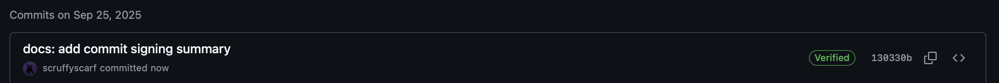
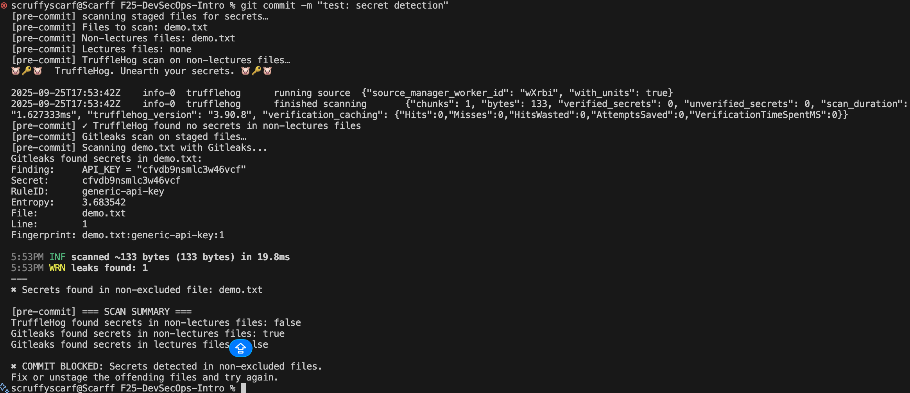
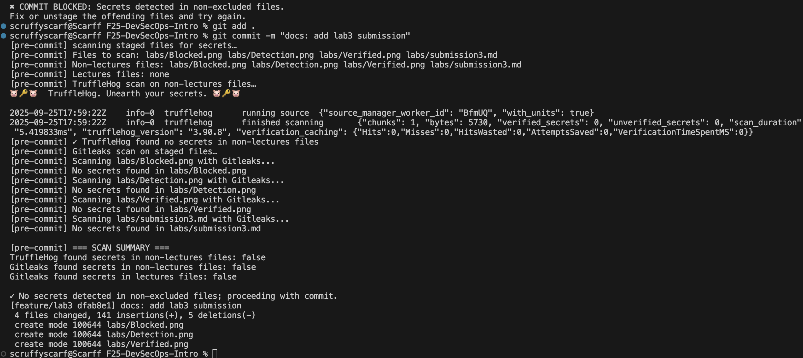

# Task 1 — SSH Commit Signature Verification

## Benefits of Signing Commits for Security
- **Authenticity**: Confirms that the commit was created by the claimed author.  
- **Integrity**: Protects code from tampering by ensuring commits haven’t been altered.  
- **Accountability**: Provides verifiable ownership of changes.  
- **Trust in CI/CD**: Signed commits reduce risk of malicious code entering pipelines.  
- **Compliance**: Helps meet security and audit requirements in regulated environments.  

---

## Evidence of Successful SSH Key Setup and Configuration
```bash
# Generate SSH key
ssh-keygen -t ed25519 -C "email@example.com"

# Configure Git for SSH Signing
git config --global user.signingkey <YOUR_SSH_KEY>
git config --global commit.gpgSign true
git config --global gpg.format ssh

# Test connection to GitHub
ssh -T git@github.com
# Expected response:
# Hi username! You've successfully authenticated, but GitHub does not provide shell access.
```


## Why Is Commit Signing Critical in DevSecOps Workflows?

- **Prevents Supply Chain Attacks**: Signed commits stop unauthorized code injection.  
- **Ensures Traceability**: Every change can be linked to a verified contributor.  
- **Strengthens Zero-Trust Model**: No implicit trust; every commit is validated.  
- **Protects Production Environments**: Only signed and verified commits are promoted through CI/CD pipelines.  
- **Supports Security Policies**: Enforces organizational rules for secure collaboration.  

## Screenshots of the "Verified" badge on GitHub



# Task 2 — Pre-commit Secret Scanning

## Pre-commit Hook Setup Process and Configuration

Create a new file at `.git/hooks/pre-commit`:

```bash
#!/usr/bin/env bash
set -euo pipefail
echo "[pre-commit] scanning staged files for secrets…"

# Collect staged files (added/changed)
mapfile -t STAGED < <(git diff --cached --name-only --diff-filter=ACM)
if [ ${#STAGED[@]} -eq 0 ]; then
   echo "[pre-commit] no staged files; skipping scans"
   exit 0
fi

FILES=()
for f in "${STAGED[@]}"; do
   [ -f "$f" ] && FILES+=("$f")
done
if [ ${#FILES[@]} -eq 0 ]; then
   echo "[pre-commit] no regular files to scan; skipping"
   exit 0
fi

echo "[pre-commit] Files to scan: ${FILES[*]}"

NON_LECTURES_FILES=()
LECTURES_FILES=()
for f in "${FILES[@]}"; do
   if [[ "$f" == lectures/* ]]; then
      LECTURES_FILES+=("$f")
   else
      NON_LECTURES_FILES+=("$f")
   fi
done

echo "[pre-commit] Non-lectures files: ${NON_LECTURES_FILES[*]:-none}"
echo "[pre-commit] Lectures files: ${LECTURES_FILES[*]:-none}"

TRUFFLEHOG_FOUND_SECRETS=false
if [ ${#NON_LECTURES_FILES[@]} -gt 0 ]; then
   echo "[pre-commit] TruffleHog scan on non-lectures files…"
   
   set +e
   TRUFFLEHOG_OUTPUT=$(docker run --rm -v "$(pwd):/repo" -w /repo \
      trufflesecurity/trufflehog:latest \
      filesystem "${NON_LECTURES_FILES[@]}" 2>&1)
   TRUFFLEHOG_EXIT_CODE=$?
   set -e    
   echo "$TRUFFLEHOG_OUTPUT"
   
   if [ $TRUFFLEHOG_EXIT_CODE -ne 0 ]; then
      echo "[pre-commit] ✖ TruffleHog detected potential secrets in non-lectures files"
      TRUFFLEHOG_FOUND_SECRETS=true
   else
      echo "[pre-commit] ✓ TruffleHog found no secrets in non-lectures files"
   fi
else
   echo "[pre-commit] Skipping TruffleHog (only lectures files staged)"
fi

echo "[pre-commit] Gitleaks scan on staged files…"
GITLEAKS_FOUND_SECRETS=false
GITLEAKS_FOUND_IN_LECTURES=false

for file in "${FILES[@]}"; do
   echo "[pre-commit] Scanning $file with Gitleaks..."
   
   # Scan individual file with Gitleaks
   GITLEAKS_RESULT=$(docker run --rm -v "$(pwd):/repo" -w /repo \
      zricethezav/gitleaks:latest \
      detect --source="$file" --no-git --verbose --exit-code=0 --no-banner 2>&1 || true)
   
   if [ -n "$GITLEAKS_RESULT" ] && echo "$GITLEAKS_RESULT" | grep -q -E "(Finding:|WRN leaks found)"; then
      echo "Gitleaks found secrets in $file:"
      echo "$GITLEAKS_RESULT"
      echo "---"
      
      # Check if this is a lectures file
      if [[ "$file" == lectures/* ]]; then
            echo "⚠️ Secrets found in lectures directory - allowing as educational content"
            GITLEAKS_FOUND_IN_LECTURES=true
      else
            echo "✖ Secrets found in non-excluded file: $file"
            GITLEAKS_FOUND_SECRETS=true
      fi
   else
      echo "[pre-commit] No secrets found in $file"
   fi
done

echo ""
echo "[pre-commit] === SCAN SUMMARY ==="
echo "TruffleHog found secrets in non-lectures files: $TRUFFLEHOG_FOUND_SECRETS"
echo "Gitleaks found secrets in non-lectures files: $GITLEAKS_FOUND_SECRETS"
echo "Gitleaks found secrets in lectures files: $GITLEAKS_FOUND_IN_LECTURES"
echo ""

if [ "$TRUFFLEHOG_FOUND_SECRETS" = true ] || [ "$GITLEAKS_FOUND_SECRETS" = true ]; then
   echo -e "✖ COMMIT BLOCKED: Secrets detected in non-excluded files." >&2
   echo "Fix or unstage the offending files and try again." >&2
   exit 1
elif [ "$GITLEAKS_FOUND_IN_LECTURES" = true ]; then
   echo "⚠️ Secrets found only in lectures directory (educational content) - allowing commit."
fi

echo "✓ No secrets detected in non-excluded files; proceeding with commit."
exit 0
```

Make the hook executable:

```bash
chmod +x .git/hooks/pre-commit
```

## Blocked and Successful Commits

Blocked commit:



Successful commit:



## How Automated Secret Scanning Prevents Security Incidents
- **Prevents accidental leaks**: Secrets like API keys, passwords, or tokens are blocked before reaching the repository.
- **Automated enforcement**: Developers are reminded automatically, reducing human error.
- **Early detection**: Identifies issues locally before CI/CD, reducing potential attack surface.