# 🎯 Lecture 10 - Vulnerability Management & Response: Discovery, Triage & Remediation

## 📂 Group 1: Vulnerability Discovery

## 📍 Slide 1 – 🔍 Vulnerability Discovery Methods

* 🔍 **Vulnerability discovery** = finding security issues before attackers do
* 🎯 **Multiple sources:** Scanners, researchers, users, attackers
* 📊 **Coverage:** Different methods find different vulnerabilities
* 🔑 **Defense in depth:** Use all methods for maximum coverage

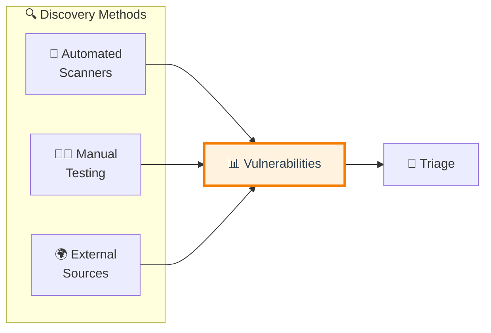

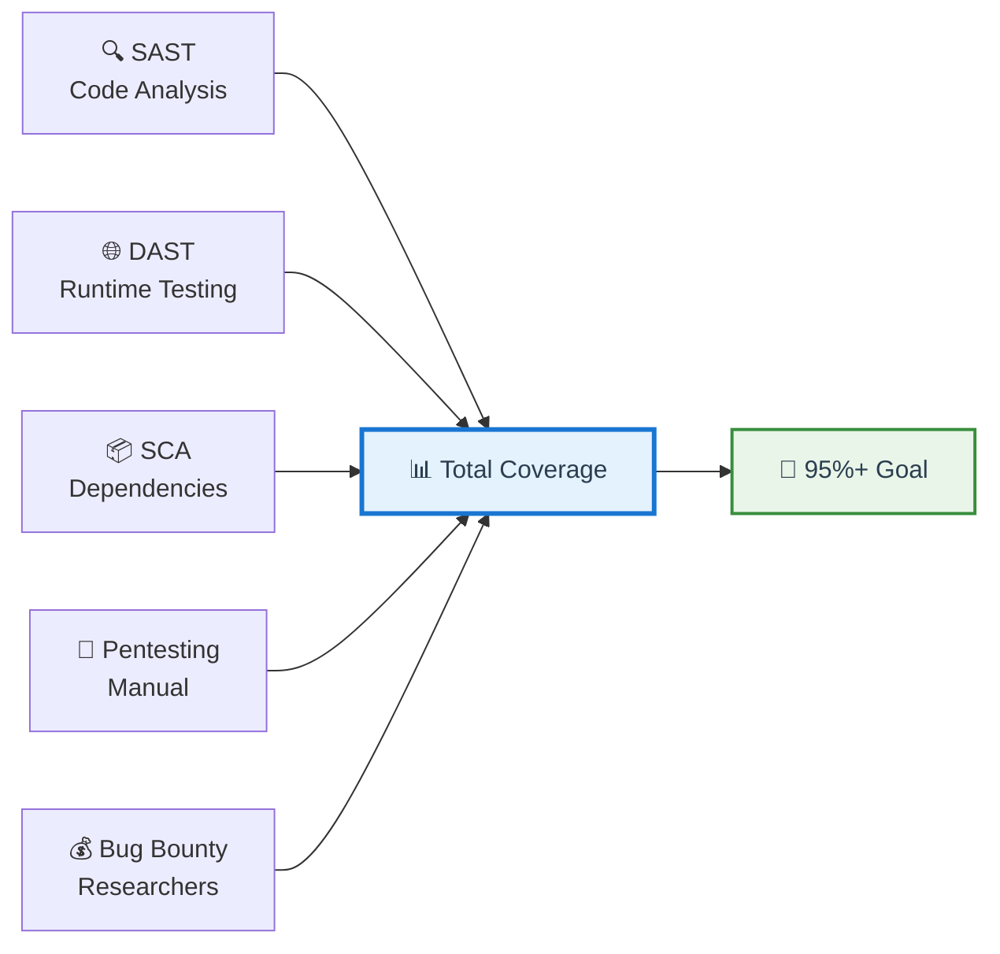

---

### 🤖 Automated Scanning Methods

**🔍 SAST (Static Application Security Testing):**
* ✅ Scans source code without running it
* 🎯 Finds: SQL injection, XSS, hardcoded secrets, buffer overflows
* ⏰ When: Every commit, pull request
* 🛠️ Tools: Snyk Code, Semgrep, SonarQube, Checkmarx
* 📊 Coverage: ~70% of code vulnerabilities

**🌐 DAST (Dynamic Application Security Testing):**
* ✅ Tests running application (black-box approach)
* 🎯 Finds: Authentication flaws, runtime issues, injection attacks
* ⏰ When: Staging/pre-production environments
* 🛠️ Tools: OWASP ZAP, Burp Suite, Acunetix
* 📊 Coverage: Runtime vulnerabilities

**📦 SCA (Software Composition Analysis):**
* ✅ Scans dependencies for known vulnerabilities
* 🎯 Finds: Vulnerable libraries, outdated packages, license issues
* ⏰ When: Every build, continuous monitoring
* 🛠️ Tools: Snyk, Grype, Dependabot, OWASP Dependency-Check
* 📋 Covered in: Lab 8 (Supply Chain Security)

**⚙️ IaC Scanning:**
* ✅ Scans infrastructure code
* 🎯 Finds: Misconfigurations, compliance violations, overpermissions
* ⏰ When: Pre-commit, pull request
* 🛠️ Tools: Checkov, tfsec, Terrascan, KICS
* 📋 Covered in: Lab 6 (Infrastructure Security)

**🐳 Container Scanning:**
* ✅ Scans container images and layers
* 🎯 Finds: OS vulnerabilities, malware, secrets in images
* ⏰ When: Build time, registry push
* 🛠️ Tools: Trivy, Grype, Snyk Container, Aqua
* 📋 Covered in: Lab 7 (Container Security)

---

### 👨‍💻 Manual Testing Methods

**🎯 Penetration Testing:**
* ✅ Ethical hackers simulate real attacks
* 🔍 Finds: Complex logic flaws, business logic vulnerabilities, chained exploits
* ⏰ When: Quarterly, before major releases, after architecture changes
* 👥 Who: External security firms or internal red team
* 💰 Cost: $10K-$100K per engagement
* 📊 Coverage: Real-world exploitability

**👀 Security Code Review:**
* ✅ Developers review code for security issues
* 🔍 Finds: Logic errors, design flaws, subtle vulnerabilities
* ⏰ When: Every pull request (peer review process)
* 🎯 Focus: Critical paths, authentication, authorization, data handling
* 📋 Best practice: Security champion reviews critical changes

**📋 Security Audits:**
* ✅ Comprehensive security assessment
* 🔍 Finds: Process gaps, architectural issues, compliance violations
* ⏰ When: Annually, before compliance audits (SOC 2, ISO 27001)
* 👥 Who: External auditors, security consultants
* 📊 Coverage: People, process, technology

---

### 🌍 External Discovery Sources

**💰 Bug Bounty Programs:**
* ✅ Security researchers find bugs for rewards
* 🌐 Platforms: HackerOne, Bugcrowd, Synack, Intigriti
* 🔍 Finds: Real-world exploitable issues, creative attack vectors
* 💵 Cost: Pay per valid bug ($100-$100K+ per finding)
* 🎯 Benefit: Continuous testing by global researchers

**🚨 CVE Alerts & Feeds:**
* ✅ New vulnerabilities in your dependencies
* 📊 Sources: NVD, GitHub Advisory, OSV, vendor feeds
* 🤖 Automated: Dependabot alerts, Snyk monitoring
* ⏰ Frequency: Daily monitoring required
* 📧 Notification: Real-time alerts for critical CVEs

**🕵️ Threat Intelligence:**
* ✅ Known attack patterns, indicators of compromise (IOCs)
* 📡 Sources: CISA, vendor threat feeds, ISACs, dark web monitoring
* 🎯 Benefit: Proactive defense against emerging threats
* 🔄 Integration: SIEM, EDR, firewalls

**📧 User/Customer Reports:**
* ✅ Customers discover and report issues
* 📬 Channel: security@company.com mailbox
* 🐛 Portal: Bug reporting form
* 🤝 Response: Thank users, validate, fix, credit (if requested)

<details>
<summary>💭 <strong>Coverage Gap Analysis:</strong> Why multiple methods?</summary>

**❌ Each method has blind spots:**

| Method | ✅ Finds | ❌ Misses |
|--------|---------|----------|
| 🔍 **SAST** | Code-level flaws | Runtime issues, dependencies |
| 🌐 **DAST** | Runtime flaws | Internal logic, code quality |
| 📦 **SCA** | Dependency vulns | Custom code vulnerabilities |
| 🎯 **Pentesting** | Real exploits | Doesn't scale, expensive |
| 👥 **Code Review** | Design flaws | Automated detectable issues |

**✅ Defense in depth:** Use all methods for 95%+ coverage

**💡 Strategy:**
* 🤖 Automate: SAST, DAST, SCA (daily/weekly)
* 👨‍💻 Manual: Pentests, audits (quarterly)
* 🌍 External: Bug bounty (continuous)
</details>

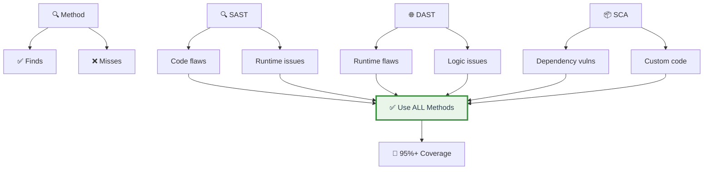

---

## 📍 Slide 2 – 🛠️ Security Testing Orchestration

* 🎯 **Orchestration** = coordinating multiple security tools into unified workflow
* 📊 **Problem:** Tool sprawl (10+ security tools, different outputs, duplicates)
* 🔑 **Solution:** Centralized platform for aggregation and deduplication
* ⚡ **Benefit:** Single pane of glass, consistent prioritization

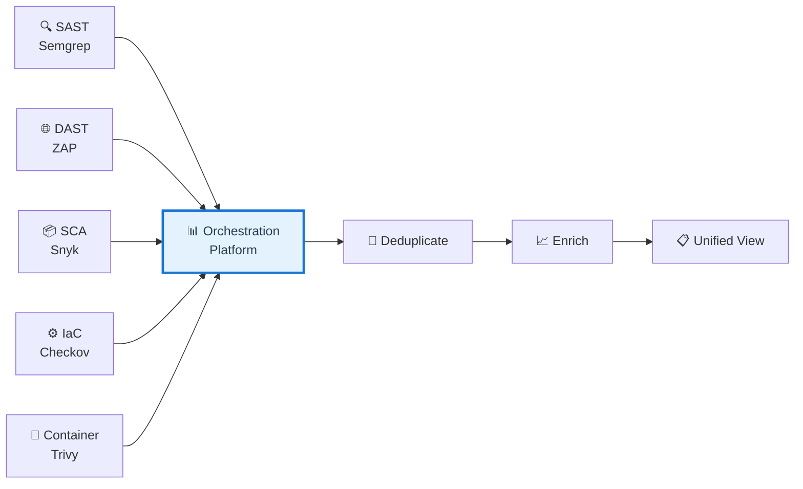

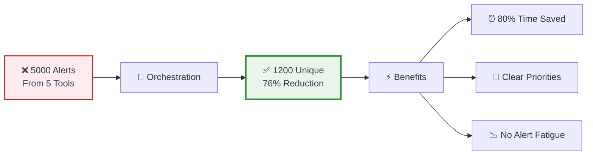

---

### 🔄 Orchestration Workflow Steps

**1️⃣ Collection:**
* 📥 Gather results from all scanners
* 🔄 Normalize data (different formats → standard format)
* 📊 Standardize severity levels (tool-specific → CVSS)

**2️⃣ Deduplication:**
* 🎯 Same vulnerability found by multiple tools
* 🔗 Group by: File + line + vulnerability type
* ✅ Reduces noise (5 tools reporting same issue → 1 unified report)
* 📉 Result: 80% fewer alerts (focus on unique issues)

**3️⃣ Enrichment:**
* 📊 Add CVSS scores, EPSS probability, KEV status
* 🔗 Link to remediation guidance (patches, code examples)
* 💼 Calculate business impact (production vs dev)
* 🎯 Add reachability analysis (if available)

**4️⃣ Prioritization:**
* 🎯 Risk-based scoring (CVSS + EPSS + context)
* 🏢 Context-aware (production > staging > dev)
* 📋 Actionable queue for development teams
* ⏰ SLA assignment based on severity

---

### 🛠️ Orchestration Platform Options

**🆓 DefectDojo (Open-Source):**
* ✅ Free and open-source
* 📊 Imports 100+ scanner formats
* 🔄 Built-in deduplication
* 📈 Metrics and dashboards
* 🎯 Workflow management (assign, track, verify)
* 👥 Best for: Medium to large teams

**💼 ThreadFix (Commercial):**
* 💰 Enterprise platform
* 📊 Advanced analytics and reporting
* 🔗 SIEM integration
* 🏢 Multi-tenant support
* 💵 Cost: $$$

**🎯 Dependency-Track (SBOM-focused):**
* ✅ Free and open-source
* 📋 SBOM-based vulnerability management
* 🔄 Continuous monitoring
* 📊 Policy engine
* 🔗 Covered in: Lab 8

**🔧 Custom Solutions:**
* ✅ Parse tool outputs via API
* 💾 Store in database (PostgreSQL, MongoDB)
* 📊 Build custom dashboards (Grafana)
* 🔄 Integration flexibility

---

### 🔗 Integration Patterns

**📊 Data Flow:**
* 🔍 Scanners → API calls → Orchestration platform
* 📊 Platform → Jira/GitHub Issues (ticketing)
* 🚨 Platform → SIEM (alerting)
* 📈 Platform → Dashboards (visualization)

**🤖 Automation:**
* ⏰ Scheduled scans (nightly builds)
* 🔔 Real-time alerts (critical findings)
* 📧 Email notifications (team assignments)
* 🔗 Webhook triggers (Slack, PagerDuty)

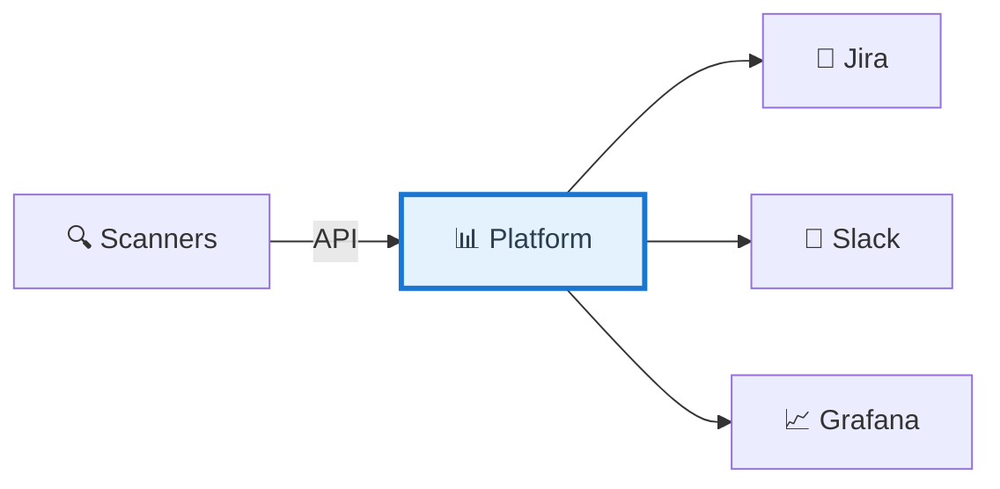

---

## 📍 Slide 3 – 📊 Centralized Vulnerability Management

* 📊 **Centralization** = single source of truth for all vulnerabilities
* 🎯 **Benefits:** No duplicates, consistent tracking, clear ownership, audit trail
* 🔗 **Integrations:** CI/CD pipelines, issue trackers, security dashboards

**📋 Common Approaches:**

**🎫 Jira/GitHub Issues:**
* ✅ Familiar to developers (existing workflow)
* ✅ Easy integration with dev process
* ⚠️ Not security-optimized (no deduplication)
* 🎯 Use case: Small teams, simple needs, existing Jira setup

**🛡️ DefectDojo (Security-Focused):**
* ✅ Built for vulnerability management
* ✅ Deduplication and correlation built-in
* ✅ Security-specific metrics and reporting
* 🎯 Use case: Medium to large teams, mature security programs

**📦 Dependency-Track (SBOM-Based):**
* ✅ SBOM-centric approach (from Lab 8)
* ✅ Continuous component monitoring
* ✅ Policy engine for governance
* 🎯 Use case: Supply chain security focus

**💰 Commercial Platforms:**
* 🔷 Snyk, Veracode, Checkmarx, Fortify
* ✅ All-in-one (scan + manage + report)
* 💵 Expensive but comprehensive
* 🎯 Use case: Enterprise with budget

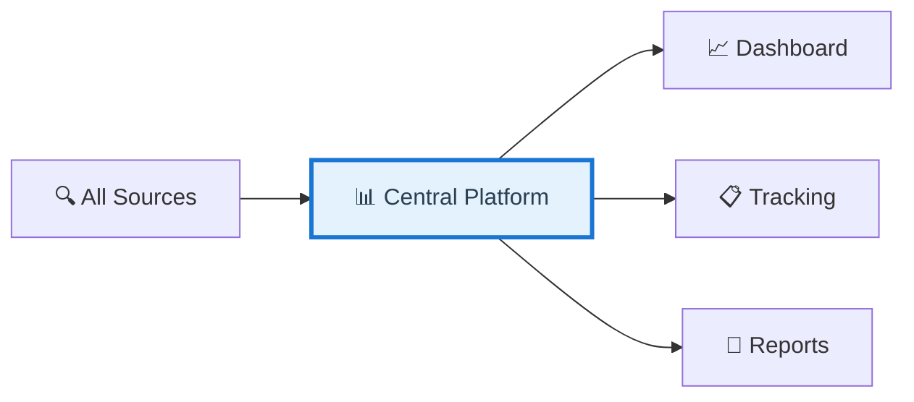

---

### 📋 Vulnerability Tracking Fields

**🔑 Essential Fields:**
* 🆔 Unique ID (tracking identifier)
* 🔍 Source (which tool found it)
* 📍 Location (file, line number, component)
* 🎯 Severity (Critical/High/Medium/Low)
* 📊 CVSS score (numerical rating)
* 📝 Description (what's vulnerable)
* 👤 Owner (assigned developer/team)
* 📅 Discovered date (when found)
* ⏰ Age (days open)
* 📋 Status (Open/In Progress/Fixed/Closed)
* 🔧 Remediation guidance (how to fix)

**📈 Optional but Valuable:**
* ⚡ EPSS score (exploitation likelihood)
* 🚨 KEV status (actively exploited?)
* 💼 Business impact (critical service?)
* 🔄 Recurrence flag (fixed before?)
* 🧪 Test status (verification completed?)
* 📊 Risk score (contextual priority)

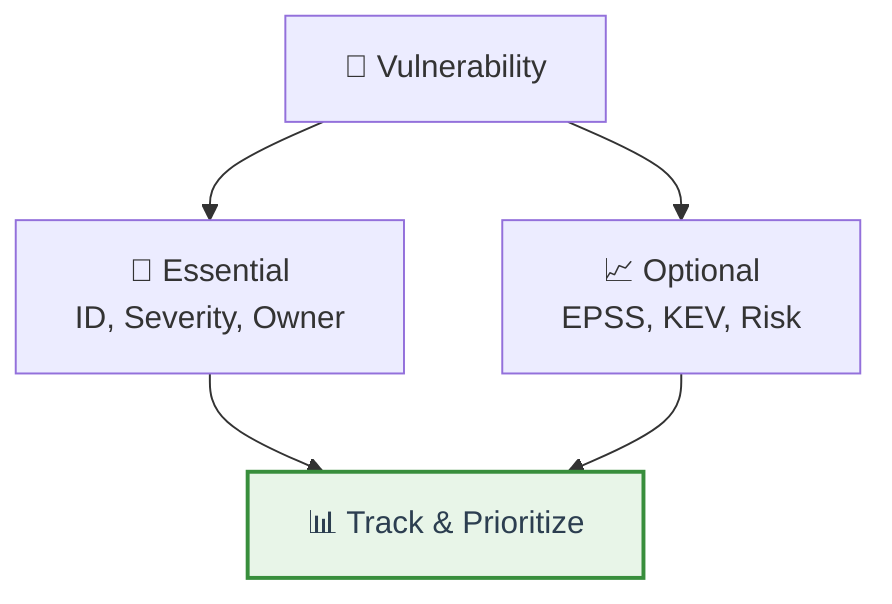

<details>
<summary>💭 <strong>Deduplication Magic:</strong> From chaos to clarity</summary>

**❌ Before deduplication:**
* 🔍 Snyk: SQL injection in auth.js:45
* 🔍 Semgrep: SQL injection in auth.js:45
* 🔍 SonarQube: SQL injection in auth.js:45
* 🔍 Checkmarx: SQL injection in auth.js:45
* 📊 **Total: 4 separate tickets, 4 alerts, 4 meetings**

**✅ After deduplication:**
* 🎯 SQL injection in auth.js:45 (found by 4 tools, confidence: very high)
* 📊 **Total: 1 ticket, 1 fix, 1 verification**

**🎉 Benefits:**
* ⏰ Save time (no duplicate work)
* 🎯 Clear priorities (focus on unique issues)
* 📊 Better metrics (accurate vulnerability counts)
* 👥 Less alert fatigue

**💡 Deduplication criteria:**
* Same file + line + vulnerability type = duplicate
* CWE matching (same weakness category)
* Hash-based matching (exact code pattern)
</details>

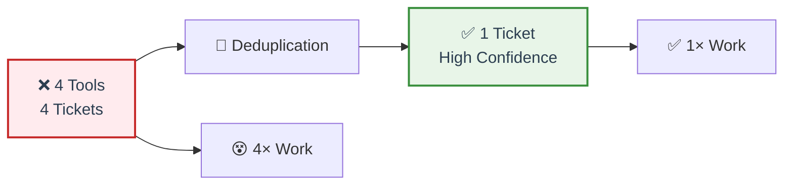

---

🔗 **Resources for Group 1:**
* [DefectDojo](https://www.defectdojo.org/)
* [OWASP Testing Guide](https://owasp.org/www-project-web-security-testing-guide/)
* [HackerOne](https://www.hackerone.com/)
* [Bugcrowd](https://www.bugcrowd.com/)

---

## 🎉 Fun Break: "The Scanner That Cried Wolf"

* 🏢 Company: 7 scanners, 200 alerts/day, 85% false positives
* 🔴 Critical bug (Log4Shell) buried in noise, missed for 3 days
* 💥 Exploited on day 4: $2M breach cost
* ✅ Fix: DefectDojo → 200 alerts became 30 unique findings
* 💡 Lesson: More tools ≠ more security. Orchestration saves lives!

---

## 📂 Group 2: Vulnerability Assessment

## 📍 Slide 4 – 📊 CVSS Scoring Deep Dive

* 📊 **CVSS (Common Vulnerability Scoring System)** = standardized severity rating 0.0-10.0
* 🎯 **Purpose:** Consistent prioritization across organizations and tools
* 📈 **Current versions:** v3.1 (widely used), v4.0 (new, more nuanced)
* 🌍 **Global standard:** Used by NVD, vendors, security teams worldwide
* 🔗 **Calculator:** [first.org/cvss/calculator](https://www.first.org/cvss/calculator/)

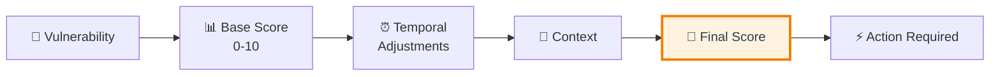

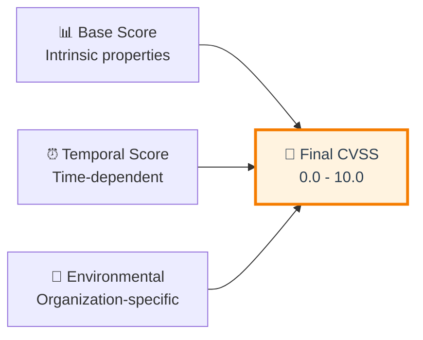

---

### 📊 CVSS v3.1 Base Metrics

**🌐 Exploitability Metrics:**
* **🔗 Attack Vector (AV):** Network (N) / Adjacent (A) / Local (L) / Physical (P)
* **🧩 Attack Complexity (AC):** Low (L) / High (H)
* **🔑 Privileges Required (PR):** None (N) / Low (L) / High (H)
* **👤 User Interaction (UI):** None (N) / Required (R)

**💥 Impact Metrics:**
* **🔐 Confidentiality (C):** None (N) / Low (L) / High (H)
* **✅ Integrity (I):** None (N) / Low (L) / High (H)
* **⚡ Availability (A):** None (N) / Low (L) / High (H)
* **🎯 Scope (S):** Unchanged (U) / Changed (C)

**💡 Example: SQL Injection**
* 🌐 AV:Network (remotely exploitable)
* 🧩 AC:Low (easy to exploit)
* 🔑 PR:None (no authentication needed)
* 👤 UI:None (no user interaction)
* 🎯 S:Changed (can access other systems)
* 🔐 C:High, ✅ I:High, ⚡ A:High
* **📊 Score: 10.0 (Critical)**

---

### 📈 Severity Ranges & Actions

| Score | Severity | Color | Action | SLA |
|-------|----------|-------|--------|-----|
| 9.0-10.0 | 🔴 **Critical** | Red | Fix immediately | ⏰ 24 hours |
| 7.0-8.9 | 🟠 **High** | Orange | Fix urgently | ⏰ 7 days |
| 4.0-6.9 | 🟡 **Medium** | Yellow | Fix soon | ⏰ 30 days |
| 0.1-3.9 | 🟢 **Low** | Green | Fix eventually | ⏰ 90 days |
| 0.0 | ⚪ **None** | White | Informational | 📋 No fix needed |

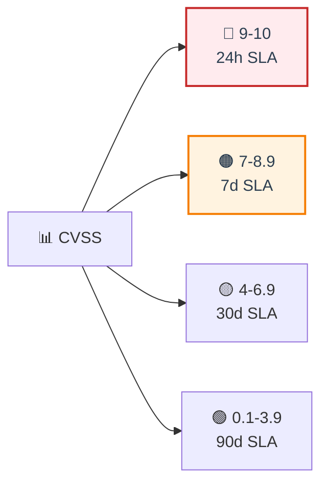

---

### ⏰ Temporal Score (Optional)

**🔧 Modifying Factors:**
* **💣 Exploit Code Maturity:** Unproven / Proof-of-Concept / Functional / High
* **🔧 Remediation Level:** Official Fix / Temporary Fix / Workaround / Unavailable
* **📊 Report Confidence:** Unknown / Reasonable / Confirmed

**📉 Impact:** Can lower base score
* 📊 Example: CVSS 9.0 base → 7.5 final (no exploit available yet, patch ready)
* ⏰ Changes over time (exploit released = score increases)

---

### 🏢 Environmental Score (Optional)

**🎯 Organization-Specific Adjustments:**
* **🔐 Confidentiality Requirement:** How sensitive is your data?
* **✅ Integrity Requirement:** How critical is data accuracy?
* **⚡ Availability Requirement:** How critical is uptime?

**💼 Example Scenarios:**
* 🛒 **E-commerce site:** Availability = High (downtime = lost revenue)
* 📝 **Blog site:** Availability = Low (downtime = minimal impact)
* 🏥 **Healthcare:** Confidentiality = High (HIPAA data)
* 💰 **Finance:** Integrity = High (transaction accuracy critical)

**📊 Result:** Same vulnerability = different scores per organization

<details>
<summary>💭 <strong>CVSS Limitations:</strong> What it doesn't tell you</summary>

**❌ CVSS doesn't consider:**
* 🎯 **Exploitability in the wild** (use EPSS for this)
* 💼 **Business impact** (use environmental score)
* 🔧 **Ease of remediation** (patch available vs. major refactor)
* 🔍 **Reachability** (is vulnerable code actually executed?)
* 🏢 **Your specific environment** (production vs. dev)
* ⏰ **Attack trends** (is it being exploited now?)

**✅ CVSS is ONE input, not the ONLY factor:**
* 📊 Combine: CVSS + EPSS + KEV + Context = Smart prioritization
* 🎯 Use as baseline, adjust with intelligence
* 🧠 Apply judgment, don't follow blindly

**💡 Pro tip:** CVSS 9.0 with 0% exploitation = lower priority than CVSS 7.0 with active exploits
</details>

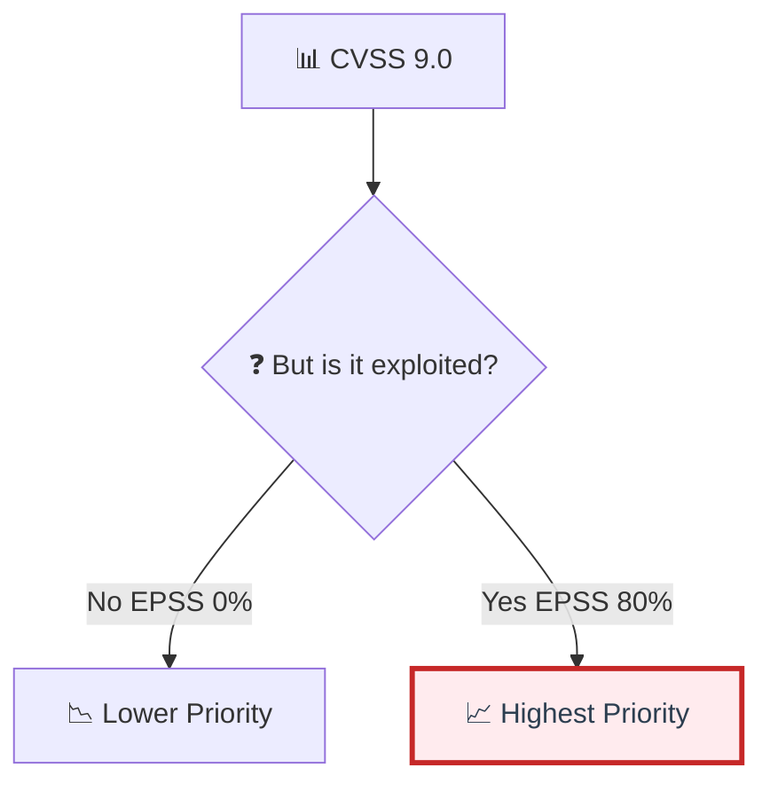

---

## 📍 Slide 5 – ⚡ Advanced Prioritization: EPSS, KEV, SSVC

* 🎯 **Problem:** CVSS measures severity, NOT likelihood of exploitation
* 📊 **Solution:** Combine multiple signals for intelligent prioritization
* 🧠 **Smart approach:** Likelihood × Impact × Context = Priority

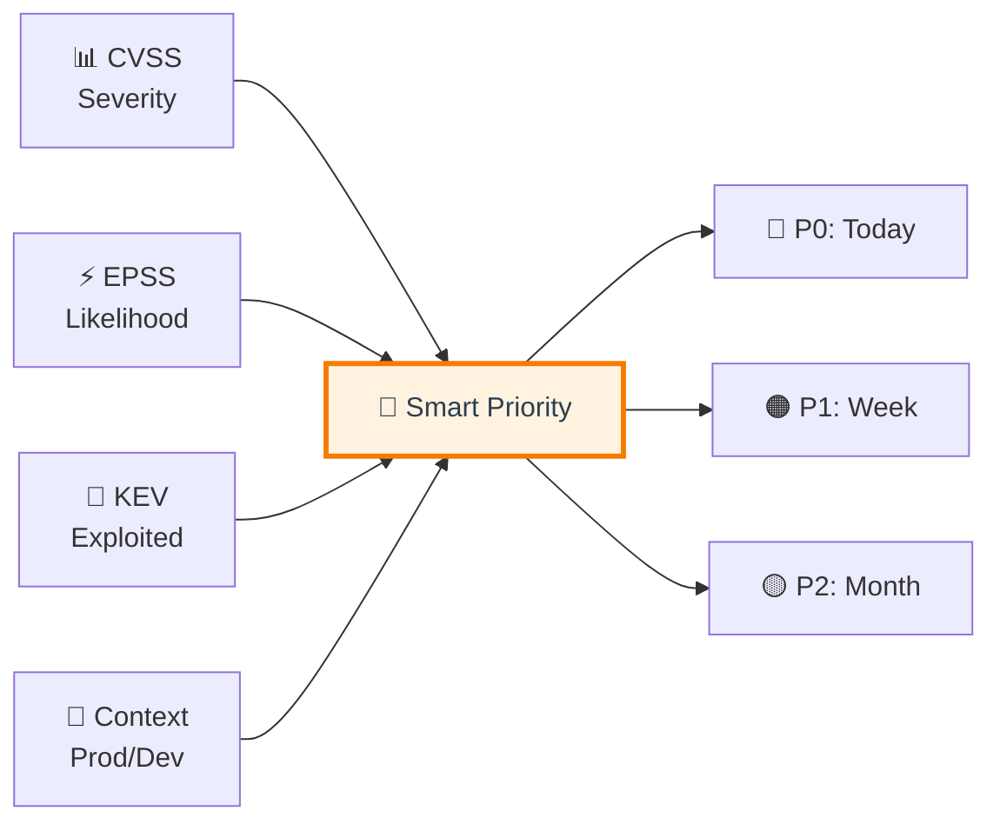

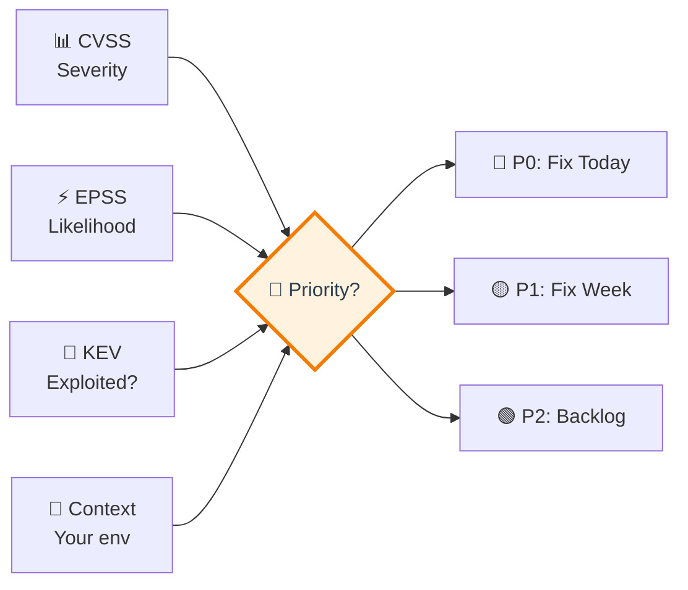

---

### ⚡ EPSS (Exploit Prediction Scoring System)

* 🎯 **EPSS:** Probability of exploitation in next 30 days
* 📊 **Score range:** 0-100% (e.g., 45% = 45% chance of active exploitation)
* 🤖 **ML-powered:** Trained on real-world exploitation data from honeypots, IDS, threat intel
* 📅 **Updated:** Daily with new data
* 🔗 **Database:** [first.org/epss](https://www.first.org/epss/)

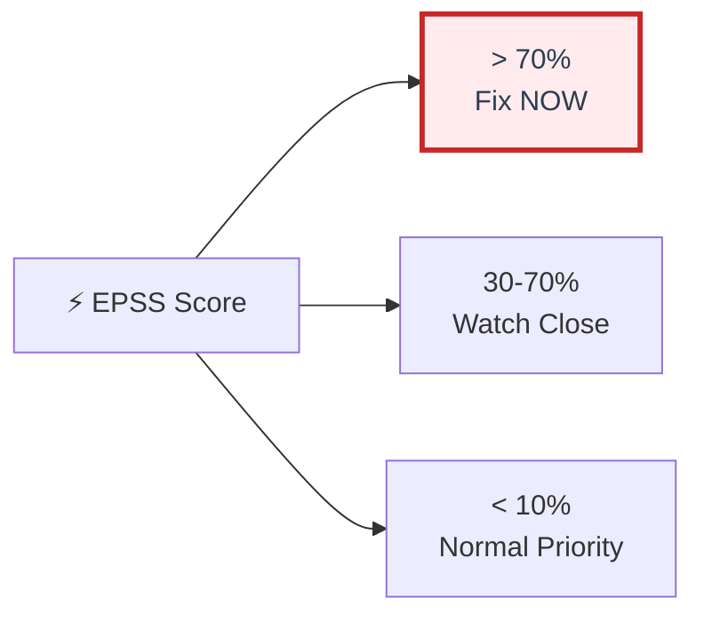

**💡 Example Prioritization:**
* 🔴 **CVE-2021-44228 (Log4Shell):** CVSS 10.0 + EPSS 97% → **DROP EVERYTHING, FIX NOW**
* 🟡 **CVE-2023-12345:** CVSS 9.8 + EPSS 0.3% → High severity but low exploitation → lower priority

**🎯 How to Use EPSS:**
* 🚨 EPSS > 70% → Treat as urgent (high exploitation risk)
* ⚠️ EPSS > 30% → Monitor closely (emerging threat)
* ✅ EPSS < 10% → Can deprioritize (low exploitation risk)

---

### 🚨 CISA KEV (Known Exploited Vulnerabilities)

* 🏛️ **CISA KEV:** Catalog of vulnerabilities actively exploited in the wild RIGHT NOW
* 🔥 **If in KEV:** Being exploited by attackers at this moment
* ⏰ **US Gov mandate:** Patch KEV vulnerabilities within 15 days (federal agencies)
* 📊 **Catalog size:** 1,000+ actively exploited vulnerabilities
* 🔗 **Catalog:** [cisa.gov/known-exploited-vulnerabilities](https://www.cisa.gov/known-exploited-vulnerabilities-catalog)

**🎯 KEV = Always Highest Priority:**
* 🔴 Even Low CVSS + in KEV = Fix immediately
* ⚡ Real-world exploitation confirmed
* 🚨 Attackers have tools and knowledge

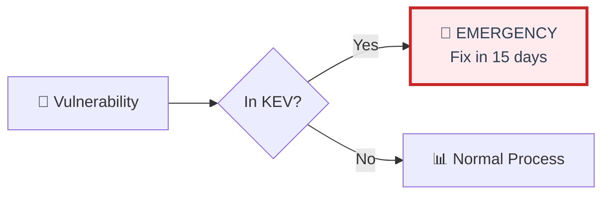

---

### 🎯 SSVC (Stakeholder-Specific Vulnerability Categorization)

* 🎯 **SSVC:** Decision tree for vulnerability prioritization
* 📊 **Factors:** Exploitation status, Technical impact, Automatable, Mission impact
* 🔀 **Output:** Act immediately / Act / Track / Track*
* 🧠 **Benefit:** More nuanced than simple CVSS scoring

**🌳 Decision Tree Questions:**
1. ❓ Is it being exploited? (KEV check)
2. ❓ Is it automatable? (wormable, self-spreading?)
3. ❓ What's technical impact? (Total/Partial/Minor)
4. ❓ What's mission impact? (Mission Essential/Support/Not Critical)

**📊 Result:** Context-aware prioritization decision

---

### 📊 Combined Prioritization Matrix

| CVSS | EPSS | KEV | Final Priority | Action | Timeline |
|------|------|-----|----------------|--------|----------|
| 9-10 | >70% | ✅ Yes | 🔴 **P0** | Fix immediately | ⏰ 24 hours |
| 9-10 | >70% | ❌ No | 🟠 **P1** | Fix urgently | ⏰ 48 hours |
| 9-10 | <30% | ❌ No | 🟡 **P2** | Fix this week | ⏰ 7 days |
| 7-8.9 | >70% | ✅ Yes | 🟠 **P1** | Fix urgently | ⏰ 48 hours |
| 7-8.9 | <30% | ❌ No | 🟡 **P2** | Fix this month | ⏰ 30 days |
| 4-6.9 | <10% | ❌ No | 🟢 **P3** | Backlog | ⏰ 90 days |

**💡 Key Insight:** High CVSS + Low EPSS + Not in KEV = Lower priority than you think!

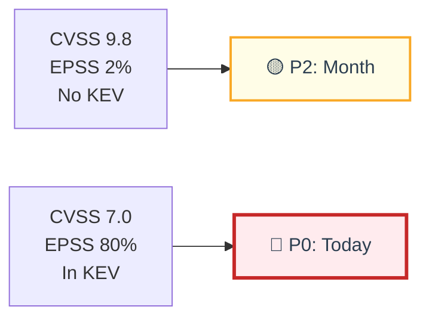

<details>
<summary>💭 <strong>Real Scenario:</strong> 100 Vulnerabilities, What to Fix First?</summary>

**❌ Old Approach (CVSS only):**
* 🔴 Fix all 30 Critical (CVSS 9-10) first
* ⏰ Timeline: 6 months to clear all Critical
* 🚨 Meanwhile, actively exploited High severity vulns remain

**✅ Smart Approach (Combined signals):**
* 🔥 **3 in KEV catalog** → Fix TODAY (P0)
* ⚡ **7 with EPSS > 50%** → Fix THIS WEEK (P1)
* 🎯 **20 with CVSS 9+ but EPSS < 5%** → Fix NEXT MONTH (P2)

**📊 Result:**
* ✅ Fixed the 10 that matter most in 1 week
* 🎯 80% risk reduction with 10% effort
* ⏰ Not 6 months, just 1 week for critical threats

**💡 Lesson:** Work smarter, not harder. Prioritize by actual threat, not just severity.
</details>

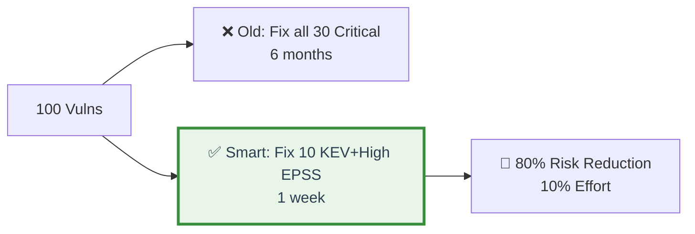

---

## 📍 Slide 6 – 🎯 Risk-Based Prioritization

* 🎯 **Risk = Likelihood × Impact × Exposure**
* 🏢 **Context matters:** Same vulnerability = different risk in different environments
* 📊 **Your environment:** Production vs. dev, internet-facing vs. internal, customer data vs. test data

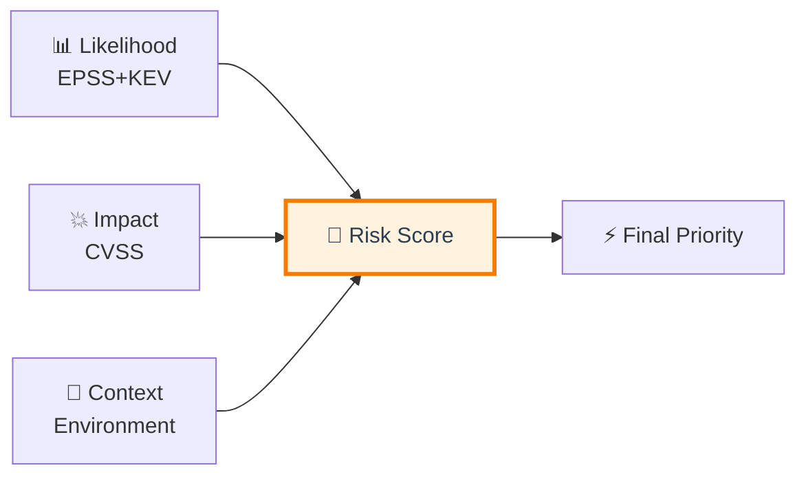

```mermaid
flowchart LR
    Likelihood[📊 Likelihood<br/>EPSS, KEV] --> Risk[🎯 Risk Score]
    Impact[💥 Impact<br/>CVSS, Business] --> Risk
    Context[🏢 Context<br/>Exposure, Criticality] --> Risk
    
    Risk --> Priority[⚡ Priority Queue]
    
    style Risk fill:#fff3e0,stroke:#f57c00,stroke-width:3px,color:#2c3e50
```

---

### 🏢 Contextual Risk Factors

**🎯 Asset Criticality:**
* 🔴 Production, customer-facing → **Highest priority**
* 🟡 Staging, internal tools → **Medium priority**
* 🟢 Development, testing → **Lower priority**
* ⚪ Sandbox, demo → **Lowest priority**

**🌍 Exposure Level:**
* 🌐 Internet-facing public API → **Highest priority**
* 🏢 Internal service, VPN-only → **Medium priority**
* 🔒 Private network, authenticated → **Lower priority**
* 🏝️ Air-gapped system → **Lowest priority**

**💼 Data Sensitivity:**
* 💳 Payment data (PCI-DSS), PII (GDPR) → **Highest priority**
* 📊 Confidential business data → **Medium priority**
* 📝 Non-sensitive business data → **Lower priority**
* 🌍 Public data → **Lowest priority**

**🛡️ Compensating Controls:**
* ✅ WAF in front (Web Application Firewall) → **Reduce priority**
* ✅ Network segmentation (isolated) → **Reduce priority**
* ✅ Strong authentication (MFA) → **Reduce priority**
* ❌ No controls → **Increase priority**

---

### 🔍 Reachability Analysis

* 🎯 **Critical question:** Is vulnerable code actually executed in your application?
* 📊 **Reality:** ~70% of vulnerabilities may be unreachable (code exists but never runs)
* 🔧 **Tools:** Snyk (reachability feature), GitHub CodeQL (dataflow analysis)

**💡 Example:**
* 📦 Vulnerability in lodash.template() function
* 🔍 Your code imports lodash but never calls .template()
* ✅ Vulnerability exists but **NOT exploitable**
* 🎯 Action: Lower priority (but don't ignore forever - transitive risk)

```mermaid
flowchart LR
    Vuln[🚨 lodash vuln] --> Reach{🔍 Reachable?}
    Reach -->|Yes| High[🔴 High Priority]
    Reach -->|No| Lower[🟡 Lower Priority]
    
    style High fill:#ffebee,stroke:#c62828,stroke-width:2px,color:#2c3e50
    style Lower fill:#fffde7,stroke:#f9a825,stroke-width:2px,color:#2c3e50
```

---

### 📊 Custom Risk Scoring

**🧮 Example Formula:**

**Risk Score = (CVSS × 0.3) + (EPSS × 100 × 0.3) + (Criticality × 0.2) + (Exposure × 0.2)**

**Where:**
* 📊 CVSS: 0-10 (severity)
* ⚡ EPSS: 0-1, multiplied by 100 (likelihood)
* 🏢 Criticality: 0-10 (0=dev, 5=staging, 10=prod)
* 🌍 Exposure: 0-10 (0=internal, 5=VPN, 10=internet)

**💡 Example Calculation:**
* 🔴 SQL injection in production API
* 📊 CVSS: 9.8
* ⚡ EPSS: 0.45 (45%)
* 🏢 Criticality: 10 (production)
* 🌍 Exposure: 10 (internet-facing)
* **🎯 Risk Score:** (9.8×0.3) + (45×0.3) + (10×0.2) + (10×0.2) = **20.4/30 (HIGH)**

**🚨 Action:** Fix immediately (P0 priority)

```mermaid
flowchart LR
    Inputs[📊 Inputs] --> Formula[🧮 Risk Formula]
    Formula --> Score[🎯 Risk Score 0-30]
    Score --> Priority[⚡ Priority Level]
    
    style Formula fill:#fff3e0,stroke:#f57c00,stroke-width:2px,color:#2c3e50
```

<details>
<summary>💭 <strong>Tune Your Formula:</strong> One size doesn't fit all</summary>

**🛒 E-commerce Company:**
* ⬆️ Higher weight: Availability impact (downtime = lost sales)
* ⬆️ Higher weight: Exposure (public-facing)
* ⬇️ Lower weight: Internal tools

**🏥 Healthcare Organization:**
* ⬆️ Higher weight: Data sensitivity (HIPAA compliance)
* ⬆️ Higher weight: Integrity impact (data accuracy)
* ⬆️ Higher weight: Confidentiality

**🏢 Internal Tools Company:**
* ⬇️ Lower weight: Exposure (mostly internal)
* ⬆️ Higher weight: Criticality (mission-critical vs. nice-to-have)

**🎯 Strategy:**
1. ✅ Start with default weights (balanced approach)
2. 📊 Track outcomes (are you fixing the right things?)
3. 🔄 Adjust weights based on your incidents
4. 📈 Iterate quarterly (refine based on data)

**💡 Remember:** Your risk tolerance ≠ other companies' risk tolerance
</details>

---

## 📍 Slide 7 – 🚨 Triage Workflows & Decisions

* 🚨 **Triage** = rapid assessment and categorization of vulnerabilities
* 🎯 **Possible outcomes:** Accept, Fix, Mitigate, Defer, False Positive
* ⏰ **Speed matters:** Don't let vulnerabilities age in triage queue
* 📊 **Goal:** Every vulnerability triaged within 24-48 hours

```mermaid
flowchart LR
    Vuln[🔍 Discovered] --> Triage{🚨 Decision}
    
    Triage --> Fix[🔧 Fix]
    Triage --> Mitigate[🛡️ Mitigate]
    Triage --> Accept[✅ Accept]
    Triage --> Defer[⏰ Defer]
    Triage --> FP[❌ False Positive]
    
    style Triage fill:#fff3e0,stroke:#f57c00,stroke-width:3px,color:#2c3e50
```

```mermaid
flowchart LR
    Vuln[🔍 Vulnerability<br/>Discovered] --> Triage{🚨 Triage<br/>Decision}
    
    Triage --> Accept[✅ Accept Risk<br/>Document & Monitor]
    Triage --> Fix[🔧 Fix<br/>Patch/Code Change]
    Triage --> Mitigate[🛡️ Mitigate<br/>Workaround/Controls]
    Triage --> Defer[⏰ Defer<br/>Add to Backlog]
    Triage --> FP[❌ False Positive<br/>Mark & Close]
    
    style Triage fill:#fff3e0,stroke:#f57c00,stroke-width:3px,color:#2c3e50
```

---

### ✅ Triage Decision Matrix

| Condition | Decision | Action | Timeline |
|-----------|----------|--------|----------|
| 🚨 In KEV catalog | **🔧 Fix** | Immediate remediation | ⏰ 24h |
| 🔴 Critical + Production | **🔧 Fix** | Urgent patch | ⏰ 24-48h |
| 🟠 High + No patch available | **🛡️ Mitigate** | WAF rule, network block | ⏰ 48h |
| 🟢 Low + Legacy system EOL | **✅ Accept** | Document risk, monitor | 📋 Review quarterly |
| 🤖 Scanner false detection | **❌ False Positive** | Mark, tune scanner | ⏰ Same day |
| 🟡 Medium + Low EPSS | **⏰ Defer** | Add to backlog | 📋 Next sprint |

---

### 🔧 Fix Decision (Permanent Remediation)

**✅ When to Fix:**
* 🔴 High risk (CVSS + EPSS + KEV + context)
* 🏭 Production environment affected
* 💊 Patch available from vendor
* 🚫 No acceptable workaround
* 📈 Business impact significant

**🛠️ Fix Strategies:**
* 📦 Update dependency (SCA findings)
* 🔐 Apply security patch (OS/library updates)
* 💻 Code change (SAST findings - rewrite vulnerable code)
* ⚙️ Configuration change (IaC findings)

---

### 🛡️ Mitigate Decision (Temporary Control)

**⚠️ When to Mitigate:**
* ❌ No patch available yet (zero-day situation)
* 🧪 Patch breaks functionality (needs testing)
* ⏰ Fix requires major refactor (time-consuming)
* 🔄 Waiting for vendor patch release

**🔧 Mitigation Strategies:**
* 🔥 **WAF rule:** Block exploit pattern (ModSecurity, AWS WAF)
* 🌐 **Network segmentation:** Limit access (VPN, IP whitelisting)
* 🔒 **Authentication layer:** Add additional auth requirement
* ⏱️ **Rate limiting:** Slow down potential attacks
* 📊 **Enhanced monitoring:** Detect exploitation attempts
* 🚫 **Feature flag:** Temporarily disable vulnerable feature

**⚠️ Remember:** Mitigations are temporary - must still fix root cause

---

### ✅ Accept Risk Decision (Documented Exception)

**📋 When to Accept:**
* 🟢 Low risk (Low CVSS + Low EPSS + Not in KEV)
* 🚫 Not reachable (dead code, never executed)
* 🛡️ Strong compensating controls (already well-protected)
* 💰 Cost > Benefit (legacy system retiring in 30 days)
* 🏗️ Architectural limitation (would require full rewrite)

**📋 Requirements for Risk Acceptance:**
* 📝 Document decision (why accepting, what's the risk)
* 👔 Get approval (manager, security team, or risk committee)
* 📅 Set review date (re-evaluate quarterly or when context changes)
* 🔔 Monitor continuously (ensure assumption remains valid)
* ⚖️ Legal sign-off (if compliance-related)

---

### ❌ False Positive Handling

**🔍 Common False Positives:**
* 🧪 Test code flagged as vulnerable (not in production)
* 💀 Dead code never executed (commented out, unreachable)
* ⚙️ Scanner misconfiguration (wrong context)
* 🔄 Duplicate of already-fixed issue (tool lag)
* 🎯 Context misunderstanding (looks vulnerable but isn't)

**✅ Process:**
1. 🔍 Validate (is it really a false positive? Double-check)
2. 🏷️ Mark in tool (prevent re-reporting in future scans)
3. ⚙️ Tune scanner (adjust rules, add exceptions)
4. 📊 Track FP rate (metric: should be < 20%)
5. 🔄 Review periodically (false positives can become real)

<details>
<summary>💭 <strong>Triage SLA:</strong> Speed kills (vulnerabilities, that is!)</summary>

**⏰ Recommended Triage Speed:**
* 🔴 **Critical:** Triage within 4 hours (same business day)
* 🟠 **High:** Triage within 24 hours (next business day)
* 🟡 **Medium:** Triage within 3 days
* 🟢 **Low:** Triage within 1 week

**📊 Why Speed Matters:**
* ⏰ Old vulnerabilities = forgotten vulnerabilities
* 📚 Triage backlog = accumulating risk
* 🎯 Fast triage = faster fixes
* 📈 Metric: Average triage time (track and improve)

**🎯 Goal:** Zero vulnerabilities untriaged > 1 week

**💡 Pro Tip:**
* 🤖 Automate triage where possible (auto-FP, auto-defer low EPSS)
* 👥 Dedicated triage rotation (security champion duty)
* 📊 Daily standup includes triage queue review
</details>

---

🔗 **Resources for Group 2:**
* [CVSS Calculator](https://www.first.org/cvss/calculator/)
* [EPSS Scores](https://www.first.org/epss/)
* [CISA KEV Catalog](https://www.cisa.gov/known-exploited-vulnerabilities-catalog)
* [SSVC Framework](https://www.cisa.gov/ssvc)

---

## 💭 Interactive: "Triage Challenge"

**🎯 Scenario: You have 10 vulnerabilities. Prioritize them!**

1. 🔓 SQL injection in admin portal (CVSS 9.8, EPSS 2%, internal-only, VPN)
2. 🌐 XSS in public blog (CVSS 6.5, EPSS 15%, internet-facing)
3. 🔐 Outdated OpenSSL (CVSS 9.0, EPSS 80%, in KEV, dev environment only)
4. 🔑 Hardcoded API key in test code (CVSS 7.5, never deployed to prod)
5. 💥 RCE in production API (CVSS 10.0, EPSS 85%, in KEV, production)
6. 📄 Info disclosure staging (CVSS 5.3, EPSS 1%, staging environment)
7. 🔒 Weak password policy (CVSS 4.0, EPSS 5%, all environments)
8. 🌐 SSRF in internal tool (CVSS 8.8, EPSS 25%, VPN-only access)
9. 💳 Deserialization in payment service (CVSS 9.8, EPSS 60%, production)
10. 📱 Unpatched library mobile app (CVSS 7.0, EPSS 10%, app store)

<details>
<summary>🔍 Click to reveal expert prioritization</summary>

**🎯 Priority Ranking:**

**🔴 P0 (Fix Today - Drop Everything):**
1. **#5:** 💥 RCE + production + KEV + EPSS 85% = **CRITICAL EMERGENCY**
2. **#9:** 💳 Deserialization + production payment + EPSS 60% = **CRITICAL**

**🟠 P1 (Fix This Week - High Urgency):**
3. **#3:** 🔐 KEV status trumps dev environment (shows active exploitation)
4. **#2:** 🌐 Public-facing + medium EPSS (real exposure)

**🟡 P2 (Fix This Month - Medium Priority):**
5. **#8:** 🌐 High CVSS but VPN-only (limited exposure)
6. **#10:** 📱 Mobile requires app update cycle (delayed deployment)
7. **#1:** 🔓 High CVSS but internal-only + low EPSS

**🟢 P3 (Backlog - Low Priority):**
8. **#7:** 🔒 Process issue, long-term fix
9. **#6:** 📄 Staging only, low risk

**❌ False Positive / No Action:**
10. **#4:** 🔑 Test code never deployed (mark as FP, remove from prod builds)

**💡 Key Insights:**
* 🎯 #5 and #9 are true emergencies (production + high exploitation)
* 🚨 #3 is in KEV despite being dev (active exploitation elsewhere)
* 📊 #1 has highest CVSS but lowest actual risk (internal + low EPSS)
* ⏰ Can address top 4 (real threats) within 1 week
* 💰 Ignore CVSS-only prioritization (would put #1 before #2, wrong!)

**🏆 Result:** Fixed highest risks in days, not months!
</details>

---

🔗 **Resources for Group 2:**
* [CVSS Calculator](https://www.first.org/cvss/calculator/)
* [EPSS Scores](https://www.first.org/epss/)
* [CISA KEV Catalog](https://www.cisa.gov/known-exploited-vulnerabilities-catalog)
* [SSVC Framework](https://www.cisa.gov/ssvc)

---

## 💭 Interactive: "Triage Challenge" (See details in slide)

---

## 📂 Group 3: Remediation Workflows

## 📍 Slide 8 – 🔧 Remediation Strategies

* 🔧 **Remediation** = permanently fixing vulnerabilities
* 🎯 **Strategies vary:** Patch, upgrade, code rewrite, configuration change
* ⏰ **Speed = Risk Reduction:** Faster fixes = lower exposure window
* ✅ **Verification required:** "Fixed" must be validated

```mermaid
flowchart LR
    Vuln[🚨 Vulnerability] --> Strategy{🔧 Strategy?}
    
    Strategy --> Patch[💊 Patch<br/>Update Library]
    Strategy --> Code[💻 Code Fix<br/>Rewrite Logic]
    Strategy --> Config[⚙️ Config Change<br/>Settings]
    Strategy --> Workaround[🛡️ Workaround<br/>Temporary]
    
    Patch --> Test[🧪 Test & Verify]
    Code --> Test
    Config --> Test
    
    Test --> Deploy[🚀 Deploy Fix]
    
    style Strategy fill:#fff3e0,stroke:#f57c00,stroke-width:3px,color:#2c3e50
```

```mermaid
flowchart TD
    Type[🚨 Vuln Type] --> Patch[💊 Patch<br/>Dependencies]
    Type --> Code[💻 Code Fix<br/>SAST]
    Type --> Config[⚙️ Config<br/>IaC]
    Type --> Temp[🛡️ Workaround<br/>Temporary]
    
    Patch --> Test[🧪 Test]
    Code --> Test
    Config --> Test
    Test --> Deploy[🚀 Deploy]
    
    style Test fill:#fff3e0,stroke:#f57c00,stroke-width:2px,color:#2c3e50
```

---

### 💊 Patching Strategy (Dependencies)

**✅ When:** Vulnerability in third-party library or package

**📋 Process:**
1. 🔍 Check patch availability (is update available?)
2. 📖 Review changelog (breaking changes? migration needed?)
3. 📝 Update version in manifest (package.json, pom.xml, requirements.txt)
4. 🔒 Update lockfile (package-lock.json, Pipfile.lock)
5. 🧪 Test thoroughly (automated tests + manual testing)
6. 🚀 Deploy (gradual rollout recommended)

**🤖 Automation Options:**
* 🔄 Dependabot creates auto-PRs
* ✅ CI/CD runs automated test suite
* 🔀 Auto-merge for patch updates (if tests pass)
* 📊 Rollback on failure detection

---

### 💻 Code Change Strategy (Application Vulnerabilities)

**✅ When:** Vulnerability in your own code (SAST findings)

**📋 Process:**
1. 🧠 Understand vulnerability (root cause analysis, not just symptom)
2. 🔧 Write secure fix (follow secure coding guidelines)
3. 🧪 Write regression test (prevent reoccurrence)
4. 👀 Security-focused code review (peer review with security lens)
5. 🚀 Deploy through normal release cycle

**💡 Example Types:**
* 🔓 SQL injection → Use parameterized queries
* 🌐 XSS → Proper output encoding
* 🔐 Weak crypto → Use strong algorithms
* 🔑 Auth bypass → Fix authorization logic

---

### ⚙️ Configuration Change Strategy

**✅ When:** Misconfiguration vulnerability (IaC findings)

**📋 Process:**
1. 📝 Update IaC code (Terraform, CloudFormation, Ansible)
2. 🔍 Run IaC security scan (verify fix)
3. 🧪 Test in staging environment
4. 🚀 Apply changes (terraform apply, cloudformation update)
5. ✅ Verify actual state (check cloud console)

**💡 Example Fixes:**
* 🪣 Public S3 bucket → Set ACL to private, enable block public access
* 🔓 Open security group → Restrict to specific IPs/ports
* 🔐 Unencrypted database → Enable encryption at rest

---

### 🛡️ Workaround Strategy (Temporary Mitigation)

**⚠️ When:** Cannot fix immediately (zero-day, testing needed, major refactor)

**🔧 Temporary Options:**
* 🔥 **WAF rule:** Block specific attack patterns
* 🌐 **Network isolation:** Restrict network access
* 🔒 **Additional authentication:** Add extra auth layer
* ⏱️ **Rate limiting:** Slow down potential attacks
* 🚫 **Feature flag:** Disable vulnerable functionality
* 📊 **Enhanced logging:** Detect exploitation attempts

**⚠️ Critical:** Workarounds are NOT solutions - must still fix permanently

---

### ❌ When NOT to Fix

**📋 Valid Reasons:**
* ✅ False positive (not actually vulnerable)
* ✅ Risk accepted (documented, approved decision)
* ✅ Not reachable (dead code, never executed)
* ✅ System retiring (EOL < 30 days)
* ✅ Compensating controls sufficient

**📝 Important:** Document decision, get approval, set review date

<details>
<summary>💭 <strong>Remediation Reality Check:</strong> How fast can you really fix?</summary>

**⏰ Ideal vs. Reality:**

| Severity | 🎯 Ideal SLA | 😓 Reality | 🚫 Bottleneck |
|----------|-------------|-----------|---------------|
| 🔴 Critical | 24 hours | 3-5 days | Testing, approvals, deployment windows |
| 🟠 High | 7 days | 2-3 weeks | Prioritization, resource availability |
| 🟡 Medium | 30 days | 1-3 months | Backlog, competing priorities |
| 🟢 Low | 90 days | 6+ months | Never gets prioritized |

**🚀 How to Speed Up:**
* 🤖 Automate testing (comprehensive test suite)
* 📋 Pre-approve patches (security exception process)
* 🔄 Continuous deployment (deploy multiple times daily)
* 👥 Empower teams (reduce approval bottlenecks)
* 🎯 Clear SLAs (accountability and urgency)

** 🎯 Goal:** Critical vulnerabilities fixed in < 48 hours consistently
</details>

```mermaid
flowchart LR
    Ideal[🎯 Ideal SLA<br/>24h Critical] --> Reality[😓 Reality<br/>3-5 days]
    Reality --> Improve[🚀 Speed Up]
    Improve --> Auto[🤖 Automate]
    Improve --> Pre[📋 Pre-approve]
    Improve --> CD[🔄 Continuous Deploy]
    
    style Improve fill:#e8f5e8,stroke:#388e3c,stroke-width:2px,color:#2c3e50
```

---

## 📍 Slide 9 – ⏱️ SLA Management & Tracking

* ⏱️ **SLA (Service Level Agreement)** = maximum time to fix vulnerability
* 🎯 **Based on severity:** Critical faster than Low
* 📊 **Track compliance:** Percentage fixed within SLA targets
* 🚨 **Escalate violations:** Don't let things slip through cracks

**📋 Standard SLA Table:**

| Severity | 🎯 SLA Target | ⏰ Clock Starts | 🚨 Escalation Point |
|----------|---------------|-----------------|---------------------|
| 🔴 Critical | 24 hours | ✅ After triage | 🚨 12h → Manager |
| 🟠 High | 7 days | ✅ After triage | 🚨 5d → Manager |
| 🟡 Medium | 30 days | ✅ After triage | 🚨 25d → Track closely |
| 🟢 Low | 90 days | ✅ After triage | 🚨 80d → Review validity |

```mermaid
flowchart LR
    Triage[✅ Triaged] --> Clock[⏰ SLA Starts]
    Clock --> Critical[🔴 24h]
    Clock --> High[🟠 7d]
    Clock --> Medium[🟡 30d]
    Clock --> Low[🟢 90d]
    
    Critical --> Escalate[🚨 12h → Manager]
    
    style Clock fill:#fff3e0,stroke:#f57c00,stroke-width:2px,color:#2c3e50
    style Critical fill:#ffebee,stroke:#c62828,stroke-width:2px,color:#2c3e50
```

---

### ⏰ SLA Clock Management

**✅ When SLA Starts:**
* ✅ After vulnerability triaged and assigned
* ✅ Not when scanner finds it (unknown at that point)
* ✅ Not when it first existed (impossible to know)

**⏸️ SLA Pause Scenarios:**
* ⏸️ Waiting for vendor patch (documented)
* ⏸️ Blocked by external dependency
* ⏸️ Requires business decision (escalated)

**❌ Not Valid Pauses:**
* ❌ "We're busy with features" (security is priority)
* ❌ "Waiting for next sprint" (security doesn't wait)
* ❌ "Not enough resources" (escalate for resources)

---

### 📊 SLA Metrics to Track

**🎯 Key Metrics:**
* 📈 **SLA compliance rate:** % vulnerabilities fixed within SLA
* ⏰ **Average fix time:** Mean time by severity
* 🚨 **SLA violations:** Count of breaches
* 📅 **Aging violations:** Vulnerabilities past SLA deadline
* 📊 **Trend analysis:** Improving or degrading over time

**💼 Dashboard Example:**
* 🔴 Critical: 95% within SLA (Target: 100%) - ⚠️ Needs improvement
* 🟠 High: 88% within SLA (Target: 90%) - 📈 Close to target
* 🟡 Medium: 72% within SLA (Target: 80%) - 🚨 Action needed
* 🟢 Low: 65% within SLA (Target: 70%) - 📉 Backlog issue

---

### 🚨 SLA Escalation Path

**🔄 Escalation Workflow:**
* 📅 **Day 0:** Developer assigned, notification sent
* ⏰ **50% SLA:** Automated reminder (Slack, email)
* 📢 **75% SLA:** Team lead notified, daily check-ins
* 🚨 **100% SLA (breach):** Manager escalation, root cause analysis
* 🔴 **150% SLA:** Executive involvement, process review

**🎯 Goal:** Prevent slipping through cracks, ensure accountability

---

## 📍 Slide 10 – 🔄 Remediation Tracking & Verification

* 🔄 **Track lifecycle:** Open → In Progress → Fixed → Verified → Closed
* 🧪 **Verification critical:** Don't trust "fixed" without testing
* 📊 **Prevent recurrence:** Same vulnerability shouldn't return
* 📈 **Metrics matter:** Fix rate, aging, recurrence rate

```mermaid
flowchart LR
    Open[📋 Open] --> InProgress[⚙️ In Progress]
    InProgress --> Fixed[✅ Fixed]
    Fixed --> Verify[🧪 Verify]
    Verify --> Closed[🔒 Closed]
    
    Verify -.->|Fail| InProgress
    Closed -.->|Regression| Open
    
    style Closed fill:#e8f5e8,stroke:#388e3c,stroke-width:2px,color:#2c3e50
```

```mermaid
flowchart LR
    Open[📋 Open<br/>Triaged] --> InProgress[⚙️ In Progress<br/>Being Fixed]
    InProgress --> Fixed[✅ Fixed<br/>Deployed]
    Fixed --> Verify[🧪 Verify<br/>Test]
    Verify --> Closed[🔒 Closed<br/>Done]
    
    Verify -->|Failed| InProgress
    Closed -.->|Regression| Open
    
    style Closed fill:#e8f5e8,stroke:#388e3c,stroke-width:2px,color:#2c3e50
```

---

### 📊 Vulnerability States Explained

* 📋 **Open:** Triaged, waiting for developer assignment or pickup
* ⚙️ **In Progress:** Developer actively working on fix
* ✅ **Fixed:** Code changed, patch applied, deployed to environment
* 🧪 **Verified:** Tested and confirmed vulnerability no longer exists
* 🔒 **Closed:** Permanently resolved, archived
* ❌ **False Positive:** Not a real vulnerability, marked and closed

**📊 Metric:** Average days in each state (identify bottlenecks)

---

### 🧪 Verification Checklist

**✅ Before closing vulnerability:**
1. 🔍 **Rescan:** Vulnerability scanner no longer detects it
2. 🧪 **Test:** Exploitation attempt fails (try to exploit manually)
3. 👀 **Code review:** Fix is actually secure (not just hiding symptom)
4. 🔄 **Regression test:** Added to test suite (won't return)
5. 📝 **Documentation:** Updated secure coding guidelines (if applicable)

**⚠️ Don't Skip Verification:**
* 🚨 "Fixed" ≠ Actually fixed (common mistake)
* 🧪 Always test the fix
* 🔄 Verify in production (not just staging)

```mermaid
flowchart LR
    Fixed[✅ Fixed] --> Rescan[🔍 Rescan]
    Rescan --> Test[🧪 Test]
    Test --> Review[👀 Review]
    Review --> Verified[✅ Verified]
    
    Rescan -.->|Still There| Reopen[🔄 Reopen]
    Test -.->|Fails| Reopen
    
    style Verified fill:#e8f5e8,stroke:#388e3c,stroke-width:2px,color:#2c3e50
```

---

### 🔄 Recurrence Prevention

* 🔄 **Recurrence:** Same vulnerability type reappears
* 🎯 **Root causes:** Incomplete fix, code duplication, no tests, lack of training
* 📊 **Target metric:** Recurrence rate < 5%

**✅ Prevention Strategies:**
* 🔍 **Root cause analysis:** Why did it happen? Why did it return?
* 🧪 **Regression tests:** Automated tests prevent reoccurrence
* 🎓 **Secure coding training:** Educate developers on patterns
* 🔧 **Linting rules:** Detect pattern automatically (ESLint, SonarQube rules)
* 📋 **Secure code templates:** Provide secure examples
* 👀 **Code review focus:** Watch for similar patterns

```mermaid
flowchart LR
    Fixed[✅ Fixed] --> Check{🔍 First Time?}
    Check -->|Yes| Close[✅ Close]
    Check -->|No| RCA[🧠 Root Cause]
    RCA --> Prevent[🎯 Prevention]
    Prevent --> Monitor[📊 Track < 5%]
    
    style RCA fill:#fff3e0,stroke:#f57c00,stroke-width:2px,color:#2c3e50
```

---

## 📍 Slide 11 – 💻 Hands-On: Automated Remediation Pipelines

* 🤖 **Automated remediation:** Fix vulnerabilities with minimal human intervention
* 🎯 **Use cases:** Dependency updates, config fixes, common patterns
* ⚠️ **Safety first:** Only automate low-risk, well-tested fixes
* ⚡ **Speed benefit:** Fix in minutes, not days

```mermaid
flowchart LR
    Detect[🔔 Detect] --> Auto[🤖 Auto-Fix]
    Auto --> PR[📝 Create PR]
    PR --> Test[🧪 CI/CD]
    Test --> Merge[🔀 Auto-Merge]
    Merge --> Deploy[🚀 Deploy]
    Deploy --> Done[✅ Fixed in 10min]
    
    style Auto fill:#e8f5e8,stroke:#388e3c,stroke-width:2px,color:#2c3e50
    style Done fill:#e8f5e8,stroke:#388e3c,stroke-width:2px,color:#2c3e50
```

**🔄 Example Automated Workflow:**
1. 🤖 Dependabot detects new patch for vulnerable dependency
2. 📝 Automatically creates pull request with update
3. 🧪 CI/CD runs full test suite automatically
4. 🔍 Security scan runs (verify fix, no new issues)
5. ✅ All tests pass → Auto-merge (or flag for review)
6. 🚀 Automatic deployment to staging/production

---

### 🤖 Automated Dependency Updates

**🔧 Dependabot Configuration:**
* ⏰ **Schedule:** Daily checks for security updates
* 📊 **Limits:** Max 5 open PRs (avoid overwhelming team)
* 👥 **Reviewers:** Auto-assign security team
* 🏷️ **Labels:** Tag as "dependencies" and "security"
* 🔀 **Auto-merge:** Enabled for patch updates only

**✅ Auto-Merge Criteria:**
* 💊 Patch updates only (1.2.3 → 1.2.4, not 1.2.3 → 1.3.0)
* ✅ All automated tests pass
* ✅ Security scan shows no new issues
* ❌ Minor/major updates require manual review

```mermaid
flowchart LR
    Dependabot[🤖 Dependabot] --> Vuln{🚨 Vuln?}
    Vuln -->|Yes| Type{📊 Type?}
    Type -->|Patch| Auto[✅ Auto-Merge]
    Type -->|Minor/Major| Manual[👀 Manual Review]
    
    Auto --> Deploy[🚀 Auto-Deploy]
    
    style Auto fill:#e8f5e8,stroke:#388e3c,stroke-width:2px,color:#2c3e50
```

---

### 🔧 Auto-Fix Tools & Features

**🔷 Snyk Auto-Fix:**
* ✅ Creates PRs with dependency upgrades
* 📊 Shows fix impact and test results
* 🎯 Includes upgrade path explanation

**🐙 GitHub CodeQL Auto-Fix:**
* ✅ Suggests code changes for vulnerabilities
* 🔐 Security-specific fixes (not just code quality)
* 💡 Explains why change is secure

**🔍 Semgrep Auto-Fix:**
* ✅ Pattern-based automated fixes
* ⚡ Can auto-apply safe transformations
* 🎯 Works for common vulnerability patterns

---

### 📊 Automated Patch Testing Pipeline

**🧪 Ephemeral Environment Testing:**
1. 🔔 Dependency update available (webhook trigger)
2. 🏗️ Create temporary test environment (Docker, cloud)
3. 🚀 Deploy application with patch
4. 🧪 Run test suite (unit, integration, security)
5. ✅ Tests pass → Promote to production
6. ❌ Tests fail → Alert for manual review + rollback
7. 🗑️ Destroy test environment (cleanup)

**🛠️ Automation Tools:**
* 🔄 Renovate (advanced Dependabot alternative)
* 🔷 Snyk auto-remediation
* 🎯 Custom scripts + CI/CD integration

<details>
<summary>💭 <strong>Safety Guidelines:</strong> What to automate vs. manual review</summary>

**✅ Safe to Automate:**
* 💊 Patch updates (security fixes, no breaking changes)
* 🧪 Changes with comprehensive test coverage
* ⚙️ Well-tested config fixes
* 🟢 Dev/staging deployments
* 🔄 Dependency updates with auto-rollback

**⚠️ Manual Review Required:**
* 🔄 Minor/major version updates (breaking changes possible)
* 🔴 Production deployments (final human approval)
* 🏗️ Architectural changes
* 💻 Complex code refactors
* 🔐 Security-critical components (auth, payment)

**🎯 Golden Rule:** Automate what you can test thoroughly and rollback safely

**📊 Gradual Approach:**
1. 🟢 Month 1: Automate in dev only
2. 🟡 Month 2: Automate in staging
3. 🟠 Month 3: Auto-merge with manual deploy
4. 🔴 Month 4: Fully automated with monitoring

**🚨 Always have:** Kill switch, monitoring, rollback plan
</details>

```mermaid
flowchart LR
    Safe[✅ Safe to Automate] --> Patch[💊 Patch Updates]
    Safe --> Tests[🧪 Good Test Coverage]
    Safe --> Dev[🟢 Dev Environment]
    
    Manual[⚠️ Manual Review] --> Major[🔄 Major Updates]
    Manual --> Prod[🔴 Production]
    Manual --> Critical[🔐 Auth/Payment]
    
    style Safe fill:#e8f5e8,stroke:#388e3c,stroke-width:2px,color:#2c3e50
    style Manual fill:#fff3e0,stroke:#f57c00,stroke-width:2px,color:#2c3e50
```

---

🔗 **Resources for Group 3:**
* [Dependabot Docs](https://docs.github.com/en/code-security/dependabot)
* [Renovate](https://www.mend.io/free-developer-tools/renovate/)
* [Snyk Auto-Remediation](https://docs.snyk.io/)

---

🔗 **Resources for Group 3:**
* [Dependabot Docs](https://docs.github.com/en/code-security/dependabot)
* [Renovate](https://www.mend.io/free-developer-tools/renovate/)
* [Snyk Auto-Remediation](https://docs.snyk.io/)

---

## 🎉 Fun Break: "10-Minute Fix That Saved $1M"

* 🚨 Critical npm vulnerability (CVSS 9.8, KEV, EPSS 95%)
* ⏰ Company with automation: 09:00 detect → 09:10 fixed (10 min)
* 😓 Competitors without automation: 6 weeks (ticket→sprint→test→release)
* 💰 Competitors breached: $1M+ in costs
* 💡 Lesson: Automation = competitive advantage!

---

## 📂 Group 4: Vulnerability Lifecycle Management

## 📍 Slide 12 – 📊 Vulnerability Lifecycle Overview

* 🔄 **Complete lifecycle:** Discovery → Triage → Remediation → Verification → Closure
* 📊 **Track everything:** Every vulnerability tracked through all states
* 📈 **Measure effectiveness:** Metrics at each stage reveal bottlenecks
* 🎯 **Continuous improvement:** Data-driven optimization of processes

```mermaid
flowchart LR
    Discovery[🔍 Discovery] --> Triage[🚨 Triage]
    Triage --> Remediation[🔧 Remediation]
    Remediation --> Verification[🧪 Verification]
    Verification --> Closure[🔒 Closure]
    
    Closure -.->|Regression| Discovery
    
    style Discovery fill:#e3f2fd,stroke:#1976d2,stroke-width:2px,color:#2c3e50
    style Closure fill:#e8f5e8,stroke:#388e3c,stroke-width:2px,color:#2c3e50
```

**📊 Key Lifecycle Metrics:**
* **MTTD:** Mean Time To Detect vulnerabilities
* **MTTR:** Mean Time To Remediate (fix)
* **Backlog size:** Total open vulnerabilities  
* **Velocity:** Vulns fixed vs. introduced per sprint
* **Recurrence rate:** % returning vulns (target: <5%)

```mermaid
flowchart TD
    Metrics[📊 Lifecycle Metrics] --> Time[⏰ Time Metrics]
    Metrics --> Volume[📊 Volume Metrics]
    Metrics --> Quality[🎯 Quality Metrics]
    
    Time --> MTTD[⏱️ MTTD<br/>Time to Detect]
    Time --> MTTR[⏱️ MTTR<br/>Time to Fix]
    
    Volume --> Backlog[📈 Backlog Size]
    Volume --> Velocity[⚡ Fix Velocity]
    
    Quality --> Recurrence[🔄 Recurrence < 5%]
    Quality --> SLA[✅ SLA Compliance]
    
    style Metrics fill:#fff3e0,stroke:#f57c00,stroke-width:3px,color:#2c3e50
```

---

## 📍 Slide 13 – 📈 Backlog Management & Health

* 📊 **Backlog health:** Most critical vulnerability management metric
* 🎯 **Goal:** Fix rate > Discovery rate = Shrinking backlog
* 🚨 **Warning:** Growing backlog = Accumulating technical security debt
* 📅 **Age matters:** Old vulnerabilities harder to fix (code drift, dependencies)

**📊 Backlog Segmentation:**
* 🔴 **Critical/High:** Should be near zero (active work)
* 🟡 **Medium:** Controlled queue (30-day pipeline)
* 🟢 **Low:** Acceptable backlog (managed risk)

```mermaid
flowchart LR
    Backlog[📊 Vulnerability Backlog] --> Healthy{🎯 Status?}
    
    Healthy -->|Fix > Discovery| Shrinking[📉 Shrinking<br/>✅ Improving]
    Healthy -->|Fix = Discovery| Stable[📊 Stable<br/>⚠️ Maintaining]
    Healthy -->|Fix < Discovery| Growing[📈 Growing<br/>🚨 Danger]
    
    Shrinking --> Good[✅ Keep Going]
    Stable --> Action1[⚡ Increase Velocity]
    Growing --> Action2[🚨 Emergency Action]
    
    style Shrinking fill:#e8f5e8,stroke:#388e3c,stroke-width:2px,color:#2c3e50
    style Stable fill:#fffde7,stroke:#f9a825,stroke-width:2px,color:#2c3e50
    style Growing fill:#ffebee,stroke:#c62828,stroke-width:3px,color:#2c3e50
```

**⏰ Age Buckets:**
* 🟢 **0-30 days:** Fresh, normal pipeline
* 🟡 **31-90 days:** Aging, needs attention  
* 🟠 **91-180 days:** Old, prioritize now
* 🔴 **180+ days:** Ancient, exec attention

```mermaid
flowchart TD
    Total[📊 Backlog: 500 Vulns] --> BySeverity[🎯 By Severity]
    Total --> ByAge[⏰ By Age]
    
    BySeverity --> Crit[🔴 Critical: 5<br/>Target: 0]
    BySeverity --> High[🟠 High: 25<br/>Target: <10]
    BySeverity --> Med[🟡 Medium: 150]
    BySeverity --> Low[🟢 Low: 320]
    
    ByAge --> Fresh[🟢 0-30d: 200<br/>Normal]
    ByAge --> Aging[🟡 31-90d: 180<br/>Watch]
    ByAge --> Old[🟠 91-180d: 80<br/>Priority]
    ByAge --> Ancient[🔴 180+d: 40<br/>🚨 Action!]
    
    Crit --> Alert[🚨 Immediate Fix]
    Ancient --> Alert
    
    style Crit fill:#ffebee,stroke:#c62828,stroke-width:2px,color:#2c3e50
    style Ancient fill:#ffebee,stroke:#c62828,stroke-width:2px,color:#2c3e50
```

---

## 📍 Slide 14 – ⚡ Velocity & Continuous Improvement

* ⚡ **Velocity:** Vulnerabilities fixed per time period (week/sprint/month)
* 📊 **Throughput:** Rate of moving vulns through pipeline
* 🎯 **Target:** Consistent or increasing velocity
* 📈 **Track trends:** Are we improving or degrading?

**📊 Velocity Example:**

| Week | 🔍 Found | 🔧 Fixed | 📊 Net | 📉 Backlog |
|------|--------|---------|--------|----------|
| Week 1 | 60 | 45 | +15 | 515 |
| Week 2 | 55 | 50 | +5 | 520 |
| Week 3 | 50 | 65 | -15 | 505 |
| Week 4 | 48 | 70 | -22 | 483 |

💡 **Analysis:** Velocity improving, backlog shrinking ✅

```mermaid
flowchart LR
    Week[📅 This Week] --> Found[🔍 Found: 50]
    Week --> Fixed[🔧 Fixed: 75]
    
    Found --> Net[📊 Net: -25<br/>✅ Good]
    Fixed --> Net
    
    Net --> Velocity[⚡ Velocity<br/>75/week]
    Velocity --> Trend{📊 Trend?}
    
    Trend -->|Up| Good[📈 Improving]
    Trend -->|Stable| OK[📊 Steady]
    Trend -->|Down| Bad[📉 Investigate]
    
    style Net fill:#e8f5e8,stroke:#388e3c,stroke-width:2px,color:#2c3e50
    style Good fill:#e8f5e8,stroke:#388e3c,stroke-width:2px,color:#2c3e50
    style Bad fill:#ffebee,stroke:#c62828,stroke-width:2px,color:#2c3e50
```

**💡 Improvement Drivers:**
* 🤖 **Automation:** 60% auto-fixable = +30 fixes/week
* 👥 **Security champions:** 5 trained = +20 fixes/week
* 🎯 **Better prioritization:** Risk-based = +15 fixes/week
* 🔧 **Modernized stack:** Less tech debt = +10 fixes/week

---

🔗 **Resources for Group 4:**
* [OWASP Vulnerability Management](https://owasp.org/www-community/Vulnerability_Management_Lifecycle)
* [Measuring DevSecOps](https://www.devsecops.org/)

---

## 🎉 Fun Break: "The Backlog That Ate Manhattan"

* 🏢 Company: 15,000 vuln backlog, growing +50/month
* 😰 Security team: Constant stress, never catching up
* 🎯 **Turnaround:** Risk-based priority, closed 8K unreachable vulns, automated 70%
* 📈 **6 months later:** 15K → 2K (86% reduction), velocity 150 → 400/month
* 💡 **Lesson:** Can't fix everything. Prioritize, automate, accept risk strategically!

---

## 📂 Group 5: Incident Response

## 📍 Slide 15 – 🔥 Incident Response Framework

* 🔥 **Incident:** Active security breach or exploitation in progress
* 🚨 **Different from vuln:** Vuln = potential risk, Incident = actual harm
* ⏰ **Time critical:** Minutes matter during active incidents
* 📋 **Structured approach:** Follow NIST/SANS IR frameworks

**🔄 NIST IR Lifecycle (6 Phases):**

**1️⃣ Preparation:**
* 📋 IR plan documented, tested
* 👥 IR team with clear roles
* 🛠️ Tools ready (forensics, backups)
* 🎓 Regular tabletop exercises

**2️⃣ Detection & Analysis:**
* 🔍 Identify incident (SIEM, alerts)
* 📊 Determine scope, severity
* 🎯 Classify type (malware, breach, DDoS)
* ⏰ Start incident timeline

**3️⃣ Containment:**
* 🚧 Short-term: Isolate systems
* 🔒 Long-term: Patch vulnerabilities
* 💾 Preserve evidence

**4️⃣ Eradication:**
* 🗑️ Remove malware, backdoors
* 🔧 Fix root cause
* 🔐 Reset compromised credentials

**5️⃣ Recovery:**
* 🔄 Restore to normal operations
* 📊 Monitor for attacker return
* ✅ Verify systems clean

**6️⃣ Post-Incident:**
* 📝 Blameless post-mortem
* 📊 Document lessons learned
* 🔧 Update IR procedures

```mermaid
flowchart LR
    Prep[📋 1. Prep<br/>Plan] --> Detect[🔍 2. Detect<br/>Identify]
    Detect --> Contain[🚧 3. Contain<br/>Stop Spread]
    Contain --> Eradicate[⚡ 4. Eradicate<br/>Remove]
    Eradicate --> Recover[🔄 5. Recover<br/>Restore]
    Recover --> PostInc[📚 6. Learn<br/>Improve]
    
    PostInc -.->|Continuous| Prep
    
    style Detect fill:#fff3e0,stroke:#f57c00,stroke-width:2px,color:#2c3e50
    style Contain fill:#ffebee,stroke:#c62828,stroke-width:2px,color:#2c3e50
    style PostInc fill:#e8f5e8,stroke:#388e3c,stroke-width:2px,color:#2c3e50
```

```mermaid
flowchart TD
    Incident[🔥 Incident] --> Severity{🚨 Severity?}
    
    Severity -->|Critical| P0[🔴 P0: All Hands<br/>CEO Notified]
    Severity -->|High| P1[🟠 P1: IR Team<br/>Manager]
    Severity -->|Medium| P2[🟡 P2: Security<br/>Standard]
    
    P0 --> Timeline[⏰ Critical Timeline]
    Timeline --> T1[⏱️ 0-15min: Respond]
    Timeline --> T2[⏱️ 15-60min: Contain]
    Timeline --> T3[⏱️ 1-4h: Eradicate]
    Timeline --> T4[⏱️ 4-24h: Recover]
    
    style P0 fill:#ffebee,stroke:#c62828,stroke-width:3px,color:#2c3e50
```

---

## 📍 Slide 16 – 👥 IR Team Roles & Escalation

* 👥 **IR Team:** Cross-functional with clear responsibilities
* 🎯 **Defined roles:** Decided before incident (not during chaos)
* 📞 **Clear escalation:** Contact lists, decision authority
* 🔄 **24/7 coverage:** On-call rotation

**🎯 Core IR Roles:**

**1️⃣ Incident Commander:**
* 🎯 Overall leader, decision maker
* 📊 Coordinates all activities
* ⏰ Declares severity, escalations
* 🚨 Authority to take systems offline

**2️⃣ Technical Lead:**
* 💻 Leads investigation
* 🔍 Analyzes logs, forensics
* 🔧 Implements containment

**3️⃣ Communications:**
* 📢 Internal/external comms
* 📰 Media, customers, regulators
* 🎯 Consistent messaging

**4️⃣ Scribe:**
* 📝 Documents all actions
* ⏰ Maintains timeline
* 📊 Tracks decisions

**5️⃣ Legal/Compliance:**
* ⚖️ Regulatory requirements
* 📋 Evidence preservation

```mermaid
flowchart TD
    Alert[🚨 Alert] --> IC[🎯 Incident Commander]
    
    IC --> Tech[💻 Tech Lead]
    IC --> Comms[📢 Communications]
    IC --> Scribe[📝 Scribe]
    IC --> Legal[⚖️ Legal]
    
    Tech --> A1[🔍 Investigate]
    Tech --> A2[🚧 Contain]
    
    Comms --> A3[📧 Internal]
    Comms --> A4[📰 External]
    
    Scribe --> A5[⏰ Timeline]
    Scribe --> A6[📊 Decisions]
    
    Legal --> A7[📋 Breach Notice]
    
    style IC fill:#fff3e0,stroke:#f57c00,stroke-width:3px,color:#2c3e50
```

**📞 Escalation Matrix:**

| Severity | IC | Notify | Response |
|----------|-----|---------|----------|
| 🔴 P0 | CISO | CEO, Board | 15 min |
| 🟠 P1 | Sec Mgr | CTO | 1 hour |
| 🟡 P2 | Sec Lead | Eng Mgr | 4 hours |

---

## 📍 Slide 17 – 📚 Blameless Post-Mortems

* 📝 **Post-mortem:** Analyze what happened (no blame!)
* 🎯 **Goal:** Learn and improve, not punish
* 📊 **Documentation:** Thorough report for future
* 🔄 **Action items:** Concrete prevention steps

**📋 Post-Mortem Components:**

**1️⃣ Timeline:**
* ⏰ Detailed chronology
* When detected, contained, resolved?

**2️⃣ Root Cause:**
* 🔍 What vulnerability exploited?
* 🤔 Why did it exist?
* 🚫 Why didn't we detect sooner?

**3️⃣ Impact:**
* 💰 Financial (downtime, recovery)
* 🔐 Data (accessed/exfiltrated?)
* 👥 Customers (how many affected?)
* 📰 Reputational (media?)

**4️⃣ What Went Well:**
* ✅ Fast detection
* ✅ Quick response
* ✅ Clear communication
* ✅ Backups available

**5️⃣ What Went Wrong:**
* ❌ Known vuln unpatched
* ❌ Incomplete containment
* ❌ Delayed escalation
* ❌ Tools not ready

**6️⃣ Action Items:**
* 🔧 Patch similar vulns (by Friday)
* 📊 Improve monitoring
* 🎓 Train team
* 📋 Update IR playbook

```mermaid
flowchart TD
    Resolved[🔥 Incident Resolved] --> PM[📚 Post-Mortem<br/>48h after]
    
    PM --> Timeline[⏰ Timeline]
    PM --> RCA[🔍 Root Cause]
    PM --> Impact[💰 Impact]
    PM --> Good[✅ Went Well]
    PM --> Bad[❌ Went Wrong]
    
    Timeline --> Actions[🎯 Action Items]
    RCA --> Actions
    Impact --> Actions
    Good --> Actions
    Bad --> Actions
    
    Actions --> Fix[🔧 Technical]
    Actions --> Process[📊 Process]
    Actions --> Training[🎓 Training]
    Actions --> Tools[🛠️ Tooling]
    
    Fix --> Track[📋 Track]
    Process --> Track
    Training --> Track
    Tools --> Track
    
    Track --> Better[✅ Improved]
    
    style PM fill:#fff3e0,stroke:#f57c00,stroke-width:3px,color:#2c3e50
    style Better fill:#e8f5e8,stroke:#388e3c,stroke-width:2px,color:#2c3e50
```

**💡 Blameless Culture:**
* 🚫 No finger-pointing
* ✅ Focus on systems, not individuals
* 🎯 Psychological safety
* 📊 Honest = real improvements

```mermaid
flowchart LR
    Culture[🎯 Culture] --> Type{Type?}
    
    Type -->|Blameful| Bad[❌ Fear<br/>Hide Problems<br/>No Learning]
    Type -->|Blameless| Good[✅ Safety<br/>Report Issues<br/>Improve]
    
    Good --> Better[📈 Better IR]
    
    style Bad fill:#ffebee,stroke:#c62828,stroke-width:2px,color:#2c3e50
    style Good fill:#e8f5e8,stroke:#388e3c,stroke-width:3px,color:#2c3e50
```

---

🔗 **Resources for Group 5:**
* [NIST IR Guide (SP 800-61)](https://csrc.nist.gov/publications/detail/sp/800-61/rev-2/final)
* [SANS IR Handbook](https://www.sans.org/white-papers/33901/)
* [Google Postmortem Culture](https://sre.google/sre-book/postmortem-culture/)

---

## 🎉 Fun Break: "The $200K S3 Bucket Typo"

**🪣 The Story:**
* 👨‍💻 Developer needs to delete test S3 bucket
* ⌨️ Types: aws s3 rm s3://prod-bucket --recursive (typo!)
* ⏰ Friday 5pm execution
* 💥 **Result:** 10TB production data deleted instantly

**📊 Impact:**
* 🌐 Website down 8 hours
* 💰 Lost revenue: $150K
* 🔧 Recovery cost: $50K
* 😓 Team weekend: Ruined

**✅ Prevention:**
* 🔐 MFA delete enabled
* 🏢 Separate AWS accounts (dev vs prod)
* 📊 Versioning enabled (could restore)
* 🚨 Better alerting (mass deletion alerts)

**💡 Lesson:** Test your incident response BEFORE you need it!

```mermaid
flowchart TD
    Incident[🔥 Incident] --> Team[👥 IR Team]
    Team --> IC[🎯 Incident Commander]
    Team --> Tech[💻 Tech Lead]
    Team --> Comms[📢 Communications]
    Team --> Scribe[📝 Scribe]
    
    IC --> Response[⚡ Coordinate Response]
    
    style Incident fill:#ffebee,stroke:#c62828,stroke-width:2px,color:#2c3e50
    style Response fill:#fff3e0,stroke:#f57c00,stroke-width:2px,color:#2c3e50
```

---

## 📊 Summary: Vulnerability Management Essentials

**🔍 Discovery:** Use multiple methods (SAST, DAST, SCA, pentests) for defense in depth
**📊 Assessment:** CVSS + EPSS + KEV + Context = Smart prioritization
**🔧 Remediation:** Fix fast per SLA, automate where safe, verify always
**📈 Lifecycle:** Track metrics (backlog, velocity, age), improve continuously
**🔥 Incidents:** Prepare before they happen, respond fast, learn from every event

```mermaid
flowchart TD
    VulnMgmt[🎯 Vuln Management] --> Discovery[🔍 Discovery]
    VulnMgmt --> Assessment[📊 Assessment]
    VulnMgmt --> Remediation[🔧 Remediation]
    VulnMgmt --> Lifecycle[📈 Lifecycle]
    VulnMgmt --> IR[🔥 IR]
    
    Discovery --> C1[📊 95%+ Coverage]
    Assessment --> C2[🧠 Smart Decisions]
    Remediation --> C3[⚡ High Velocity]
    Lifecycle --> C4[📊 Data-Driven]
    IR --> C5[🎯 Always Ready]
    
    C1 --> Success[✅ Secure Org]
    C2 --> Success
    C3 --> Success
    C4 --> Success
    C5 --> Success
    
    style VulnMgmt fill:#fff3e0,stroke:#f57c00,stroke-width:3px,color:#2c3e50
    style Success fill:#e8f5e8,stroke:#388e3c,stroke-width:3px,color:#2c3e50
```

**🎯 Key Takeaways:**
* 🛠️ Orchestrate tools to reduce alert fatigue
* 🧠 Prioritize by actual threat (not just CVSS)
* 🤖 Automate everything you can safely
* 📊 Track metrics for continuous improvement
* 👥 Prepare IR before incidents happen
* 📚 Learn from every incident (blameless)

---

🔗 **Essential Resources:**
* [OWASP Vulnerability Management](https://owasp.org/www-community/Vulnerability_Management_Lifecycle)
* [CVSS Calculator](https://www.first.org/cvss/calculator/)
* [CISA KEV](https://www.cisa.gov/known-exploited-vulnerabilities-catalog)
* [NIST IR Guide (SP 800-61)](https://csrc.nist.gov/publications/detail/sp/800-61/rev-2/final)
* [Dependency-Track](https://dependencytrack.org/)

---

## 🎓 Final Thoughts

**💡 Vulnerability Management is a Journey:**
* 🚀 Start small: One tool, one metric, one improvement
* 📈 Iterate: Continuous improvement > perfection
* 🤖 Automate: Let machines do repetitive work
* 👥 Collaborate: Security is everyone's job
* 📊 Measure: What gets measured gets improved

**🎯 Remember:**
* ✅ Can't fix everything → Prioritize by risk
* ✅ Older ≠ worse → Focus on exploitability
* ✅ Automation saves time → Invest in tooling
* ✅ Metrics drive decisions → Track what matters
* ✅ Incidents will happen → Be prepared

**🌟 Goal: Not zero vulnerabilities (impossible), but effective risk management!**

---
