# 📌Lecture 2 - Threat Modeling & Security Requirements


## 📍 Slide 1 – 🧭 What Is Threat Modeling?

* 🧠 **Definition:** a **structured analysis** to find and prioritize **potential threats** to a system **before** or **during** design/changes, and to plan **mitigations** that reduce risk. ([OWASP Developer Guide][1])
* 🗂️ **Typical outputs:** diagrams (e.g., **Data Flow Diagrams**), a **threat list**, mapped **mitigations**, and **risk notes** tied to backlog items. ([OWASP Developer Guide][1])
* 🔁 **When:** at design time, during major refactors, before launches, and on a cadence (e.g., each significant feature/sprint). ([OWASP Developer Guide][1])
* 🔗 **Read more:** OWASP Developer Guide — Threat Modeling in practice. ([OWASP Developer Guide][1])

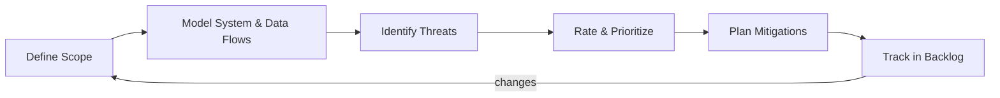

---

## 📍 Slide 2 – 📈 Why It Matters (Outcomes & Fresh Stats)

* 📊 **Reality check:** the **Verizon DBIR 2025** analyzed **22,052 incidents** and **12,195 breaches**—the **largest** set to date. ([Verizon][2])
* 🕳️ **Initial access trend:** **exploitation of vulnerabilities** grew **34% year-over-year**, now **\~20%** of breaches—underscoring the value of modeling “**what can be exploited**.” ([IT Services][3])
* 🤖 **AI risk angle (new in 2025):** **13%** of orgs reported breaches of **AI models/apps**; many lack adequate **AI access controls**—threat modeling helps surface these attack paths. ([IBM Newsroom][4])
* 💷 **Value of automation:** In the **UK**, broad **AI/automation** in security **reduced breach costs by >£600k** compared to non-users. ([IBM UK Newsroom][5])
* 🔗 **Read more:** DBIR 2025; IBM **Cost of a Data Breach 2025** resources. ([Verizon][2], [IBM][6])

---

## 📍 Slide 3 – 🏷️ Assets, Threats, Vulnerabilities, Risk (Clear Terms)

* 🧩 **Asset:** anything of value to protect (e.g., service, data, identity). *(Used across NIST risk guidance.)* ([NIST CSRC][7])
* ⚠️ **Threat:** a circumstance/event with potential to **adversely impact** operations or individuals via an information system. ([NIST Publications][8])
* 🕳️ **Vulnerability:** a **weakness** that can be **exploited** by a threat; consider **predisposing conditions** too. ([NIST Publications][8])
* 📉 **Risk:** a **function of likelihood and impact** for a threat exploiting a vulnerability (context matters). ([NIST Publications][9])
* 🔗 **Read more:** NIST **SP 800-30 Rev.1** (risk assessment foundations). ([NIST Publications][8])

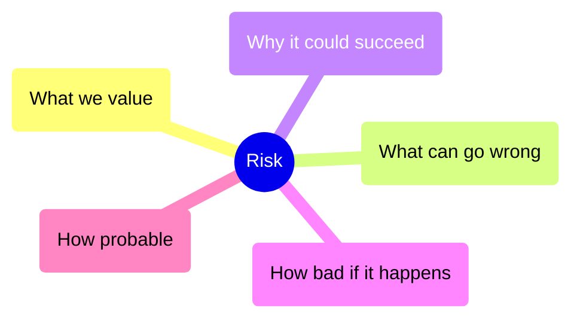

---

## 📍 Slide 4 – 🧱 Trust Boundaries & 🔐 Data Sensitivity

* 🧭 **Trust boundary:** where **privilege/identity/zone** changes (e.g., Internet → app tier, app → database); crossing it increases **threat exposure**. ([OWASP Developer Guide][1])
* 🗃️ **Classify data** (e.g., **PII**) to set impact expectations; NIST **SP 800-122** details **PII confidentiality impact levels** (low/moderate/high) and safeguards. ([NIST Publications][10])
* 🧾 **Document assumptions** (e.g., “DB is private network only”) and verify them—assumptions are often where attacks land. ([OWASP Developer Guide][1])
* 🔗 **Read more:** OWASP Threat Modeling guidance; NIST **SP 800-122** (PII). ([OWASP Developer Guide][1], [NIST CSRC][11])

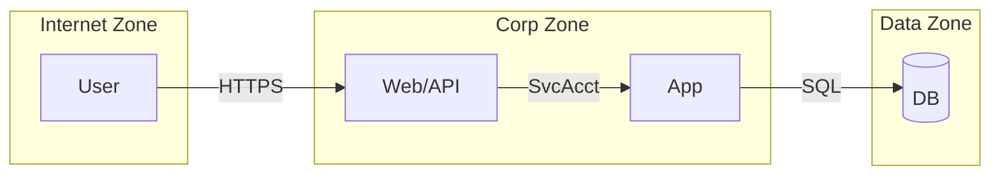

---

## 📍 Slide 5 – 🌐 Attack Surface 101 (What Expands It?)

* 🛰️ **Definition:** the **portion of resources accessible to an adversary**; complex enterprises make it hard to enumerate without structured segmentation/visibility. ([CISA][12])
* 🌍 **Common contributors:** **public-facing endpoints**, **exposed edge/IoT/OT devices**, **third-party SaaS/APIs**, **secrets** in repos, **shadow AI** features. ([CISA][13], [IBM Newsroom][4])
* 🧩 **Zero Trust microsegmentation** **reduces** attack surface and **limits lateral movement**; now explicit CISA guidance (2025). ([CISA][14])
* 🔗 **Read more:** CISA **Microsegmentation Guidance** (Part One), CISA **OT mitigations**. ([CISA][12])

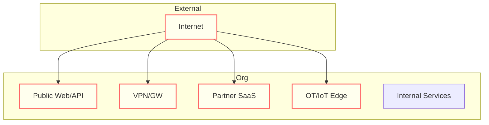

---

## 📍 Slide 6 – 🔁 Where Threat Modeling Fits (SDLC & Agile)

* 🧪 **Design/Build:** run modeling during **architecture & design**, and as part of **feature kickoff**; keep models updated as the design evolves. ([OWASP Developer Guide][1])
* 🧑‍🤝‍🧑 **Team roles:** product owner clarifies **business impact**, engineers map **flows & boundaries**, security helps **enumerate threats**, everyone owns **mitigations**. ([OWASP Developer Guide][1])
* ✅ **Definition of Done:** mitigations **linked to backlog tickets**, controls **verified**, and **residual risk** captured/reviewed. ([Microsoft GitHub][15])
* 🔗 **Read more:** Microsoft **Engineering Playbook** (Threat Modelling), OWASP Developer Guide. ([Microsoft GitHub][15], [OWASP Developer Guide][1])

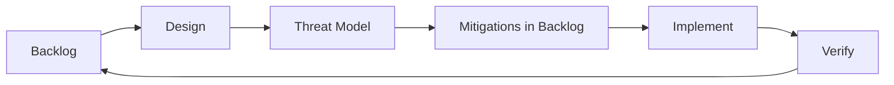

---

## 📍 Slide 7 – 🗺️ Data Flow Diagrams (DFDs) Essentials

* 🧩 **Why DFDs?** — They give a **visual map** of components, data stores, external entities, and flows; perfect for threat enumeration.
* 🖼️ **Core elements:**

  * 📦 **Processes** (rectangles)
  * 🗄️ **Data Stores** (cylinders)
  * 🌐 **External Entities** (actors, clouds)
  * 🔀 **Data Flows** (arrows)
* 🛑 **Common pitfalls:** skipping external entities, over-complicated diagrams, not marking **trust boundaries**.
* 🔗 **Docs:** OWASP Threat Modeling Cheat Sheet.

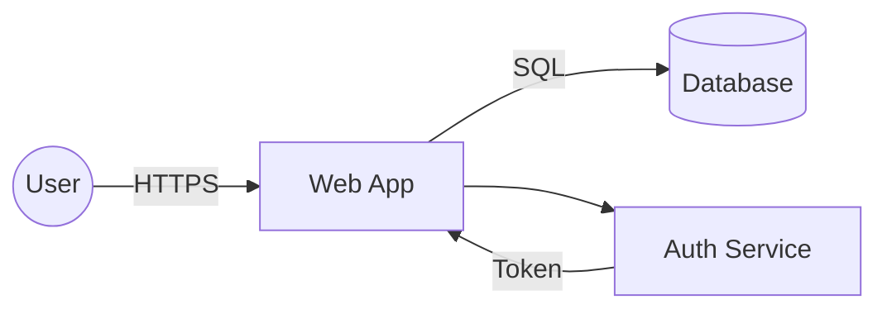

---

## 📍 Slide 8 – 🧭 Scoping & Assumptions

* 📌 **Define boundaries** — which systems **in/out of scope**; makes models actionable.
* 🧾 **Assumptions** — document them (e.g., “S3 bucket is private”), then **challenge & test** later.
* 📂 **Levels of trust:** assign zones (e.g., **public**, **internal**, **restricted**, **sensitive**).
* 🛠️ **Practical tip:** start **small** (one feature/system), then grow. Don’t boil the ocean.
* 🔗 **Docs:** OWASP Threat Dragon “Getting Started” guide.

```yaml
# Example: backlog entry for assumptions
threat_model_scope:
  in_scope:
    - "Customer web portal"
    - "Auth microservice"
  out_of_scope:
    - "Legacy CRM"
  assumptions:
    - "DB encrypted at rest"
    - "Internal network cannot be spoofed"
```

---

## 📍 Slide 9 – 🧩 STRIDE Framework Intro

* 🧭 **Created by Microsoft** (1999) to classify threats in **six categories**, each tied to a **security property**.
* 🔒 **Spoofing → Authentication**
* 🧪 **Tampering → Integrity**
* 📑 **Repudiation → Non-repudiation**
* 🔐 **Information Disclosure → Confidentiality**
* 🛑 **Denial of Service → Availability**
* 🧰 **Elevation of Privilege → Authorization**
* 🔗 **Docs:** Microsoft Threat Modeling Tool (supports STRIDE).

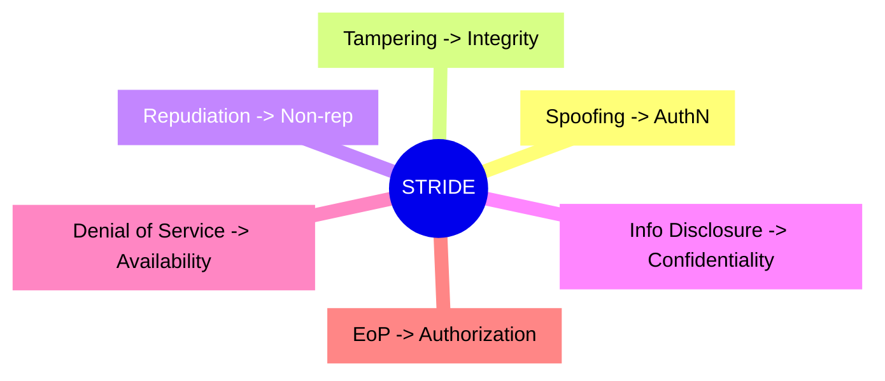

---

## 📍 Slide 10 – 🪪 S = Spoofing

* 🧩 **Definition:** Pretending to be someone/something else to gain unauthorized access.
* 📊 **Examples:** credential stuffing, forged JWTs, fake service endpoints.
* 🛡️ **Mitigations:**

  * 🔑 Strong authentication (MFA, FIDO2, mTLS)
  * 🗝️ Secure credential storage & rotation
  * 🔍 Identity federation w/ auditing
* 📈 **Why it matters:** 2025 DBIR shows **credentials still top vector**, with attacks doubling vs 2024.
* 🔗 **Docs:** Microsoft SDL guidance, OWASP ASVS (auth controls).

```yaml
# Example: backlog security requirement
requirement:
  id: "AUTH-01"
  text: "All external endpoints MUST enforce MFA via OIDC provider."
  mapped_to: STRIDE:Spoofing
```

---

## 📍 Slide 11 – 🧪 T = Tampering

* 🧩 **Definition:** Malicious **modification of data or code**.
* 📊 **Examples:** parameter tampering (price=0), code injection, log/file alteration.
* 🛡️ **Mitigations:**

  * 🧰 Input validation & canonicalization
  * 🔏 Signatures & checksums on critical data
  * 🔒 Integrity controls in pipelines (e.g., SLSA, Sigstore)
* 📈 **Why it matters:** Supply chain attacks grew **20% in 2025** (DBIR). Tampering is a key vector in dependency abuse.
* 🔗 **Docs:** Microsoft SDL, OWASP ASVS (data integrity).

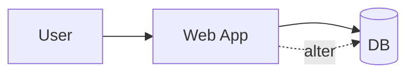

---

## 📍 Slide 12 – 🧾 STRIDE Letters in Practice (Setup)

* 🧾 We’ve covered **S (Spoofing)** & **T (Tampering)** with examples and mitigations.
* 📑 Next up: **R (Repudiation)**, **I (Information Disclosure)**, **D (Denial of Service)**, **E (Elevation of Privilege)**.
* 🧰 Each will get **its own slide** with **examples, mitigations, and use cases**.
* 🛠️ This detail is critical: new students must see how **each STRIDE letter ties to concrete controls**.

---

## 📍 Slide 13 – 🧾 R = Repudiation

* 🧩 **Definition:** A user or system **denies performing an action** without supporting evidence available.
* 📊 **Examples:**

  * User disputes a financial transaction
  * Attacker deletes logs to cover tracks
  * Cloud API call without signed evidence
* 🛡️ **Mitigations:**

  * 📝 **Audit logs** with **time sync** (NTP/chrony)
  * 🔏 **Cryptographically signed logs** (e.g., append-only ledgers, immutability in cloud)
  * 🕵️ **Monitoring & alerting** for tampered/erased events
* 📈 **Why it matters:** Legal & compliance investigations depend on reliable logs.
* 🔗 **Docs:** Microsoft SDL (repudiation mitigations), OWASP Logging Cheat Sheet.

```yaml
# Example log config snippet
logging:
  format: json
  integrity: signed
  retention_days: 365
  clock_sync: true
```

---

## 📍 Slide 14 – 🔐 I = Information Disclosure

* 🧩 **Definition:** Exposure of **sensitive data** to unauthorized parties.
* 📊 **Examples:**

  * PII in verbose error messages
  * Leaky S3 bucket / misconfigured storage
  * Secrets in GitHub repos
* 🛡️ **Mitigations:**

  * 🔒 Encryption in transit (TLS 1.2+/1.3) & at rest (AES-256, KMS)
  * 🔑 Secrets management (Vault, AWS Secrets Manager)
  * 🧹 Data minimization & masking in logs
* 📈 **Why it matters:** IBM 2025 report — **82% of breaches involved data stored in cloud**; misconfig remains a top driver.
* 🔗 **Docs:** OWASP ASVS (crypto requirements).

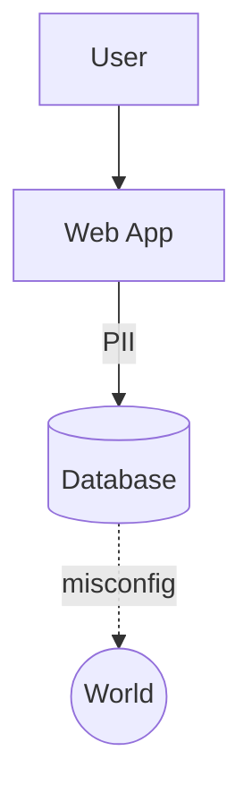

---

## 📍 Slide 15 – 🛑 D = Denial of Service (DoS)

* 🧩 **Definition:** Attacks aiming to **degrade availability** of a system.
* 📊 **Examples:**

  * Volumetric floods (UDP amplification)
  * Logical DoS (regex bombs, algorithmic complexity)
  * Resource exhaustion (unbounded queue)
* 🛡️ **Mitigations:**

  * 🌐 Web Application Firewalls (WAF) + DDoS protection (CDN, scrubbing centers)
  * ⏱️ Rate limits, back-pressure, exponential backoff
  * 🔄 Circuit breakers in service-to-service calls
* 📈 **Why it matters:** 2025 DBIR shows **DoS still \~30% of incidents**, especially in finance & gov.
* 🔗 **Docs:** Microsoft SDL availability guidelines.

```yaml
# Example API rate-limit config
rate_limits:
  /login:
    rps: 5
    burst: 10
  /orders:
    rps: 50
```

---

## 📍 Slide 16 – 🧰 E = Elevation of Privilege (EoP)

* 🧩 **Definition:** Gaining **permissions** beyond what was intended.
* 📊 **Examples:**

  * User escalates from **reader → admin** via IDOR
  * Privileged container escape
  * Default creds in cloud services
* 🛡️ **Mitigations:**

  * 🔐 Least privilege (RBAC/ABAC, Just-In-Time access)
  * 🛡️ Defense in depth (network + app + OS controls)
  * 🧾 Security testing (IAST/DAST fuzzing for access control)
* 📈 **Why it matters:** EoP is **core to ransomware ops** — attackers escalate to deploy payloads org-wide.
* 🔗 **Docs:** Microsoft SDL (authorization), OWASP ASVS access control.

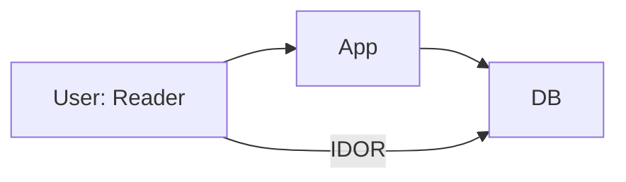

---

## 📍 Slide 17 – 🕵️‍♀️ LINDDUN Overview

* 🧭 **What it is:** A **privacy threat modeling framework** created by KU Leuven; focuses on **privacy harms** instead of only security flaws.
* 🧩 **Acronym:** **L-I-N-D-D-U-N** → Linkability, Identifiability, Non-repudiation, Detectability, Data Disclosure, Unawareness, Non-compliance.
* 🧰 **Purpose:** Helps identify **privacy risks** early in design (e.g., GDPR, HIPAA alignment).
* 🧑‍⚖️ **Recognition:** Listed by **NIST Privacy Framework** as a key methodology (last updated March 2025).
* 🔗 **Docs:** [linddun.org](https://linddun.org/) | [NIST Privacy Framework LINDDUN page](https://www.nist.gov/privacy-framework/linddun-privacy-threat-modeling-framework)

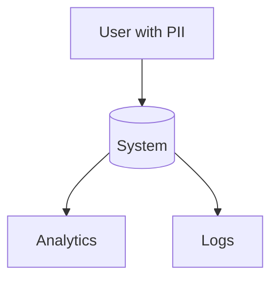

---

## 📍 Slide 18 – 📚 LINDDUN Methods & Aids

* 📂 **Threat Catalogs & Trees:** Provide structured ways to brainstorm privacy issues for each LINDDUN category.
* 🃏 **LINDDUN GO cards:** Lightweight cards for quick workshops; each card = threat + countermeasure.
* 🧰 **Flavors:**

  * **LINDDUN GO (lightweight)** → brainstorming in agile sprints.
  * **LINDDUN Pro** → full threat tree + PET mapping.
  * **LINDDUN Maestro** → large-scale system modeling, supported by tooling.
* 🧪 **Outputs:** Identified threats → mapped to **privacy-enhancing technologies (PETs)** like anonymization, pseudonymization, consent mgmt.
* 🔗 **Docs:** LINDDUN GO & Pro guidelines on [linddun.org](https://linddun.org/)

---

## 📍 Slide 19 – 🧪 LINDDUN Use Cases

* 🌐 **Web analytics/advertising:** Detect **linkability/identifiability** risks; mitigate via pseudonyms, aggregation.
* 📱 **Mobile health app:** **Detectability & Non-compliance** — traffic patterns reveal sensitive use; mitigated by encryption, DPIAs.
* 🏠 **IoT devices (smart home):** **Unawareness** of telemetry collection; add explicit consent & notice.
* 🧩 **Integration:** Often run **alongside STRIDE** for full picture (security + privacy).
* 📊 **Industry uptake:** Increasingly adopted in **DPIA processes** across EU-based companies (per NIST & LINDDUN Foundation guidance, 2025).

---

## 📍 Slide 20 – 🏛️ PASTA Overview

* 🧭 **What it is:** **Process for Attack Simulation & Threat Analysis (PASTA)** — a **7-stage, risk-centric methodology**.
* 📑 **Goal:** Align **business objectives** with **technical threats** → ensure risks have measurable business impact.
* 🔄 **Approach:** Iterative and **attacker-centric**, simulating how adversaries would exploit systems.
* 🧰 **Inventors:** Developed by **VerSprite**; widely used in enterprises needing regulatory alignment (finance, healthcare).
* 🔗 **Docs:** [VerSprite PASTA Threat Modeling](https://versprite.com/blog/pasta-threat-modeling-solution/)

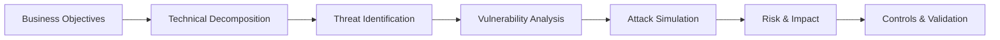

---

## 📍 Slide 21 – 🧪 PASTA 7 Stages in Detail

1. **Define Business Objectives** — scope, business drivers, compliance targets.
2. **Define Technical Scope** — decompose app/system, map trust boundaries.
3. **Application Decomposition & Threat Analysis** — identify threats/abuse cases.
4. **Vulnerability Analysis** — discover flaws (manual, automated).
5. **Attack Simulation** — model adversary behavior & kill chains.
6. **Risk & Impact Analysis** — map technical to **business risk**.
7. **Controls & Mitigations** — define countermeasures, test, and validate.

* 🧾 **Outputs:** Risk register with business impact traceability; prioritized mitigations.
* 🏗️ **Strength:** Ensures executives, architects, and testers all speak the **same risk language**.&#x20;

---

## 📍 Slide 22 – 📊 PASTA Case Study

* 🏦 **Scenario:** Online banking app in EU.
* 🔎 **Stage 1:** Objective → protect financial data & comply with PSD2.
* 🔐 **Stage 3–4:** Identified threats → credential stuffing, replay, insecure APIs; vulnerabilities in session handling.
* 🎭 **Stage 5:** Attack simulation showed chaining replay + weak session validation → account takeover.
* 📊 **Stage 6:** Business impact = customer fraud losses, regulatory fines.
* 🧰 **Stage 7:** Mitigations = MFA, replay protection, secure session mgmt.
* 📈 **Benefit:** Board-level risk visibility (“€ loss if attack succeeds”) → prioritized MFA rollout across all channels.

---

## 📍 Slide 23 – 🚀 VAST Overview

* 🧭 **What it is:** **Visual, Agile, and Simple Threat (VAST)** modeling — a framework designed for **enterprise-scale adoption**.
* 🧰 **Created by:** **ThreatModeler** to address scalability problems in traditional threat modeling approaches.
* ⚙️ **Core idea:** Threat modeling must be **automated, continuous, and aligned with Agile/DevOps** practices.
* 🏢 **Why VAST matters:**

  * Scales across **hundreds of applications**.
  * Keeps modeling accessible to **developers and non-security roles**.
  * Produces consistent, organization-wide threat intelligence.
* 🔗 **Docs:** [ThreatModeler VAST Overview](https://threatmodeler.com/innovation-lab/vast/)&#x20;

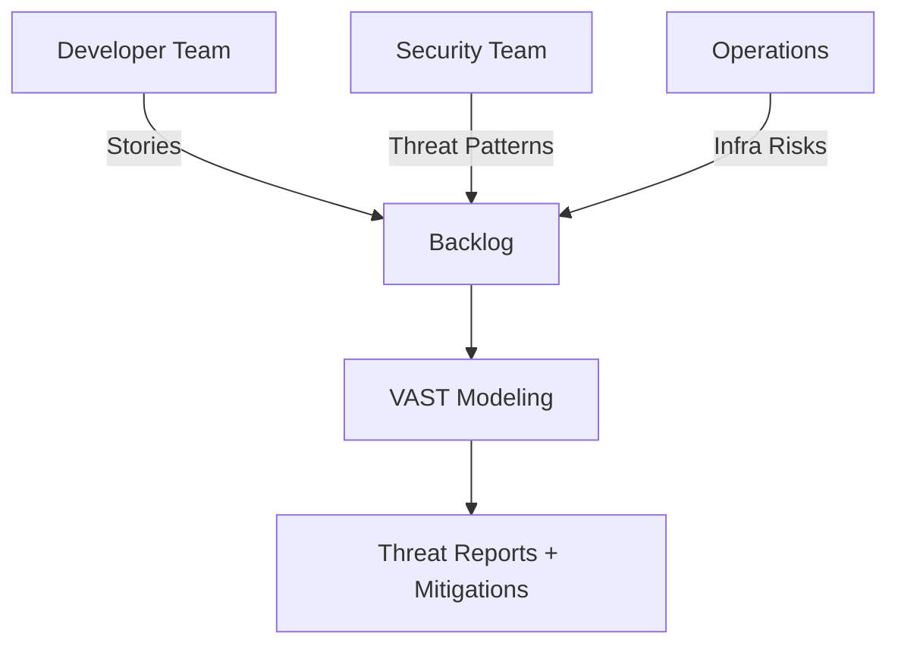

---

## 📍 Slide 24 – 🔌 VAST Integrations & Use Cases

* 🔄 **Application Threat Models:** Auto-generate threat models from architecture diagrams, cloud templates, or CI/CD pipelines.
* 🏗️ **Operational Threat Models:** Extend modeling to **infrastructure & deployment** (e.g., Kubernetes, AWS).
* 🚀 **Integration:** Embeds directly into **Agile backlog tools** (Jira, Azure DevOps) → devs see threats as **user stories**.
* 📊 **Use Cases:**

  * Large enterprises needing **consistent risk coverage**.
  * Organizations adopting **DevOps at scale**.
  * Continuous compliance for **PCI, HIPAA, NIST 800-53**.
* 📈 **Industry trend (2025):** ThreatModeler reports enterprises using VAST can reduce **manual modeling time by \~60%** across portfolios (per vendor benchmarks).

---

## 📍 Slide 25 – 💹 FAIR Overview

* 🧭 **What it is:** **FAIR = Factor Analysis of Information Risk** — the **international standard (Open FAIR)** for **quantitative risk analysis**.
* 💵 **Goal:** Express cyber risk in **financial terms** (probable loss, ranges, confidence levels) instead of vague “high/medium/low.”
* 🧩 **Core factors:**

  * **Loss Event Frequency (LEF)** = Threat Event Frequency × Vulnerability.
  * **Loss Magnitude (LM)** = Primary + Secondary losses (direct + indirect impacts).
* 🧰 **Use cases:**

  * Prioritize mitigations by **expected \$ impact**.
  * Communicate risk to **executives and boards**.
  * Compare control ROI across projects.
* 🔗 **Docs:** [FAIR Institute – What is FAIR?](https://www.fairinstitute.org/what-is-fair) (updated 2025)

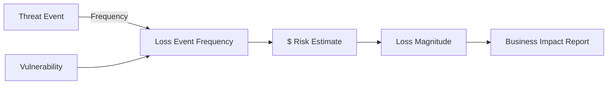

---

## 📍 Slide 26 – 🧮 FAIR in Practice

* 🏦 **Example:** Bank analyzing risk of API credential stuffing.

  * **LEF:** 12 times/year (based on incident data).
  * **Vulnerability:** Moderate (API lacks strict lockout).
  * **Loss Magnitude:**

    * **Primary:** Fraud reimbursements = \$5M/yr.
    * **Secondary:** Regulator fines, reputation damage = \$10M/yr.
  * **Total risk:** \~\$15M/year.
* 📊 **Result:** Clear **business case** for investing \$2M in stronger authn controls + fraud monitoring.
* 📈 **Industry adoption:** By 2025, FAIR is used by >50% of Fortune 100 companies for **cyber risk quantification** (FAIR Institute).
* 🤝 **Pairing:** Works well when combined with **STRIDE/PASTA/VAST** → identify threats, then quantify impact with FAIR.

---

## 📍 Slide 27 – 🧱 Threagile Overview

* 🧭 **What it is:** **Threagile** is an **open-source Agile Threat Modeling Toolkit** (by Christian Schneider).
* 📜 **Concept:** Treats **threat models as code** → written in **YAML** files, versioned in Git, integrated into DevOps.
* 🧰 **Outputs:**

  * 📊 Risk reports (JSON/XLSX/PDF).
  * 🗺️ Auto-generated **Data Flow Diagrams (DFDs)**.
  * ⚠️ Risk rules engine → finds issues like unencrypted traffic, missing authn.
* 📈 **Benefits:**

  * Agile-friendly (works in sprints).
  * Automatable (CLI, Docker, REST).
  * Repeatable (models live with code).
* 🔗 **Docs:** [threagile.io](https://threagile.io/) | [About Threagile](https://threagile.io/about/index.html)&#x20;

```yaml
# 📂 Example: Threagile YAML model (simplified)
title: Online Shop
technical_assets:
  webapp:
    type: web-application
    communication_links:
      - target: database
        protocol: https
```

---

## 📍 Slide 28 – 🧰 Threagile Workflow & Use Cases

* 🔄 **Workflow:**

  1. Define model in **YAML** (assets, comms, data).
  2. Run `threagile` CLI → generates **DFD + risk report**.
  3. Export to **JSON/XLSX** → feed into risk mgmt systems.
  4. Track risks like backlog items in Agile boards.
* 🧪 **Use Cases:**

  * **Microservices architecture** → model each service, see inter-service risks.
  * **Cloud migration** → identify new attack surfaces (S3 buckets, APIs).
  * **Regulated systems** → auto-generate reports for auditors.
* 📊 **Advanced metrics:** **Relative Attacker Attractiveness (RAA)** & **Data Loss Probability (DLP)** quantify risk importance. (DEF CON talk, widely adopted 2024–2025).
* 🤝 **Integration:** Works with IDEs, GitHub Actions, GitLab CI.
* 📈 **Trend:** By 2025, Threagile is used in many **“shift-left” security pipelines** as the de facto “code-first” modeling approach.

---

## 📍 Slide 29 – 🐉 OWASP Threat Dragon Overview

* 🧭 **What it is:** **Threat Dragon** is an **open-source threat modeling tool** from **OWASP**.
* 🖥️ **Versions:**

  * **Desktop app** (Win/Mac/Linux).
  * **Web app** (hosted or self-hosted).
* 🧰 **Features (v2.x, 2024–2025 releases):**

  * Supports **multiple methodologies**: STRIDE, LINDDUN, CIA, DIE, PLOT4ai.
  * **Rule engine** → auto-suggests threats based on diagram context.
  * Export models in **JSON**.
  * Integration with **GitHub/GitLab repos**.
* 📊 **Focus:** Make threat modeling accessible for dev teams (friendly UI, drag-and-drop).
* 🔗 **Docs:** [OWASP Threat Dragon Project Page](https://owasp.org/www-project-threat-dragon/)&#x20;

```json
{
  "summary": "Sample Threat Model",
  "threats": [
    { "id": "T1", "title": "SQL Injection", "method": "STRIDE-Tampering" },
    { "id": "T2", "title": "Data Exposure", "method": "LINDDUN-Disclosure" }
  ]
}
```

---

## 📍 Slide 30 – 🧪 Threat Dragon Workflow & Use Cases

* 🔄 **Workflow:**

  1. Create a **Data Flow Diagram** (DFD) → processes, stores, flows, externals.
  2. Tool auto-suggests **candidate threats**.
  3. Team reviews, accepts, or refines threats.
  4. Export model as **JSON** → track in repo or issue tracker.
* 🧪 **Use Cases:**

  * Agile teams doing lightweight threat modeling inside sprints.
  * Privacy/security workshops (with STRIDE + LINDDUN side by side).
  * Teaching & training (used in many university AppSec courses).
* 📈 **Trend (2025):** Maintainers report growing adoption due to **integration with DevOps workflows** and support for **AI-related threat patterns (PLOT4ai)** in latest versions.&#x20;
* 🤝 **Comparison:**

  * **Threagile** → code-centric, automation-first.
  * **Threat Dragon** → diagram-centric, collaboration-first.
  * Both complement each other in different DevSecOps contexts.

---

[1]: https://devguide.owasp.org/en/04-design/01-threat-modeling/01-threat-modeling/ "Threat modeling in practice - OWASP Developer Guide"
[2]: https://www.verizon.com/business/resources/T163/reports/2025-dbir-data-breach-investigations-report.pdf "2025 Data Breach Investigations Report - Verizon"
[3]: https://its.ny.gov/system/files/documents/2025/06/maguire-verizon.pdf "2025 Data Breach Investigations Report - its.ny.gov"
[4]: https://newsroom.ibm.com/2025-07-30-ibm-report-13-of-organizations-reported-breaches-of-ai-models-or-applications%2C-97-of-which-reported-lacking-proper-ai-access-controls "IBM Report: 13% Of Organizations Reported Breaches Of AI Models Or ..."
[5]: https://uk.newsroom.ibm.com/2025-cost-of-data-breach-UK?asPDF=1&utm_source=chatgpt.com "IBM Report: UK Sees Drop in Breach Costs as AI Speeds Detection"
[6]: https://www.ibm.com/think/x-force/2025-cost-of-a-data-breach-navigating-ai "2025 Cost of a Data Breach Report: Navigating the AI rush without ... - IBM"
[7]: https://csrc.nist.gov/pubs/sp/800/30/r1/final "SP 800-30 Rev. 1, Guide for Conducting Risk Assessments | CSRC"
[8]: https://nvlpubs.nist.gov/nistpubs/Legacy/SP/nistspecialpublication800-30r1.pdf "NIST Special Publication 800-30 Revision 1, Guide for Conducting Risk ..."
[9]: https://nvlpubs.nist.gov/nistpubs/Legacy/SP/nistspecialpublication800-30.pdf "Archived NIST Technical Series Publication"
[10]: https://nvlpubs.nist.gov/nistpubs/Legacy/SP/nistspecialpublication800-122.pdf "NIST SP 800-122, Guide to Protecting the Confidentiality of Personally ..."
[11]: https://csrc.nist.gov/pubs/sp/800/122/final "SP 800-122, Guide to Protecting the Confidentiality of Personally ..."
[12]: https://www.cisa.gov/sites/default/files/2025-07/ZT-Microsegmentation-Guidance-Part-One_508c.pdf "The Journey to Zero Trust: Microsegmentation in Zero Trust Part ... - CISA"
[13]: https://www.cisa.gov/resources-tools/resources/primary-mitigations-reduce-cyber-threats-operational-technology "Primary Mitigations to Reduce Cyber Threats to Operational ... - CISA"
[14]: https://www.cisa.gov/news-events/alerts/2025/07/29/cisa-releases-part-one-zero-trust-microsegmentation-guidance "CISA Releases Part One of Zero Trust Microsegmentation Guidance"
[15]: https://microsoft.github.io/code-with-engineering-playbook/security/threat-modelling/ "Threat Modeling - Engineering Fundamentals Playbook"
