# 📌Lecture 3 - Secure Git & Secrets Management

## 📍 Slide 1 – 🌍 Brief History of Git

* 🧑‍💻 Git was created in **2005 by Linus Torvalds**, the same creator of the Linux kernel.
* ⚡ It was designed after the **BitKeeper licensing dispute**, to give the Linux community a free and open source Version Control System (VCS).
* 🛠️ Git quickly became popular due to its **speed, distributed nature, and branching model**.
* 🌐 Today, **over 90% of open source projects** use Git as their primary VCS.
* 🎉 Fun fact: Torvalds named Git after himself, calling it a “stupid content tracker.”

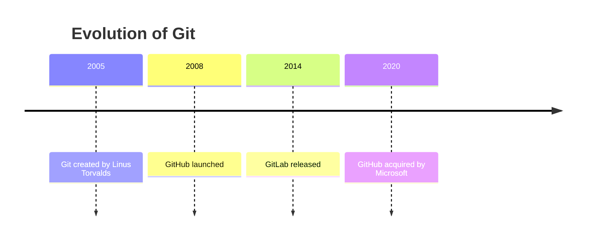

---

## 📍 Slide 2 – 🔐 Why Git Security is Important

* 🚨 **Repositories often contain sensitive data**: API keys, credentials, infrastructure details.
* 🧩 Git commits are **permanent by design** — once pushed, removing sensitive data is very hard.
* 🏢 Many breaches start with **leaked secrets in public repos** (attackers scan GitHub constantly).
* 📈 Reports show **millions of secrets** are leaked yearly in public repositories.
* 🛡️ Ensuring security in Git workflows is a **core practice in DevSecOps**.

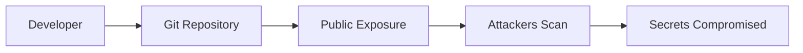

---

## 📍 Slide 3 – 🗃️ Version Control System (VCS) Basics Recap

* 📦 **Version Control System (VCS)** tracks changes in files, enabling collaboration.
* 🧑‍🤝‍🧑 Developers can **work in parallel** without overwriting each other’s work.
* 🔄 Git supports **branching and merging**, essential for modern workflows.
* 🛠️ Examples of VCS: **SVN (Subversion), Mercurial, Git**.
* 🚀 Git dominates due to **speed, distributed nature, and strong community**.

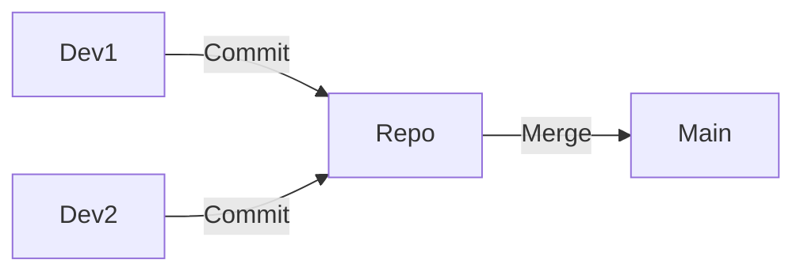

---

## 📍 Slide 4 – 🚨 Common Git-Related Security Incidents

* ❌ Developers accidentally commit **API keys, SSH keys, cloud tokens**.
* 📜 Sensitive files like `.env`, `config.json`, or database dumps are pushed.
* 🌍 Attackers monitor GitHub in real time for newly leaked credentials.
* 🏴‍☠️ Breaches:

  * Uber 2016 — AWS keys leaked in GitHub, attackers accessed millions of records.
  * Toyota 2022 — API keys exposed, leading to customer data risk.
* ⚡ Lesson: **Git is powerful, but careless usage leads to security disasters**.

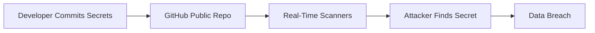

---

## 📍 Slide 5 – 🧾 Commit Identity Basics

* 🧑 Every Git commit contains **author information**: name & email.
* 🧑‍💻 The **committer** may differ from the author (e.g., when applying patches).
* 🖊️ This identity is only text metadata, so it can be **spoofed easily**.
* ⚠️ Without additional verification, **attackers could impersonate contributors**.
* ✅ Secure workflows use **signed commits** to prove authenticity.

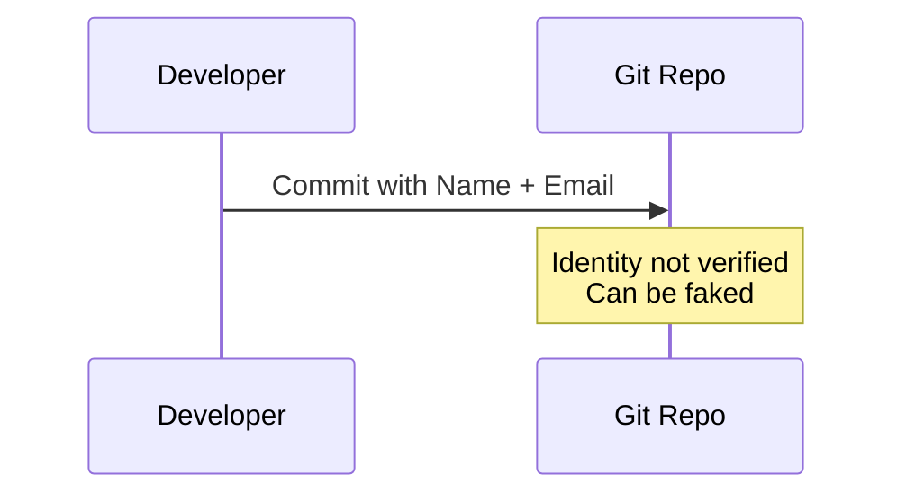

---

## 📍 Slide 6 – 🖊️ Signed Commits Explained

* 🛡️ **Signed commits** use cryptographic keys to prove authenticity.
* 🔑 A commit includes a **digital signature** that can be verified.
* 🏷️ GitHub and GitLab display a “✔ Verified” badge for signed commits.
* ⚠️ Unsigned commits may be flagged as **unverified**, reducing trust.
* 📖 Fun fact: Some open source projects only accept **signed commits** in pull requests.

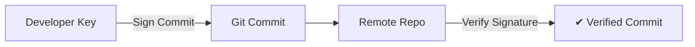

---

## 📍 Slide 7 – 🔑 PGP/GPG Keys in Git

* 🔒 **GPG (GNU Privacy Guard)** implements **Pretty Good Privacy (PGP)** encryption.
* 🗝️ Developers generate a **GPG key pair** (public + private keys).
* ✍️ Private key signs commits → Public key verifies authenticity.
* 🧩 Requires setting up Git to use GPG keys for signing.
* 🏢 Many enterprises enforce **GPG-signed commits** for compliance.

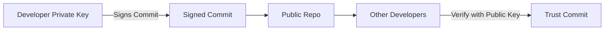

---

## 📍 Slide 8 – 🪪 SSH Signing of Commits

* 🔑 **SSH keys** (commonly used for repo access) can also sign commits.
* 🚀 Simpler setup than GPG — many developers already have SSH keys.
* 🛡️ Supported by Git 2.34+ and major platforms like GitHub.
* 🏢 Organizations can enforce **SSH-signed commits** at repository level.
* ⚖️ Comparison: SSH signing is **lighter** but less flexible than GPG.

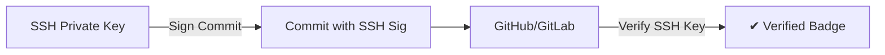

---
## 📍 Slide 9 – 🛡️ Verification of Commits in Platforms

* 🏢 GitHub, GitLab, and Bitbucket display commit signatures with badges.
* ✔️ A **green “Verified” label** means the signature matches a trusted key.
* ⚠️ A **yellow “Unverified” label** means signature exists but cannot be trusted.
* ❌ A **red “Bad signature” label** indicates possible tampering.
* 📊 Organizations can set policies to reject unverified commits in pull requests.

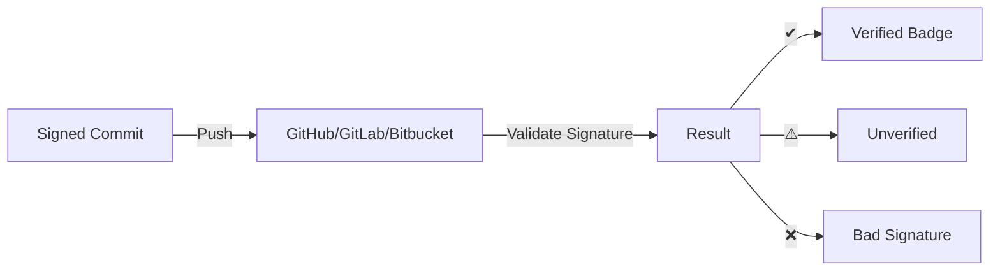

---

## 📍 Slide 10 – ⚖️ GPG vs SSH Commit Signing

* 🔑 **GPG (GNU Privacy Guard)**

  * ✅ Flexible, widely supported, strong cryptography.
  * ❌ Setup is complex, key management can be hard for beginners.
* 🪪 **SSH Signing**

  * ✅ Easier setup, uses existing SSH keys.
  * ❌ Less flexible, limited to Git commit signing.
* 🧩 Many developers prefer SSH for convenience, but enterprises lean on GPG for compliance.
* 📖 Fun fact: Some projects allow **both GPG and SSH signatures** depending on contributor level.

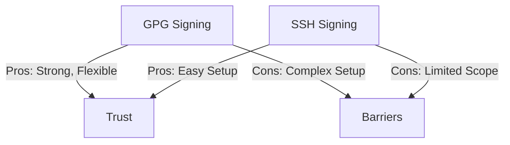

---

## 📍 Slide 11 – 🏢 Organizational Enforcement of Signed Commits

* 🛡️ Enterprises can **enforce signed commits** across repos.
* ⚙️ Platforms like GitHub/GitLab have repository settings to **reject unsigned commits**.
* 🚧 Helps prevent impersonation and ensures accountability.
* 🧑‍🤝‍🧑 Promotes **trust in collaborative environments**.
* 📜 Compliance: Aligns with standards like **ISO 27001** and **SOC2**.

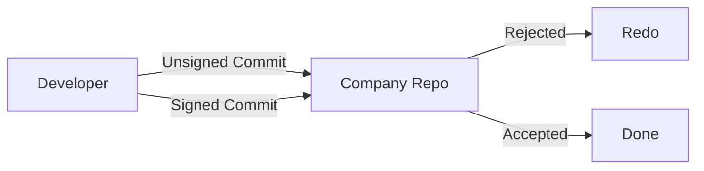

---

## 📍 Slide 12 – ❌ What Are “Secrets”?

* 🔑 **Secrets** are sensitive values used by applications to authenticate or authorize:

  * API keys
  * Database credentials
  * SSH private keys
  * Cloud provider tokens
* 📦 Secrets are as critical as passwords — if exposed, attackers gain access to systems.
* ⚡ Fun fact: Many leaks are due to developers **copy-pasting keys for quick testing**.

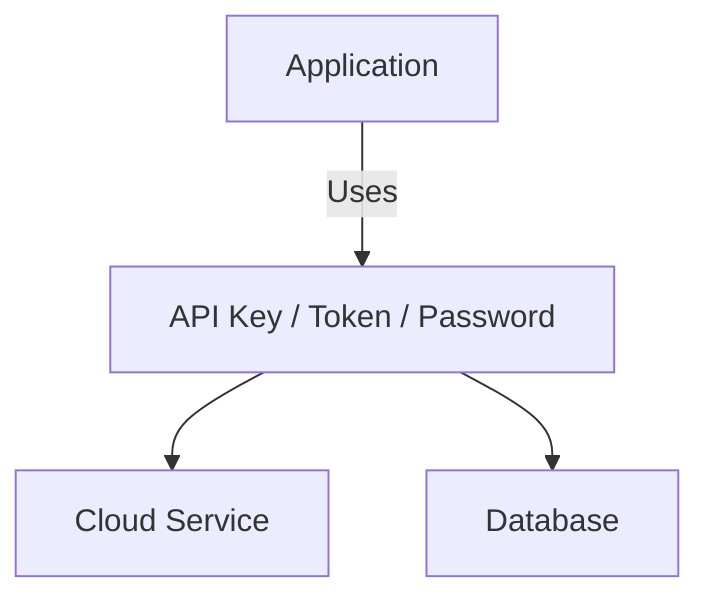

---

## 📍 Slide 13 – 🔓 How Secrets Leak into Git Repositories

* 📂 Committing `.env` or `config.json` files with credentials.
* 🧑‍💻 Copy-pasting tokens directly into source code.
* 🔁 Using test credentials but forgetting to remove them.
* 📦 Uploading entire folders without `.gitignore` filters.
* ⚠️ Once pushed, **history preserves the secret forever**.

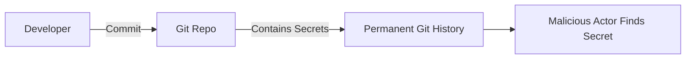

---

## 📍 Slide 14 – 📂 Examples of Leaked Secrets in Public Repos

* 🚨 High-profile incidents:

  * Uber (2016): AWS keys leaked, attackers accessed 57M records.
  * Toyota (2022): Hardcoded API keys exposed, customer data at risk.
  * GitHub (2021): Dozens of companies had internal tokens leaked.
* 📊 Studies show **thousands of new secrets** appear in public GitHub repos daily.
* 🧩 Attackers use **real-time scanners** to catch leaked keys within minutes.
* 🏴‍☠️ Secrets are often sold on dark web forums.

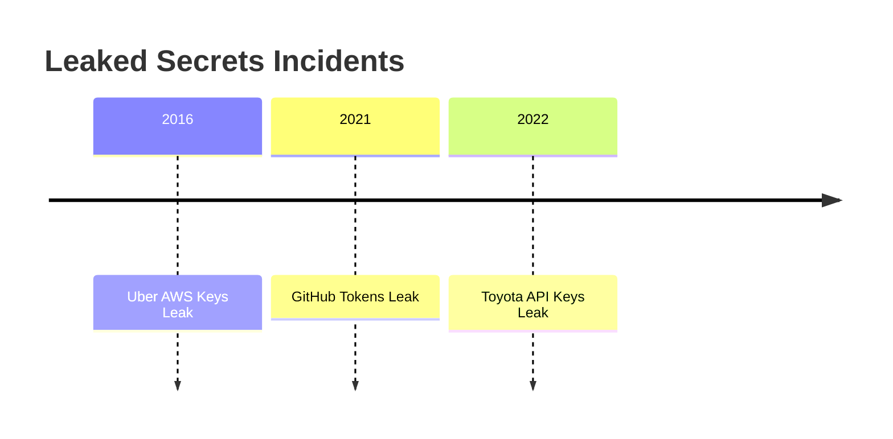

---
## 📍 Slide 15 – 📉 Impact of Secret Leaks

* 🚨 Attackers can gain **direct access to cloud services, databases, or APIs**.
* 💸 Financial impact: breaches often lead to **fines, lawsuits, and lost revenue**.
* 🕵️ Secrets may be used in **supply-chain attacks** (injecting malicious code).
* 🌍 Data breaches can expose **millions of user records**.
* 🏴‍☠️ Attackers sometimes don’t exploit directly but **sell secrets on black markets**.
* 📊 Fun fact: Average cost of a secret-related breach is **over \$4M (IBM 2023 study)**.

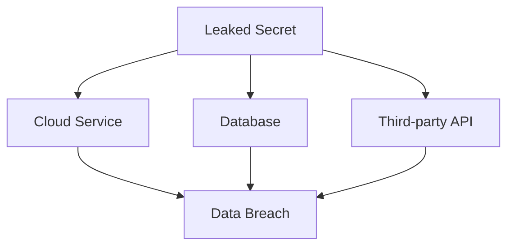

---

## 📍 Slide 16 – ⚠️ Why Deleting from Git History Is Not Enough

* 🗂️ Git keeps **full history of commits**, even if files are removed later.
* 🧩 A leaked key in an old commit can still be retrieved with `git log`.
* 📥 Attackers may already have **cloned the repo** before deletion.
* 🧹 Cleaning requires **rewriting history** with tools like `git filter-repo` or **BFG Repo-Cleaner**.
* 🚧 Even after cleaning, copies may exist in **forks or caches**.

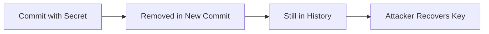

---

## 📍 Slide 17 – 🔍 Manual vs Automated Secret Scanning

* 🧑 **Manual review**: developers scanning code before pushing.

  * ✅ Good for awareness, but ❌ prone to human error.
* ⚙️ **Automated scanning**: tools detect secrets during commit or CI/CD pipeline.

  * ✅ Scales across teams, ❌ may generate false positives.
* 📦 Best practice: use **both manual awareness and automated scanning**.
* 📊 Fun fact: Some attackers run their own **secret scanners** across GitHub 24/7.

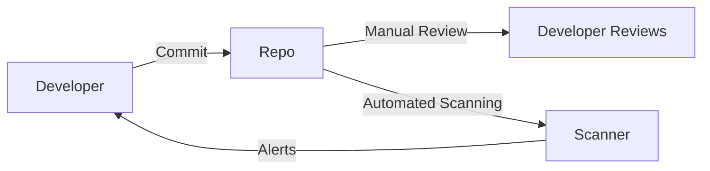

---

## 📍 Slide 18 – 🛠️ GitGuardian for Secret Scanning

* 🧭 **GitGuardian** scans repositories in real time for exposed secrets.
* 🔑 Detects API keys, tokens, and sensitive patterns in code.
* 📊 Provides dashboards with statistics, incident history, and alerts.
* 🛡️ Used by enterprises to **monitor both private and public repos**.
* ⚡ Fun fact: GitGuardian’s research shows **millions of secrets leaked yearly**.

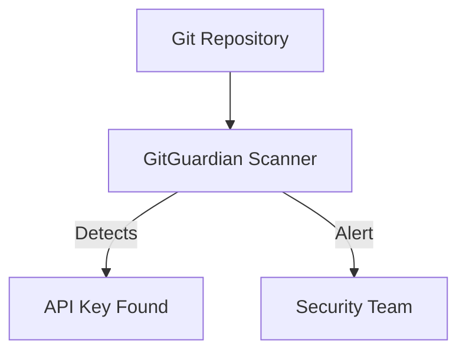

---

## 📍 Slide 19 – 🛠️ TruffleHog for Secret Scanning

* 🐷 **TruffleHog** searches Git history for secrets and high-entropy strings.
* 🕵️ Supports scanning entire repos, branches, and commits.
* 🔑 Finds both **hardcoded keys** and **high-risk random strings**.
* 🧩 Integrates into CI/CD workflows for continuous scanning.
* 🏆 Popular in open source communities and DevSecOps pipelines.

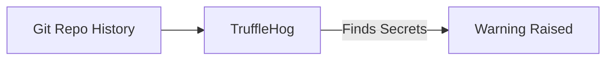

---

## 📍 Slide 20 – 🛠️ Gitleaks for Secret Scanning

* 🔎 **Gitleaks** is a fast, open-source tool for scanning repos for secrets.
* ⚡ Can be integrated as a **pre-commit hook** or in CI/CD pipelines.
* 🧩 Uses regex + entropy detection to catch secrets in commits.
* 🛡️ Lightweight and easy to configure with custom rules.
* 🏢 Adopted by companies to enforce **“no secret in repo” policies**.

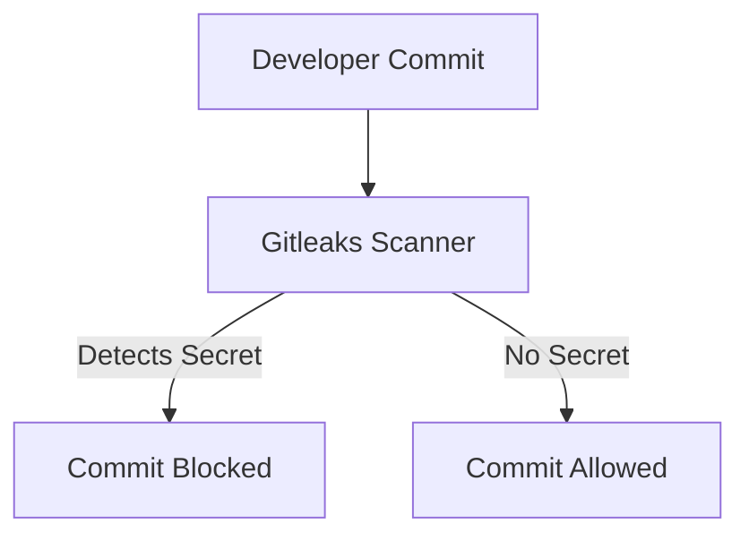

---
## 📍 Slide 21 – 📦 Built-in Scanners in Git Platforms

* 🛡️ **GitHub Secret Scanning** automatically detects common tokens (AWS, Azure, Slack, etc.).
* 🏗️ **GitLab Secret Detection** integrates into CI pipelines for scanning commits and merge requests.
* 📊 **Bitbucket** offers integrations with security tools for secret scanning.
* 📬 Many providers partner with **cloud vendors** (e.g., AWS, GCP) to automatically revoke exposed tokens.
* ⚡ Fun fact: GitHub scans **all public repos by default** for leaked secrets.

```mermaid
graph TD
    Repo[Repository] --> GitHub[GitHub Secret Scanning]
    Repo --> GitLab[GitLab Secret Detection]
    Repo --> Bitbucket[Bitbucket Security]
    GitHub -->|Alert| Dev[Developer]
    GitLab -->|Alert| Dev
    Bitbucket -->|Alert| Dev
```

---

## 📍 Slide 22 – 📊 Stats & Trends of Secret Leaks

* 📈 Research shows **over 10M secrets** leaked in public repos annually.
* 🏴‍☠️ Leaks increased by **60% year-over-year** due to cloud adoption.
* 📊 Most common leaks: **cloud API keys (AWS, Azure, GCP)** and **database credentials**.
* 🧑‍💻 Attackers often exploit secrets **within minutes** of exposure.
* 🛠️ Enterprises increasingly integrate **automated detection + revocation** systems.
* 🎉 Fun fact: GitHub found that **90% of repos with leaked secrets** belonged to individuals, not companies.

```mermaid
pie
    title Secret Types Leaked
    "Cloud API Keys" : 45
    "Database Credentials" : 25
    "SSH Keys" : 15
    "Other Tokens" : 15
```

---

## 📍 Slide 23 – 🧰 History of Secret Storage

* 📜 Early days: developers stored secrets in **plain text config files**.
* 📂 Later: secrets were placed in **environment variables** (`.env` files).
* 🔑 With cloud adoption, **vaulting systems** emerged for centralized management.
* 🏗️ Now: dynamic secrets and **short-lived credentials** are becoming standard.
* 🌍 Trend: secrets are moving away from code repos → into **dedicated secret managers**.

```mermaid
timeline
    title Secret Storage Evolution
    1990s : Plaintext Config Files
    2000s : Environment Variables
    2010s : Vaulting Solutions
    2020s : Dynamic & Ephemeral Secrets
```

---

## 📍 Slide 24 – 🔑 Environment Variables for Secrets

* 📦 Common practice: store secrets in `.env` files and load them into apps.
* ✅ Pros: simple, supported by most frameworks, easy to override.
* ❌ Cons: risk of committing `.env` into Git, poor lifecycle management.
* 🛡️ Must be combined with `.gitignore` to prevent accidental commits.
* 🎉 Fun fact: `.env` file practice became popular with **12-Factor App methodology**.

```mermaid
flowchart TD
    EnvFile[.env File] --> App[Application]
    App --> Service[Database / API / Cloud]
```

---

## 📍 Slide 25 – 📜 Config Files & .gitignore

* 📝 Secrets often live in config files (`config.yaml`, `settings.json`).
* 🚨 Danger: config files can be accidentally committed to repos.
* 🛡️ Best practice: add them to `.gitignore` to keep them out of Git.
* ⚙️ Example `.gitignore` entry:

  ```bash
  # Ignore environment config
  .env
  config/*.json
  secrets/*
  ```
* 🎉 Fun fact: In 2013, a researcher found **thousands of AWS keys** in GitHub due to config file commits.

```mermaid
graph LR
    Dev[Developer] --> Config[Config File with Secrets]
    Config --> Repo[Git Repository]
    Repo -->|Ignored by .gitignore| Safe[Secrets Not Committed]
```

---

## 📍 Slide 26 – 🛡️ Secrets Vaulting Tools Overview

* 🧰 Secrets vaulting = **dedicated tools for secure secret storage & retrieval**.
* 🔑 Examples:

  * **HashiCorp Vault** (open-source, dynamic secrets)
  * **AWS Secrets Manager** (cloud-native integration)
  * **Azure Key Vault** (tight integration with Microsoft ecosystem)
  * **GCP Secret Manager** (Google Cloud-native)
* ⚡ Features: centralized storage, auditing, rotation, fine-grained access.
* 🌍 Trend: moving from **static to dynamic, short-lived secrets**.

```mermaid
flowchart TD
    Vault[Secrets Vault] -->|Provide Secrets| App[Application]
    Vault --> Audit[Audit Logs]
    Vault --> Rotate[Secret Rotation]
    App --> Service[Cloud Service / DB]
```

---
## 📍 Slide 27 – ⚡ Secret Rotation & Lifecycle Management

* 🔄 **Secret rotation** = replacing secrets regularly to reduce exposure risk.
* 🛠️ Automated rotation is supported by tools like **AWS Secrets Manager** and **HashiCorp Vault**.
* 📅 Rotation can be scheduled (e.g., every 30 days) or triggered by incidents.
* 🛡️ Benefits: limits attacker window, improves compliance.
* ⚠️ Challenge: updating dependent applications without downtime.
* 🎉 Fun fact: Netflix rotates certain service keys **every few hours**.

```mermaid
sequenceDiagram
    participant Vault
    participant App
    Vault->>App: Old Secret
    Note over Vault: Rotation Trigger
    Vault->>App: New Secret
    App->>Service: Use New Secret
```

---

## 📍 Slide 28 – 🧩 Integrating Vaults with CI/CD Pipelines

* 🚀 CI/CD = Continuous Integration / Continuous Deployment.
* 🔑 Pipelines need secrets (DB passwords, cloud keys, API tokens).
* 🛡️ Vault integration injects secrets **dynamically at runtime** instead of storing them in code.
* ⚙️ Example: GitHub Actions pulling secrets from Vault.
* 📊 Benefits: reduces leaks, enables rotation, adds audit trails.

```mermaid
flowchart LR
    Vault[Secret Vault] -->|Inject Secrets| Pipeline[CI/CD Pipeline]
    Pipeline --> App[Application Build/Deploy]
    Pipeline --> Cloud[Cloud Services]
```

---

## 📍 Slide 29 – 🔄 Dynamic vs Static Secrets

* 🧾 **Static secrets**: long-lived, manually managed (e.g., hardcoded API key).
* ⚡ **Dynamic secrets**: generated on demand, short-lived (e.g., 1-hour DB password).
* ✅ Dynamic secrets reduce risk: compromised keys expire quickly.
* 🛠️ Vault tools can auto-generate **ephemeral credentials**.
* 🌍 Trend: industry moving towards **dynamic-first models**.

```mermaid
flowchart TD
    Static[Static Secret] --> Risk[Long-term Exposure Risk]
    Dynamic[Dynamic Secret] --> Safe[Expires Quickly, Lower Risk]
```

---

## 📍 Slide 30 – 🧹 Cleaning Git History of Secrets

* 🚨 If secrets are leaked in Git, they must be removed from history.
* 🛠️ Tools: **BFG Repo-Cleaner** (fast, easy) or `git filter-repo` (flexible).
* 📜 After cleanup, force-push to overwrite history.
* ⚠️ Risk: breaks clones/forks, requires coordination with collaborators.
* ✅ Still recommended for compliance even if secret is rotated.

```mermaid
graph LR
    Old[Repo with Leaked Secret] --> BFG[BFG Repo-Cleaner]
    BFG --> Clean[Repo without Secret]
    Clean --> Push[Force Push to Remote]
```

---

## 📍 Slide 31 – 🚦 Pre-Commit Hooks for Preventing Leaks

* 🛡️ **Pre-commit hooks** run checks before a commit is saved.
* 🧩 Tools like **Husky** or custom Git hooks can block secrets.
* ⚙️ Example rule: block commits containing “AWS\_SECRET\_KEY”.
* 📊 Helps developers catch mistakes early, before they hit Git history.
* 🎉 Fun fact: Some teams enforce **mandatory pre-commit checks** across all repos.

```mermaid
flowchart TD
    Dev[Developer Commit] --> Hook[Pre-Commit Hook]
    Hook -->|Contains Secret| Block[❌ Block Commit]
    Hook -->|No Secret| Allow[✔ Commit Allowed]
```

---

## 📍 Slide 32 – 🛠️ Secrets Scanning in CI/CD Pipelines

* 🏗️ Pipelines can run **secret scanners** (Gitleaks, TruffleHog, GitGuardian).
* 🚨 If a secret is detected, the build/deploy process fails.
* 🛡️ Ensures no sensitive data reaches production.
* 📦 Best practice: run scanning on every pull request and branch.
* 📊 Enterprises combine CI/CD scanning with **centralized monitoring**.

```mermaid
flowchart LR
    Dev[Pull Request] --> Pipeline[CI/CD Pipeline]
    Pipeline --> Scanner[Secret Scanner]
    Scanner -->|Secret Found| Fail[❌ Build Fails]
    Scanner -->|No Secret| Deploy[✔ Deploy Continues]
```

---
## 📍 Slide 33 – 🕸️ Zero-Trust Approach to Git Security

* 🔐 **Zero-Trust** = “Never trust, always verify” principle applied to Git workflows.
* 🧑‍💻 Every commit, merge, and access request is verified against policies.
* 🛡️ Requires **signed commits, enforced 2FA, and role-based repo access**.
* 🌐 Remote access uses VPNs or Zero-Trust Network Access (ZTNA).
* 📊 Benefit: reduces insider threats and unauthorized code changes.
* 🎉 Fun fact: Google pioneered the **BeyondCorp** model, inspiring Zero-Trust in DevOps.

```mermaid
flowchart TD
    Dev[Developer] -->|Signed Commit| Repo[Repository]
    Dev -->|Access Request| Gatekeeper[Zero-Trust Policy Check]
    Gatekeeper -->|Allow| Repo
    Gatekeeper -->|Deny| Blocked
```

---

## 📍 Slide 34 – 🌐 Emerging Trends: P2P & Blockchain Git

* 🔄 **Peer-to-Peer Git (P2P)** — repos shared directly without central servers.
* 📦 Example: **Radicle** — decentralized Git collaboration.
* 🌍 **Blockchain-backed repos** (e.g., Gitopia) ensure tamper-proof history.
* ⚡ Benefits: resilience, censorship resistance, cryptographic integrity.
* 🚧 Challenges: slower adoption, tooling still maturing.
* 🎉 Fun fact: Radicle is described as “GitHub without GitHub.”

```mermaid
graph TD
    Dev1[Developer A] <--> Dev2[Developer B]
    Dev2 <--> Dev3[Developer C]
    Dev1 <--> Dev3[Decentralized P2P Git Network]
```

---

## 📍 Slide 35 – 🔮 Future of Git Security & Secret Management

* 🚀 Growing adoption of **ephemeral, auto-rotating secrets**.
* 🛠️ AI-driven scanners that detect secrets more accurately with context.
* 🕸️ Wider move to **P2P and blockchain-based version control**.
* 🏢 Enterprises adopting **“security by default”** policies in Git platforms.
* 🌍 Regulatory compliance (GDPR, NIST, ISO) pushing stricter practices.
* 🎉 Prediction: within 5–10 years, **manual secret handling will disappear**.

```mermaid
timeline
    title Future of Git Security
    2025 : Widespread Automated Scanning
    2027 : Ephemeral Secrets Standardized
    2030 : Blockchain-backed Git Adoption
```

---

## 📍 Slide 36 – 🏢 Case Study: GitHub Token Leaks

* 🚨 In 2021, GitHub reported widespread **token leaks** across public repos.
* 🛠️ Many tokens were found by **automated scanners**, not by developers.
* 🏴‍☠️ Attackers exploited leaked tokens to access CI/CD pipelines.
* 📦 GitHub partnered with providers (AWS, GCP, Slack) to **auto-revoke tokens**.
* 📊 Lesson: automation is essential — humans can’t keep up with leak frequency.

```mermaid
graph TD
    Leak[Leaked Token] --> Attacker[Attacker Exploits Access]
    Attacker --> Pipelines[CI/CD Pipeline]
    Pipelines --> Data[System/Data Compromised]
```

---

## 📍 Slide 37 – 🚨 Case Study: Supply-Chain Attacks via Repos

* 🕵️ Attackers compromise repos to insert **malicious code or dependencies**.
* 🏴‍☠️ Example: **event-stream NPM package** hijack in 2018.
* 📦 Malicious commits looked legitimate but harvested cryptocurrency wallets.
* ⚠️ Unsigned commits made it easier to inject code unnoticed.
* 📊 Lesson: enforce signed commits and review dependencies.
* 🎉 Fun fact: Supply-chain attacks are among the **fastest-growing cyber threats**.

```mermaid
flowchart TD
    Attacker[Attacker] --> Repo[Compromised Repo]
    Repo --> User[Developers Install Dependency]
    User --> Exploit[Malicious Code Executes]
```

---

## 📍 Slide 38 – 📘 Industry Standards & Compliance Requirements

* 📜 **ISO 27001**: requires secure handling of credentials and repos.
* 🏛️ **NIST Guidelines**: recommend strong key management and audit logging.
* 🛡️ **SOC2 Compliance**: demands evidence of secret management practices.
* ⚖️ **GDPR & HIPAA**: enforce strict data protection (including access keys).
* 📊 Enterprises adopt Git security policies to meet compliance.
* 🎉 Fun fact: some auditors now require **proof of commit signing policies**.

```mermaid
flowchart LR
    Standards[Compliance Standards] --> Org[Organizations]
    Org --> Policies[Signed Commits, Vaulting, Scanning]
    Policies --> Audit[Auditors Approve]
```

---
## 📍 Slide 39 – 📝 Best Practices Checklist for Developers

* 🔑 **Always sign commits** (GPG or SSH) to ensure authenticity.
* 🛡️ **Never hardcode secrets** into code or config files.
* 📦 Use **environment variables or vaults** for secret storage.
* 🚦 Add **pre-commit hooks** to block sensitive files (`.env`, keys).
* 🛠️ Run **secret scanners** locally and in CI/CD pipelines.
* 🔄 **Rotate secrets** regularly and enforce expiration.
* 🧑‍🤝‍🧑 Collaborate under **Zero-Trust policies** — every commit verified.
* 📊 Monitor repos with **automated alerts** for new leaks.

```mermaid
graph TD
    Checklist[Secure Git & Secrets Checklist] --> Signed[✔ Signed Commits]
    Checklist --> NoSecrets[✔ No Secrets in Code]
    Checklist --> Vaults[✔ Vaults for Storage]
    Checklist --> Hooks[✔ Pre-Commit Hooks]
    Checklist --> Scanners[✔ Automated Scanners]
    Checklist --> Rotation[✔ Secret Rotation]
```

---

## 📍 Slide 40 – 🎯 Summary & Hands-On Practice

* 📖 **Key Takeaways**:

  * Git history is permanent → treat commits as sensitive.
  * Signed commits build **trust & accountability**.
  * Secrets must be managed via **vaults, rotation, and scanning**.
  * Zero-Trust is the **future of Git security**.
* 🛠️ **Hands-On Practice Ideas**:

  * Generate GPG & SSH keys, sign commits.
  * Use `gitleaks` to scan your repos.
  * Configure `.gitignore` and pre-commit hooks.
  * Deploy HashiCorp Vault and integrate with a pipeline.
* 📚 **Further Learning**:

  * Git & GitHub official docs
  * OWASP Secrets Management Guide
  * DevSecOps playbooks & industry case studies
* 🎉 Remember: **security is everyone’s job in DevOps!**

```mermaid
flowchart TD
    Git[Git Security] --> Commits[Signed Commits]
    Git --> Secrets[Secrets Management]
    Git --> Vaults[Vaulting & Rotation]
    Git --> Scanning[Automated Scanning]
    Git --> ZeroTrust[Zero-Trust Practices]
```

---
