# 📌Lecture 4 - CI/CD Security & Build Hardening

## 📂 Group 1: CI/CD Pipeline Foundations & Architecture

## 📍 Slide 1 – 🏗️ What is CI/CD? (Continuous Integration/Continuous Deployment)

* 🏗️ **CI = Continuous Integration** → developers merge code changes frequently (multiple times daily) into a shared repository, triggering **automated builds and tests**.
* 🚀 **CD = Continuous Deployment/Delivery** → automated deployment of validated code changes to **staging/production environments**.
* 🔄 **Core principle**: "**integrate early, deploy often**" → catch issues fast, reduce integration hell, enable rapid releases.
* 🎯 **Benefits**: faster feedback loops, reduced manual errors, consistent deployments, improved team collaboration.
* 📊 **Industry adoption**: **85% of organizations** use CI/CD practices as of 2024 (GitLab DevOps Report).
* 🔗 **Learn more**: [What is CI/CD? - GitLab](https://about.gitlab.com/topics/ci-cd/)

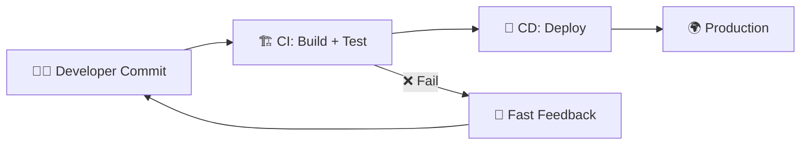

---

## 📍 Slide 2 – 🔄 Evolution of CI/CD: From Manual Builds to Modern Pipelines

* 📅 **1990s-2000s**: Manual builds, nightly builds, "integration hell" → developers fear merging code.
* 📅 **2006**: **CruiseControl** introduces automated CI → "build on every commit" concept emerges.
* 📅 **2011**: **Jenkins** (Hudson fork) revolutionizes CI with plugins and distributed builds.
* 📅 **2018**: **Cloud-native CI/CD** emerges → GitHub Actions, GitLab CI, CircleCI offer **serverless pipelines**.
* 📅 **2020-2024**: **GitOps**, **Infrastructure-as-Code (IaC)**, and **security-first pipelines** become standard.
* 🚀 **Today**: **AI-assisted pipelines**, **policy-as-code**, and **supply chain security** are the new frontier.
* 🔗 **History deep-dive**: [Evolution of CI/CD - ThoughtWorks](https://www.thoughtworks.com/insights/articles/continuous-integration)

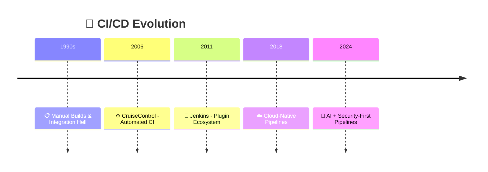

---

## 📍 Slide 3 – 🏛️ CI/CD Architecture Components & Trust Boundaries

* 🏗️ **Core components** of modern CI/CD architecture:
  * 📂 **Source Control** (Git repositories) → code storage and version control
  * ⚙️ **Build Agents/Runners** → compute resources executing pipeline jobs
  * 🗄️ **Artifact Repositories** → storing build outputs (Docker images, packages)
  * 🚀 **Deployment Targets** → staging/production environments
* 🛡️ **Trust boundaries** → security perimeters where **privilege levels change**:
  * 🌍 **Internet ↔ SCM**: public access vs. authenticated repository access
  * 🔧 **SCM ↔ Build System**: code checkout vs. build execution
  * 📦 **Build ↔ Artifact Store**: temporary builds vs. permanent storage
  * 🎯 **Artifact Store ↔ Production**: staging approval vs. live deployment
* ⚠️ **Attack surface**: each boundary represents potential **compromise points**.
* 🔗 **Architecture guide**: [CI/CD Security Architecture - NIST](https://csrc.nist.gov/pubs/sp/800/204/final)

```mermaid
flowchart LR
    subgraph "🌍 Internet Zone"
        Dev[👨‍💻 Developers]
    end
    
    subgraph "🔐 SCM Zone"
        Git[📂 Git Repository]
    end
    
    subgraph "⚙️ Build Zone"
        Agent[🔧 Build Agent]
        Tests[🧪 Test Suite]
    end
    
    subgraph "📦 Artifact Zone"
        Registry[🗄️ Artifact Registry]
    end
    
    subgraph "🎯 Deployment Zone"
        Staging[🧪 Staging]
        Prod[🌍 Production]
    end
    
    Dev -->|HTTPS + Auth| Git
    Git -->|Webhook| Agent
    Agent --> Tests
    Tests -->|Success| Registry
    Registry --> Staging
    Staging -->|Approval| Prod
    
    %% Trust boundaries
    classDef boundary stroke:#ff4444,stroke-width:3px,stroke-dasharray: 5 5
```

---

## 📍 Slide 4 – ⚙️ Popular CI/CD Platforms Overview (Jenkins, GitHub Actions, GitLab CI, Azure DevOps)

* 🔧 **Jenkins** (2011, open-source):
  * ✅ **Strengths**: massive plugin ecosystem (1800+ plugins), self-hosted flexibility
  * ❌ **Challenges**: complex setup, security maintenance burden, legacy UI
  * 🏢 **Best for**: enterprises with dedicated DevOps teams, hybrid cloud
* ⚡ **GitHub Actions** (2019, cloud-native):
  * ✅ **Strengths**: native Git integration, marketplace ecosystem, serverless
  * ❌ **Challenges**: vendor lock-in, pricing for private repos, limited self-hosting
  * 👥 **Best for**: open-source projects, GitHub-centric workflows
* 🦊 **GitLab CI** (2012, integrated platform):
  * ✅ **Strengths**: built-in SCM+CI+CD+security, self-hosted options
  * ❌ **Challenges**: resource-heavy, learning curve for complex workflows
  * 🏢 **Best for**: teams wanting all-in-one DevSecOps platform
* 🔷 **Azure DevOps** (2018, Microsoft ecosystem):
  * ✅ **Strengths**: tight Microsoft integration, enterprise features, hybrid support
  * ❌ **Challenges**: complexity, licensing costs, less popular in open-source
  * 🏢 **Best for**: Microsoft-stack enterprises, .NET applications

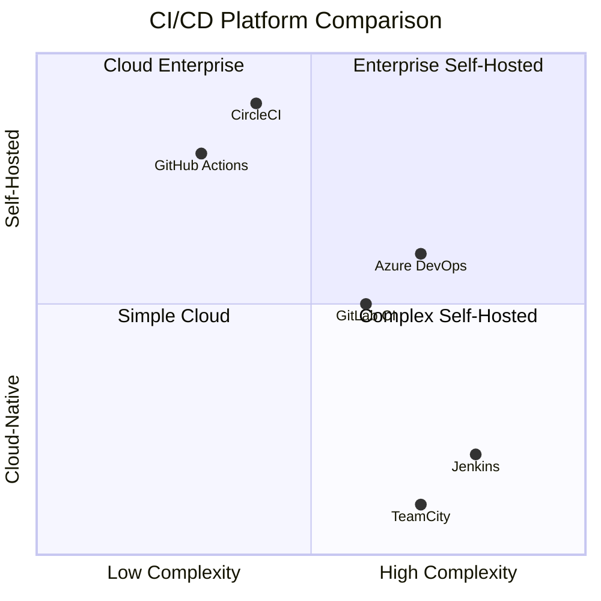

* 📊 **Market share (2024)**: Jenkins 47%, GitHub Actions 31%, GitLab CI 12%, Azure DevOps 7% ([JetBrains DevEcosystem Survey](https://www.jetbrains.com/lp/devecosystem-2024/))

---

## 📍 Slide 5 – 🚨 Why CI/CD Pipelines Became High-Value Attack Targets

* 🎯 **Central position**: CI/CD pipelines have **privileged access** to:
  * 📂 **Source code repositories** → intellectual property, secrets
  * 🔑 **Production credentials** → cloud accounts, databases, APIs
  * 🏗️ **Build infrastructure** → compute resources, internal networks
  * 📦 **Artifact repositories** → deployment packages, container images
* ⚡ **Attack amplification**: compromising CI/CD enables:
  * 🦠 **Supply chain poisoning** → inject malicious code into software releases
  * 🔓 **Lateral movement** → pivot to production systems using pipeline credentials
  * 📥 **Data exfiltration** → access sensitive data across multiple environments
* 💥 **Real-world impact examples**:
  * **SolarWinds (2020)**: attackers compromised build system → 18,000 customers affected
  * **Codecov (2021)**: CI system breach → customer secrets exposed for months
  * **NPM ecosystem (2021-2024)**: multiple supply chain attacks via compromised CI/CD
* 📈 **Growing threat**: **45% increase** in CI/CD-targeted attacks since 2022 ([Checkmarx Supply Chain Report](https://checkmarx.com/resource/documents/en/report/2024-software-supply-chain-security-report/))

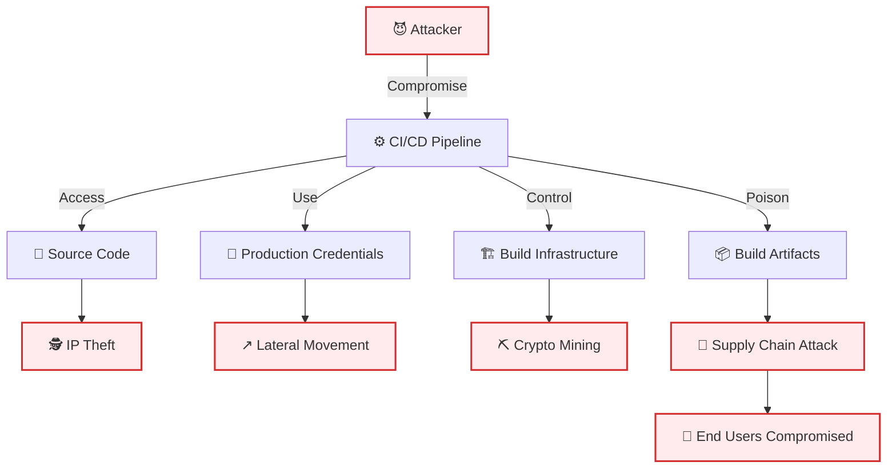

---

## 📍 Slide 6 – 📊 The OWASP Top 10 CI/CD Security Risks (2024)

* 📋 **OWASP CI/CD Security Top 10** → framework identifying **most critical risks** in CI/CD environments ([OWASP CI/CD Security](https://owasp.org/www-project-top-10-ci-cd-security-risks/)):

1. **🚫 CICD-SEC-1: Insufficient Flow Control** → inadequate pipeline stage controls
2. **🔐 CICD-SEC-2: Inadequate Identity and Access Management** → excessive permissions
3. **⚠️ CICD-SEC-3: Dependency Chain Abuse** → compromised third-party components
4. **☠️ CICD-SEC-4: Poisoned Pipeline Execution (PPE)** → malicious pipeline modifications
5. **🔓 CICD-SEC-5: Insufficient PBAC (Pipeline-Based Access Control)** → weak pipeline permissions
6. **🔑 CICD-SEC-6: Insufficient Credential Hygiene** → exposed secrets and credentials
7. **🏗️ CICD-SEC-7: Insecure System Configuration** → misconfigured CI/CD infrastructure
8. **🔍 CICD-SEC-8: Ungoverned Usage of 3rd Party Services** → unvetted external services
9. **🔍 CICD-SEC-9: Improper Artifact Integrity Validation** → unsigned/unverified artifacts
10. **📊 CICD-SEC-10: Insufficient Logging and Visibility** → poor monitoring and auditing

* 🎯 **Why this matters**: provides **structured approach** to securing CI/CD pipelines
* 📈 **Industry adoption**: used by **60% of enterprises** for CI/CD security assessments

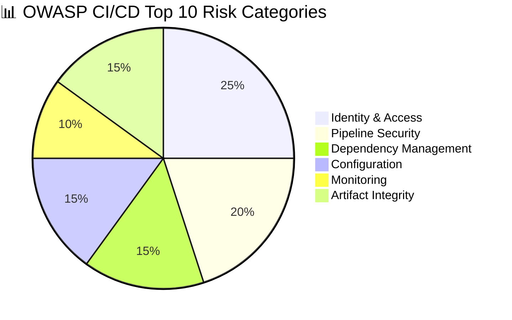

---

## 📍 Slide 7 – 🔗 Supply Chain Attacks via CI/CD: Famous Case Studies

* 🌟 **SolarWinds Orion (2020)**:
  * 🎯 **Attack vector**: compromised build system → malicious code injected during build process
  * 📊 **Impact**: 18,000+ organizations affected, including US government agencies
  * ⏱️ **Duration**: undetected for **9 months**, demonstrating stealth capabilities
  * 💡 **Lesson**: build environment security is **critical infrastructure**

* 🧪 **Codecov Bash Uploader (2021)**:
  * 🎯 **Attack vector**: compromised CI script in Codecov's infrastructure
  * 📊 **Impact**: customer environment variables and secrets exposed for **2+ months**
  * 🔑 **Scope**: affected hundreds of companies using Codecov in their CI/CD
  * 💡 **Lesson**: third-party CI/CD tools require **continuous monitoring**

* 📦 **NPM Package Attacks (2021-2024)**:
  * 🎯 **Attack vectors**: compromised developer accounts, dependency confusion, typosquatting
  * 📊 **Examples**: `event-stream`, `ua-parser-js`, `node-ipc` package compromises
  * 🔍 **Impact**: millions of downloads of malicious packages via automated CI/CD
  * 💡 **Lesson**: dependency management requires **automated security scanning**

* 🐍 **PyTorch Supply Chain (2022)**:
  * 🎯 **Attack vector**: compromised dependency in PyTorch nightly builds
  * 📊 **Impact**: malicious code in ML framework affecting AI/ML pipelines
  * ⚡ **Response**: rapid detection and response **within hours**
  * 💡 **Lesson**: even "trusted" ecosystems need **continuous validation**

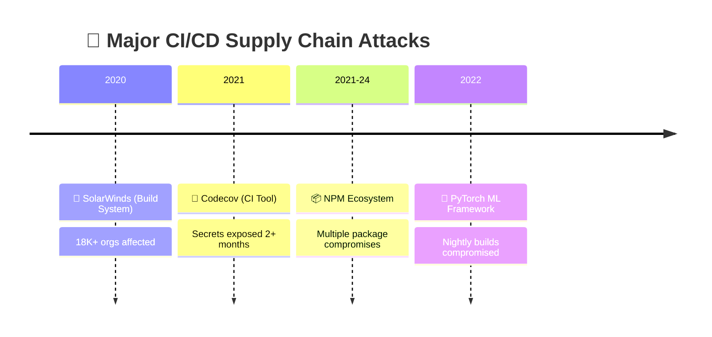

* 💰 **Economic impact**: supply chain attacks cost organizations **average $4.35M per incident** ([IBM Cost of Data Breach 2024](https://www.ibm.com/reports/data-breach))
* 📈 **Trend**: **300% increase** in supply chain attacks targeting CI/CD since 2021 ([Sonatype State of Software Supply Chain](https://www.sonatype.com/state-of-the-software-supply-chain/))

---

## 📂 Group 2: Pipeline Access Control & Identity Management

## 📍 Slide 8 – 🔐 Authentication & Authorization in CI/CD Pipelines

* 🔐 **Authentication** = verifying **who** is accessing the CI/CD system (users, services, systems)
* 🛡️ **Authorization** = determining **what** authenticated entities can do (permissions, roles)
* 🧩 **Common authentication methods**:
  * 👤 **Human users**: SSO (SAML/OIDC), API tokens, SSH keys
  * 🤖 **Service accounts**: machine identities, workload identity, service principals
  * 🔧 **Build agents**: agent tokens, certificate-based authentication
* 📊 **Identity sources**: Active Directory, LDAP, cloud identity providers (AWS IAM, Azure AD, Google Cloud Identity)
* ⚠️ **Common failures**: shared accounts, long-lived tokens, excessive permissions
* 🔗 **Best practices**: [NIST SP 800-63 Digital Identity Guidelines](https://pages.nist.gov/800-63-3/)

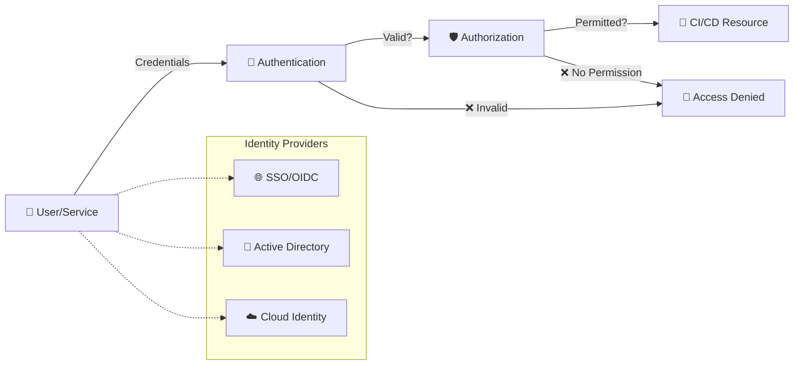

---

## 📍 Slide 9 – 🎭 Role-Based Access Control (RBAC) for Pipeline Resources

* 🎭 **RBAC = Role-Based Access Control** → users assigned to **roles**, roles granted **permissions**
* 🏗️ **CI/CD-specific roles** (example hierarchy):
  * 👑 **Pipeline Admin**: full pipeline management, user administration
  * 🔧 **Pipeline Developer**: create/modify pipelines, trigger builds
  * 👀 **Pipeline Viewer**: read-only access to pipeline status and logs
  * 🚀 **Deployer**: deployment permissions to specific environments
  * 📊 **Auditor**: read-only access for compliance and security reviews
* 🎯 **Granular permissions**:
  * 📂 **Repository access**: read/write to specific repos
  * 🔧 **Pipeline operations**: create, modify, delete, execute
  * 🌍 **Environment access**: dev, staging, production deployment
  * 🔑 **Secret access**: view/use specific credentials and tokens
* 📈 **Benefits**: scalable permission management, audit trails, compliance alignment
* 🏢 **Enterprise example**: developers can deploy to staging but need approval for production

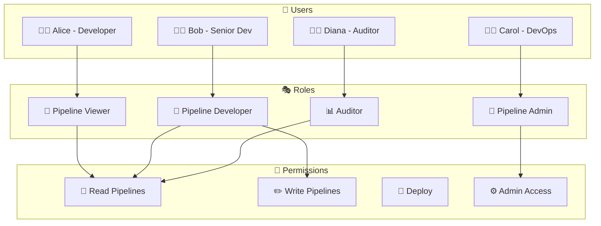

---

## 📍 Slide 10 – 🔑 Service Account Security & Credential Management

* 🤖 **Service accounts** = non-human identities for **automated processes** (build agents, deployment scripts, integrations)
* 🔐 **Types of service credentials**:
  * 🎫 **API tokens**: GitHub Personal Access Tokens, GitLab tokens
  * 🎟️ **Service principals**: Azure service principals, AWS IAM roles
  * 🔑 **SSH keys**: for Git operations and server access
  * 🎪 **Workload identity**: cloud-native identity (AWS IRSA, Azure pod identity)
* ⚠️ **Common security risks**:
  * 📝 **Hardcoded secrets**: tokens stored in plain text in pipelines
  * ⏰ **Long-lived credentials**: tokens that never expire
  * 🎯 **Over-privileged access**: service accounts with excessive permissions
  * 🔄 **Credential sharing**: same token used across multiple pipelines
* ✅ **Security best practices**:
  * 🔐 Use **credential managers** (HashiCorp Vault, cloud key vaults)
  * ⏱️ Implement **short-lived tokens** with automatic rotation
  * 🎯 Follow **least privilege principle** for service accounts
  * 🔍 Regular **access reviews** and credential audits

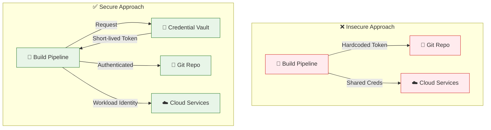

---

## 📍 Slide 11 – 🛡️ Multi-Factor Authentication (MFA) for Pipeline Access

* 🛡️ **MFA = Multi-Factor Authentication** → requires **multiple verification factors** beyond password
* 🧩 **Authentication factors**:
  * 🧠 **Something you know**: password, PIN, security questions
  * 📱 **Something you have**: smartphone app, hardware token, SMS
  * 👁️ **Something you are**: fingerprint, face recognition, voice
* 🎯 **CI/CD MFA implementation**:
  * 👤 **Human access**: mandatory MFA for all pipeline administrative access
  * 📱 **TOTP (Time-based OTP)**: Google Authenticator, Microsoft Authenticator
  * 🔑 **Hardware tokens**: YubiKey, FIDO2 security keys
  * 📞 **Push notifications**: mobile app approval workflows
* 📊 **MFA effectiveness**: blocks **99.9% of automated attacks** ([Microsoft Security Intelligence Report](https://www.microsoft.com/en-us/security/business/security-intelligence-report))
* 🏢 **Enterprise requirements**: many organizations mandate MFA for all CI/CD access
* ⚠️ **Bypass risks**: SMS-based MFA vulnerable to SIM swapping, prefer app-based or hardware tokens

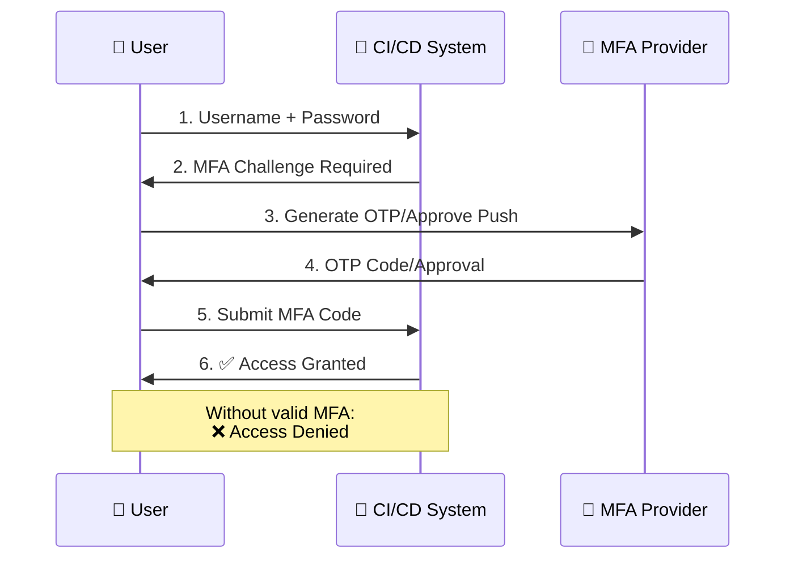

* 🔗 **Implementation guides**:
  * [GitHub MFA Setup](https://docs.github.com/en/authentication/securing-your-account-with-two-factor-authentication-2fa)
  * [GitLab MFA Configuration](https://docs.gitlab.com/ee/user/profile/account/two_factor_authentication.html)

---

## 📍 Slide 12 – ⚖️ Principle of Least Privilege in CI/CD Workflows

* ⚖️ **Least Privilege Principle** → entities should have **minimum permissions** required to perform their function
* 🎯 **Application in CI/CD**:
  * 👤 **Users**: developers only access their team's pipelines
  * 🤖 **Service accounts**: build agents only access required repositories
  * 🔧 **Pipelines**: each pipeline only accesses necessary resources
  * 🌍 **Environments**: staging access ≠ production access
* 📊 **Permission granularity levels**:
  * 🏗️ **Organization level**: admin vs. member access
  * 📂 **Repository level**: read, write, admin permissions
  * 🔧 **Pipeline level**: view, edit, execute, delete
  * 🌍 **Environment level**: deploy, approve, configure
* ⚠️ **Common violations**:
  * 👑 **Admin by default**: giving users more permissions than needed
  * 🔄 **Permission creep**: accumulating permissions over time
  * 🎯 **Broad service accounts**: single account for multiple purposes
* ✅ **Implementation strategies**:
  * 📋 **Regular access reviews**: quarterly permission audits
  * 🔄 **Just-in-time access**: temporary elevated permissions
  * 📊 **Permission analytics**: identify unused or excessive permissions

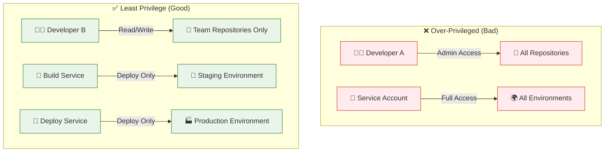

### 💻 Example: GitHub Repository Permissions

```yaml
# ❌ Over-privileged team permissions
team_permissions:
  developers:
    role: admin  # Too much access
    repositories: "*"  # Access to all repos

# ✅ Least privilege team permissions
team_permissions:
  frontend_devs:
    role: write  # Appropriate for development
    repositories: 
      - "web-app"
      - "ui-components"
  backend_devs:
    role: write
    repositories:
      - "api-service"
      - "database-migrations"
```

---

## 📍 Slide 13 – 🕸️ Zero-Trust Approaches to Pipeline Security

* 🕸️ **Zero-Trust Security Model** → "**never trust, always verify**" - assume breach and verify every access attempt
* 🔐 **Core Zero-Trust principles for CI/CD**:
  * 🚫 **No implicit trust**: verify identity and device for every access
  * 🔍 **Continuous verification**: monitor and re-authenticate during sessions
  * 🎯 **Micro-segmentation**: isolate pipeline components and limit blast radius
  * 📊 **Real-time monitoring**: detect and respond to anomalous behavior
* 🛡️ **Zero-Trust CI/CD implementation**:
  * 🔐 **Device trust**: only managed/compliant devices access pipelines
  * 📍 **Location-based access**: restrict access based on geographic location
  * 🕐 **Time-based access**: limit access to business hours or maintenance windows
  * 🔄 **Dynamic permissions**: permissions based on current risk assessment
* 🧩 **Supporting technologies**:
  * 🌐 **Secure Access Service Edge (SASE)**: cloud-native security platform
  * 🔐 **Privileged Access Management (PAM)**: just-in-time privileged access
  * 📊 **User and Entity Behavior Analytics (UEBA)**: detect anomalous behavior
* 🏢 **Industry adoption**: **67% of enterprises** implementing Zero-Trust by 2025 ([Gartner Zero Trust Research](https://www.gartner.com/en/newsroom/press-releases/2023-07-11-gartner-identifies-three-factors-influencing-adoption-of-a-zero-trust-architecture))

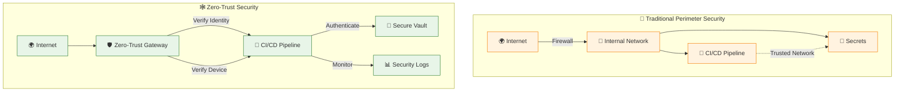

### 💻 Example: Zero-Trust Pipeline Configuration

```yaml
# Zero-Trust CI/CD Pipeline Configuration
pipeline_security:
  identity_verification:
    mfa_required: true
    device_compliance: required
    location_restrictions:
      - "corporate_office"
      - "approved_vpn"
  
  access_controls:
    session_timeout: 2h
    re_authentication_interval: 30min
    privilege_escalation: just_in_time
  
  monitoring:
    behavioral_analytics: enabled
    anomaly_detection: enabled
    real_time_alerts: enabled
```

* 💡 **Benefits**: reduced attack surface, improved compliance, faster threat detection
* 🚧 **Implementation challenges**: complexity, user experience impact, cultural change required

---

## 📂 Group 3: Secure Pipeline Configuration & Hardening

## 📍 Slide 14 – 📋 Infrastructure-as-Code (IaC) for Pipeline Configuration

* 📋 **IaC = Infrastructure-as-Code** → managing CI/CD infrastructure through **version-controlled configuration files**
* 🏗️ **Pipeline-as-Code benefits**:
  * 📂 **Version control**: track changes, rollback capabilities, audit history
  * 🔄 **Reproducibility**: consistent pipeline deployments across environments
  * 👥 **Collaboration**: code review processes for infrastructure changes
  * 🧪 **Testing**: validate pipeline configurations before deployment
* 🛠️ **Popular IaC tools for CI/CD**:
  * ⚙️ **Terraform**: multi-cloud pipeline infrastructure provisioning
  * 📘 **Azure ARM/Bicep**: Azure DevOps pipeline infrastructure
  * ☁️ **AWS CDK/CloudFormation**: CodePipeline and CodeBuild setup
  * 🐙 **Pulumi**: modern IaC with familiar programming languages
* 📊 **Adoption statistics**: **76% of organizations** use IaC for CI/CD infrastructure ([HashiCorp State of Cloud Strategy Report](https://www.hashicorp.com/state-of-the-cloud))
* 🔐 **Security advantages**: immutable infrastructure, consistent security configs, policy enforcement
* 🔗 **Best practices**: [Terraform CI/CD Best Practices](https://developer.hashicorp.com/terraform/tutorials/automation)

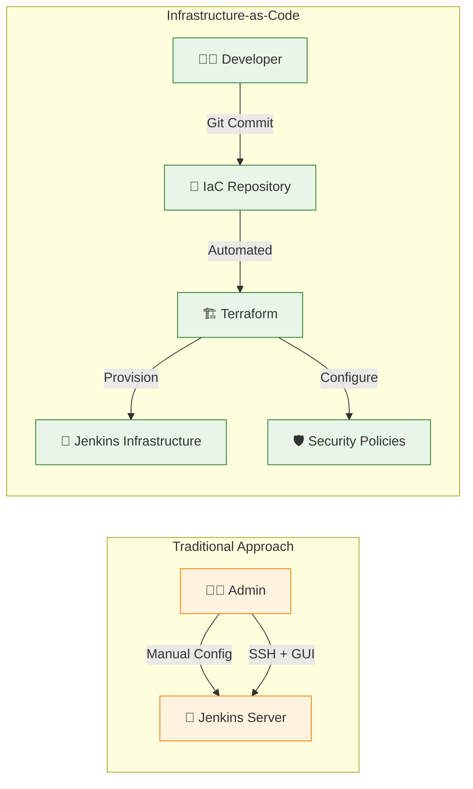

---

## 📍 Slide 15 – 🔒 Securing Pipeline Configuration Files (YAML/JSON Security)

* 📄 **Configuration file risks**: pipeline definitions (YAML/JSON) are **code** and need security review
* ⚠️ **Common vulnerabilities in pipeline configs**:
  * 🔑 **Hardcoded secrets**: API keys, passwords directly in YAML/JSON files
  * 🌐 **External script execution**: downloading and executing untrusted scripts
  * 📝 **Command injection**: user input passed to shell commands without validation
  * 🔓 **Overly permissive triggers**: pipelines triggered by any branch or PR
* 🛡️ **Configuration security best practices**:
  * 📖 **Code review mandatory**: all pipeline changes require peer review
  * 🔐 **Secret scanning**: automated detection of credentials in config files
  * ✅ **Schema validation**: ensure pipeline configs follow secure templates
  * 🚫 **Restricted permissions**: limit who can modify pipeline configurations
* 🧩 **Platform-specific protections**:
  * 🐙 **GitHub Actions**: required reviewers for workflow changes
  * 🦊 **GitLab CI**: protected variables and restricted runners
  * 🔧 **Jenkins**: job configuration restrictions and approval processes
* 📊 **Impact**: **23% of CI/CD breaches** involve compromised configuration files ([Argon Security Research](https://www.argon.io/blog/argo-cd-security-research-findings/))

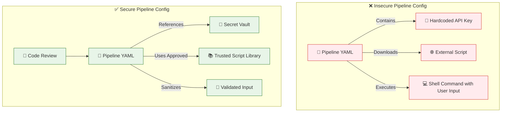

---

## 📍 Slide 16 – 🏰 Build Environment Isolation & Sandboxing

* 🏰 **Build isolation** = running each build in a **separate, controlled environment** to prevent interference and security breaches
* 🧩 **Isolation techniques**:
  * 📦 **Containerization**: Docker containers for build execution
  * 🖥️ **Virtual machines**: dedicated VMs for sensitive builds
  * 🔒 **Process isolation**: separate user accounts and namespaces
  * 🌐 **Network isolation**: restricted network access during builds
* 🛡️ **Sandboxing benefits**:
  * 🚫 **Malware containment**: malicious code cannot escape build environment
  * 🔐 **Secret protection**: credentials isolated per build
  * 🧹 **Clean state**: each build starts with fresh environment
  * 📊 **Resource limits**: CPU, memory, and disk quotas per build
* ⚙️ **Implementation approaches**:
  * 🐳 **Docker-based**: ephemeral containers destroyed after build
  * ☁️ **Cloud runners**: AWS CodeBuild, Google Cloud Build, Azure DevOps hosted agents
  * 🖥️ **On-premise**: VMware vSphere, Hyper-V, KVM virtualization
* 📈 **Performance trade-offs**: stronger isolation = higher resource overhead
* 🔗 **Container security**: [Docker Security Best Practices](https://docs.docker.com/develop/security-best-practices/)

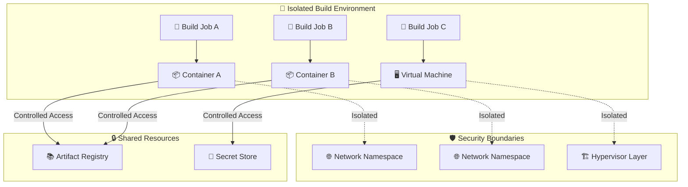

---

## 📍 Slide 17 – 🚫 Preventing Poisoned Pipeline Execution (PPE) Attacks

* ☠️ **Poisoned Pipeline Execution (PPE)** = attacker modifies pipeline configuration to execute **malicious commands during build**
* 🎯 **PPE attack vectors**:
  * 📝 **Direct config modification**: altering YAML/JSON pipeline files
  * 🔀 **Pull request attacks**: malicious changes in external contributor PRs
  * 🧬 **Template injection**: exploiting dynamic pipeline generation
  * 📦 **Dependency confusion**: malicious packages with pipeline modifications
* ⚠️ **Real-world PPE examples**:
  * 🏢 **Codecov incident (2021)**: bash script modification led to credential theft
  * 📦 **npm package attacks**: malicious install scripts in CI/CD environments
  * 🔧 **Jenkins plugins**: compromised plugins executing unauthorized code
* 🛡️ **PPE prevention strategies**:
  * 👥 **Mandatory code review**: all pipeline changes require approval
  * 🔐 **Branch protection**: restrict pipeline modifications to trusted users
  * 🎯 **Least privilege**: pipeline permissions limited to necessary operations
  * 📊 **Runtime monitoring**: detect unusual pipeline behavior during execution
* 📈 **Growing threat**: PPE attacks increased **67% in 2023** ([Checkmarx Research](https://checkmarx.com/resource/documents/en/report/2024-software-supply-chain-security-report/))

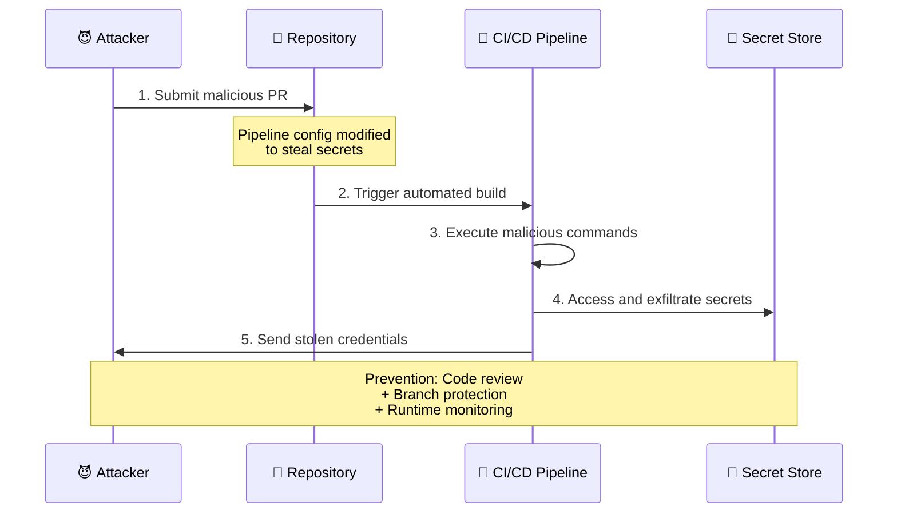

* 🔗 **OWASP guidance**: [Poisoned Pipeline Execution Prevention](https://owasp.org/www-project-top-10-ci-cd-security-risks/CICD-SEC-4)

---

## 📍 Slide 18 – 🌐 Network Segmentation for CI/CD Infrastructure

* 🌐 **Network segmentation** = isolating CI/CD components in **separate network zones** with controlled communication
* 🏗️ **CI/CD network architecture tiers**:
  * 🌍 **DMZ (Demilitarized Zone)**: public-facing components (webhooks, APIs)
  * 🔧 **Build network**: isolated build agents and runners
  * 📦 **Artifact network**: secure storage for build outputs
  * 🏭 **Production network**: deployment targets with strict access controls
* 🛡️ **Segmentation benefits**:
  * 🚫 **Lateral movement prevention**: compromised component cannot access other zones
  * 📊 **Traffic monitoring**: network flows between segments are logged and analyzed
  * 🔐 **Access control**: firewall rules enforce communication policies
  * 🎯 **Blast radius reduction**: security incidents contained to specific segments
* ⚙️ **Implementation technologies**:
  * 🧱 **Firewalls**: next-generation firewalls with application awareness
  * 🏷️ **VLANs**: virtual local area networks for logical separation
  * 🕸️ **Software-Defined Networking (SDN)**: programmable network policies
  * ☁️ **Cloud security groups**: AWS security groups, Azure NSGs, GCP firewall rules
* 📊 **Industry adoption**: **82% of enterprises** use network segmentation for CI/CD ([Cisco Security Report](https://www.cisco.com/c/en/us/products/security/security-reports.html))

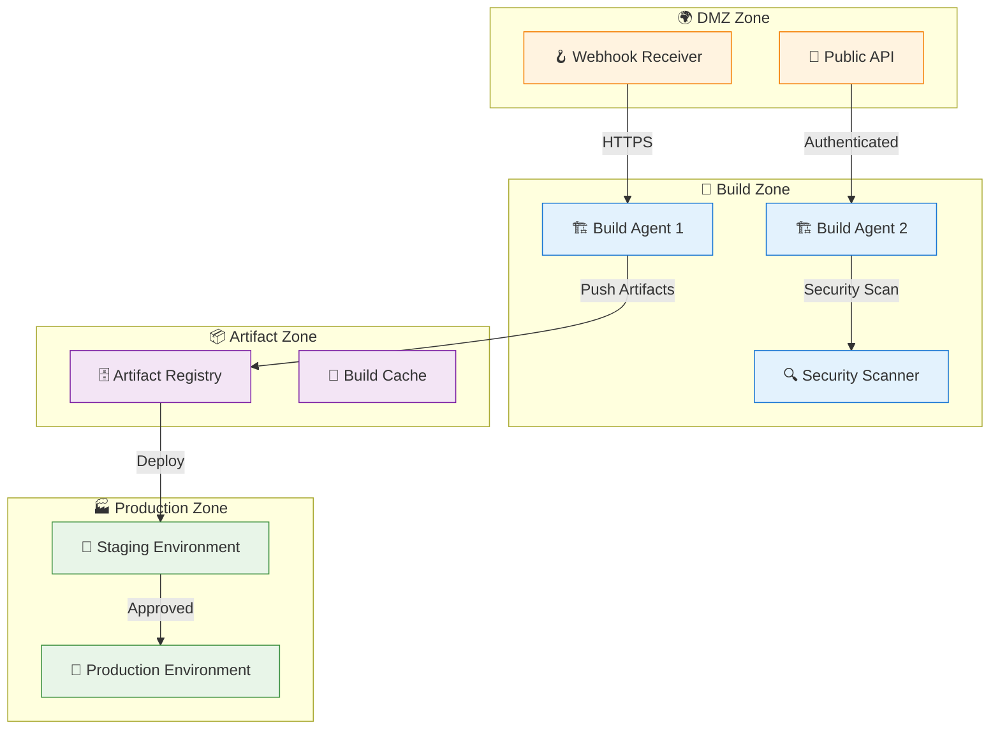

---

## 📍 Slide 19 – 📂 Secure Artifact Storage & Repository Management

* 📦 **Artifacts** = build outputs stored for deployment (container images, packages, binaries, libraries)
* 🏗️ **Artifact repository types**:
  * 🐳 **Container registries**: Docker Hub, AWS ECR, Azure ACR, Google GCR
  * 📚 **Package repositories**: npm registry, Maven Central, NuGet Gallery, PyPI
  * 📁 **Binary repositories**: JFrog Artifactory, Sonatype Nexus, AWS S3
  * 🧬 **Generic storage**: cloud blob storage with versioning and access control
* 🔐 **Security requirements for artifact storage**:
  * 🔏 **Access control**: role-based permissions for push/pull operations
  * 🔐 **Encryption**: artifacts encrypted at rest and in transit
  * 🏷️ **Vulnerability scanning**: automated security scanning of stored artifacts
  * 📝 **Audit logging**: comprehensive logs of all artifact operations
* ⚠️ **Common security risks**:
  * 🌍 **Public exposure**: accidentally making private artifacts publicly accessible
  * 🔓 **Weak authentication**: inadequate access controls allowing unauthorized access
  * 🦠 **Malware injection**: attackers replacing legitimate artifacts with malicious ones
  * 📊 **Lack of scanning**: unscanned artifacts deployed with known vulnerabilities
* 💰 **Cost optimization**: lifecycle policies for automatic cleanup of old artifacts
* 🔗 **Registry security**: [Container Registry Security Best Practices](https://cloud.google.com/artifact-registry/docs/secure)

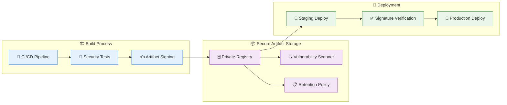

---

## 📍 Slide 20 – 🧹 Container Security in Build Environments

* 🐳 **Container security** = protecting **containerized build processes** from threats and vulnerabilities
* 🔒 **Container-specific risks in CI/CD**:
  * 🏗️ **Insecure base images**: using images with known vulnerabilities
  * 👑 **Privileged containers**: running containers with root privileges
  * 📂 **Host path mounts**: exposing host filesystem to build containers
  * 🌐 **Network exposure**: containers with unnecessary network access
* 🛡️ **Container hardening practices**:
  * 🎯 **Minimal base images**: distroless, Alpine, or scratch images
  * 👤 **Non-root execution**: running containers as non-privileged users
  * 📁 **Read-only filesystems**: preventing runtime file modifications
  * 🔒 **Security policies**: Pod Security Standards, OPA Gatekeeper, Falco
* 🔍 **Container image scanning**:
  * 🦠 **Vulnerability detection**: Trivy, Clair, Snyk, Twistlock scanning
  * 📋 **Policy enforcement**: blocking deployments of vulnerable images
  * 🏷️ **Image signing**: Sigstore Cosign for supply chain integrity
  * 📊 **SBOM generation**: Software Bill of Materials for transparency
* 🚀 **Runtime protection**:
  * 👁️ **Behavioral monitoring**: detecting anomalous container behavior
  * 🚫 **Syscall filtering**: restricting dangerous system calls
  * 🌐 **Network policies**: controlling container-to-container communication
* 📈 **Statistics**: **75% of organizations** experienced container security incidents in 2023 ([Red Hat State of Kubernetes Security](https://www.redhat.com/en/resources/state-kubernetes-security-report-2024))

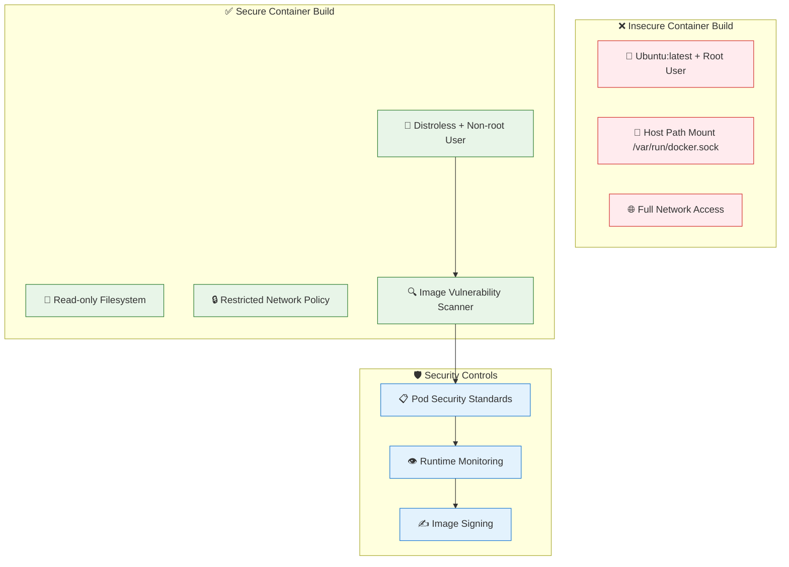

---

## 📍 Slide 21 – ⏱️ Resource Limits & Denial of Service Prevention

* ⏱️ **Resource limits** = preventing CI/CD processes from consuming **excessive compute resources** (CPU, memory, disk, network)
* 🎯 **DoS attack vectors in CI/CD**:
  * 💻 **CPU exhaustion**: infinite loops, cryptomining, CPU-intensive operations
  * 🧠 **Memory bombs**: memory leaks, large data processing, recursive algorithms
  * 💾 **Disk space attacks**: generating large files, log flooding, artifact bloat
  * 🌐 **Network flooding**: DDoS attacks, bandwidth consumption, connection exhaustion
* 🛡️ **Resource protection strategies**:
  * ⏰ **Timeout policies**: maximum execution time for builds and deployments
  * 📊 **Resource quotas**: CPU/memory limits per pipeline, user, and organization
  * 🔄 **Rate limiting**: maximum number of concurrent builds, API requests
  * 📈 **Monitoring and alerting**: real-time resource usage tracking
* ⚙️ **Implementation mechanisms**:
  * 🐳 **Container limits**: Docker memory/CPU constraints, Kubernetes resource limits
  * ☁️ **Cloud quotas**: AWS service limits, Azure subscription limits, GCP quotas
  * 🔧 **Build system controls**: Jenkins executor limits, GitHub Actions usage limits
  * 📊 **Monitoring tools**: Prometheus, Grafana, cloud monitoring dashboards
* 💰 **Cost control**: preventing runaway processes from generating unexpected cloud bills
* 📈 **Industry impact**: **32% of CI/CD incidents** involve resource exhaustion attacks ([SANS DevSecOps Survey](https://www.sans.org/white-papers/devsecops-survey/))

```mermaid
flowchart TD
    subgraph "⚠️ Uncontrolled Resources"
        Pipeline1[🔧 Build Pipeline] --> Unlimited[♾️ No Limits]
        Unlimited --> CPUSpike[💻 CPU 100%]
        Unlimited --> MemoryLeak[🧠 Memory Overflow] 
        Unlimited --> DiskFull[💾 Disk Space Full]
    end
    
    subgraph "✅ Controlled Resources"
        Pipeline2[🔧 Build Pipeline] --> Limits[📊 Resource Limits]
        Limits --> CPULimit[💻 CPU: 2 cores max]
        Limits --> MemoryLimit[🧠 Memory: 4GB max]
        Limits --> TimeoutLimit[⏰ Timeout: 30min max]
        Monitor[📈 Resource Monitor] --> Alerts[🚨 Usage Alerts]
    end
    
    subgraph "🛡️ Protection Mechanisms"
        Kubernetes[☸️ K8s Resource Quotas]
        Docker[🐳 Container Limits]
        Cloud[☁️ Cloud Service Quotas]
    end
    
    Limits --> Kubernetes
    Limits --> Docker
    Limits --> Cloud
    
    classDef uncontrolled fill:#ffebee,stroke:#d32f2f
    classDef controlled fill:#e8f5e8,stroke:#2e7d32
    classDef protection fill:#e3f2fd,stroke:#1976d2
    
    class Pipeline1,Unlimited,CPUSpike,MemoryLeak,DiskFull uncontrolled
    class Pipeline2,Limits,CPULimit,MemoryLimit,TimeoutLimit,Monitor,Alerts controlled
    class Kubernetes,Docker,Cloud protection
```

---

## 📂 Group 4: Build Integrity & Artifact Security

## 📍 Slide 22 – 📦 Secure Artifact Creation & Packaging

* 📦 **Artifacts** = final outputs of CI/CD process (executables, container images, packages, libraries, documentation)
* 🏗️ **Secure artifact creation principles**:
  * 🧹 **Reproducible builds**: same source code produces identical artifacts every time
  * 🔐 **Tamper evidence**: detect if artifacts modified after creation
  * 📋 **Metadata inclusion**: version info, build environment, dependencies, timestamps
  * 🏷️ **Proper labeling**: semantic versioning, environment tags, security classifications
* ⚠️ **Common artifact security risks**:
  * 🦠 **Malware injection**: malicious code inserted during build process
  * 🔄 **Supply chain tampering**: compromised dependencies affecting final artifact
  * 📝 **Metadata manipulation**: false version info or dependency information
  * 🌍 **Unauthorized distribution**: artifacts shared through insecure channels
* 🛡️ **Security measures during packaging**:
  * 🔍 **Pre-packaging scans**: malware detection, vulnerability assessment
  * 📊 **Build environment validation**: ensure clean, trusted build systems
  * 🏷️ **Immutable tagging**: prevent tag reuse for different artifacts
  * 📝 **Audit trail creation**: complete record of build process and inputs
* 📈 **Industry trend**: **89% of organizations** implementing secure packaging practices by 2024 ([Sonatype DevSecOps Report](https://www.sonatype.com/state-of-the-software-supply-chain/))

```mermaid
flowchart LR
    subgraph "🏗️ Build Process"
        Source[📂 Source Code]
        Dependencies[📚 Dependencies]
        Build[⚙️ Build System]
    end
    
    subgraph "📦 Secure Packaging"
        Scan[🔍 Security Scan]
        Package[📦 Package Creation]
        Metadata[📋 Metadata Addition]
        Tag[🏷️ Immutable Tagging]
    end
    
    subgraph "✅ Verification"
        Checksum[🔢 Checksum Generation]
        Signature[✍️ Digital Signature]
        Registry[🗄️ Secure Registry]
    end
    
    Source --> Build
    Dependencies --> Build
    Build --> Scan
    Scan --> Package
    Package --> Metadata
    Metadata --> Tag
    Tag --> Checksum
    Checksum --> Signature
    Signature --> Registry
    
    classDef build fill:#e3f2fd,stroke:#1976d2,color:#2c3e50
    classDef package fill:#f3e5f5,stroke:#7b1fa2,color:#2c3e50
    classDef verify fill:#e8f5e8,stroke:#388e3c,color:#2c3e50
    
    class Source,Dependencies,Build build
    class Scan,Package,Metadata,Tag package
    class Checksum,Signature,Registry verify
```

---

## 📍 Slide 23 – 🔏 Digital Signing & Verification of Build Artifacts

* 🔏 **Digital signing** = cryptographic proof that artifact **came from trusted source** and **hasn't been tampered with**
* 🔑 **Signing technologies**:
  * 📜 **Code signing certificates**: X.509 certificates from trusted Certificate Authorities (CA)
  * 🔐 **GPG/PGP signatures**: GNU Privacy Guard for open-source artifact signing
  * 🌟 **Sigstore Cosign**: modern, keyless signing for container images and artifacts
  * ☁️ **Cloud HSMs**: Hardware Security Modules for enterprise-grade key management
* 🛡️ **Signing best practices**:
  * 🔒 **Private key protection**: store signing keys in secure hardware or cloud HSM
  * ⏰ **Time stamping**: include trusted timestamps to prevent replay attacks
  * 📋 **Certificate management**: regular renewal, revocation capabilities
  * 🎯 **Principle of least privilege**: limit access to signing operations
* ✅ **Verification process**:
  * 🔍 **Signature validation**: verify artifact signature before deployment
  * 🏛️ **Certificate chain validation**: ensure signing certificate is trusted
  * ⏰ **Timestamp verification**: confirm signing occurred within valid timeframe
  * 📊 **Policy enforcement**: reject unsigned or improperly signed artifacts
* 📊 **Adoption statistics**: **73% of enterprises** require signed artifacts for production deployment ([Venafi Machine Identity Report](https://www.venafi.com/resource/2024-machine-identity-security-trends-report))

```mermaid
sequenceDiagram
    participant Developer as 👨‍💻 Developer
    participant Pipeline as 🔧 CI/CD Pipeline
    participant HSM as 🔐 HSM/Key Vault
    participant Registry as 🗄️ Artifact Registry
    participant Deploy as 🚀 Deployment
    
    Developer->>Pipeline: 1. Commit Code
    Pipeline->>Pipeline: 2. Build Artifact
    Pipeline->>HSM: 3. Request Signing Key
    HSM->>Pipeline: 4. Provide Signing Capability
    Pipeline->>Pipeline: 5. Sign Artifact
    Pipeline->>Registry: 6. Store Signed Artifact
    Deploy->>Registry: 7. Retrieve Artifact
    Deploy->>Deploy: 8. Verify Signature
    alt Valid Signature
        Deploy->>Deploy: 9. ✅ Deploy Artifact
    else Invalid Signature
        Deploy->>Deploy: 9. ❌ Reject Deployment
    end
    
    classDef default fill:#f9f,stroke:#333,stroke-width:2px,color:#2c3e50
```

---

## 📍 Slide 24 – 📋 Software Bill of Materials (SBOM) Generation

* 📋 **SBOM = Software Bill of Materials** → comprehensive inventory of **all components, libraries, and dependencies** used in software
* 🎯 **SBOM importance for security**:
  * 🔍 **Vulnerability tracking**: identify which components have known security issues
  * 📊 **License compliance**: understand licensing obligations for all dependencies
  * 🕵️ **Supply chain visibility**: map entire software supply chain for risk assessment
  * 🚨 **Incident response**: quickly identify affected systems when vulnerabilities discovered
* 📁 **SBOM formats and standards**:
  * 🌀 **CycloneDX**: OWASP standard, security-focused, supports vulnerability data
  * 📄 **SPDX (Software Package Data Exchange)**: Linux Foundation standard, license-focused
  * 🧾 **SWID (Software Identification)**: ISO standard for software identification
* 🛠️ **SBOM generation tools**:
  * 🔧 **Syft**: open-source SBOM generator for container images and filesystems
  * 🌀 **CycloneDX generators**: language-specific tools (Maven, npm, pip, etc.)
  * 🏢 **Commercial tools**: Snyk, JFrog Xray, Sonatype Nexus, FOSSA
* 📊 **Regulatory requirements**: US Executive Order 14028 **mandates SBOM** for federal software procurement
* 🔗 **Learn more**: [NTIA SBOM Minimum Elements](https://www.ntia.doc.gov/files/ntia/publications/sbom_minimum_elements_report.pdf)

```mermaid
flowchart TD
    subgraph "📦 Software Artifact"
        App[🖥️ Application]
        Lib1[📚 Library A v1.2]
        Lib2[📚 Library B v2.5]
        OS[🐧 Base OS Image]
    end
    
    subgraph "🔍 SBOM Generation"
        Scanner[🕵️ SBOM Scanner]
        Analysis[🔬 Dependency Analysis]
        Format[📋 Format Generation]
    end
    
    subgraph "📄 SBOM Output"
        CycloneDX[🌀 CycloneDX Format]
        SPDX[📄 SPDX Format]
        Vulnerabilities[⚠️ Vulnerability Data]
        Licenses[⚖️ License Information]
    end
    
    App --> Scanner
    Lib1 --> Scanner
    Lib2 --> Scanner
    OS --> Scanner
    Scanner --> Analysis
    Analysis --> Format
    Format --> CycloneDX
    Format --> SPDX
    Format --> Vulnerabilities
    Format --> Licenses
    
    classDef artifact fill:#e3f2fd,stroke:#1976d2,color:#2c3e50
    classDef generation fill:#f3e5f5,stroke:#7b1fa2,color:#2c3e50
    classDef output fill:#e8f5e8,stroke:#388e3c,color:#2c3e50
    
    class App,Lib1,Lib2,OS artifact
    class Scanner,Analysis,Format generation
    class CycloneDX,SPDX,Vulnerabilities,Licenses output
```

---

## 📍 Slide 25 – 🏷️ Container Image Signing with Cosign/Notary

* 🏷️ **Container image signing** = cryptographic verification that **container images are authentic** and **haven't been tampered with**
* 🔧 **Cosign (Sigstore)**:
  * 🌟 **Keyless signing**: uses OIDC identity providers, no long-term key management
  * 🔗 **Transparency log**: public ledger of all signatures for auditability
  * 🎯 **OCI-compliant**: works with any OCI-compatible container registry
  * 🆓 **Open source**: developed by Linux Foundation, widely adopted
* 🐳 **Docker Content Trust (Notary)**:
  * 🏛️ **Established standard**: mature signing solution integrated with Docker
  * 🔑 **Key management**: requires managing signing keys and certificates
  * 🎯 **Role-based signing**: different keys for different purposes (root, targets, snapshot)
  * ⚠️ **Legacy concerns**: less active development, complex key management
* 🛡️ **Image signing workflow**:
  * 🏗️ **Build**: create container image in CI/CD pipeline
  * ✍️ **Sign**: cryptographically sign image before pushing to registry
  * 📤 **Push**: upload both image and signature to registry
  * 🔍 **Verify**: deployment systems verify signature before pulling/running
* 📊 **Adoption growth**: container image signing adoption increased **156% in 2023** ([CNCF Security Report](https://www.cncf.io/reports/cncf-annual-survey-2023/))

```mermaid
flowchart LR
    subgraph "🏗️ Build & Sign"
        Build[🔨 Build Image]
        Sign[✍️ Sign with Cosign]
        Identity[🆔 OIDC Identity]
    end
    
    subgraph "📦 Registry"
        Image[🐳 Container Image]
        Signature[🔏 Digital Signature]
        Transparency[📋 Transparency Log]
    end
    
    subgraph "🚀 Deploy & Verify"
        Pull[📥 Pull Image]
        Verify[🔍 Verify Signature]
        Deploy[🌟 Deploy if Valid]
        Reject[❌ Reject if Invalid]
    end
    
    Build --> Sign
    Identity --> Sign
    Sign --> Image
    Sign --> Signature
    Signature --> Transparency
    Image --> Pull
    Pull --> Verify
    Verify --> Deploy
    Verify --> Reject
    
    classDef build fill:#e3f2fd,stroke:#1976d2,color:#2c3e50
    classDef registry fill:#f3e5f5,stroke:#7b1fa2,color:#2c3e50
    classDef deploy fill:#e8f5e8,stroke:#388e3c,color:#2c3e50
    classDef reject fill:#ffebee,stroke:#d32f2f,color:#2c3e50
    
    class Build,Sign,Identity build
    class Image,Signature,Transparency registry
    class Pull,Verify,Deploy deploy
    class Reject reject
```

---

## 📍 Slide 26 – 🧪 Build Reproducibility & Deterministic Builds

* 🧪 **Reproducible builds** = ability to **recreate identical artifacts** from same source code and build environment
* 🎯 **Benefits of reproducible builds**:
  * 🔍 **Tamper detection**: compare official builds with independent rebuilds
  * 🛡️ **Supply chain security**: verify no malicious code injection during build
  * 🕵️ **Forensic analysis**: investigate security incidents by recreating exact build conditions
  * 📊 **Compliance**: meet regulatory requirements for software integrity
* ⚠️ **Challenges to reproducibility**:
  * ⏰ **Timestamps**: build tools embedding current time in artifacts
  * 🎲 **Randomness**: random values, memory addresses, hash ordering
  * 🌍 **Environment variation**: different OS versions, locale settings, timezone
  * 📦 **Dependency versions**: floating version numbers, latest tags
* 🛠️ **Achieving reproducible builds**:
  * 🔒 **Fixed environments**: containerized builds with pinned dependencies
  * ⏰ **Controlled timestamps**: use commit timestamp or fixed build date
  * 📋 **Normalized outputs**: sort file lists, strip debug information
  * 🎯 **Minimal environments**: reduce build environment complexity
* 📊 **Industry adoption**: **42% of open-source projects** implementing reproducible builds ([Reproducible Builds Project](https://reproducible-builds.org/))
* 🏆 **Success stories**: Debian, Bitcoin Core, Tor Browser achieve reproducible builds

```mermaid
flowchart TD
    subgraph "📝 Input Sources"
        Source1[📂 Source Code v1.0]
        Deps1[📚 Dependencies pinned]
        Env1[🏗️ Build Environment]
    end
    
    subgraph "🏭 Build Process"
        Build1[⚙️ Official Build]
        Build2[⚙️ Independent Build]
        Controls[🎯 Reproducibility Controls]
    end
    
    subgraph "📦 Artifacts"
        Artifact1[📦 Official Artifact<br/>Hash: abc123]
        Artifact2[📦 Independent Artifact<br/>Hash: abc123]
        Match[✅ Identical Artifacts]
    end
    
    Source1 --> Build1
    Deps1 --> Build1
    Env1 --> Build1
    
    Source1 --> Build2
    Deps1 --> Build2
    Env1 --> Build2
    
    Controls --> Build1
    Controls --> Build2
    
    Build1 --> Artifact1
    Build2 --> Artifact2
    Artifact1 --> Match
    Artifact2 --> Match
    
    classDef input fill:#e3f2fd,stroke:#1976d2,color:#2c3e50
    classDef build fill:#f3e5f5,stroke:#7b1fa2,color:#2c3e50
    classDef artifact fill:#e8f5e8,stroke:#388e3c,color:#2c3e50
    
    class Source1,Deps1,Env1 input
    class Build1,Build2,Controls build
    class Artifact1,Artifact2,Match artifact
```

---

## 📍 Slide 27 – 🔍 Integrity Checks: Checksums, Hashes, and Verification

* 🔢 **Integrity checks** = mathematical verification that **artifacts haven't been corrupted** or **maliciously modified**
* 🧮 **Hash algorithms for integrity**:
  * 🔢 **SHA-256**: most common, cryptographically secure, 256-bit output
  * 🔢 **SHA-512**: higher security, 512-bit output, slower but more secure
  * ⚡ **BLAKE2/BLAKE3**: modern alternatives, faster than SHA with same security
  * ❌ **MD5/SHA-1**: deprecated due to collision vulnerabilities
* 📊 **Checksum implementation patterns**:
  * 📝 **Manifest files**: separate files listing hashes for each artifact
  * 🏷️ **Registry metadata**: hashes stored alongside artifacts in repositories
  * 📋 **SBOM integration**: checksums included in Software Bill of Materials
  * 🔗 **Chain of custody**: hash verification at each stage of pipeline
* 🛡️ **Verification best practices**:
  * 🎯 **Multiple hash algorithms**: use different algorithms to detect sophisticated attacks
  * 🔍 **Pre-deployment verification**: always verify before deployment/installation
  * 📊 **Automated checking**: integrate verification into CI/CD pipeline
  * 📝 **Audit logging**: log all verification results for compliance
* ⚠️ **Hash collision attacks**: birthday attacks, chosen-prefix attacks against weak algorithms
* 📈 **Performance considerations**: balance security vs. speed for different use cases

```mermaid
flowchart LR
    subgraph "📦 Artifact Creation"
        Artifact[🗂️ Build Artifact]
        Hash1[🔢 SHA-256 Hash]
        Hash2[🔢 SHA-512 Hash]
        Manifest[📋 Checksum Manifest]
    end
    
    subgraph "🗄️ Storage & Distribution"
        Registry[📚 Artifact Registry]
        CDN[🌐 Content Distribution]
        Mirror[🪞 Mirror Sites]
    end
    
    subgraph "✅ Verification Process"
        Download[📥 Download Artifact]
        Calculate[🧮 Calculate Hash]
        Compare[⚖️ Compare Hashes]
        Result[✅ Verify Integrity]
    end
    
    Artifact --> Hash1
    Artifact --> Hash2
    Hash1 --> Manifest
    Hash2 --> Manifest
    
    Artifact --> Registry
    Manifest --> Registry
    Registry --> CDN
    Registry --> Mirror
    
    CDN --> Download
    Mirror --> Download
    Download --> Calculate
    Registry --> Compare
    Calculate --> Compare
    Compare --> Result
    
    classDef creation fill:#e3f2fd,stroke:#1976d2,color:#2c3e50
    classDef storage fill:#f3e5f5,stroke:#7b1fa2,color:#2c3e50
    classDef verify fill:#e8f5e8,stroke:#388e3c,color:#2c3e50
    
    class Artifact,Hash1,Hash2,Manifest creation
    class Registry,CDN,Mirror storage
    class Download,Calculate,Compare,Result verify
```

---

## 📍 Slide 28 – 📊 Artifact Provenance & Supply Chain Transparency

* 📊 **Provenance** = comprehensive record of **how, when, where, and by whom** an artifact was created
* 🔗 **Supply chain transparency components**:
  * 👨‍💻 **Build actor**: who or what system performed the build
  * 📂 **Source materials**: exact source code, dependencies, and build inputs
  * 🏗️ **Build environment**: operating system, tools, configuration used
  * ⏰ **Temporal information**: when build occurred, duration, sequence
* 📋 **SLSA (Supply-chain Levels for Software Artifacts)**:
  * 📊 **SLSA Level 1**: basic provenance, automated builds
  * 📊 **SLSA Level 2**: tamper resistance, hosted build service
  * 📊 **SLSA Level 3**: hardened builds, non-forgeable provenance
  * 📊 **SLSA Level 4**: highest security, two-person review, hermetic builds
* 🛠️ **Provenance technologies**:
  * 🔗 **in-toto**: framework for securing software supply chain integrity
  * 🌟 **SLSA attestations**: standardized format for build provenance
  * 📜 **Sigstore Rekor**: transparency log for storing provenance data
  * ☁️ **Cloud build provenance**: native support in major cloud platforms
* 🎯 **Use cases for provenance**:
  * 🕵️ **Incident response**: trace compromised artifacts to source
  * 📊 **Risk assessment**: evaluate supply chain security posture
  * ⚖️ **Compliance**: meet regulatory requirements for software traceability
  * 🔍 **Vulnerability management**: quickly identify affected systems
* 📈 **Industry momentum**: **67% of Fortune 500** planning provenance implementation by 2025 ([Linux Foundation Report](https://www.linuxfoundation.org/research/))

```mermaid
flowchart TD
    subgraph "🔍 Provenance Collection"
        Actor[👨‍💻 Build Actor<br/>CI/CD System]
        Source[📂 Source Code<br/>Git Commit SHA]
        Environment[🏗️ Build Environment<br/>OS, Tools, Config]
        Time[⏰ Temporal Data<br/>Timestamps, Duration]
    end
    
    subgraph "📋 Attestation Creation"
        Collect[🔄 Collect Metadata]
        Format[📝 SLSA Format]
        Sign[✍️ Sign Attestation]
    end
    
    subgraph "🌐 Transparency & Storage"
        Rekor[📋 Rekor Log<br/>Immutable Record]
        Registry[🗄️ Artifact Registry<br/>Linked Attestation]
        Consumer[👥 Consumers<br/>Verification & Trust]
    end
    
    Actor --> Collect
    Source --> Collect
    Environment --> Collect
    Time --> Collect
    
    Collect --> Format
    Format --> Sign
    Sign --> Rekor
    Sign --> Registry
    Registry --> Consumer
    Rekor --> Consumer
    
    classDef collection fill:#e3f2fd,stroke:#1976d2,color:#2c3e50
    classDef attestation fill:#f3e5f5,stroke:#7b1fa2,color:#2c3e50
    classDef transparency fill:#e8f5e8,stroke:#388e3c,color:#2c3e50
    
    class Actor,Source,Environment,Time collection
    class Collect,Format,Sign attestation
    class Rekor,Registry,Consumer transparency
```

---

## 📂 Group 5: Quality Gates & Automated Security Controls

## 📍 Slide 29 – 🚦 Quality Gates: Definition and Implementation

* 🚦 **Quality Gates** = automated **decision points** in CI/CD pipeline that **block progression** if predefined criteria not met
* 🎯 **Purpose of quality gates**:
  * 🛑 **Prevent defective code**: stop buggy or insecure code from reaching production
  * 📊 **Enforce standards**: ensure code meets organizational quality requirements
  * 🔄 **Fail fast**: catch issues early when they're cheaper and easier to fix
  * 📈 **Continuous improvement**: provide feedback for development process optimization
* 🧩 **Common quality gate criteria**:
  * 🧪 **Test coverage**: minimum percentage of code covered by automated tests
  * 🐛 **Bug thresholds**: maximum number of critical/high severity issues
  * 📊 **Code quality metrics**: complexity, maintainability, duplication limits
  * 🔒 **Security standards**: vulnerability counts, security policy compliance
* ⚙️ **Implementation approaches**:
  * 🔧 **Pipeline stages**: dedicated quality check stages in CI/CD workflow
  * 📋 **Policy engines**: centralized rules management with OPA, Sentinel
  * 🤖 **Automated tools**: SonarQube, CodeClimate, Veracode integration
  * 👥 **Manual approvals**: human review for critical deployment stages
* 📊 **Industry adoption**: **91% of high-performing teams** use quality gates ([DORA State of DevOps Report](https://cloud.google.com/devops/state-of-devops/))

```mermaid
flowchart LR
    subgraph "🏗️ Development"
        Code[💻 Code Commit]
        Build[🔨 Build Process]
        Tests[🧪 Automated Tests]
    end
    
    subgraph "🚦 Quality Gates"
        Gate1[🎯 Coverage Gate<br/>≥80% Required]
        Gate2[🐛 Bug Gate<br/>0 Critical Issues]
        Gate3[🔒 Security Gate<br/>No High CVEs]
        Gate4[👥 Manual Approval<br/>Production Ready]
    end
    
    subgraph "🚀 Deployment"
        Staging[🧪 Staging Deploy]
        Production[🌟 Production Deploy]
    end
    
    Code --> Build
    Build --> Tests
    Tests --> Gate1
    Gate1 -->|✅ Pass| Gate2
    Gate1 -->|❌ Fail| Code
    Gate2 -->|✅ Pass| Gate3
    Gate2 -->|❌ Fail| Code
    Gate3 -->|✅ Pass| Gate4
    Gate3 -->|❌ Fail| Code
    Gate4 -->|✅ Approved| Staging
    Gate4 -->|❌ Rejected| Code
    Staging --> Production
    
    classDef dev fill:#e3f2fd,stroke:#1976d2,color:#2c3e50
    classDef gate fill:#fff3e0,stroke:#f57c00,color:#2c3e50
    classDef deploy fill:#e8f5e8,stroke:#388e3c,color:#2c3e50
    
    class Code,Build,Tests dev
    class Gate1,Gate2,Gate3,Gate4 gate
    class Staging,Production deploy
```

---

## 📍 Slide 30 – 🔒 Security Gates vs. Quality Gates in CI/CD

* 🔒 **Security Gates** = specialized quality gates focused on **security-specific criteria** and compliance requirements
* ⚖️ **Key differences**:
  * 🎯 **Scope**: quality gates cover all aspects (performance, maintainability), security gates focus on vulnerabilities
  * 🏛️ **Compliance**: security gates often tied to regulatory requirements (SOX, HIPAA, PCI-DSS)
  * ⏰ **Timing**: security gates may have different thresholds for different environments
  * 👥 **Stakeholders**: security teams define criteria, development teams implement
* 🛡️ **Common security gate criteria**:
  * 🔍 **Vulnerability scanning**: SAST, DAST, SCA results within acceptable limits
  * 🔑 **Secret detection**: zero exposed credentials or API keys
  * 📋 **Policy compliance**: adherence to security policies and standards
  * 🏷️ **Artifact integrity**: signed artifacts, verified checksums, SBOM presence
* 🎯 **Risk-based approach**:
  * 🟢 **Development**: lenient thresholds, focus on education and guidance
  * 🟡 **Staging**: moderate thresholds, balance security with development velocity
  * 🔴 **Production**: strict thresholds, zero tolerance for high-severity issues
* 📊 **Implementation statistics**: **78% of organizations** implement security-specific gates ([Snyk State of Open Source Security](https://snyk.io/reports/open-source-security/))

```mermaid
flowchart TD
    subgraph "🎯 Quality Gates (Broader Scope)"
        QualityMetrics[📊 Code Quality Metrics<br/>Complexity, Coverage, Duplication]
        Performance[⚡ Performance Tests<br/>Load Time, Memory Usage]
        Functional[🧪 Functional Tests<br/>Unit, Integration, E2E]
    end
    
    subgraph "🔒 Security Gates (Security-Focused)"
        Vulnerabilities[🔍 Vulnerability Scans<br/>SAST, DAST, SCA Results]
        Secrets[🔑 Secret Detection<br/>API Keys, Credentials]
        Compliance[📋 Policy Compliance<br/>SOX, HIPAA, PCI-DSS]
        Integrity[🏷️ Artifact Integrity<br/>Signatures, Checksums]
    end
    
    subgraph "🌍 Environment-Specific Thresholds"
        Dev[🟢 Development<br/>Lenient, Educational]
        Stage[🟡 Staging<br/>Moderate, Balanced]
        Prod[🔴 Production<br/>Strict, Zero Tolerance]
    end
    
    QualityMetrics --> Dev
    Performance --> Dev
    Functional --> Stage
    
    Vulnerabilities --> Stage
    Secrets --> Prod
    Compliance --> Prod
    Integrity --> Prod
    
    classDef quality fill:#e3f2fd,stroke:#1976d2,color:#2c3e50
    classDef security fill:#ffebee,stroke:#d32f2f,color:#2c3e50
    classDef environment fill:#f3e5f5,stroke:#7b1fa2,color:#2c3e50
    
    class QualityMetrics,Performance,Functional quality
    class Vulnerabilities,Secrets,Compliance,Integrity security
    class Dev,Stage,Prod environment
```

---

## 📍 Slide 31 – ⚡ Automated Security Controls in Pipelines

* ⚡ **Automated Security Controls** = security checks that run **without human intervention** as part of CI/CD pipeline
* 🔧 **Types of automated security controls**:
  * 🔍 **Static Analysis**: SAST tools scanning source code for vulnerabilities
  * 🌐 **Dynamic Analysis**: DAST tools testing running applications
  * 📦 **Dependency Scanning**: SCA tools checking third-party components
  * 🔑 **Secret Scanning**: detecting exposed credentials and API keys
  * 🏗️ **Infrastructure Scanning**: IaC security analysis for misconfigurations
  * 📋 **Compliance Checking**: automated policy validation and audit trails
* 🎯 **Integration patterns**:
  * 🪝 **Pre-commit hooks**: local security checks before code submission
  * 🔄 **Pipeline stages**: dedicated security scanning steps in CI/CD
  * 📊 **Continuous monitoring**: ongoing security assessment of deployed systems
  * 🚨 **Alerting and reporting**: automated notifications and security dashboards
* ✅ **Benefits of automation**:
  * ⚡ **Speed**: faster feedback compared to manual security reviews
  * 🎯 **Consistency**: standardized security checks across all projects
  * 📈 **Scalability**: handle large volumes of code and deployments
  * 🔄 **Continuous protection**: security checks run on every change
* 📊 **Effectiveness metrics**: automated controls catch **85% of common vulnerabilities** before production ([Veracode State of Software Security](https://www.veracode.com/state-of-software-security-report))

```mermaid
flowchart LR
    subgraph "📝 Code Development"
        Developer[👨‍💻 Developer]
        Commit[📝 Code Commit]
        PR[🔀 Pull Request]
    end
    
    subgraph "🔄 Automated Security Pipeline"
        PreCommit[🪝 Pre-commit Hooks<br/>Secrets, Linting]
        SAST[🔍 SAST Scan<br/>Code Vulnerabilities]
        SCA[📦 SCA Scan<br/>Dependencies]
        DAST[🌐 DAST Scan<br/>Running App]
        IaC[🏗️ IaC Scan<br/>Infrastructure]
    end
    
    subgraph "📊 Results & Actions"
        Dashboard[📈 Security Dashboard]
        Alerts[🚨 Automated Alerts]
        Block[🛑 Block Deployment]
        Approve[✅ Approve & Deploy]
    end
    
    Developer --> PreCommit
    PreCommit --> Commit
    Commit --> PR
    PR --> SAST
    SAST --> SCA
    SCA --> DAST
    DAST --> IaC
    
    SAST --> Dashboard
    SCA --> Dashboard
    DAST --> Alerts
    IaC --> Dashboard
    
    Dashboard --> Block
    Dashboard --> Approve
    Alerts --> Block
    
    classDef dev fill:#e3f2fd,stroke:#1976d2,color:#2c3e50
    classDef security fill:#f3e5f5,stroke:#7b1fa2,color:#2c3e50
    classDef results fill:#e8f5e8,stroke:#388e3c,color:#2c3e50
    
    class Developer,Commit,PR dev
    class PreCommit,SAST,SCA,DAST,IaC security
    class Dashboard,Alerts,Block,Approve results
```

---

## 📍 Slide 32 – 📈 Policy-as-Code for Build Security

* 📈 **Policy-as-Code** = defining and enforcing security policies through **version-controlled, executable code**
* 🎯 **Core benefits**:
  * 📂 **Version control**: policies tracked, reviewed, and rolled back like application code
  * 🔄 **Consistency**: same policies applied across all environments and teams
  * 🤖 **Automation**: policies automatically enforced without manual intervention
  * 👥 **Collaboration**: security and development teams jointly define policies
* 🛠️ **Policy-as-Code tools and frameworks**:
  * 🔧 **Open Policy Agent (OPA)**: general-purpose policy engine with Rego language
  * 🏛️ **HashiCorp Sentinel**: policy framework integrated with Terraform and Vault
  * ☁️ **Cloud-native**: AWS Config Rules, Azure Policy, GCP Organization Policy
  * 🔒 **Specialized tools**: Falco for runtime security, Conftest for configuration testing
* 📋 **Common policy types for CI/CD**:
  * 🔐 **Security policies**: vulnerability thresholds, encryption requirements
  * 🏛️ **Compliance policies**: regulatory requirements (GDPR, SOX, HIPAA)
  * 💰 **Cost policies**: resource limits, budget constraints
  * 🛡️ **Operational policies**: deployment windows, approval requirements
* 🎯 **Implementation workflow**:
  * 📝 **Define**: write policies in domain-specific language
  * 🧪 **Test**: validate policies against test scenarios
  * 🚀 **Deploy**: integrate policies into CI/CD pipeline
  * 📊 **Monitor**: track policy violations and effectiveness
* 📊 **Adoption trend**: **64% of enterprises** implementing Policy-as-Code by 2024 ([Gartner Infrastructure Automation Survey](https://www.gartner.com/en/information-technology))

```mermaid
flowchart TD
    subgraph "📝 Policy Definition"
        SecurityTeam[🛡️ Security Team]
        DevTeam[👨‍💻 Development Team]
        PolicyRepo[📂 Policy Repository]
    end
    
    subgraph "🔧 Policy Engine"
        OPA[🔧 Open Policy Agent]
        Sentinel[🏛️ HashiCorp Sentinel]
        CloudPolicy[☁️ Cloud Native Policies]
    end
    
    subgraph "🚀 Enforcement Points"
        PreDeploy[🔍 Pre-deployment Check]
        Runtime[⚡ Runtime Validation]
        Compliance[📋 Compliance Audit]
    end
    
    subgraph "📊 Monitoring & Feedback"
        Violations[⚠️ Policy Violations]
        Reports[📈 Compliance Reports]
        Improvement[🔄 Policy Refinement]
    end
    
    SecurityTeam --> PolicyRepo
    DevTeam --> PolicyRepo
    PolicyRepo --> OPA
    PolicyRepo --> Sentinel
    PolicyRepo --> CloudPolicy
    
    OPA --> PreDeploy
    Sentinel --> PreDeploy
    CloudPolicy --> Runtime
    
    PreDeploy --> Violations
    Runtime --> Violations
    Runtime --> Compliance
    
    Violations --> Reports
    Compliance --> Reports
    Reports --> Improvement
    Improvement --> PolicyRepo
    
    classDef definition fill:#e3f2fd,stroke:#1976d2,color:#2c3e50
    classDef engine fill:#f3e5f5,stroke:#7b1fa2,color:#2c3e50
    classDef enforcement fill:#fff3e0,stroke:#f57c00,color:#2c3e50
    classDef monitoring fill:#e8f5e8,stroke:#388e3c,color:#2c3e50
    
    class SecurityTeam,DevTeam,PolicyRepo definition
    class OPA,Sentinel,CloudPolicy engine
    class PreDeploy,Runtime,Compliance enforcement
    class Violations,Reports,Improvement monitoring
```

---

## 📍 Slide 33 – 🛑 Breaking Builds on Security Policy Violations

* 🛑 **Build breaking** = automatically **stopping CI/CD pipeline** when security policies are violated
* 🎯 **When to break builds**:
  * 🔴 **Critical vulnerabilities**: CVSS score ≥ 9.0 or actively exploited vulnerabilities
  * 🔑 **Exposed secrets**: API keys, passwords, certificates found in code
  * 📋 **Compliance violations**: regulatory requirement breaches (PCI-DSS, HIPAA)
  * 🏷️ **Unsigned artifacts**: missing digital signatures on production deployments
* ⚖️ **Risk-based approach to build breaking**:
  * 🟢 **Development branches**: warnings and guidance, minimal build breaking
  * 🟡 **Feature branches**: moderate enforcement, break on high-severity issues
  * 🔴 **Main/production branches**: strict enforcement, break on any policy violation
* 🛠️ **Implementation strategies**:
  * 📊 **Graduated enforcement**: increase strictness closer to production
  * 🕐 **Grace periods**: allow time for teams to adapt to new policies
  * 🔄 **Override mechanisms**: emergency bypasses with proper approval and audit
  * 📚 **Developer education**: provide clear guidance on fixing violations
* 📈 **Benefits vs. challenges**:
  * ✅ **Benefits**: prevents security issues reaching production, enforces standards
  * ⚠️ **Challenges**: potential developer productivity impact, false positives
* 📊 **Industry practice**: **87% of organizations** break builds on critical security issues ([GitLab DevSecOps Survey](https://about.gitlab.com/developer-survey/))

```mermaid
flowchart TD
    subgraph "🔍 Security Scanning"
        CodeScan[📝 Code Analysis]
        DepScan[📦 Dependency Scan]
        SecretScan[🔑 Secret Detection]
        ComplianceScan[📋 Compliance Check]
    end
    
    subgraph "📊 Policy Evaluation"
        Critical[🔴 Critical Issues<br/>CVSS ≥ 9.0]
        High[🟡 High Issues<br/>CVSS 7.0-8.9]
        Medium[🟢 Medium Issues<br/>CVSS 4.0-6.9]
        Low[⚪ Low Issues<br/>CVSS < 4.0]
    end
    
    subgraph "🎯 Decision Logic"
        ProdBranch[🔴 Production Branch<br/>Strict Enforcement]
        FeatureBranch[🟡 Feature Branch<br/>Moderate Enforcement]
        DevBranch[🟢 Dev Branch<br/>Lenient Enforcement]
    end
    
    subgraph "🚦 Build Actions"
        Break[🛑 Break Build<br/>Block Deployment]
        Warn[⚠️ Warning Only<br/>Continue with Alert]
        Pass[✅ Pass<br/>Continue Normally]
    end
    
    CodeScan --> Critical
    DepScan --> High
    SecretScan --> Critical
    ComplianceScan --> High
    
    Critical --> ProdBranch
    High --> FeatureBranch
    Medium --> DevBranch
    Low --> DevBranch
    
    ProdBranch --> Break
    FeatureBranch --> Warn
    DevBranch --> Pass
    
    classDef scanning fill:#e3f2fd,stroke:#1976d2,color:#2c3e50
    classDef policy fill:#f3e5f5,stroke:#7b1fa2,color:#2c3e50
    classDef decision fill:#fff3e0,stroke:#f57c00,color:#2c3e50
    classDef action fill:#e8f5e8,stroke:#388e3c,color:#2c3e50
    
    class CodeScan,DepScan,SecretScan,ComplianceScan scanning
    class Critical,High,Medium,Low policy
    class ProdBranch,FeatureBranch,DevBranch decision
    class Break,Warn,Pass action
```

---

## 📍 Slide 34 – 📊 Security Metrics & KPIs for Pipeline Health

* 📊 **Security KPIs (Key Performance Indicators)** = measurable values that track **security effectiveness** in CI/CD pipelines
* 🎯 **Leading indicators** (predict future security issues):
  * ⏱️ **Mean Time to Fix (MTTF)**: average time to resolve security vulnerabilities
  * 📈 **Vulnerability detection rate**: percentage of vulnerabilities caught in pipeline vs. production
  * 🔍 **Security test coverage**: percentage of code covered by security-focused tests
  * 🏃‍♂️ **Security debt**: accumulation of known but unaddressed security issues
* 📊 **Lagging indicators** (measure security outcomes):
  * 🐛 **Escaped defects**: security issues that reach production
  * 🚨 **Security incidents**: actual breaches or exploitation attempts
  * ⏰ **Vulnerability age**: how long security issues remain unpatched
  * 💰 **Security-related downtime**: service disruptions due to security issues
* 📈 **Operational metrics**:
  * 🔄 **Pipeline security scan frequency**: how often security checks run
  * 🛑 **Build break rate**: percentage of builds stopped due to security issues
  * 👥 **Developer engagement**: participation in security training and practices
  * 🏆 **Policy compliance rate**: adherence to security policies and standards
* 🎯 **Industry benchmarks**:
  * 🏆 **High performers**: MTTF < 24 hours, >95% vulnerability detection in pipeline
  * 📊 **Average performers**: MTTF 1-7 days, 80-95% detection rate
  * 📉 **Low performers**: MTTF > 7 days, <80% detection rate
* 🔗 **Measurement tools**: DORA metrics, SOAR platforms, security dashboards

```mermaid
flowchart LR
    subgraph "🎯 Leading Indicators (Predictive)"
        MTTF[⏱️ Mean Time to Fix<br/>Target: < 24 hours]
        DetectionRate[📈 Detection Rate<br/>Target: > 95%]
        Coverage[🔍 Security Coverage<br/>Target: > 80%]
        Debt[🏃‍♂️ Security Debt<br/>Target: Decreasing]
    end
    
    subgraph "📊 Lagging Indicators (Outcome)"
        Escaped[🐛 Escaped Defects<br/>Target: < 5%]
        Incidents[🚨 Security Incidents<br/>Target: 0 critical]
        VulnAge[⏰ Vulnerability Age<br/>Target: < 30 days]
        Downtime[💰 Security Downtime<br/>Target: < 0.1%]
    end
    
    subgraph "⚙️ Operational Metrics"
        ScanFreq[🔄 Scan Frequency<br/>Every commit]
        BreakRate[🛑 Build Break Rate<br/>5-10% target]
        Engagement[👥 Developer Engagement<br/>Training completion]
        Compliance[🏆 Policy Compliance<br/>>98% target]
    end
    
    subgraph "📈 Performance Tiers"
        HighPerf[🏆 High Performers<br/>MTTF < 24h, >95% detection]
        AvgPerf[📊 Average Performers<br/>MTTF 1-7d, 80-95% detection]
        LowPerf[📉 Low Performers<br/>MTTF > 7d, <80% detection]
    end
    
    MTTF --> HighPerf
    DetectionRate --> HighPerf
    Coverage --> AvgPerf
    Debt --> LowPerf
    
    classDef leading fill:#e3f2fd,stroke:#1976d2,color:#2c3e50
    classDef lagging fill:#f3e5f5,stroke:#7b1fa2,color:#2c3e50
    classDef operational fill:#fff3e0,stroke:#f57c00,color:#2c3e50
    classDef performance fill:#e8f5e8,stroke:#388e3c,color:#2c3e50
    
    class MTTF,DetectionRate,Coverage,Debt leading
    class Escaped,Incidents,VulnAge,Downtime lagging
    class ScanFreq,BreakRate,Engagement,Compliance operational
    class HighPerf,AvgPerf,LowPerf performance
```

---

## 📂 Group 6: Dependency Management & Software Composition Analysis

## 📍 Slide 35 – 📚 Third-Party Dependency Security Risks

* 📚 **Dependencies** = external libraries, frameworks, and components that applications rely on for functionality
* 🎯 **Why dependencies create security risks**:
  * 🦠 **Inherited vulnerabilities**: security flaws in third-party code affect your application
  * 🔗 **Transitive dependencies**: dependencies of dependencies create deep, complex chains
  * 🌍 **Supply chain exposure**: compromised upstream packages can poison entire ecosystems
  * 📊 **Scale complexity**: modern apps contain 100s-1000s of dependencies
* ⚠️ **Common dependency security issues**:
  * 🐛 **Known vulnerabilities**: CVEs in popular libraries (Log4Shell, Struts, etc.)
  * 🦠 **Malicious packages**: intentionally harmful code injected into package repositories
  * 🔄 **Dependency confusion**: attackers exploit naming similarities to inject malicious packages
  * ⏰ **Outdated versions**: using old versions with known security issues
  * 🔑 **License violations**: legal risks from incompatible or restrictive licenses
* 📊 **Scale of the problem**:
  * 📦 **Average application**: contains 500+ open-source components ([Sonatype Report](https://www.sonatype.com/state-of-the-software-supply-chain/))
  * 🐛 **Vulnerability growth**: 20,000+ new vulnerabilities discovered in open-source components annually
  * 🎯 **Attack frequency**: 742% increase in supply chain attacks from 2019-2022
* 🔗 **Real-world impact**: Equifax breach (Apache Struts), SolarWinds attack (build tool compromise)

```mermaid
flowchart TD
    subgraph "🖥️ Your Application"
        App[💻 Main Application Code]
    end
    
    subgraph "📚 Direct Dependencies"
        Lib1[📦 Web Framework v2.1]
        Lib2[📦 Database Driver v1.5]
        Lib3[📦 JSON Parser v3.2]
    end
    
    subgraph "🔗 Transitive Dependencies"
        Trans1[📦 HTTP Client v1.8]
        Trans2[📦 Crypto Library v2.0]
        Trans3[📦 XML Parser v1.2]
        Trans4[📦 Logging Framework v1.9]
    end
    
    subgraph "⚠️ Security Risks"
        Vuln1[🐛 Known CVE in XML Parser]
        Vuln2[🦠 Malicious Code in HTTP Client]
        Vuln3[⏰ Outdated Crypto Library]
    end
    
    App --> Lib1
    App --> Lib2
    App --> Lib3
    
    Lib1 --> Trans1
    Lib1 --> Trans2
    Lib2 --> Trans3
    Lib3 --> Trans4
    
    Trans1 --> Vuln2
    Trans2 --> Vuln3
    Trans3 --> Vuln1
    
    classDef app fill:#e3f2fd,stroke:#1976d2,color:#2c3e50
    classDef direct fill:#f3e5f5,stroke:#7b1fa2,color:#2c3e50
    classDef transitive fill:#fff3e0,stroke:#f57c00,color:#2c3e50
    classDef risk fill:#ffebee,stroke:#d32f2f,color:#2c3e50
    
    class App app
    class Lib1,Lib2,Lib3 direct
    class Trans1,Trans2,Trans3,Trans4 transitive
    class Vuln1,Vuln2,Vuln3 risk
```

---

## 📍 Slide 36 – 🔍 Software Composition Analysis (SCA) in Build Pipelines

* 🔍 **SCA = Software Composition Analysis** → automated identification and security assessment of **open-source and third-party components**
* 🎯 **SCA core capabilities**:
  * 📋 **Inventory creation**: comprehensive list of all dependencies and versions
  * 🐛 **Vulnerability detection**: matching components against known CVE databases
  * ⚖️ **License analysis**: identifying licensing obligations and conflicts
  * 📊 **Risk assessment**: scoring components based on security, quality, and compliance factors
* 🛠️ **Popular SCA tools**:
  * 🏢 **Commercial**: Snyk, Veracode, Checkmarx, JFrog Xray, Sonatype Nexus
  * 🆓 **Open source**: OWASP Dependency-Check, GitHub Dependabot, GitLab Dependency Scanning
  * ☁️ **Cloud-native**: AWS Inspector, Azure Security Center, Google Container Analysis
* ⚙️ **SCA integration in CI/CD**:
  * 📝 **Pre-commit**: local scanning before code submission
  * 🔄 **Build stage**: automated scanning during compilation
  * 📦 **Package stage**: scanning before artifact creation
  * 🚀 **Deployment**: scanning before production release
* 📊 **Effectiveness metrics**:
  * 🎯 **Coverage**: percentage of dependencies actively monitored
  * ⏱️ **Detection speed**: time from vulnerability disclosure to identification
  * 🔄 **False positive rate**: accuracy of vulnerability identification
* 📈 **Industry adoption**: **89% of organizations** use SCA tools in their CI/CD pipelines ([Synopsis OSSRA Report](https://www.synopsys.com/software-integrity/resources/analyst-reports/open-source-security-risk-analysis-report.html))

```mermaid
flowchart LR
    subgraph "📝 Code Repository"
        Code[💻 Application Code]
        ManifestFiles[📋 Dependency Manifests<br/>package.json, pom.xml, requirements.txt]
        LockFiles[🔒 Lock Files<br/>package-lock.json, Pipfile.lock]
    end
    
    subgraph "🔍 SCA Analysis Engine"
        Scanner[🕵️ Component Scanner]
        CVEDatabase[🗄️ CVE Database<br/>NVD, OSV, GitHub Advisory]
        LicenseDB[⚖️ License Database<br/>SPDX, OSI Approved]
        RiskEngine[📊 Risk Assessment Engine]
    end
    
    subgraph "📊 SCA Outputs"
        Inventory[📋 Component Inventory<br/>SBOM Generation]
        Vulnerabilities[🐛 Vulnerability Report<br/>CVSS Scores, Exploitability]
        Licenses[⚖️ License Compliance<br/>Obligations, Conflicts]
        Recommendations[💡 Remediation Guidance<br/>Updates, Alternatives]
    end
    
    Code --> Scanner
    ManifestFiles --> Scanner
    LockFiles --> Scanner
    
    Scanner --> CVEDatabase
    Scanner --> LicenseDB
    Scanner --> RiskEngine
    
    RiskEngine --> Inventory
    CVEDatabase --> Vulnerabilities
    LicenseDB --> Licenses
    RiskEngine --> Recommendations
    
    classDef code fill:#e3f2fd,stroke:#1976d2,color:#2c3e50
    classDef analysis fill:#f3e5f5,stroke:#7b1fa2,color:#2c3e50
    classDef output fill:#e8f5e8,stroke:#388e3c,color:#2c3e50
    
    class Code,ManifestFiles,LockFiles code
    class Scanner,CVEDatabase,LicenseDB,RiskEngine analysis
    class Inventory,Vulnerabilities,Licenses,Recommendations output
```

---

## 📍 Slide 37 – ⚠️ Vulnerability Scanning of Dependencies

* ⚠️ **Dependency vulnerability scanning** = automated process of **identifying known security flaws** in third-party components
* 🔍 **Vulnerability data sources**:
  * 🏛️ **NVD (National Vulnerability Database)**: US government's official CVE database
  * 🔒 **OSV (Open Source Vulnerabilities)**: distributed vulnerability database for open source
  * 🐙 **GitHub Security Advisory**: platform-specific vulnerability data
  * 🏢 **Commercial feeds**: vendor-specific vulnerability intelligence (Snyk, VulnDB)
* 📊 **CVSS scoring and prioritization**:
  * 🔴 **Critical (9.0-10.0)**: immediate action required, likely remote code execution
  * 🟠 **High (7.0-8.9)**: priority fixing, significant security impact
  * 🟡 **Medium (4.0-6.9)**: moderate risk, plan remediation
  * 🟢 **Low (0.1-3.9)**: minimal risk, fix when convenient
* 🎯 **Advanced vulnerability assessment**:
  * 🔥 **Exploit availability**: is there a known exploit in the wild?
  * 🎯 **Reachability analysis**: is the vulnerable code actually used in your application?
  * 🌍 **Environmental factors**: network exposure, data sensitivity, compliance requirements
* 📈 **Scanning frequency patterns**:
  * 🔄 **Continuous**: real-time monitoring of deployed applications
  * 📅 **Daily**: scheduled scans for new vulnerabilities
  * 📝 **On-demand**: triggered by code changes or security events
* 📊 **Industry challenge**: average of **528 vulnerabilities** per application, with only 9.5% actually exploitable ([Veracode SOSS Report](https://www.veracode.com/state-of-software-security-report))

```mermaid
flowchart TD
    subgraph "📦 Component Identification"
        App[🖥️ Application]
        Components[📚 Component List<br/>Name, Version, Location]
        Fingerprint[🔍 Component Fingerprinting<br/>Hashes, Metadata]
    end
    
    subgraph "🗄️ Vulnerability Databases"
        NVD[🏛️ NVD Database<br/>Official CVE Data]
        OSV[🔒 OSV Database<br/>Open Source Focus]
        GitHub[🐙 GitHub Advisory<br/>Platform Specific]
        Commercial[🏢 Commercial Feeds<br/>Enhanced Intelligence]
    end
    
    subgraph "📊 Risk Assessment"
        CVSS[📈 CVSS Scoring<br/>0.1-10.0 Scale]
        Exploitability[🔥 Exploit Availability<br/>Public PoCs, Active Use]
        Reachability[🎯 Code Reachability<br/>Is Vulnerable Code Used?]
        Context[🌍 Environmental Context<br/>Exposure, Data Sensitivity]
    end
    
    subgraph "🚨 Actionable Results"
        Critical[🔴 Critical Issues<br/>Immediate Action]
        High[🟠 High Priority<br/>Fix Soon]
        Medium[🟡 Medium Priority<br/>Plan Remediation]
        Low[🟢 Low Priority<br/>Fix When Convenient]
    end
    
    App --> Components
    Components --> Fingerprint
    
    Fingerprint --> NVD
    Fingerprint --> OSV
    Fingerprint --> GitHub
    Fingerprint --> Commercial
    
    NVD --> CVSS
    OSV --> Exploitability
    GitHub --> Reachability
    Commercial --> Context
    
    CVSS --> Critical
    Exploitability --> Critical
    Reachability --> High
    Context --> Medium
    CVSS --> Low
    
    classDef identification fill:#e3f2fd,stroke:#1976d2,color:#2c3e50
    classDef database fill:#f3e5f5,stroke:#7b1fa2,color:#2c3e50
    classDef assessment fill:#fff3e0,stroke:#f57c00,color:#2c3e50
    classDef results fill:#e8f5e8,stroke:#388e3c,color:#2c3e50
    
    class App,Components,Fingerprint identification
    class NVD,OSV,GitHub,Commercial database
    class CVSS,Exploitability,Reachability,Context assessment
    class Critical,High,Medium,Low results
```

---

## 📍 Slide 38 – 📋 License Compliance Scanning & Management

* 📋 **License compliance** = ensuring all third-party components comply with **legal and organizational licensing policies**
* ⚖️ **Common open-source license types**:
  * 🆓 **Permissive licenses**: MIT, Apache 2.0, BSD → minimal restrictions, commercial-friendly
  * 🔄 **Copyleft licenses**: GPL v2/v3, AGPL → require source code sharing of derivatives
  * 🏢 **Commercial licenses**: proprietary software requiring payment or specific terms
  * 🚫 **Prohibited licenses**: organization-specific restrictions (e.g., AGPL banned in some companies)
* ⚠️ **License compliance risks**:
  * ⚖️ **Legal liability**: using incompatible licenses can result in lawsuits
  * 📤 **Forced disclosure**: copyleft licenses may require sharing proprietary code
  * 💰 **Financial penalties**: violation of commercial license terms
  * 🏢 **Reputation damage**: public license violations harm company credibility
* 🛠️ **License scanning tools**:
  * 🔧 **FOSSA**: comprehensive license compliance platform
  * 📊 **Black Duck**: Synopsys license and security scanning
  * 🆓 **licensee**: GitHub's open-source license detection library
  * ⚙️ **scancode-toolkit**: open-source license and copyright scanner
* 📊 **Compliance automation**:
  * 📋 **Policy definition**: create organizational license policies
  * 🔍 **Automated scanning**: integrate license detection in CI/CD
  * 🚨 **Violation alerts**: notify teams of license conflicts
  * 📝 **Compliance reports**: generate legal documentation for audits
* 📈 **Industry statistics**: **65% of codebases** contain license policy violations ([Synopsis OSSRA 2024](https://www.synopsys.com/software-integrity/resources/analyst-reports/open-source-security-risk-analysis-report.html))

```mermaid
flowchart LR
    subgraph "📦 Component Analysis"
        Dependencies[📚 Project Dependencies]
        LicenseDetection[🔍 License Detection<br/>Source Code, Metadata]
        LicenseDB[🗄️ License Database<br/>SPDX, OSI, Custom]
    end
    
    subgraph "📋 License Categories"
        Permissive[🆓 Permissive<br/>MIT, Apache 2.0, BSD]
        Copyleft[🔄 Copyleft<br/>GPL v2/v3, AGPL]
        Commercial[🏢 Commercial<br/>Proprietary, Paid]
        Unknown[❓ Unknown<br/>Unidentified, Custom]
    end
    
    subgraph "⚖️ Policy Engine"
        OrgPolicy[🏛️ Organizational Policy<br/>Approved, Restricted, Banned]
        RiskAssessment[📊 Risk Assessment<br/>Legal, Commercial Impact]
        ConflictDetection[⚠️ Conflict Detection<br/>License Incompatibilities]
    end
    
    subgraph "📊 Compliance Results"
        Approved[✅ Approved<br/>Policy Compliant]
        Review[👥 Manual Review<br/>Requires Legal Input]
        Violation[🚫 Policy Violation<br/>Must Remove/Replace]
        Report[📝 Compliance Report<br/>Legal Documentation]
    end
    
    Dependencies --> LicenseDetection
    LicenseDetection --> LicenseDB
    
    LicenseDB --> Permissive
    LicenseDB --> Copyleft
    LicenseDB --> Commercial
    LicenseDB --> Unknown
    
    Permissive --> OrgPolicy
    Copyleft --> RiskAssessment
    Commercial --> ConflictDetection
    Unknown --> RiskAssessment
    
    OrgPolicy --> Approved
    RiskAssessment --> Review
    ConflictDetection --> Violation
    OrgPolicy --> Report
    
    classDef analysis fill:#e3f2fd,stroke:#1976d2,color:#2c3e50
    classDef categories fill:#f3e5f5,stroke:#7b1fa2,color:#2c3e50
    classDef policy fill:#fff3e0,stroke:#f57c00,color:#2c3e50
    classDef results fill:#e8f5e8,stroke:#388e3c,color:#2c3e50
    
    class Dependencies,LicenseDetection,LicenseDB analysis
    class Permissive,Copyleft,Commercial,Unknown categories
    class OrgPolicy,RiskAssessment,ConflictDetection policy
    class Approved,Review,Violation,Report results
```

---

## 📍 Slide 39 – 🔄 Automated Dependency Updates & Patch Management

* 🔄 **Automated dependency updates** = systematic process of **keeping third-party components current** with latest security patches
* 🎯 **Update automation benefits**:
  * 🛡️ **Faster security patching**: reduce window of vulnerability exposure
  * ⏰ **Reduced manual effort**: eliminate time-consuming manual update processes
  * 🎯 **Consistent updates**: ensure all projects follow same update patterns
  * 📊 **Improved visibility**: track update status across entire organization
* 🛠️ **Automated update tools**:
  * 🤖 **Dependabot**: GitHub's automated dependency update service
  * 🔄 **Renovate**: comprehensive dependency update automation platform
  * 🦊 **GitLab Dependency Updates**: integrated GitLab dependency management
  * ☁️ **Snyk Open Source**: automated fix PRs with vulnerability context
* ⚙️ **Update strategies**:
  * 🟢 **Patch updates**: automated security patches (1.2.3 → 1.2.4)
  * 🟡 **Minor updates**: feature updates with review (1.2.0 → 1.3.0)
  * 🔴 **Major updates**: breaking changes requiring manual intervention (1.x → 2.0)
* 🛡️ **Safety mechanisms**:
  * 🧪 **Automated testing**: run full test suite before accepting updates
  * 🎯 **Staged rollouts**: deploy to staging before production
  * 🔄 **Rollback procedures**: quick reversion if updates cause issues
  * 👥 **Review requirements**: human approval for high-risk updates
* 📊 **Industry challenge**: **75% of vulnerabilities** remain unpatched 30 days after disclosure ([Veracode Fixing the Enterprise](https://www.veracode.com/resource/report/fixing-the-enterprise))

```mermaid
flowchart TD
    subgraph "🔍 Vulnerability Detection"
        CVEMonitor[🚨 CVE Monitoring<br/>New Vulnerabilities]
        Scanner[🔍 Dependency Scanner<br/>Current Components]
        RiskAssess[📊 Risk Assessment<br/>CVSS + Context]
    end
    
    subgraph "🤖 Update Automation"
        UpdateBot[🤖 Update Bot<br/>Dependabot, Renovate]
        VersionAnalysis[📈 Version Analysis<br/>Patch, Minor, Major]
        PRCreation[🔀 Pull Request Creation<br/>Automated Updates]
    end
    
    subgraph "🛡️ Safety Checks"
        AutoTests[🧪 Automated Tests<br/>Unit, Integration, Security]
        PolicyCheck[📋 Policy Validation<br/>License, Security Rules]
        StagingDeploy[🎭 Staging Deployment<br/>Real-world Testing]
    end
    
    subgraph "🚀 Deployment Decision"
        LowRisk[🟢 Low Risk<br/>Auto-merge Patches]
        MediumRisk[🟡 Medium Risk<br/>Review Required]
        HighRisk[🔴 High Risk<br/>Manual Testing]
        Emergency[🚨 Emergency<br/>Critical Security]
    end
    
    CVEMonitor --> Scanner
    Scanner --> RiskAssess
    RiskAssess --> UpdateBot
    
    UpdateBot --> VersionAnalysis
    VersionAnalysis --> PRCreation
    PRCreation --> AutoTests
    
    AutoTests --> PolicyCheck
    PolicyCheck --> StagingDeploy
    
    StagingDeploy --> LowRisk
    StagingDeploy --> MediumRisk
    StagingDeploy --> HighRisk
    RiskAssess --> Emergency
    
    classDef detection fill:#e3f2fd,stroke:#1976d2,color:#2c3e50
    classDef automation fill:#f3e5f5,stroke:#7b1fa2,color:#2c3e50
    classDef safety fill:#fff3e0,stroke:#f57c00,color:#2c3e50
    classDef decision fill:#e8f5e8,stroke:#388e3c,color:#2c3e50
    
    class CVEMonitor,Scanner,RiskAssess detection
    class UpdateBot,VersionAnalysis,PRCreation automation
    class AutoTests,PolicyCheck,StagingDeploy safety
    class LowRisk,MediumRisk,HighRisk,Emergency decision
```

---

## 📍 Slide 40 – 🕸️ Dependency Confusion & Typosquatting Prevention

* 🕸️ **Dependency confusion** = attack where malicious packages with **higher version numbers** are published to **public repositories** with same names as **internal packages**
* 🎯 **Typosquatting** = creating malicious packages with **similar names** to popular legitimate packages (e.g., "reqeusts" instead of "requests")
* ⚠️ **Attack mechanisms**:
  * 📦 **Public package priority**: package managers often prefer public repositories over private ones
  * 🔢 **Version precedence**: higher version numbers automatically selected
  * 🔤 **Name similarity**: developers mistype package names in dependencies
  * 🤖 **Automated scanning**: attackers monitor internal package names from public repositories
* 🛡️ **Prevention strategies**:
  * 🏗️ **Package scoping**: use organizational scopes (@company/package-name)
  * 🔐 **Repository prioritization**: configure package managers to prefer private repositories
  * 🚫 **Public repository blocking**: prevent accidental public package installation
  * 📋 **Dependency pinning**: lock specific versions and sources in lockfiles
  * 🔍 **Monitoring & alerting**: detect unauthorized package installations
* 🛠️ **Technical mitigations**:
  * 📦 **npm**: use .npmrc with registry configuration and scoped packages
  * 🐍 **Python**: configure pip.conf with trusted hosts and index priorities
  * ☕ **Maven**: settings.xml with repository mirroring and blocking
  * 🔷 **NuGet**: NuGet.Config with package source mapping
* 📊 **Real-world impact**: **130+ malicious packages** discovered in npm registry targeting dependency confusion in 2023 ([ReversingLabs Research](https://www.reversinglabs.com/blog))

```mermaid
flowchart TD
    subgraph "😈 Attack Scenarios"
        Confusion[🕸️ Dependency Confusion<br/>internal-pkg v1.0 → malicious-pkg v2.0]
        Typosquat[🔤 Typosquatting<br/>lodash → lodahs, reqeusts]
        AutoScan[🤖 Automated Scanning<br/>Monitor for internal names]
    end
    
    subgraph "📦 Package Repositories"
        Private[🔐 Private Repository<br/>internal-package v1.0]
        Public[🌍 Public Repository<br/>npm, PyPI, Maven Central]
        Malicious[☠️ Malicious Packages<br/>Higher versions, Similar names]
    end
    
    subgraph "🛡️ Prevention Controls"
        Scoping[🏗️ Package Scoping<br/>@company/package-name]
        RepoConfig[⚙️ Repository Configuration<br/>Private first, blocked public]
        Pinning[📌 Version Pinning<br/>Exact versions, checksums]
        Monitoring[🔍 Package Monitoring<br/>Unauthorized installation alerts]
    end
    
    subgraph "🔧 Technical Implementation"
        NPM[📦 npm: .npmrc config<br/>Registry priority, scoping]
        Python[🐍 Python: pip.conf<br/>Trusted hosts, index order]
        Maven[☕ Maven: settings.xml<br/>Repository mirroring]
        NuGet[🔷 NuGet: NuGet.Config<br/>Package source mapping]
    end
    
    Confusion --> Public
    Typosquat --> Malicious
    AutoScan --> Malicious
    
    Private --> Scoping
    Public --> RepoConfig
    Malicious --> Pinning
    
    Scoping --> NPM
    RepoConfig --> Python
    Pinning --> Maven
    Monitoring --> NuGet
    
    classDef attack fill:#ffebee,stroke:#d32f2f,color:#2c3e50
    classDef repository fill:#f3e5f5,stroke:#7b1fa2,color:#2c3e50
    classDef prevention fill:#fff3e0,stroke:#f57c00,color:#2c3e50
    classDef implementation fill:#e8f5e8,stroke:#388e3c,color:#2c3e50
    
    class Confusion,Typosquat,AutoScan attack
    class Private,Public,Malicious repository
    class Scoping,RepoConfig,Pinning,Monitoring prevention
    class NPM,Python,Maven,NuGet implementation
```

---

---
