# 📌Lecture 5 - Application Security Testing Basics: SAST, DAST, IAST & Pipeline Integration

## 📂 Group 1: Application Security Testing Foundations

## 📍 Slide 1 – 🔍 What is Application Security Testing? (AST Overview)

* 🔍 **Application Security Testing (AST)** = systematic evaluation of software applications to **identify security vulnerabilities** before they reach production.
* 🎯 **Core purpose**: find and fix security flaws **early and automatically** in the development process.
* 📊 **Three main approaches**:
  * 🔬 **Testing**: examining code/application behavior for known vulnerability patterns
  * 📡 **Scanning**: automated tools checking for security misconfigurations
  * 🧠 **Analysis**: deep inspection of code logic and data flows
* 📈 **Industry adoption**: **91% of organizations** now use automated security testing tools in development ([DevSecOps Survey 2024](https://www.devsecops.org/))
* 💰 **Business impact**: fixing vulnerabilities in development costs **100x less** than fixing in production ([NIST Study](https://www.nist.gov/system/files/documents/director/planning/report02-3.pdf))
* 🔗 **Learn more**: [OWASP Application Security Testing Guide](https://owasp.org/www-project-web-security-testing-guide/)

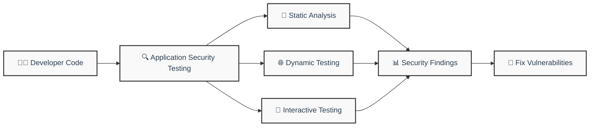

---

## 📍 Slide 2 – 📈 Evolution of Application Security Testing

* 📅 **1990s-2000s**: **Manual code reviews** by security experts → slow, expensive, inconsistent coverage.
* 📅 **2005-2010**: **First SAST tools** emerge → Fortify (2003), Veracode (2006) → automated source code analysis.
* 📅 **2010-2015**: **DAST tools mature** → OWASP ZAP (2010), commercial web app scanners proliferate.
* 📅 **2015-2020**: **DevSecOps integration** → CI/CD pipeline integration, shift-left movement accelerates.
* 📅 **2020-Present**: **AI-powered analysis** → machine learning reduces false positives, cloud-native testing emerges.
* 📊 **Market growth**: AST market grew from **$2.1B in 2019** to **$8.2B in 2024** ([Gartner Security Report](https://www.gartner.com/en/information-technology/insights/application-security))
* 🚀 **Next frontier**: **Real-time security feedback** in IDEs, AI-assisted vulnerability remediation, quantum-safe crypto testing.

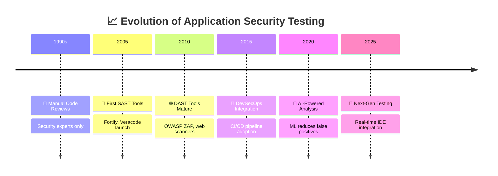

---

## 📍 Slide 3 – 🎯 Types of Security Vulnerabilities We're Testing For

* 🧩 **OWASP Top 10 vulnerabilities** → primary targets for AST tools:
  * 💉 **Injection flaws**: SQL injection, command injection, LDAP injection
  * 🔓 **Broken authentication**: weak passwords, session hijacking, credential stuffing
  * 📤 **Sensitive data exposure**: unencrypted data, weak crypto, information leakage
  * 🔧 **Security misconfigurations**: default credentials, unnecessary services, verbose errors
* 🏗️ **Code-level vulnerabilities**: buffer overflows, race conditions, insecure randomness
* ⚡ **Runtime vulnerabilities**: memory corruption, privilege escalation, resource exhaustion
* 🛠️ **Configuration issues**: cloud misconfigurations, container security, infrastructure-as-code flaws
* 📊 **Business logic flaws**: authorization bypasses, workflow manipulation, price manipulation
* 🔗 **Vulnerability databases**: [CVE Details](https://www.cvedetails.com/), [CWE List](https://cwe.mitre.org/), [OWASP Top 10](https://owasp.org/www-project-top-ten/)

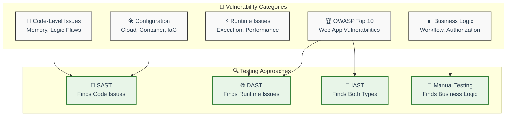

---

## 📍 Slide 4 – ⚖️ Static vs. Dynamic vs. Interactive Testing Comparison

* 🔬 **SAST (Static Application Security Testing)**:
  * ✅ **Pros**: early detection, complete code coverage, fast feedback, no running app needed
  * ❌ **Cons**: false positives, missing runtime context, configuration blind spots
  * 🎯 **Best for**: injection flaws, hardcoded secrets, coding standard violations
* 🌐 **DAST (Dynamic Application Security Testing)**:
  * ✅ **Pros**: real runtime conditions, finds configuration issues, business logic testing
  * ❌ **Cons**: late-stage detection, limited code coverage, requires running application
  * 🎯 **Best for**: authentication bypasses, session management, server misconfigurations
* 🧬 **IAST (Interactive Application Security Testing)**:
  * ✅ **Pros**: combines SAST + DAST benefits, low false positives, precise vulnerability location
  * ❌ **Cons**: performance overhead, deployment complexity, limited language support
  * 🎯 **Best for**: comprehensive analysis during QA testing, runtime vulnerability validation
* 📊 **Industry usage**: **67% use SAST**, **52% use DAST**, **23% use IAST** ([Synopsys DevSecOps Report 2024](https://www.synopsys.com/software-integrity/resources/analyst-reports/devsecops-report.html))

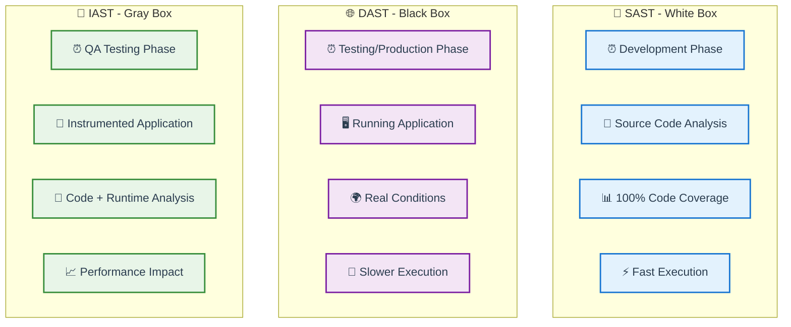

---

## 📍 Slide 5 – 🧩 The Testing Pyramid for Application Security

* 🔺 **Security Testing Pyramid** → layered approach to comprehensive application security validation:
  * 🏗️ **Base Layer**: **Unit Security Tests** → test individual functions for security flaws (80% of tests)
  * 🔗 **Middle Layer**: **Integration Security Tests** → test API endpoints, service interactions (15% of tests)
  * 🌍 **Top Layer**: **End-to-End Security Tests** → full application workflow testing (4% of tests)
  * 👤 **Apex**: **Manual Penetration Testing** → expert human testing for complex business logic (1% of effort)
* ⚡ **Pyramid principle**: **more tests at the bottom** = faster feedback, lower cost, better coverage
* 🛠️ **Tool mapping**:
  * 🏗️ **Unit level**: SAST tools, secure coding linters, dependency scanners
  * 🔗 **Integration level**: API security testing, DAST for services, IAST during integration tests
  * 🌍 **E2E level**: Full DAST scans, automated penetration testing tools
  * 👤 **Manual level**: Expert penetration testing, business logic review
* 📊 **Cost efficiency**: unit tests cost **$1 to fix**, production fixes cost **$100+** ([IBM Systems Sciences Institute](https://www.ibm.com/garage/method/practices/code/tool_continuous_integration/))

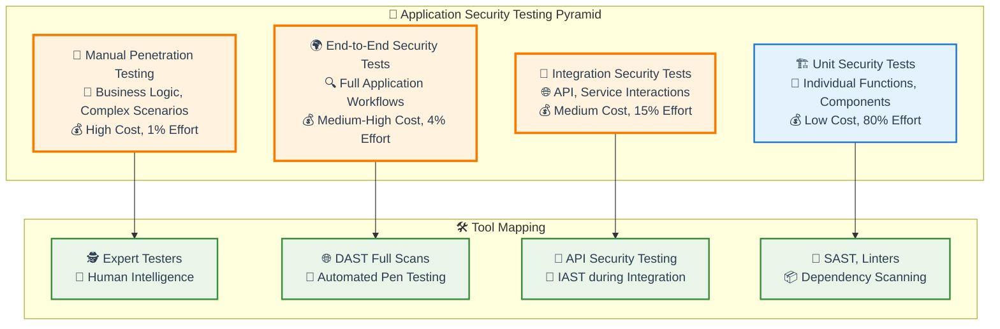

* 🔗 **Learn more**: [Google Testing Blog - Test Pyramid](https://testing.googleblog.com/2015/04/just-say-no-to-more-end-to-end-tests.html), [Martin Fowler - Test Pyramid](https://martinfowler.com/articles/practical-test-pyramid.html)

---

## 🎉 **Fun Break: Security Testing Memes & Facts**

### 😄 **"Why Security Testing is Like Going to the Dentist"**
* 🦷 **Nobody wants to do it** → but everyone knows they should
* 😬 **It hurts more when you wait** → early testing = less painful fixes
* 🔍 **Prevention is better than cure** → regular checkups prevent major issues
* 💰 **Ignoring it gets expensive fast** → root canals are way more expensive than cleanings!

### 🤯 **Mind-Blowing Security Testing Facts:**
* 🚀 **Speed demon**: Modern SAST tools can analyze **1 million lines of code in under 5 minutes**
* 🔍 **False alarm city**: Average SAST tool generates **30-40% false positives** (that's why we need humans!)
* 🐛 **Bug economics**: Average cost to fix a security bug jumps from **$80 in development** to **$7,600 in production**
* 🤖 **AI revolution**: **GitHub Copilot** now suggests **secure code patterns** in real-time as you type!

### 💭 **Interactive Question for Students:**
**🤔 "If you could only choose ONE type of security testing (SAST, DAST, or IAST) for your startup's web application, which would you pick and why?"**

*Think about: budget constraints, team size, application type, and risk tolerance...*

---
## 📂 Group 2: Static Application Security Testing (SAST)

## 📍 Slide 6 – 🔬 Deep Dive into SAST: Definition and Core Concepts

* 🔬 **SAST = Static Application Security Testing** → automated analysis of **source code** without executing the application.
* 🧠 **Core principle**: examine code structure, data flows, and patterns to **identify potential vulnerabilities** before runtime.
* 🌳 **How SAST works**:
  * 📝 **Lexical analysis**: breaks source code into tokens and symbols
  * 🌲 **Abstract Syntax Tree (AST)**: creates hierarchical code structure representation
  * 🔄 **Data flow analysis**: tracks how data moves through the application
  * 🎯 **Pattern matching**: compares code patterns against vulnerability databases
* ⚡ **Analysis types**:
  * 🔍 **Syntactic analysis**: looks for dangerous function calls, hardcoded secrets
  * 🧮 **Semantic analysis**: understands code meaning and context
  * 🌊 **Taint analysis**: tracks untrusted data from input to dangerous operations
* 📊 **Language support**: **Java, C#, JavaScript, Python, C/C++, PHP, Go, Swift** and 50+ languages
* 🔗 **Learn more**: [NIST SAST Guide](https://csrc.nist.gov/Projects/Static-Analysis-Tool-Exposition), [OWASP SAST Overview](https://owasp.org/www-community/Source_Code_Analysis_Tools)

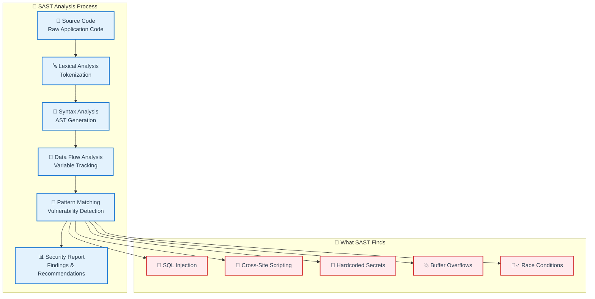

---

## 📍 Slide 7 – 🛠️ Popular SAST Tools and Platform Overview

* 🏢 **Commercial Enterprise SAST Tools**:
  * 🛡️ **Veracode Static Analysis**: cloud-native, **150+ languages**, IDE plugins, policy management
  * ✅ **Checkmarx SAST**: **31 languages**, incremental scanning, custom rules, **$50-200 per developer/year**
  * 🔒 **Synopsys Coverity**: **C/C++ excellence**, automotive compliance, **complex dataflow analysis**
  * 🏰 **Micro Focus Fortify**: **enterprise-grade**, audit workbench, regulatory compliance
* 🆓 **Open Source SAST Tools**:
  * 🔍 **SonarQube**: **29 languages**, quality gates, technical debt tracking, **free community edition**
  * ⚡ **Semgrep**: **fast pattern-based**, custom rules, **30+ languages**, CLI and cloud versions
  * 🐍 **Bandit (Python)**: specialized Python security linter, PCI DSS compliance
  * 📱 **MobSF**: mobile application security testing for Android/iOS
* ☁️ **Cloud-Native SAST Solutions**:
  * 🐙 **GitHub Advanced Security**: native GitHub integration, **CodeQL engine**, automatic PR scanning
  * ⚡ **AWS CodeGuru Reviewer**: machine learning-powered, Java/Python focus, pay-per-review model
  * 🔵 **Azure Security Center**: integrated DevOps workflows, compliance dashboards
* 📊 **Market leaders**: **Veracode (23% market share)**, **Checkmarx (19%)**, **Synopsys (16%)** ([Gartner Magic Quadrant 2024](https://www.gartner.com/en/documents/4018395))

```mermaid
flowchart TD
    subgraph "🏢 Commercial Enterprise"
        Veracode[🛡️ Veracode<br/>📊 Cloud-native, 150+ languages]
        Checkmarx[✅ Checkmarx<br/>💰 $50-200/dev/year]
        Coverity[🔒 Synopsys Coverity<br/>🚗 Automotive compliance]
        Fortify[🏰 Micro Focus Fortify<br/>📋 Enterprise audit]
    end
    
    subgraph "🆓 Open Source"
        SonarQube[🔍 SonarQube<br/>📈 Quality gates, 29 languages]
        Semgrep[⚡ Semgrep<br/>🎯 Pattern-based, custom rules]
        Bandit[🐍 Bandit<br/>🔐 Python security specialist]
        MobSF[📱 MobSF<br/>📲 Mobile app security]
    end
    
    subgraph "☁️ Cloud-Native"
        GitHub[🐙 GitHub Advanced Security<br/>🔍 CodeQL engine]
        CodeGuru[⚡ AWS CodeGuru<br/>🤖 ML-powered analysis]
        Azure[🔵 Azure Security Center<br/>📊 DevOps integration]
    end
    
    subgraph "🎯 Selection Criteria"
        Language[💻 Language Support]
        Integration[🔗 CI/CD Integration]
        Cost[💰 Total Cost of Ownership]
        Accuracy[🎯 False Positive Rate]
        Scalability[📈 Enterprise Scalability]
    end
    
    Veracode -.-> Language
    SonarQube -.-> Integration
    GitHub -.-> Cost
    Checkmarx -.-> Accuracy
    Coverity -.-> Scalability
    
    classDef commercial fill:#fff3e0,stroke:#f57c00,stroke-width:2px,color:#2c3e50
    classDef opensource fill:#e8f5e8,stroke:#388e3c,stroke-width:2px,color:#2c3e50
    classDef cloud fill:#e3f2fd,stroke:#1976d2,stroke-width:2px,color:#2c3e50
    classDef criteria fill:#f3e5f5,stroke:#7b1fa2,stroke-width:2px,color:#2c3e50
    
    class Veracode,Checkmarx,Coverity,Fortify commercial
    class SonarQube,Semgrep,Bandit,MobSF opensource
    class GitHub,CodeGuru,Azure cloud
    class Language,Integration,Cost,Accuracy,Scalability criteria
```

---

## 📍 Slide 8 – ⚡ SAST Strengths and Limitations

* ✅ **SAST Superpowers**:
  * 🏃‍♂️ **Early detection**: finds vulnerabilities **during development** → cheapest to fix
  * 📊 **Complete coverage**: analyzes **100% of code paths** including rarely executed branches
  * ⚡ **Fast feedback**: results in **minutes to hours** vs. days for manual review
  * 🚫 **No runtime required**: works with **incomplete applications** and third-party libraries
  * 📋 **Compliance friendly**: generates detailed reports for **audit trails** (SOX, PCI-DSS)
  * 🎯 **Precise location**: points to **exact line of code** with vulnerability
* ❌ **SAST Limitations**:
  * 🚨 **False positive plague**: **30-40% false positive rate** → developer fatigue and tool abandonment
  * 🌍 **Missing runtime context**: can't detect **configuration issues** or **environment-specific** problems
  * 🧩 **Complex business logic**: struggles with **multi-step workflows** and **authorization logic**
  * 📚 **Language constraints**: **compiled languages work better** than interpreted (JavaScript challenges)
  * 🔧 **Integration complexity**: requires **build environment setup** and **dependency resolution**
* 📊 **Industry reality**: **67% of developers** report SAST false positives as biggest adoption barrier ([DevSecOps Community Survey 2024](https://www.devsecops.org/))

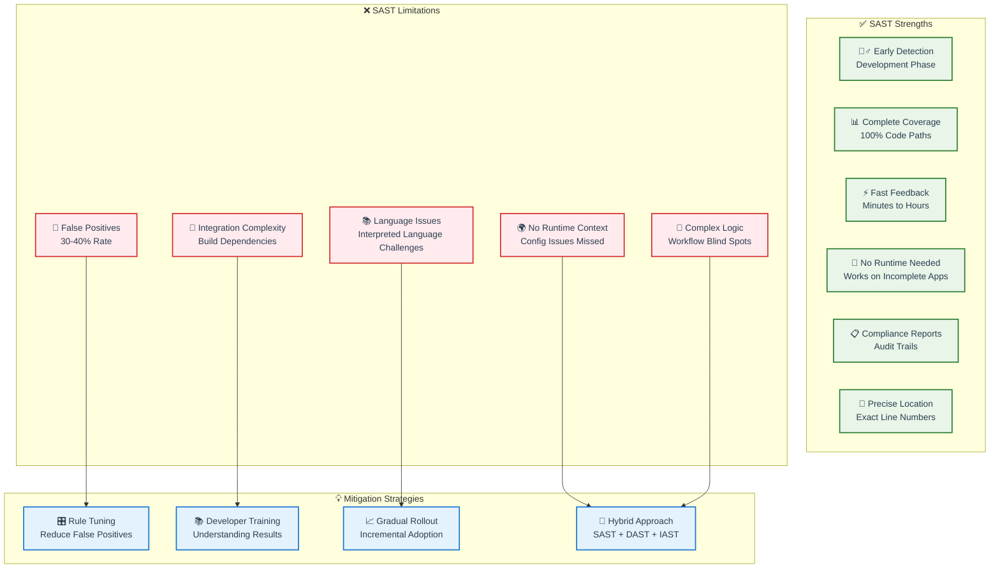

---

## 📍 Slide 9 – 🎯 SAST Implementation Best Practices

* 🎯 **Successful SAST Deployment Strategy**:
  * 📈 **Start small**: begin with **high-risk applications** and **critical security rules**
  * 🎛️ **Tune relentlessly**: spend **first 30 days** reducing false positives to **<10%**
  * 👥 **Train developers**: provide **hands-on training** on interpreting and fixing findings
  * 📊 **Measure everything**: track **time-to-fix**, **developer adoption**, **vulnerability trends**
* 🔗 **IDE Integration Best Practices**:
  * 💻 **Real-time feedback**: integrate with **VS Code**, **IntelliJ**, **Eclipse** for instant alerts
  * 🏃‍♂️ **Incremental scanning**: scan only **changed files** to maintain developer flow
  * 🎨 **Custom highlighting**: use **different colors** for different severity levels
  * 🔕 **Noise reduction**: allow developers to **suppress false positives** with justification
* 🚀 **CI/CD Pipeline Integration**:
  * ⚖️ **Quality gates**: **fail builds** only on **high/critical** vulnerabilities initially
  * 📊 **Trend analysis**: track vulnerability **introduction** and **fix rates** over time
  * 📧 **Smart notifications**: alert only **code authors** and **security champions**
  * 🔄 **Automated triage**: use **ML models** to **pre-classify** likely false positives
* 💡 **Developer Adoption Secrets**: **gamification** (vulnerability fix leaderboards), **positive reinforcement** (celebrate security improvements), **just-in-time training** (context-aware learning)

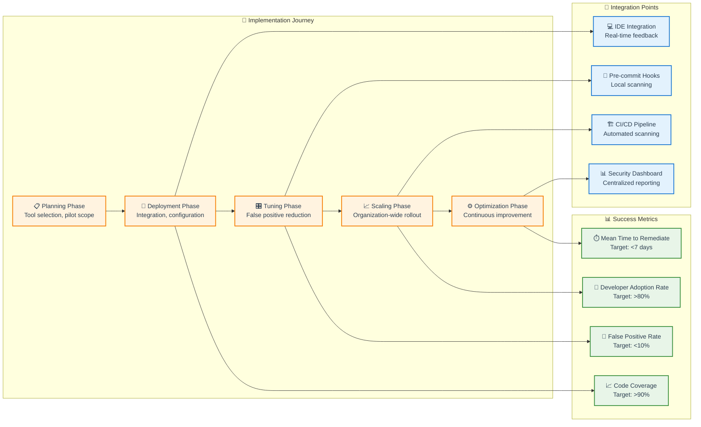

---

## 📍 Slide 10 – 🔧 Hands-on SAST: Tool Configuration and Output Analysis

* 🔧 **SonarQube Setup Example** (Free Community Edition):
  * 🐳 **Docker deployment**: `docker run -d -p 9000:9000 sonarqube:lts-community`
  * ⚙️ **Project configuration**: create `sonar-project.properties` with language settings
  * 🔍 **Scan execution**: `sonar-scanner` analyzes code and uploads results
  * 📊 **Quality gate**: define **pass/fail criteria** for builds
* 📊 **Understanding SAST Output**:
  * 🔴 **Blocker**: **security vulnerabilities** → immediate fix required
  * 🟠 **Critical**: **major bugs** → fix before release
  * 🟡 **Major**: **maintainability issues** → address in sprint
  * 🔵 **Minor**: **code smells** → technical debt cleanup
  * ⚪ **Info**: **suggestions** → optional improvements
* 🛠️ **Sample Vulnerability Fix Workflow**:
  * 🔍 **Identify**: SQL injection in user login function
  * 📖 **Understand**: review SAST explanation and code context
  * 🔧 **Fix**: replace string concatenation with parameterized query
  * ✅ **Verify**: re-run SAST scan to confirm resolution
  * 📚 **Learn**: document pattern for team knowledge base

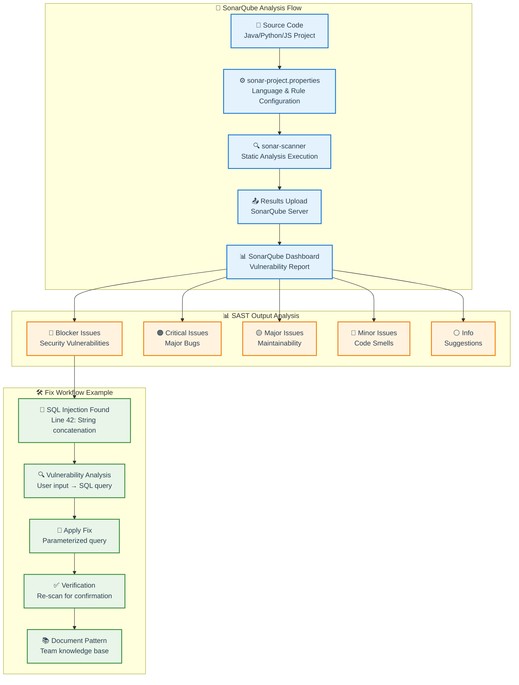

---

## 📂 Group 3: Dynamic Application Security Testing (DAST)

## 📍 Slide 11 – 🌐 Deep Dive into DAST: Black-box Runtime Testing

* 🌐 **DAST = Dynamic Application Security Testing** → automated security testing of **running applications** without access to source code.
* 🕵️ **Black-box approach**: tests application **from external perspective** like a real attacker would.
* 🔄 **How DAST works**:
  * 🕷️ **Web crawling**: automatically discovers **application pages and endpoints**
  * 🎯 **Attack simulation**: sends **malicious payloads** to input fields and parameters
  * 📊 **Response analysis**: examines **HTTP responses** for vulnerability indicators
  * 📝 **Vulnerability confirmation**: validates findings with **exploit proof-of-concept**
* 🧩 **DAST Testing Types**:
  * 🌍 **Web application scanning**: traditional website and web app testing
  * 🔗 **API testing**: REST/GraphQL/SOAP endpoint security validation
  * 📱 **Mobile app testing**: iOS/Android application security assessment
  * ☁️ **Cloud configuration**: serverless functions and cloud service testing
* ⏰ **Testing phases**: typically runs during **QA/staging** or **pre-production** phases
* 🔗 **Learn more**: [OWASP DAST Guide](https://owasp.org/www-community/Vulnerability_Scanning_Tools), [NIST Application Security Testing](https://csrc.nist.gov/projects/application-security)

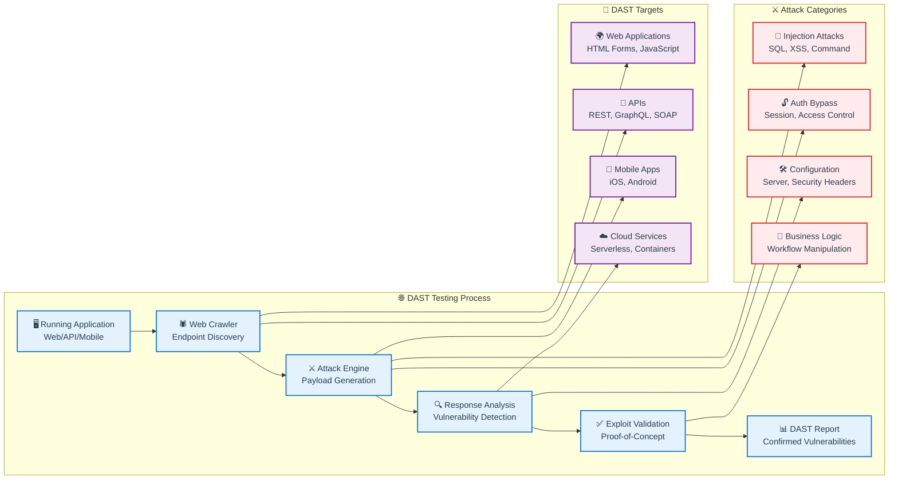

---

## 📍 Slide 12 – 🛠️ Popular DAST Tools and Platform Overview

* 🏢 **Commercial Enterprise DAST Tools**:
  * 🛡️ **Veracode Dynamic Analysis**: **cloud-based scanning**, API testing, **authenticated scans**, compliance reporting
  * 🔍 **Rapid7 AppSpider**: **enterprise web app scanner**, **custom attack patterns**, detailed remediation guidance
  * 🌐 **Invicti (formerly Netsparker)**: **low false positive rate**, **proof-of-exploit**, WordPress/CMS specialization
  * ⚡ **HCL AppScan**: **IBM heritage**, **enterprise integration**, regulatory compliance focus
* 🆓 **Open Source DAST Tools**:
  * ⚡ **OWASP ZAP**: **most popular open-source** scanner, **active development**, **extensive plugin ecosystem**
  * 🔍 **Nikto**: **web server scanner**, **6000+ vulnerability tests**, lightweight and fast
  * 🐍 **w3af**: **Python-based framework**, **extensible architecture**, custom plugin development
  * 💉 **SQLMap**: **specialized SQL injection** testing tool, **database takeover** capabilities
* ☁️ **Cloud-Native DAST Solutions**:
  * 🔶 **AWS Inspector**: **application assessment**, **network reachability analysis**, **automated remediation**
  * 🔵 **Azure Security Center**: **integrated DevOps**, **container scanning**, **threat intelligence**
  * 🔍 **Google Cloud Security Scanner**: **App Engine applications**, **automatic crawling**, **minimal false positives**
* 🎯 **Specialized API Testing Tools**: **Postman Security**, **Insomnia**, **REST-Assured**, **Karate DSL**
* 📊 **Market adoption**: **OWASP ZAP leads** with **45% open-source market share** ([DAST Tools Survey 2024](https://owasp.org/www-project-zap/))

```mermaid
flowchart TD
    subgraph "🏢 Commercial Enterprise"
        Veracode2[🛡️ Veracode Dynamic<br/>☁️ Cloud-based, API testing]
        AppSpider[🔍 Rapid7 AppSpider<br/>🎯 Custom attack patterns]
        Invicti[🌐 Invicti Netsparker<br/>📈 Low false positives]
        AppScan[⚡ HCL AppScan<br/>🏢 Enterprise integration]
    end
    
    subgraph "🆓 Open Source Champions"
        ZAP[⚡ OWASP ZAP<br/>👑 Most popular, plugin ecosystem]
        Nikto[🔍 Nikto<br/>⚡ 6000+ tests, lightweight]
        w3af[🐍 w3af<br/>🔧 Python framework, extensible]
        SQLMap[💉 SQLMap<br/>🎯 SQL injection specialist]
    end
    
    subgraph "☁️ Cloud-Native"
        Inspector[🔶 AWS Inspector<br/>🔍 Network + app assessment]
        AzureSC[🔵 Azure Security Center<br/>🐳 Container scanning]
        GoogleCS[🔍 Google Cloud Scanner<br/>📱 App Engine focus]
    end
    
    subgraph "🔗 API Specialists"
        Postman[📮 Postman Security<br/>🔗 API workflow testing]
        Insomnia[😴 Insomnia<br/>🎯 GraphQL specialist]
        RestAssured[🛡️ REST-Assured<br/>☕ Java API testing]
        Karate[🥋 Karate DSL<br/>📝 BDD API testing]
    end
    
    subgraph "💡 Selection Criteria"
        AppType[🌐 Application Type<br/>Web vs API vs Mobile]
        Budget[💰 Budget Constraints<br/>Free vs Commercial]
        Integration[🔗 CI/CD Integration<br/>Pipeline compatibility]
        Expertise[🧠 Team Expertise<br/>Tool complexity]
        Compliance[📋 Compliance Needs<br/>Regulatory requirements]
    end
    
    ZAP -.-> Budget
    Veracode2 -.-> Compliance
    AppSpider -.-> Integration
    Postman -.-> AppType
    Inspector -.-> Expertise
    
    classDef commercial fill:#fff3e0,stroke:#f57c00,stroke-width:2px,color:#2c3e50
    classDef opensource fill:#e8f5e8,stroke:#388e3c,stroke-width:2px,color:#2c3e50
    classDef cloud fill:#e3f2fd,stroke:#1976d2,stroke-width:2px,color:#2c3e50
    classDef api fill:#f3e5f5,stroke:#7b1fa2,stroke-width:2px,color:#2c3e50
    classDef criteria fill:#fce4ec,stroke:#c2185b,stroke-width:2px,color:#2c3e50
    
    class Veracode2,AppSpider,Invicti,AppScan commercial
    class ZAP,Nikto,w3af,SQLMap opensource
    class Inspector,AzureSC,GoogleCS cloud
    class Postman,Insomnia,RestAssured,Karate api
    class AppType,Budget,Integration,Expertise,Compliance criteria
```

---

## 📍 Slide 13 – ⚡ DAST Strengths and Limitations

* ✅ **DAST Superpowers**:
  * 🌍 **Real-world conditions**: tests **actual running environment** with real configurations
  * 🛠️ **Configuration testing**: detects **server misconfigurations**, missing security headers, SSL/TLS issues
  * 🧩 **Business logic validation**: can identify **workflow manipulation** and **authorization bypasses**
  * 🔍 **Language agnostic**: works with **any technology stack** (Java, .NET, PHP, Node.js, Python)
  * 🎯 **Production-like testing**: validates security in **staging/pre-production** environments
  * 📊 **Low false positives**: **exploitable vulnerabilities** are confirmed through actual attacks
* ❌ **DAST Limitations**:
  * 🐌 **Slow execution**: comprehensive scans can take **hours to days** for large applications
  * 📉 **Limited code coverage**: only tests **accessible application paths** → **~20-30% code coverage**
  * 🏃‍♂️ **Late-stage detection**: vulnerabilities found **after development** → **expensive to fix**
  * 🔧 **Complex setup**: requires **running application**, **test data**, **network access**
  * 🔐 **Authentication challenges**: difficulty testing **authenticated sections** and **complex workflows**
  * 💥 **Potentially disruptive**: aggressive testing may **crash applications** or **corrupt data**
* 📊 **Industry insights**: **52% of organizations** use DAST but only **23% integrate it effectively** into CI/CD ([DevSecOps Maturity Report 2024](https://www.devsecops.org/))

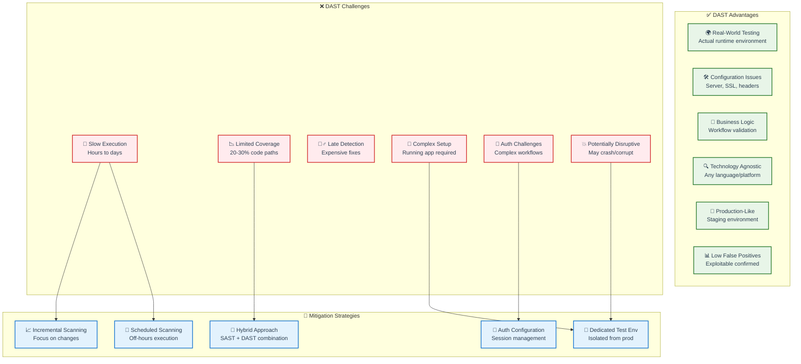

---

## 📍 Slide 14 – 🎯 DAST Implementation Best Practices

* 🎯 **Successful DAST Deployment Strategy**:
  * 🧪 **Dedicated test environment**: isolated staging environment with **production-like data**
  * 📅 **Scheduling strategy**: run comprehensive scans **nightly** or **weekly** to avoid disruption
  * 🎛️ **Incremental scanning**: focus on **changed components** for faster feedback in CI/CD
  * 📊 **Risk-based prioritization**: fix **critical** and **high** vulnerabilities first
* 🔑 **Authentication and Session Management**:
  * 👤 **Test user accounts**: create dedicated **test accounts** with different **privilege levels**
  * 🍪 **Session handling**: configure **automatic login** and **session maintenance**
  * 🔄 **Multi-step authentication**: handle **2FA**, **CAPTCHA**, and **complex login flows**
  * 📋 **Role-based testing**: test with **admin**, **user**, and **anonymous** access levels
* 🚀 **CI/CD Pipeline Integration Patterns**:
  * 🔄 **Parallel execution**: run DAST **alongside** other testing phases
  * 📊 **Quality gates**: **fail builds** only on **newly introduced** high-severity issues
  * 📧 **Smart notifications**: alert **relevant teams** based on vulnerability type
  * 📈 **Trend analysis**: track vulnerability **introduction** and **resolution** rates
* 💡 **Performance Optimization Tips**: **crawler tuning** (limit scope), **payload optimization** (focus on likely vulnerabilities), **result caching** (avoid duplicate scans)

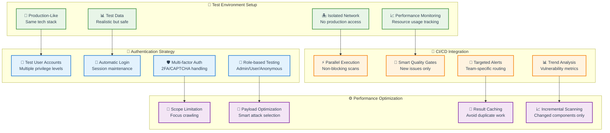

---

## 📍 Slide 15 – 🔧 Hands-on DAST: OWASP ZAP Configuration and Testing

* 🔧 **OWASP ZAP Setup and Configuration**:
  * 🐳 **Docker deployment**: `docker run -t owasp/zap2docker-stable zap-baseline.py -t https://target-app.com`
  * 🖥️ **Desktop GUI**: download from [zaproxy.org](https://www.zaproxy.org/) for interactive scanning
  * 🤖 **CI/CD integration**: use **ZAP API** or **Jenkins plugin** for automated pipeline scanning
  * ⚙️ **Configuration files**: customize scan policies, authentication, and scope settings
* 🕷️ **ZAP Spider and Active Scan Configuration**:
  * 🌐 **Spider configuration**: set **max crawl depth**, **exclude patterns**, **form handling**
  * ⚔️ **Active scan policies**: enable/disable **attack categories** based on application type
  * 🎯 **Scope management**: define **in-scope URLs** and **exclude sensitive endpoints**
  * 📊 **Scan tuning**: adjust **attack strength** and **timing** for different environments
* 🔑 **Authentication Configuration Examples**:
  * 📝 **Form-based auth**: configure **login URL**, **username/password fields**, **success indicators**
  * 🍪 **Session management**: handle **session cookies**, **CSRF tokens**, **logout detection**
  * 🔗 **API authentication**: configure **Bearer tokens**, **API keys**, **OAuth flows**
* 📊 **Result Analysis and Reporting**: ZAP generates **HTML**, **XML**, and **JSON** reports with vulnerability details, remediation guidance, and **risk ratings**

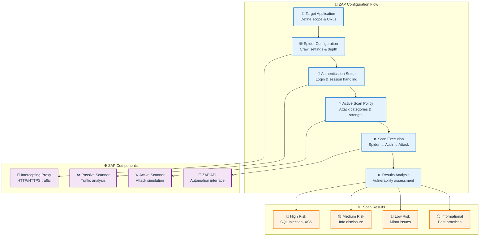

---

## 🎉 **Fun Break: SAST vs DAST - The Eternal Debate!**

### 😄 **"SAST vs DAST: The Developer Dating Game"**
* 💕 **SAST is like dating someone's profile** → you know everything about them on paper, but haven't met in person
* 🌍 **DAST is like meeting them in real life** → you see how they actually behave, but don't know their deep thoughts
* 💑 **IAST is like moving in together** → you get the full picture, but it's a bigger commitment!
* 🤝 **Smart couples use all three** → because no single approach tells the whole story

### 🤯 **Mind-Blowing Security Testing Facts:**
* ⚡ **Speed comparison**: SAST can scan **1 million lines in 5 minutes**, DAST takes **8 hours** for the same app
* 🎯 **Coverage paradox**: SAST covers **100% of code** but finds **60% false positives**, DAST covers **30% of code** but has **95% accuracy**
* 💰 **ROI reality**: Companies using **both SAST and DAST** reduce security incidents by **73%** vs single-tool users
* 🤖 **AI integration**: **GitHub Copilot** now suggests **ZAP scan configurations** when you mention security testing!

### 💭 **Interactive Challenge for Students:**
**🎮 "Build Your Security Testing Strategy Game!"**

*Scenario: You're the security lead for a fintech startup. You have:*
- 💰 **Limited budget**: $50K/year for tools
- ⏰ **Tight deadlines**: 2-week sprints
- 👥 **Small team**: 5 developers, 2 QA engineers
- 🏛️ **Compliance**: PCI-DSS requirements

**Which combination would you choose and why?**
1. 🔬 Premium SAST tool ($40K) + Open source DAST
2. 🆓 Open source everything (ZAP + SonarQube) + Security consultant
3. ☁️ Cloud-native integrated suite (GitHub Advanced Security)

*Discuss in groups and defend your choice!*

---
## 📂 Group 4: Interactive Application Security Testing (IAST)

## 📍 Slide 16 – 🧬 Deep Dive into IAST: Runtime Instrumentation Testing

* 🧬 **IAST = Interactive Application Security Testing** → **hybrid approach** combining benefits of **SAST and DAST** through **runtime instrumentation**.
* 🔧 **How IAST works**:
  * 📡 **Agent instrumentation**: lightweight **monitoring agents** deployed within the application runtime
  * 👁️ **Runtime observation**: agents **monitor application behavior** during normal QA testing
  * 🌊 **Data flow tracking**: follows **untrusted data** from **input to dangerous operations**
  * ⚡ **Real-time analysis**: detects vulnerabilities **as they occur** during application execution
* 🎯 **Gray-box testing approach**: has **access to source code** (like SAST) while testing **running application** (like DAST)
* 🧩 **Key IAST capabilities**:
  * 🔍 **Precise vulnerability location**: pinpoints **exact line of code** with runtime context
  * 📊 **Code coverage analysis**: shows **which code paths were tested** during QA execution
  * 🚫 **Low false positives**: validates vulnerabilities through **actual runtime conditions**
  * 📈 **Incremental testing**: only tests **code paths that are actually executed**
* ⏱️ **Testing timing**: runs **during QA testing phase** when functional tests exercise application features
* 🔗 **Learn more**: [Gartner IAST Guide](https://www.gartner.com/en/information-technology/glossary/interactive-application-security-testing-iast), [OWASP IAST Overview](https://owasp.org/www-community/Vulnerability_Scanning_Tools)

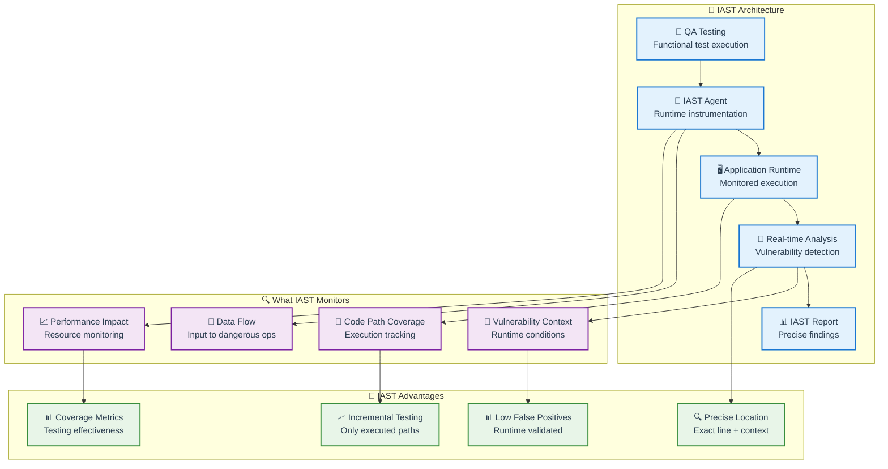

---

## 📍 Slide 17 – 🛠️ Popular IAST Tools and Platform Overview

* 🏢 **Commercial Enterprise IAST Tools**:
  * 🛡️ **Veracode Interactive Analysis**: **cloud-based IAST**, supports **Java, .NET, Node.js**, **DevOps integration**
  * 🔍 **Synopsys Seeker**: **comprehensive language support**, **custom policy creation**, **enterprise scalability**
  * 🛡️ **Hdiv Security**: **specialized in business logic** vulnerabilities, **real-time protection**, **RASP capabilities**
  * ⚡ **Checkmarx Interactive**: **integrated with CxSAST**, **unified vulnerability management**, **correlation engine**
* 🆓 **Open Source & Community IAST**:
  * 📦 **OWASP Dependency-Check**: **limited IAST features**, focuses on **known vulnerable components**
  * 🔧 **Custom instrumentation**: **AspectJ for Java**, **monkey patching for Python**, **middleware for Node.js**
  * 🤖 **Research tools**: **JALANGI** (JavaScript), **PHOSPHOR** (Java taint tracking), academic projects
* ☁️ **Cloud-Native IAST Limitations**:
  * 📉 **Limited native offerings**: most cloud providers focus on **SAST and DAST**
  * 🔄 **RASP integration**: **Runtime Application Self-Protection** tools overlap with IAST functionality
  * 🐳 **Container challenges**: instrumentation complexity in **containerized environments**
* 📊 **Market reality**: **IAST adoption is 23%** vs **67% SAST** and **52% DAST** ([Application Security Report 2024](https://www.synopsys.com/software-integrity.html))
* 💡 **Selection considerations**: **language support**, **performance overhead**, **DevOps integration**, **licensing costs**

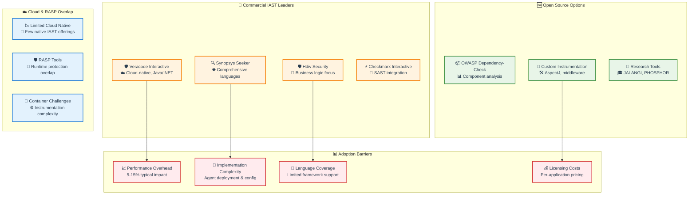

---

## 📍 Slide 18 – ⚡ IAST Strengths and Limitations

* ✅ **IAST Superpowers**:
  * 🎯 **Extremely low false positives**: **<5% false positive rate** vs 30-40% for SAST
  * 🔍 **Precise vulnerability location**: exact **line of code + runtime context** for faster remediation
  * 📊 **Code coverage insights**: shows **which parts of application were actually tested**
  * ⚡ **Real-time feedback**: detects vulnerabilities **during QA testing** when developers are most engaged
  * 🧩 **Business logic testing**: can identify **complex multi-step vulnerabilities** that SAST/DAST miss
  * 🔄 **Incremental analysis**: only analyzes **executed code paths** → more efficient than full SAST scans
* ❌ **IAST Challenges**:
  * 📈 **Performance overhead**: **5-15% performance impact** on application during testing
  * 🏗️ **Deployment complexity**: requires **agent installation** and **runtime configuration**
  * 📚 **Limited language support**: fewer supported **frameworks and languages** vs SAST/DAST
  * 🧪 **Test-dependent coverage**: vulnerability detection limited to **QA test execution** scope
  * 💰 **Higher costs**: **per-application licensing** can be expensive for large portfolios
  * 🐳 **Container/cloud challenges**: **instrumentation complexity** in modern **containerized environments**
* 🔄 **Best use cases**: **critical applications** with **comprehensive QA testing**, **complex business logic**, **regulatory requirements**
* 📊 **ROI sweet spot**: applications with **>10,000 lines of code** and **>50% test coverage** see best IAST value

```mermaid
graph TD
    subgraph "✅ IAST Strengths"
        LowFP[🎯 Ultra-Low False Positives<br/><5% vs 30-40% SAST]
        Precise2[🔍 Precise Location<br/>Line + runtime context]
        Coverage2[📊 Coverage Insights<br/>Tested vs untested code]
        RealTime[⚡ Real-time Feedback<br/>During QA execution]
        BusinessLogic2[🧩 Business Logic<br/>Multi-step vulnerabilities]
        Incremental2[🔄 Incremental Analysis<br/>Only executed paths]
    end
    
    subgraph "❌ IAST Limitations"
        PerfOverhead[📈 Performance Overhead<br/>5-15% impact]
        DeployComplex[🏗️ Deployment Complexity<br/>Agent installation]
        LangSupport[📚 Limited Language Support<br/>Fewer frameworks]
        TestDependent[🧪 Test-Dependent Coverage<br/>QA execution scope]
        HighCost[💰 Higher Costs<br/>Per-app licensing]
        ContainerIssues[🐳 Container Challenges<br/>Instrumentation complexity]
    end
    
    subgraph "🎯 Ideal Use Cases"
        CriticalApps[⭐ Critical Applications<br/>High security requirements]
        ComprehensiveQA[🧪 Comprehensive QA<br/>Good test coverage]
        ComplexLogic[🧩 Complex Business Logic<br/>Multi-tier workflows]
        Compliance[📋 Regulatory Requirements<br/>Financial, healthcare]
    end
    
    subgraph "📊 ROI Factors"
        CodeSize[📏 Application Size<br/>>10K lines optimal]
        TestCoverage[📊 Test Coverage<br/>>50% coverage needed]
        VulnDensity[🐛 Vulnerability Density<br/>Historical incident rate]
        TeamSize[👥 Development Team<br/>Dedicated QA resources]
    end
    
    LowFP --> CriticalApps
    Precise2 --> ComprehensiveQA
    BusinessLogic2 --> ComplexLogic
    TestDependent --> Compliance
    
    PerfOverhead --> CodeSize
    DeployComplex --> TestCoverage
    HighCost --> VulnDensity
    ContainerIssues --> TeamSize
    
    classDef strength fill:#e8f5e8,stroke:#2e7d32,stroke-width:2px,color:#2c3e50
    classDef limitation fill:#ffebee,stroke:#d32f2f,stroke-width:2px,color:#2c3e50
    classDef usecase fill:#e3f2fd,stroke:#1976d2,stroke-width:2px,color:#2c3e50
    classDef roi fill:#fff3e0,stroke:#f57c00,stroke-width:2px,color:#2c3e50
    
    class LowFP,Precise2,Coverage2,RealTime,BusinessLogic2,Incremental2 strength
    class PerfOverhead,DeployComplex,LangSupport,TestDependent,HighCost,ContainerIssues limitation
    class CriticalApps,ComprehensiveQA,ComplexLogic,Compliance usecase
    class CodeSize,TestCoverage,VulnDensity,TeamSize roi
```

---

## 📍 Slide 19 – 🎯 IAST Implementation Best Practices

* 🎯 **Strategic IAST Deployment Approach**:
  * 📈 **Pilot program**: start with **1-2 critical applications** with **good QA coverage**
  * 🧪 **Staging-first**: deploy agents in **staging environments** before considering production
  * 📊 **Performance baseline**: establish **performance metrics** before agent deployment
  * 🔄 **Gradual rollout**: expand to additional applications based on **pilot success**
* 🤖 **Agent Deployment Strategies**:
  * 🐳 **Containerized agents**: use **sidecar pattern** in Kubernetes environments
  * 🏗️ **Build-time integration**: embed agents during **application build process**
  * 🔧 **Runtime attachment**: dynamic agent attachment for **legacy applications**
  * 📊 **Configuration management**: use **infrastructure-as-code** for agent configuration
* 🧪 **QA Process Integration**:
  * 📋 **Test coverage requirements**: ensure **>70% code coverage** for effective IAST results
  * 🔄 **Automated test execution**: integrate IAST with **automated regression testing**
  * 👥 **Manual testing protocols**: train QA teams on **security-focused testing scenarios**
  * 📊 **Coverage gap analysis**: identify **untested code paths** for additional test creation
* 💡 **Performance Monitoring & Optimization**: **resource monitoring**, **agent tuning**, **selective instrumentation**, **result correlation**

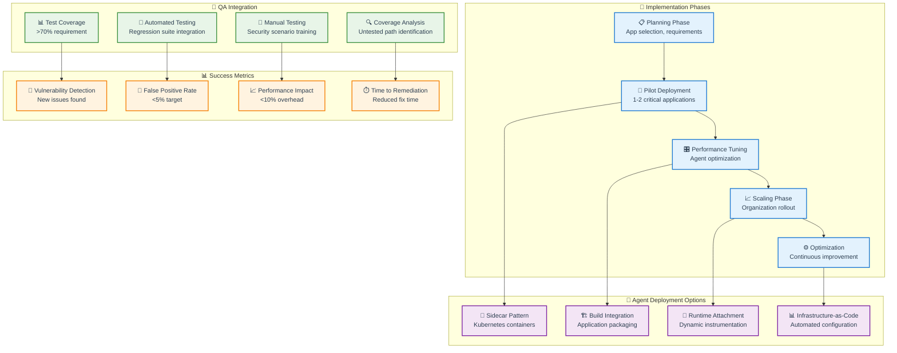

---

## 📍 Slide 20 – 🔧 Hands-on IAST: Agent-based Testing Setup

* 🔧 **IAST Agent Configuration Example** (Java Application):
  * ☕ **JVM agent**: add `-javaagent:iast-agent.jar` to **application startup parameters**
  * ⚙️ **Configuration file**: specify **monitoring rules**, **reporting endpoints**, **performance settings**
  * 🌐 **Network connectivity**: ensure agent can **communicate with IAST server**
  * 📊 **Logging configuration**: enable **agent debugging** during initial setup
* 🧪 **QA Testing Integration Workflow**:
  * 🚀 **Application startup**: launch application with **IAST agent** attached
  * 🧪 **Execute test suite**: run **functional**, **integration**, and **security tests**
  * 👁️ **Monitor agent activity**: watch **real-time vulnerability detection** in IAST dashboard
  * 📊 **Review findings**: analyze **vulnerabilities** with **precise code location** and **runtime context**
* 📊 **Performance Impact Assessment**:
  * ⏱️ **Response time monitoring**: measure **API response times** before/after agent
  * 💾 **Memory usage tracking**: monitor **heap utilization** and **garbage collection**
  * 🔄 **Throughput analysis**: assess **requests per second** impact
  * 📈 **Resource optimization**: tune agent settings to **minimize overhead**
* 🔄 **Result Correlation and Analysis**: combine IAST findings with **SAST results**, identify **confirmed vulnerabilities**, prioritize based on **exploitability**

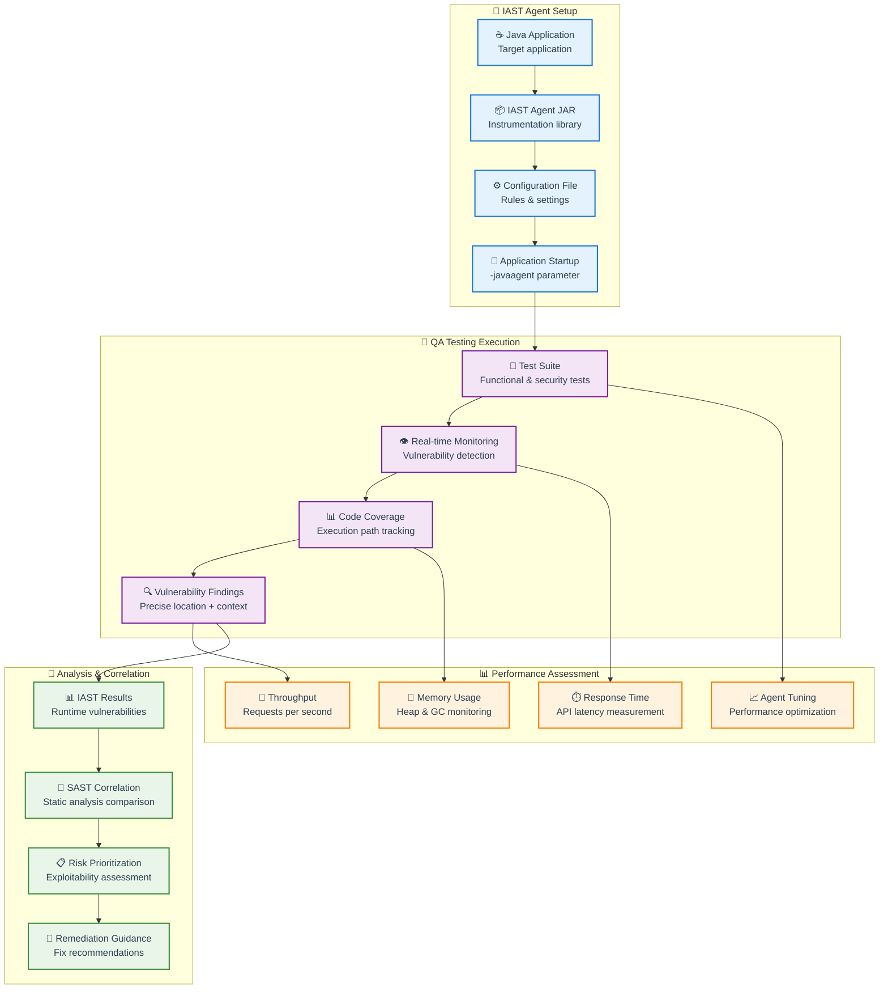

---

## 📂 Group 5: CI/CD Pipeline Integration and Automation

## 📍 Slide 21 – 🚀 Integrating Security Testing into CI/CD Pipelines

* 🚀 **Security Testing Pipeline Strategy**:
  * 🏗️ **Left-shift approach**: run **SAST** during **build phase** for immediate feedback
  * 🧪 **Middle integration**: execute **IAST** during **QA testing phase** for runtime validation
  * 🌍 **Right-shift validation**: perform **DAST** in **staging/pre-production** for final verification
  * 🔄 **Continuous monitoring**: ongoing security assessment in **production** environments
* ⚖️ **Quality Gate Implementation**:
  * 🚦 **Fail-fast strategy**: **block builds** on critical/high vulnerabilities in main branch
  * 📊 **Risk-based gates**: different thresholds for **development**, **staging**, **production** pipelines
  * 🔄 **Progressive enforcement**: **gradual tightening** of security requirements over time
  * 🚨 **Emergency bypasses**: controlled **override mechanisms** for critical business needs
* ⚡ **Parallel vs Sequential Execution**:
  * ⚡ **Parallel benefits**: **faster pipeline execution**, independent tool operation
  * 🔗 **Sequential advantages**: **result correlation**, dependency management, resource optimization
  * 🎯 **Hybrid approach**: **SAST parallel** with build, **DAST sequential** after deployment
* 📊 **Pipeline Performance Optimization**: **caching strategies**, **incremental scanning**, **result persistence**, **smart triggering**

```mermaid
flowchart LR
    subgraph "🏗️ CI/CD Pipeline Stages"
        Commit[📝 Code Commit<br/>Developer push]
        Build[⚙️ Build Stage<br/>Compile & package]
        Test[🧪 Test Stage<br/>QA & Integration]
        Deploy[🚀 Deploy Stage<br/>Staging deployment]
        Prod[🌍 Production<br/>Live environment]
    end
    
    subgraph "🔒 Security Testing Integration"
        SAST2[🔬 SAST<br/>Static analysis]
        IAST2[🧬 IAST<br/>Interactive testing]
        DAST2[🌐 DAST<br/>Dynamic testing]
        Monitor[📊 Runtime Monitoring<br/>Continuous security]
    end
    
    subgraph "🚦 Quality Gates"
        BuildGate[🚦 Build Gate<br/>SAST results check]
        TestGate[🚦 Test Gate<br/>IAST findings review]
        DeployGate[🚦 Deploy Gate<br/>DAST validation]
        ProdGate[🚦 Prod Gate<br/>Monitoring alerts]
    end
    
    Commit --> Build
    Build --> Test
    Test --> Deploy
    Deploy --> Prod
    
    Build --> SAST2
    Test --> IAST2
    Deploy --> DAST2
    Prod --> Monitor
    
    SAST2 --> BuildGate
    IAST2 --> TestGate
    DAST2 --> DeployGate
    Monitor --> ProdGate
    
    BuildGate -->|❌ Fail| Commit
    TestGate -->|❌ Fail| Build
    DeployGate -->|❌ Fail| Test
    ProdGate -->|🚨 Alert| Deploy
    
    classDef pipeline fill:#e3f2fd,stroke:#1976d2,stroke-width:2px,color:#2c3e50
    classDef security fill:#f3e5f5,stroke:#7b1fa2,stroke-width:2px,color:#2c3e50
    classDef gates fill:#fff3e0,stroke:#f57c00,stroke-width:2px,color:#2c3e50
    
    class Commit,Build,Test,Deploy,Prod pipeline
    class SAST2,IAST2,DAST2,Monitor security
    class BuildGate,TestGate,DeployGate,ProdGate gates
```

---

## 📍 Slide 22 – 📊 Tool Orchestration and Security Dashboard Creation

* 📊 **Multi-Tool Result Aggregation**:
  * 🔄 **Data normalization**: convert **different tool formats** into **unified vulnerability model**
  * 🎯 **Deduplication logic**: identify **same vulnerability** found by **multiple tools**
  * 📈 **Risk scoring**: combine **CVSS scores**, **exploitability**, **business context**
  * 🏷️ **Vulnerability lifecycle**: track findings from **detection** through **remediation**
* 🎛️ **Security Orchestration Platforms**:
  * 🛡️ **DefectDojo**: **open-source** vulnerability management with **140+ tool integrations**
  * 🔗 **ThreadFix**: **commercial platform** with **advanced correlation** and **application mapping**
  * 📊 **Snyk**: **developer-first** platform with **IDE**, **SCM**, and **CI/CD** integrations
  * ☁️ **Cloud-native**: **AWS Security Hub**, **Azure Security Center**, **Google Security Command Center**
* 📈 **Dashboard Design Principles**:
  * 👥 **Role-based views**: **executives** see trends, **developers** see actionable items, **security** sees details
  * 🎯 **Actionable insights**: focus on **"what to fix first"** rather than raw vulnerability counts
  * 📊 **Trend analysis**: show **security posture** improvements over time
  * 🚨 **Alert fatigue prevention**: intelligent notifications based on **priority** and **change**
* 🤖 **Automation and Workflows**: **auto-assignment** to developers, **JIRA integration**, **SLA tracking**, **compliance reporting**

```mermaid
flowchart TD
    subgraph "🛠️ Security Tools"
        SAST3[🔬 SAST Tools<br/>SonarQube, Checkmarx]
        DAST3[🌐 DAST Tools<br/>ZAP, Veracode]
        IAST3[🧬 IAST Tools<br/>Seeker, Hdiv]
        SCA[📦 SCA Tools<br/>Snyk, WhiteSource]
        Secrets[🔑 Secret Scanning<br/>GitLeaks, TruffleHog]
    end
    
    subgraph "🔄 Orchestration Layer"
        Normalize[📊 Data Normalization<br/>Unified vulnerability format]
        Dedupe[🎯 Deduplication<br/>Same vuln detection]
        Score[📈 Risk Scoring<br/>CVSS + context]
        Workflow[🔄 Workflow Engine<br/>Assignment & tracking]
    end
    
    subgraph "📊 Security Dashboard"
        Executive[👔 Executive View<br/>Trends & KPIs]
        Developer[👨‍💻 Developer View<br/>Actionable items]
        Security[🛡️ Security View<br/>Detailed analysis]
        Compliance[📋 Compliance View<br/>Audit reports]
    end
    
    subgraph "🔗 Integration Points"
        JIRA[🎫 JIRA Integration<br/>Ticket management]
        Slack[💬 Slack Alerts<br/>Team notifications]
        Email[📧 Email Reports<br/>Scheduled summaries]
        API[🔌 REST APIs<br/>Custom integrations]
    end
    
    SAST3 --> Normalize
    DAST3 --> Normalize
    IAST3 --> Dedupe
    SCA --> Score
    Secrets --> Workflow
    
    Normalize --> Executive
    Dedupe --> Developer
    Score --> Security
    Workflow --> Compliance
    
    Executive --> JIRA
    Developer --> Slack
    Security --> Email
    Compliance --> API
    
    classDef tools fill:#e3f2fd,stroke:#1976d2,stroke-width:2px,color:#2c3e50
    classDef orchestration fill:#f3e5f5,stroke:#7b1fa2,stroke-width:2px,color:#2c3e50
    classDef dashboard fill:#e8f5e8,stroke:#388e3c,stroke-width:2px,color:#2c3e50
    classDef integration fill:#fff3e0,stroke:#f57c00,stroke-width:2px,color:#2c3e50
    
    class SAST3,DAST3,IAST3,SCA,Secrets tools
    class Normalize,Dedupe,Score,Workflow orchestration
    class Executive,Developer,Security,Compliance dashboard
    class JIRA,Slack,Email,API integration
```

---

## 📍 Slide 23 – ⚖️ Balancing Security and Development Velocity

* ⚖️ **The Velocity vs Security Dilemma**:
  * ⚡ **Developer pressure**: **feature delivery deadlines** vs **security requirements**
  * 📊 **False positive fatigue**: too many **non-actionable alerts** slow development
  * 🚦 **Quality gate friction**: overly strict gates can **block legitimate releases**
  * 💰 **Business pressure**: **time-to-market** vs **risk tolerance**
* 🎯 **Risk-Based Security Approach**:
  * 📊 **Contextual risk scoring**: consider **data sensitivity**, **user exposure**, **attack surface**
  * 🏷️ **Application classification**: **critical**, **high**, **medium**, **low** risk tiers
  * 🔄 **Progressive enforcement**: **stricter rules** for higher-risk applications
  * ⏰ **Time-based thresholds**: **immediate fixes** for critical, **30 days** for high, **next release** for medium
* 🚀 **Developer Experience Optimization**:
  * 💻 **IDE integration**: **real-time feedback** without breaking developer flow
  * 🧠 **Smart notifications**: **context-aware alerts** with **clear remediation guidance**
  * 🎯 **Just-in-time training**: **educational content** delivered when vulnerabilities found
  * 🏆 **Gamification**: **security achievement badges**, **vulnerability fix leaderboards**
* 🔄 **Emergency Response Procedures**: **bypass mechanisms**, **post-deployment fixes**, **incident response**, **lessons learned**

```mermaid
graph TD
    subgraph "⚖️ Balancing Factors"
        Velocity[⚡ Development Velocity<br/>Feature delivery speed]
        Security[🛡️ Security Requirements<br/>Risk mitigation needs]
        Business[💰 Business Pressure<br/>Time-to-market demands]
        Compliance[📋 Compliance Needs<br/>Regulatory requirements]
    end
    
    subgraph "🎯 Risk-Based Strategy"
        Critical[🔴 Critical Apps<br/>Strict security gates]
        High[🟡 High Risk Apps<br/>Moderate enforcement]
        Medium[🔵 Medium Risk Apps<br/>Standard controls]
        Low[⚪ Low Risk Apps<br/>Minimal gates]
    end
    
    subgraph "🚀 Developer Experience"
        IDE2[💻 IDE Integration<br/>Real-time feedback]
        Smart[🧠 Smart Notifications<br/>Context-aware alerts]
        Training2[🎯 Just-in-time Learning<br/>Educational content]
        Gamify[🏆 Gamification<br/>Achievement system]
    end
    
    subgraph "📊 Success Metrics"
        DeployFreq[📈 Deployment Frequency<br/>Releases per week]
        LeadTime[⏱️ Lead Time<br/>Commit to production]
        MTTR2[🔧 Mean Time to Recovery<br/>Incident resolution]
        VulnFix[🐛 Vulnerability Fix Rate<br/>Time to remediation]
    end
    
    Velocity --> Critical
    Security --> High
    Business --> Medium
    Compliance --> Low
    
    Critical --> IDE2
    High --> Smart
    Medium --> Training2
    Low --> Gamify
    
    IDE2 --> DeployFreq
    Smart --> LeadTime
    Training2 --> MTTR2
    Gamify --> VulnFix
    
    classDef factors fill:#fff3e0,stroke:#f57c00,stroke-width:2px,color:#2c3e50
    classDef strategy fill:#f3e5f5,stroke:#7b1fa2,stroke-width:2px,color:#2c3e50
    classDef experience fill:#e3f2fd,stroke:#1976d2,stroke-width:2px,color:#2c3e50
    classDef metrics fill:#e8f5e8,stroke:#388e3c,stroke-width:2px,color:#2c3e50
    
    class Velocity,Security,Business,Compliance factors
    class Critical,High,Medium,Low strategy
    class IDE2,Smart,Training2,Gamify experience
    class DeployFreq,LeadTime,MTTR2,VulnFix metrics
```

---

## 📍 Slide 24 – 🔄 Advanced Integration Patterns and GitOps

* 🔄 **GitOps Security Integration**:
  * 📂 **Security-as-Code**: store **security policies**, **scan configurations**, **quality gates** in Git
  * 🤖 **Automated policy updates**: **GitOps operators** sync security configurations across environments
  * 📊 **Immutable security**: **version-controlled** security settings prevent **configuration drift**
  * 🔄 **Rollback capabilities**: **revert security changes** using Git history
* 🏗️ **Infrastructure-as-Code (IaC) Security Testing**:
  * ☁️ **Cloud formation scanning**: **Terraform**, **ARM templates**, **CloudFormation** security validation
  * 🐳 **Container security**: **Dockerfile** scanning, **image vulnerability** assessment, **runtime protection**
  * ☸️ **Kubernetes security**: **YAML manifest** scanning, **RBAC validation**, **network policy** checking
  * 📋 **Policy enforcement**: **Open Policy Agent (OPA)**, **Gatekeeper**, **Falco** integration
* 🔐 **Advanced Pipeline Patterns**:
  * 🔄 **Multi-stage pipelines**: **security testing** at **build**, **test**, **deploy**, **runtime** stages
  * 🌍 **Multi-environment validation**: **progressive deployment** with security validation at each stage
  * 🔀 **Branching strategies**: different **security requirements** for **feature**, **develop**, **main** branches
  * 📊 **Compliance pipelines**: automated **audit trails**, **evidence collection**, **regulatory reporting**
* 🤖 **AI and Automation**: **ML-powered** vulnerability prioritization, **automated** remediation suggestions, **intelligent** false positive reduction

```mermaid
flowchart TD
    subgraph "🔄 GitOps Security Model"
        GitRepo[📂 Git Repository<br/>Security policies & configs]
        GitOpsOperator[🤖 GitOps Operator<br/>Automated sync]
        SecurityConfigs[⚙️ Security Configurations<br/>Immutable settings]
        PolicyEngine[📋 Policy Engine<br/>OPA, Gatekeeper]
    end
    
    subgraph "🏗️ IaC Security Testing"
        Terraform[☁️ Terraform<br/>Infrastructure code]
        Dockerfile[🐳 Dockerfile<br/>Container definitions]
        K8sManifests[☸️ K8s Manifests<br/>Deployment configs]
        IaCScanner[🔍 IaC Scanner<br/>Configuration validation]
    end
    
    subgraph "🔀 Advanced Pipeline Patterns"
        FeatureBranch[🌿 Feature Branch<br/>Basic security checks]
        DevelopBranch[🚧 Develop Branch<br/>Comprehensive testing]
        MainBranch[🎯 Main Branch<br/>Full security validation]
        MultiStage[🎭 Multi-stage Deploy<br/>Progressive validation]
    end
    
    subgraph "🤖 AI-Powered Automation"
        MLPrioritization[🧠 ML Prioritization<br/>Risk-based ranking]
        AutoRemediation[🔧 Auto Remediation<br/>Fix suggestions]
        FalsePositiveML[🎯 FP Reduction<br/>ML-powered filtering]
        PredictiveAnalysis[📈 Predictive Analysis<br/>Trend forecasting]
    end
    
    GitRepo --> GitOpsOperator --> SecurityConfigs --> PolicyEngine
    
    Terraform --> IaCScanner
    Dockerfile --> IaCScanner
    K8sManifests --> IaCScanner
    
    FeatureBranch --> DevelopBranch --> MainBranch --> MultiStage
    
    PolicyEngine --> MLPrioritization
    IaCScanner --> AutoRemediation
    MultiStage --> FalsePositiveML
    MLPrioritization --> PredictiveAnalysis
    
    classDef gitops fill:#e8f5e8,stroke:#388e3c,stroke-width:2px,color:#2c3e50
    classDef iac fill:#e3f2fd,stroke:#1976d2,stroke-width:2px,color:#2c3e50
    classDef patterns fill:#f3e5f5,stroke:#7b1fa2,stroke-width:2px,color:#2c3e50
    classDef ai fill:#fff3e0,stroke:#f57c00,stroke-width:2px,color:#2c3e50
    
    class GitRepo,GitOpsOperator,SecurityConfigs,PolicyEngine gitops
    class Terraform,Dockerfile,K8sManifests,IaCScanner iac
    class FeatureBranch,DevelopBranch,MainBranch,MultiStage patterns
    class MLPrioritization,AutoRemediation,FalsePositiveML,PredictiveAnalysis ai
```

---

## 📍 Slide 25 – 🌟 Modern Trends and Future of Application Security Testing

* 🤖 **AI and Machine Learning Revolution**:
  * 🧠 **Smart vulnerability detection**: **ML models** trained on **millions of code patterns** reduce false positives by **60%**
  * 🎯 **Intelligent prioritization**: **AI-powered risk scoring** considers **exploit probability**, **business impact**, **environmental context**
  * 🔧 **Automated remediation**: **AI-generated** fix suggestions with **code patches** for common vulnerability patterns
  * 📈 **Predictive analysis**: **ML models** predict **future vulnerability hotspots** based on code changes and historical data
* 🔄 **Shift-Everywhere Security**:
  * ⬅️ **Shift-left expansion**: security testing **in IDEs**, **pre-commit hooks**, **code review** integration
  * ➡️ **Shift-right adoption**: **production security monitoring**, **runtime protection**, **continuous compliance**
  * 🔄 **Shift-everywhere**: security considerations **throughout entire** software lifecycle
* ☁️ **Cloud-Native and Serverless Security**:
  * 🏗️ **Serverless function scanning**: **AWS Lambda**, **Azure Functions**, **Google Cloud Functions** security testing
  * 🐳 **Container-native security**: **admission controllers**, **runtime monitoring**, **image signing** workflows
  * ☸️ **Kubernetes security**: **pod security standards**, **network policies**, **service mesh** security validation
* 📦 **Supply Chain Security Integration**: **SBOM generation**, **dependency signing**, **provenance tracking**, **vulnerability disclosure** automation
* 🔮 **Emerging technologies**: **quantum-safe cryptography** testing, **WebAssembly security**, **edge computing** security validation

```mermaid
flowchart TD
    subgraph "🤖 AI/ML Revolution"
        SmartDetection[🧠 Smart Detection<br/>60% FP reduction]
        IntelligentPrio[🎯 Intelligent Prioritization<br/>Context-aware scoring]
        AutoRemediation2[🔧 Auto Remediation<br/>AI-generated fixes]
        Predictive[📈 Predictive Analysis<br/>Future hotspot detection]
    end
    
    subgraph "🔄 Shift-Everywhere"
        ShiftLeft[⬅️ Shift-Left++<br/>IDE, pre-commit, review]
        ShiftRight[➡️ Shift-Right<br/>Production monitoring]
        ShiftEverywhere[🔄 Shift-Everywhere<br/>Full lifecycle security]
    end
    
    subgraph "☁️ Cloud-Native Evolution"
        Serverless[🏗️ Serverless Security<br/>Function scanning]
        Containers[🐳 Container-Native<br/>Runtime protection]
        Kubernetes[☸️ K8s Security<br/>Policy enforcement]
        ServiceMesh[🕸️ Service Mesh<br/>Zero-trust networking]
    end
    
    subgraph "🔮 Future Technologies"
        QuantumSafe[🔐 Quantum-Safe Crypto<br/>Post-quantum algorithms]
        WebAssembly[⚡ WebAssembly Security<br/>WASM runtime protection]
        EdgeComputing[🌐 Edge Security<br/>Distributed validation]
        SupplyChain[📦 Supply Chain++<br/>SBOM, provenance, signing]
    end
    
    subgraph "📊 2025-2030 Predictions"
        AIAdoption[🤖 90% AI Integration<br/>ML-powered testing]
        RealTimeSec[⚡ Real-time Security<br/>Instant vulnerability detection]
        ZeroTouchSec[🤲 Zero-touch Security<br/>Fully automated remediation]
        QuantumReady[🔮 Quantum-ready<br/>Post-quantum crypto standard]
    end
    
    SmartDetection --> AIAdoption
    ShiftEverywhere --> RealTimeSec
    ServiceMesh --> ZeroTouchSec
    QuantumSafe --> QuantumReady
    
    classDef ai fill:#e8f5e8,stroke:#388e3c,stroke-width:2px,color:#2c3e50
    classDef shift fill:#e3f2fd,stroke:#1976d2,stroke-width:2px,color:#2c3e50
    classDef cloud fill:#f3e5f5,stroke:#7b1fa2,stroke-width:2px,color:#2c3e50
    classDef future fill:#fff3e0,stroke:#f57c00,stroke-width:2px,color:#2c3e50
    classDef predictions fill:#fce4ec,stroke:#c2185b,stroke-width:2px,color:#2c3e50
    
    class SmartDetection,IntelligentPrio,AutoRemediation2,Predictive ai
    class ShiftLeft,ShiftRight,ShiftEverywhere shift
    class Serverless,Containers,Kubernetes,ServiceMesh cloud
    class QuantumSafe,WebAssembly,EdgeComputing,SupplyChain future
    class AIAdoption,RealTimeSec,ZeroTouchSec,QuantumReady predictions
```

---

## 📍 Slide 26 – 🎯 Summary & Key Takeaways

* 🎯 **The Three Pillars of Application Security Testing**:
  * 🔬 **SAST**: Early detection, complete coverage, **integrate in build phase**
  * 🌐 **DAST**: Real-world validation, configuration testing, **run in staging**
  * 🧬 **IAST**: Best of both worlds, low false positives, **deploy during QA**
* 🚀 **CI/CD Integration Success Formula**:
  * ⚖️ **Balance velocity with security**: risk-based approach, smart quality gates
  * 📊 **Tool orchestration**: unified dashboards, deduplication, correlation
  * 👥 **Developer experience**: IDE integration, just-in-time training, gamification
  * 🔄 **Continuous improvement**: metrics-driven optimization, feedback loops
* 🌟 **Future-Ready Security Testing**:
  * 🤖 **Embrace AI/ML**: intelligent prioritization, automated remediation
  * 🔄 **Shift-everywhere mindset**: security throughout entire lifecycle
  * ☁️ **Cloud-native focus**: containers, serverless, Kubernetes security
  * 📦 **Supply chain protection**: SBOM, signing, provenance tracking
* 💡 **Remember**: **Perfect security is impossible**, but **continuous improvement** through **automated testing** makes applications **significantly more secure** while **maintaining development velocity**

```mermaid
graph TD
    subgraph "🏆 Key Success Factors"
        Strategy[📋 Security Testing Strategy<br/>SAST + DAST + IAST]
        Integration[🔗 CI/CD Integration<br/>Seamless workflow]
        Culture[👥 Security Culture<br/>Developer engagement]
        Automation[🤖 Automation<br/>Tool orchestration]
    end
    
    subgraph "📊 Success Metrics"
        VelocityMetric[⚡ Development Velocity<br/>Maintained or improved]
        SecurityPosture[🛡️ Security Posture<br/>Vulnerability reduction]
        DeveloperSat[👨‍💻 Developer Satisfaction<br/>Tool adoption rate]
        BusinessValue[💰 Business Value<br/>Risk mitigation ROI]
    end
    
    subgraph "🚀 Next Steps"
        Assessment[📊 Current State Assessment<br/>Gap analysis]
        Pilot[🧪 Pilot Implementation<br/>Start small, learn fast]
        Scale[📈 Scaling Strategy<br/>Organization-wide rollout]
        Optimize[⚙️ Continuous Optimization<br/>Metrics-driven improvement]
    end
    
    Strategy --> VelocityMetric
    Integration --> SecurityPosture
    Culture --> DeveloperSat
    Automation --> BusinessValue
    
    VelocityMetric --> Assessment
    SecurityPosture --> Pilot
    DeveloperSat --> Scale
    BusinessValue --> Optimize
    
    classDef success fill:#e8f5e8,stroke:#2e7d32,stroke-width:3px,color:#2c3e50
    classDef metrics fill:#e3f2fd,stroke:#1976d2,stroke-width:2px,color:#2c3e50
    classDef next fill:#fff3e0,stroke:#f57c00,stroke-width:2px,color:#2c3e50
    
    class Strategy,Integration,Culture,Automation success
    class VelocityMetric,SecurityPosture,DeveloperSat,BusinessValue metrics
    class Assessment,Pilot,Scale,Optimize next
```
