# 📌Lecture 7 - Container & Kubernetes Security: Docker/K8s Fundamentals, Image Scanning, RBAC & Runtime Protection

## 📂 Group 1: Container Fundamentals & Security Basics

## 📍 Slide 1 – 🐳 Container Technology Overview & Evolution

* 🐳 **Container** = lightweight, portable execution environment that packages application + dependencies
* 🕰️ **Evolution timeline:**
  * 📅 **1979**: Unix chroot → first process isolation concept
  * 📅 **2000**: FreeBSD Jails → early container-like technology
  * 📅 **2008**: LXC (Linux Containers) → Linux namespace + cgroups integration
  * 📅 **2013**: Docker released → revolutionized container adoption
  * 📅 **2014**: Kubernetes released by Google → container orchestration at scale
  * 📅 **2017**: containerd donated to CNCF (Cloud Native Computing Foundation)
* 📊 **Adoption stats**: 87% of organizations use containers in production (Red Hat State of Enterprise Open Source 2024)
* 🏢 **Industry impact**: Netflix runs 300,000+ containers, Uber deploys 1,000+ times per day
* 🔗 **Learn more:** [Docker Overview](https://docs.docker.com/get-started/overview/), [Container History](https://blog.aquasec.com/a-brief-history-of-containers-from-1970s-chroot-to-docker-2016)

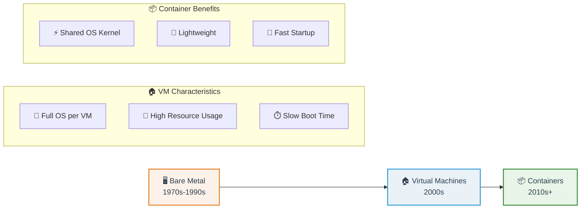

---

### 🆚 Container vs Virtual Machine Comparison

| Aspect | 🏠 Virtual Machines | 📦 Containers |
|--------|-------------------|---------------|
| 🔧 **Architecture** | Full OS + Hypervisor | Shared OS kernel |
| 💾 **Resource Usage** | High (GB per VM) | Low (MB per container) |
| ⏱️ **Startup Time** | Minutes | Seconds |
| 🔒 **Isolation** | Hardware-level | Process-level |
| 📦 **Portability** | Limited | Excellent |
| 🛡️ **Security** | Stronger isolation | Weaker isolation |
| 💰 **Cost** | Higher | Lower |

### 🛠️ Container Runtime Ecosystem

* 🐳 **Docker** = most popular, full container platform (daemon + CLI + registry)
* 🏗️ **containerd** = industry-standard container runtime (Docker's core engine)
* 🔧 **CRI-O** = Kubernetes-focused, OCI (Open Container Initiative) compliant
* 🔒 **Podman** = daemonless, rootless containers by Red Hat
* ⚡ **runc** = low-level container runtime (spawns/runs containers)
* 📊 **Market share**: Docker 83%, containerd 17% (Datadog Container Report 2024)

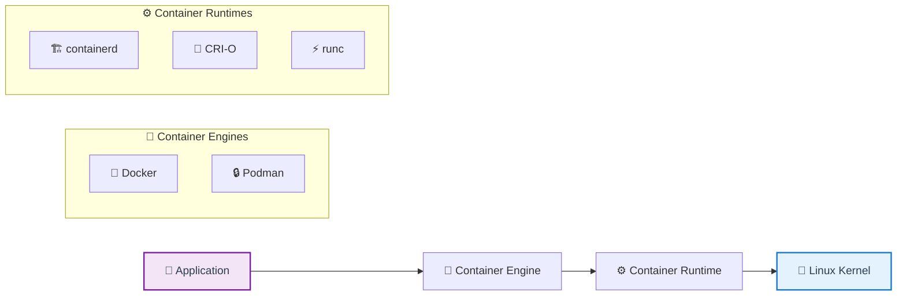

<details>
<summary>💭 <strong>Interactive Question:</strong> Why would you choose Podman over Docker?</summary>

**Podman advantages:**
* 🔒 **Daemonless** → no privileged daemon running
* 👤 **Rootless** → runs containers without root privileges
* 🔐 **More secure** → smaller attack surface
* 📦 **OCI compliant** → better standards compliance
* 🏢 **Enterprise focus** → Red Hat/IBM enterprise support

**Docker advantages:**
* 🌍 **Ecosystem** → larger community, more tutorials
* 🛠️ **Docker Compose** → easier multi-container apps
* 📚 **Documentation** → more learning resources
* 🔄 **Docker Hub** → largest container registry

**Bottom line:** Podman for security-conscious enterprises, Docker for development ease
</details>

---

## 📍 Slide 2 – 🏗️ Docker Architecture & Security Model

* 🏗️ **Docker Architecture Components:**
  * 🖥️ **Docker Daemon (dockerd)** = background service managing containers
  * 💻 **Docker CLI** = command-line interface for user interactions
  * 🌐 **Docker API** = RESTful API for programmatic control
  * 📦 **Docker Registry** = stores and distributes container images
* 🔒 **Container Isolation Mechanisms:**
  * 🏠 **Namespaces** = isolate process views (PID, network, filesystem, user)
  * ⚖️ **Control Groups (cgroups)** = limit resource usage (CPU, memory, I/O)
  * 🛡️ **Seccomp** = restricts system calls available to processes
  * 🔐 **AppArmor/SELinux** = mandatory access control policies
* ⚠️ **Critical security concern**: Docker daemon runs as root → potential privilege escalation
* 📊 **Default Docker setup** = containers can access host resources if misconfigured

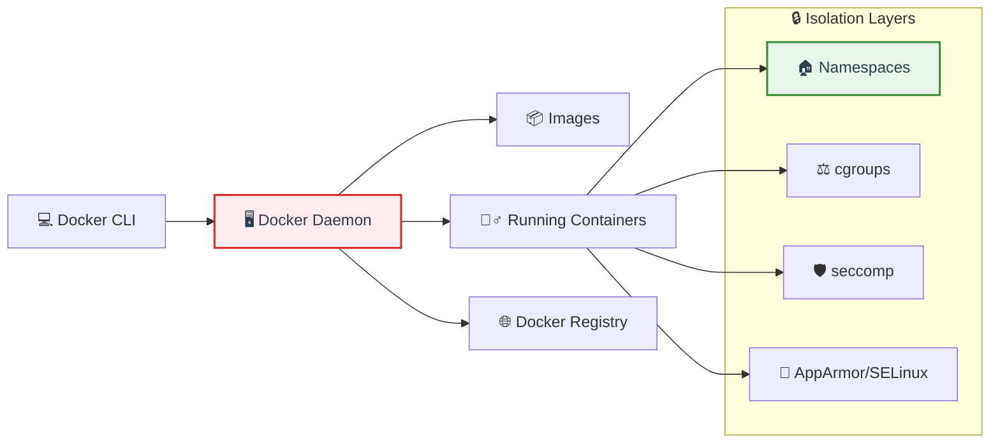

---

### 🔓 Container Security Risks & Attack Vectors

* 🚪 **Container Escape** = breaking out of container to access host system
  * 🔑 Common causes: privileged containers, mounted host directories, kernel vulnerabilities
  * 📊 **CVE-2019-5736** (runc escape) affected millions of containers worldwide
* ⚠️ **Docker Daemon Vulnerabilities:**
  * 🌐 Exposed Docker API (port 2375/2376) → remote code execution
  * 🔓 Insecure Docker socket access (`/var/run/docker.sock`)
  * 👑 Docker daemon runs as root → full host compromise possible
* 📦 **Image-Based Attacks:**
  * 🐛 Vulnerable base images with known CVEs
  * 🔑 Secrets embedded in image layers
  * 🦠 Malicious images from untrusted registries
* 🌐 **Network Security Issues:**
  * 📡 Default bridge network → containers can communicate freely
  * 🔓 Exposed container ports → unintended external access

<details>
<summary>💭 <strong>Security Challenge:</strong> What makes the first command dangerous?</summary>

**Multiple dangerous flags:**

1. **`--privileged`** 🔓
   - Disables all security restrictions
   - Gives container full access to host devices
   - Can modify kernel parameters

2. **`-v /:/host`** 📁
   - Mounts entire host filesystem
   - Container can read/write ANY host file
   - Includes `/etc/passwd`, `/etc/shadow`, etc.

3. **Running as root (default)** 👑
   - Container processes run with root privileges
   - No user namespace isolation

**Result:** Complete host compromise in one command!

**Real-world impact:** This exact pattern caused the 2018 Tesla Kubernetes compromise.
</details>

---

## 📍 Slide 3 – 📦 Container Images & Layered Filesystem

* 📦 **Container Image** = read-only template containing application code + runtime + libraries + dependencies
* 🧅 **Layered Architecture:**
  * 🏗️ **Base layer** = operating system foundation (e.g., ubuntu:20.04)
  * 📚 **Library layers** = runtime dependencies, frameworks
  * 📱 **Application layer** = your code and configurations
  * 🔝 **Writable layer** = created when container runs (ephemeral)
* 🏭 **Image Registries:**
  * 🌍 **Docker Hub** = public registry (10B+ image pulls monthly)
  * ☁️ **Amazon ECR** = AWS-managed private registry
  * ☁️ **Google GCR** = Google Cloud container registry  
  * 🏢 **Harbor** = open-source enterprise registry with security scanning
* 🔐 **Docker Content Trust (DCT)** = image signing and verification using Notary
* 📊 **Security stats**: 51% of container images contain high-severity vulnerabilities (Snyk Container Security Report 2024)

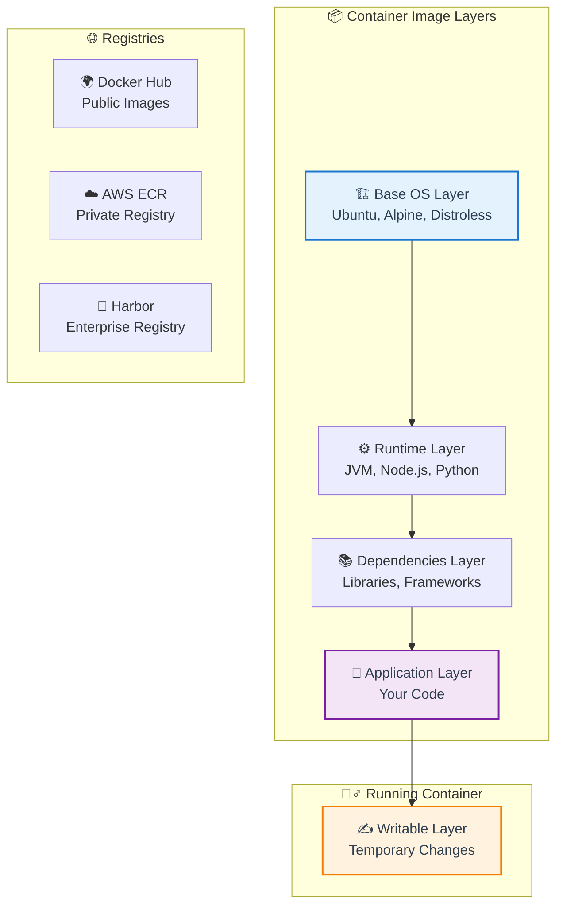

---

### 🔒 Image Security Best Practices

* 🏔️ **Use Minimal Base Images:**
  * 🐧 **Alpine Linux** = 5MB base image vs Ubuntu's 64MB
  * 🛡️ **Distroless** = no shell, package manager → smaller attack surface
  * 📦 **Scratch** = empty base image for static binaries
* 🚫 **Avoid Root User:**
  ```dockerfile
  # ❌ BAD: Running as root (default)
  FROM ubuntu:20.04
  COPY app /app
  CMD ["/app"]
  
  # ✅ GOOD: Create and use non-root user
  FROM ubuntu:20.04
  RUN groupadd -r appuser && useradd -r -g appuser appuser
  COPY app /app
  RUN chown -R appuser:appuser /app
  USER appuser
  CMD ["/app"]
  ```
* 🔐 **Multi-stage Builds** = separate build and runtime environments

### 📊 Base Image Comparison

| Base Image | Size | Packages | Use Case | Security |
|------------|------|----------|----------|----------|
| 🐧 **ubuntu:20.04** | 64MB | ~100 | Development | ⚠️ Medium |
| 🏔️ **alpine:latest** | 5MB | ~15 | Production | ✅ Good |
| 🛡️ **distroless** | 2-20MB | 0-5 | Production | 🏆 Excellent |
| 📦 **scratch** | 0MB | 0 | Static binaries | 🏆 Maximum |

<details>
<summary>💭 <strong>Quick Poll:</strong> Which base image would you choose for a Python web app?</summary>

**Options:**
1. 🐧 `python:3.11` (900MB)
2. 🏔️ `python:3.11-alpine` (50MB)  
3. 🛡️ `python:3.11-slim` (120MB)
4. 📦 Custom distroless + Python

**Best practices:**
- **Development:** python:3.11 (easier debugging)
- **Production:** python:3.11-alpine or distroless (security + size)
- **High security:** Custom distroless build
- **CI/CD:** python:3.11-slim (balance of features + size)

**Pro tip:** Start with slim, move to alpine/distroless as you mature your security practices!
</details>

---

## 📍 Slide 4 – 🔍 Container Image Security Scanning

* 🔍 **Vulnerability Scanning** = automated analysis of container images for known security vulnerabilities
* 🎯 **What scanners detect:**
  * 🐛 **OS package vulnerabilities** = CVEs in base image packages (apt, yum packages)
  * 📚 **Application dependencies** = vulnerable libraries (npm, pip, maven packages)  
  * 🔑 **Embedded secrets** = API keys, passwords, certificates in image layers
  * ⚙️ **Misconfigurations** = running as root, exposed ports, insecure defaults
* 🛠️ **Popular Scanning Tools:**
  * ⚡ **Trivy** = comprehensive, fast, supports multiple languages
  * 🦅 **Grype** = by Anchore, excellent vulnerability database
  * 🐍 **Snyk** = commercial, great developer experience
  * 🔍 **Clair** = open-source, API-first, used by Red Hat Quay
* 📊 **Scanning integration**: 78% of organizations scan images in CI/CD pipelines (CNCF Survey 2024)

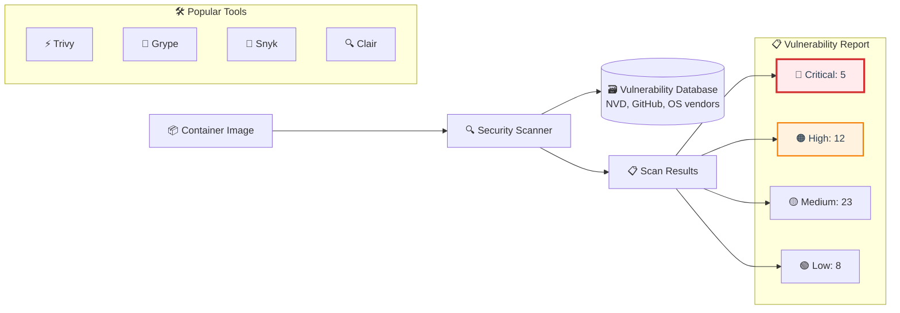

---

### 🔧 Scanner Comparison Matrix

| Tool | 💰 Cost | ⚡ Speed | 📊 Accuracy | 🌍 Languages | 🏢 Enterprise |
|------|---------|----------|-------------|--------------|--------------|
| ⚡ **Trivy** | Free | Fast | High | 20+ | Good |
| 🦅 **Grype** | Free | Fast | High | 15+ | Good |
| 🐍 **Snyk** | Freemium | Fast | Very High | 25+ | Excellent |
| 🔍 **Clair** | Free | Medium | High | 10+ | Good |
| 📊 **JFrog Xray** | Paid | Fast | Very High | 20+ | Excellent |

### 📈 Vulnerability Severity Levels (CVSS)

| Score | Severity | 🎯 Action Required | ⏰ Timeline |
|-------|----------|-------------------|------------|
| **9.0-10.0** | 🔴 **Critical** | Immediate fix | < 24 hours |
| **7.0-8.9** | 🟠 **High** | Priority fix | < 7 days |
| **4.0-6.9** | 🟡 **Medium** | Plan fix | < 30 days |
| **0.1-3.9** | 🟢 **Low** | Consider fix | Next release |

<details>
<summary>💭 <strong>Real-World Scenario:</strong> Your scan shows 50 vulnerabilities. What do you do?</summary>

**Step-by-step vulnerability triage:**

1. **🔴 Address Critical/High first**
   - Focus on actively exploitable vulnerabilities
   - Check if patches are available
   - Prioritize by EPSS (Exploit Prediction Scoring System)

2. **📊 Analyze false positives**
   - Some vulnerabilities may not apply to your use case
   - Use scanner suppression files for confirmed false positives
   - Document reasoning for suppression

3. **🔄 Update strategy**
   ```bash
   # Update base image
   FROM python:3.11-slim-bullseye  # Instead of outdated version
   
   # Update packages  
   RUN apt-get update && apt-get upgrade -y && \
       apt-get clean && rm -rf /var/lib/apt/lists/*
   ```

4. **📈 Set policies**
   - No Critical vulnerabilities in production
   - High vulnerabilities fixed within 7 days
   - Regular scanning schedule (weekly/monthly)

**Pro tip:** Not all vulnerabilities are equal! A SQL injection in a web service vs a command injection in a CLI tool have different risk levels.
</details>

---

## 🎉 Fun Break: "Container Horror Stories & Memes"

### 😱 **"The 2018 Tesla Cryptocurrency Mining Incident"**

**What happened:**
* 🚗 Tesla left Kubernetes dashboard **publicly accessible** without authentication
* 😈 Cryptominers discovered it and deployed mining containers
* ⛏️ Mined Monero cryptocurrency using Tesla's cloud resources  
* 💸 Generated **thousands of dollars** in cloud bills
* 🔍 Tesla discovered it when AWS sent an unusually high bill

**The meme-worthy part:**
* 🤖 Tesla, a company building **AI-powered cars**, got pwned by basic container misconfig
* 📰 Headlines: *"Tesla's AI cars are secure, but their containers aren't"*
* 💬 Security community: *"They can make cars drive themselves but can't secure a dashboard"*

### 🐳 **Classic Container Memes:**

**"Docker vs VM Resource Usage"**
```
VM: I need 4GB RAM to run Hello World
Container: Hold my beer... 4MB is enough
```

**"Container Debugging"**
```
Developer: "It works on my machine"
DevOps: "It works in containers"  
Security: "Your container is pwned"
```

**"Container Escape Reality"**
```
Junior Dev: "Containers are totally isolated!"
Security Engineer: "docker run --privileged has entered the chat"
```

### 🎭 **Interactive Meme Creation Time!**

**Fill in the blanks:**
```
Before containers: "It works on my _____"
After containers: "It fails in _____"
After security scanning: "It has _____ critical vulnerabilities"
After hardening: "It _____ but it's secure!"
```

**Answers from the community:**
- machine / production / 47 / runs slower 😂
- laptop / staging / 1000 / doesn't run 💀
- computer / k8s / zero / works perfectly 🏆

---

🔗 **Container Security Resources for Group 1:**
* [Docker Security Best Practices](https://docs.docker.com/develop/security-best-practices/)
* [Container Security by Liz Rice (Free eBook)](https://info.aquasec.com/container-security-book)
* [NIST Container Security Guide](https://www.nist.gov/publications/application-container-security-guide)
* [CIS Docker Benchmark](https://www.cisecurity.org/benchmark/docker)
* [Trivy Documentation](https://aquasecurity.github.io/trivy/)
* [OWASP Container Security Top 10](https://github.com/OWASP/www-project-container-top-10)

## 📂 Group 2: Container Runtime Security

## 📍 Slide 5 – 🛡️ Container Runtime Security

* 🛡️ **Runtime Security** = monitoring containers while they're running, not just during build
* 🚨 **Runtime Threats:**
  * 🐚 **Malicious process execution** (reverse shells, crypto miners)
  * 📁 **Unauthorized file access** (reading `/etc/passwd`, config files)
  * 🌐 **Suspicious network activity** (C2 communication, data exfiltration)
  * 🔓 **Privilege escalation** attempts
* 🔍 **Detection Tools:**
  * 🦅 **Falco** = CNCF project, runtime security monitoring
  * 📊 **Sysdig** = commercial platform with Falco underneath
  * ⚡ **Aqua Security** = comprehensive runtime protection
* 📊 **Stats**: 68% of organizations experienced runtime security incidents (Stackrox Report 2024)

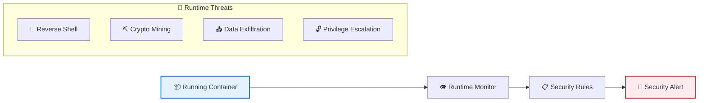

<details>
<summary>💭 <strong>Quick Question:</strong> How would you detect cryptocurrency mining?</summary>

**Common indicators:**
* 📊 High CPU usage (>80% sustained)
* 🔍 Process names: `xmrig`, `ethminer`, `cpuminer`
* 🌐 Network connections to mining pools
* 📁 Files: `/tmp/.X11-unix/`, hidden directories

**Falco rule example:**
```yaml
- rule: Detect Crypto Mining
  condition: spawned_process and (proc.name contains "miner" or proc.name contains "xmrig")
  output: Crypto mining detected (process=%proc.name)
  priority: CRITICAL
```
</details>

---

## 📍 Slide 6 – 🔐 Secrets Management in Containers

* 🔑 **Container Secrets Problem:**
  * ❌ **In Dockerfile** = visible to anyone with image access
  * ❌ **Environment variables** = visible in process list (`docker inspect`)
  * ❌ **Config files** = persisted in image layers forever
* ✅ **Secure Solutions:**
  * 🐳 **Docker Secrets** = encrypted at rest, in-memory only in container
  * ☸️ **Kubernetes Secrets** = base64 encoded, etcd encryption
  * 🏦 **External Vaults** = HashiCorp Vault, AWS Secrets Manager
  * 🔌 **CSI Drivers** = mount secrets as files from external systems

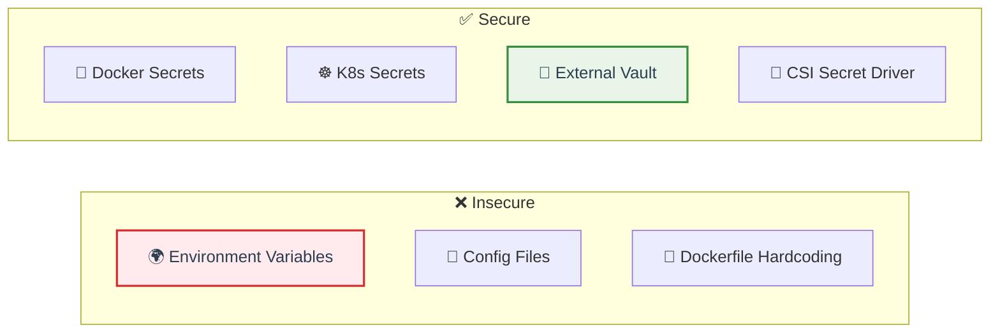

### 🔄 Secret Rotation Best Practices

* ⏰ **Automatic rotation** every 30-90 days
* 🔄 **Zero-downtime rotation** using external secret operators
* 📊 **Audit secret access** and usage patterns
* 🚫 **Revoke compromised secrets** immediately

---

## 📍 Slide 7 – 📋 Container Compliance & Hardening

* 📋 **CIS Docker Benchmark** = 100+ security recommendations for Docker
* 🔒 **Container Hardening Checklist:**
  * 👤 Run as non-root user (`USER 1001`)
  * 📖 Read-only filesystem (`--read-only`)
  * 🚫 Drop capabilities (`--cap-drop=ALL`)
  * 🏠 Use specific user namespaces
  * 📦 Scan images before deployment
* 🛠️ **Compliance Tools:**
  * ⚖️ **Docker Bench** = CIS benchmark automated checker
  * ☸️ **kube-bench** = CIS Kubernetes benchmark scanner
  * 📊 **Falco** = runtime compliance monitoring

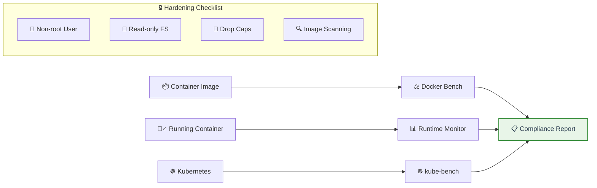

### 🛡️ Hardened Container Example

```dockerfile
# ✅ SECURE DOCKERFILE
FROM alpine:3.18

# Create non-root user
RUN addgroup -g 1001 appgroup && \
    adduser -u 1001 -G appgroup -s /bin/sh -D appuser

# Install only required packages
RUN apk add --no-cache python3 py3-pip && \
    rm -rf /var/cache/apk/*

# Copy application
COPY --chown=appuser:appgroup app.py /app/
COPY --chown=appuser:appgroup requirements.txt /app/

# Switch to non-root
USER appuser
WORKDIR /app

# Install dependencies
RUN pip install --no-cache-dir -r requirements.txt

# Health check
HEALTHCHECK --interval=30s --timeout=3s \
  CMD python3 -c "import urllib.request; urllib.request.urlopen('http://localhost:8000/health')"

EXPOSE 8000
CMD ["python3", "app.py"]
```

### 🚀 Running Hardened Containers

```bash
# ✅ SECURE RUNTIME FLAGS
docker run \
  --read-only \                    # Read-only filesystem
  --tmpfs /tmp \                   # Writable temp directory  
  --user 1001:1001 \              # Non-root user
  --cap-drop=ALL \                 # Drop all capabilities
  --cap-add=NET_BIND_SERVICE \     # Only add required caps
  --security-opt=no-new-privileges \  # Prevent privilege escalation
  --memory=512m \                  # Memory limit
  --cpus=0.5 \                     # CPU limit
  myapp:latest
```

### 📊 Compliance Scanning

```bash
# Docker Bench Security
git clone https://github.com/docker/docker-bench-security.git
cd docker-bench-security
sudo sh docker-bench-security.sh

# Output example:
# [WARN] 4.5 - Ensure Content trust for Docker is Enabled
# [PASS] 4.6 - Ensure HEALTHCHECK is enabled  
# [FAIL] 5.1 - Ensure AppArmor Profile is Enabled
```

<details>
<summary>💭 <strong>Challenge:</strong> Your container needs to write logs. How do you handle read-only filesystem?</summary>

**Solutions:**

1. **tmpfs mount** (in-memory):
```bash
docker run --read-only --tmpfs /var/log myapp:latest
```

2. **Volume mount**:
```bash
docker run --read-only -v /host/logs:/var/log myapp:latest
```

3. **Log to stdout/stderr**:
```python
# Instead of writing files, log to stdout
import logging
logging.basicConfig(stream=sys.stdout, level=logging.INFO)
```

4. **External logging** (best):
```bash
# Use logging driver
docker run --log-driver=fluentd myapp:latest
```

**Pro tip:** Cloud-native apps should log to stdout and let the orchestrator handle log collection!
</details>

---

## 🎉 Fun Break: "Container Security Fails"

### 😅 **"The Bitcoin Mining Dockerfile"**

```dockerfile
# Real Dockerfile found on Docker Hub (anonymized)
FROM ubuntu:16.04
RUN apt-get update && apt-get install -y wget
RUN wget https://github.com/xmrig/xmrig/releases/download/v6.18.0/xmrig-6.18.0-linux-static-x64.tar.gz
RUN tar -xf xmrig*.tar.gz
RUN chmod +x xmrig-6.18.0/xmrig
CMD ["./xmrig-6.18.0/xmrig", "--donate-level=1"]
```

**Community reactions:**
* 😂 "Finally, a Dockerfile that mines its own hosting costs"
* 🤦‍♂️ "Running this in production would be interesting"
* 🔒 "Security team's nightmare in 8 lines"

### 🎭 **Security Meme Generator:**

```
When junior dev runs:
docker run --privileged -v /:/host ubuntu

Senior dev: "Congratulations, you just _____ the host"
Security team: "Time to _____ everything"  
Manager: "How much will this cost to _____?"

Popular answers:
- pwned / reinstall / fix ($50k)
- nuked / rebuild / explain (my job)
- rooted / audit / cover up (priceless)
```

---

🔗 **Runtime Security Resources:**
* [Falco Rules](https://github.com/falcosecurity/rules)
* [Docker Secrets Guide](https://docs.docker.com/engine/swarm/secrets/)
* [CIS Docker Benchmark](https://www.cisecurity.org/benchmark/docker)
* [Container Security Checklist](https://github.com/krol3/container-security-checklist)
## 📂 Group 3: Kubernetes Fundamentals & Architecture

## 📍 Slide 8 – ☸️ Kubernetes Architecture & Components

* ☸️ **Kubernetes** = container orchestration platform managing 1000s of containers across multiple nodes
* 🏗️ **Control Plane Components:**
  * 🌐 **API Server** = all communication goes through here (kubectl, pods, everything)
  * 🧠 **etcd** = distributed key-value store (cluster state, secrets, configs)
  * 📅 **Scheduler** = decides which node runs each pod
  * 🎛️ **Controller Manager** = maintains desired state (replication, endpoints, etc.)
* 👷 **Worker Node Components:**
  * 🤖 **kubelet** = node agent, manages pods and containers
  * 🌐 **kube-proxy** = network proxy, handles service routing
  * 🏃‍♂️ **Container Runtime** = Docker, containerd, or CRI-O
* 📊 **Scale**: Google runs 2B+ containers/week on Kubernetes (2024)

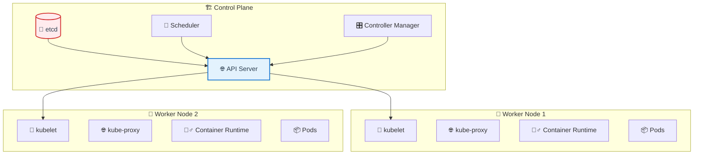

### 🔒 Security Boundaries & Trust Zones

| Component | Trust Level | Attack Surface | Impact if Compromised |
|-----------|-------------|----------------|----------------------|
| 🌐 **API Server** | 🔴 Critical | High | Complete cluster control |
| 🧠 **etcd** | 🔴 Critical | Medium | All secrets exposed |
| 🤖 **kubelet** | 🟠 High | Medium | Node compromise |
| 📦 **Pod** | 🟢 Low | High | Container breakout |

### 🌐 Kubernetes Networking Model

* 📡 **Every pod gets its own IP** (no NAT between pods)
* 🔗 **Pods can communicate** with all other pods by default
* 🚪 **Services provide stable endpoints** for dynamic pods
* 🛡️ **Network Policies** = firewall rules for pod-to-pod communication

<details>
<summary>💭 <strong>Security Question:</strong> What happens if etcd gets compromised?</summary>

**Complete disaster! 💥**

**What's in etcd:**
* 🔑 All Kubernetes secrets (base64 encoded, not encrypted by default)
* 🎫 Service account tokens
* ⚙️ ConfigMaps with sensitive data
* 🔐 TLS certificates
* 🏗️ All cluster configuration

**Attack scenarios:**
* 📤 Extract all secrets and tokens
* 🎭 Impersonate any service account
* 🔧 Modify cluster configuration
* 💣 Deploy malicious workloads

**Protection:**
* 🔐 Enable etcd encryption at rest
* 🔒 Restrict etcd network access
* 🛡️ Use strong authentication
* 📊 Monitor etcd access logs
</details>

---

## 📍 Slide 9 – 🔑 Kubernetes Authentication & Authorization

* 🔑 **Authentication** = Who are you?
  * 📜 **X.509 Certificates** = most common, used by kubectl
  * 🎫 **Service Account Tokens** = for pods to access API
  * 🌐 **OIDC/OAuth** = integration with external identity providers
  * 🔐 **Static tokens** = deprecated, avoid in production
* 🛡️ **Authorization** = What can you do? (RBAC = Role-Based Access Control)
  * 👤 **Users** = humans with certificates
  * 🤖 **Service Accounts** = pods/applications  
  * 👥 **Groups** = collection of users
  * 🎭 **Roles** = set of permissions (verbs + resources)
* 📊 **Default behavior**: Service accounts have minimal permissions (good!)

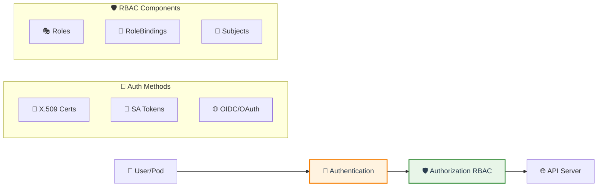

<details>
<summary>💭 <strong>RBAC Challenge:</strong> How do you give a pod access to create other pods?</summary>

**Careful! This is dangerous! 🚨**

```yaml
# ⚠️ HIGH RISK ROLE
apiVersion: rbac.authorization.k8s.io/v1
kind: Role
rules:
- apiGroups: [""]
  resources: ["pods"]
  verbs: ["create", "get", "list"]

# Better: Use Jobs or Deployments
apiVersion: rbac.authorization.k8s.io/v1
kind: Role  
rules:
- apiGroups: ["batch"]
  resources: ["jobs"]
  verbs: ["create"]
```

**Why dangerous:**
* 📦 Can create privileged pods
* 🔓 Can mount service account tokens
* 🌐 Can access host network
* 💣 Essentially cluster-admin via pod creation

**Better alternatives:**
* 🎯 Use specific controllers (Jobs, CronJobs)
* 🔒 Admission controllers to prevent privilege escalation
* 🛡️ Pod Security Standards
</details>

---

## 📍 Slide 10 – 🚪 Kubernetes Admission Control & Policies

* 🚪 **Admission Controllers** = gatekeepers that intercept requests before persistence
* 🔄 **Two Types:**
  * 🔧 **Mutating** = modify requests (add labels, inject sidecars)
  * ✅ **Validating** = approve/reject requests (policy enforcement)
* 🛡️ **Pod Security Standards** (replaces deprecated Pod Security Policies):
  * 🔓 **Privileged** = unrestricted (development only)
  * ⚡ **Baseline** = minimally restrictive (default production)
  * 🔒 **Restricted** = heavily restricted (high security)
* 🎯 **Open Policy Agent (OPA) Gatekeeper** = policy-as-code for Kubernetes

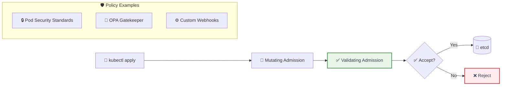

### 🛠️ Common Admission Controller Use Cases

| Use Case | Tool | Example |
|----------|------|---------|
| 🔒 **Security Policies** | Pod Security Standards | Block privileged containers |
| 🏷️ **Resource Quotas** | ResourceQuota controller | Limit CPU/memory per namespace |
| 🎯 **Policy Enforcement** | OPA Gatekeeper | Require specific labels |
| 🔐 **Secret Injection** | Custom webhook | Inject certificates from Vault |
| 📊 **Monitoring** | Mutating webhook | Add monitoring sidecars |

<details>
<summary>💭 <strong>Policy Question:</strong> Should you block or warn for policy violations?</summary>

**Three enforcement modes:**

1. **🚫 Enforce (Block)**
   - Rejects violating resources
   - Prevents deployment
   - Use for critical security policies

2. **⚠️ Warn**
   - Shows warning but allows deployment
   - Good for gradual policy rollout
   - Doesn't break existing workflows

3. **📊 Audit (Log only)**
   - Records violations for analysis
   - No user impact
   - Great for understanding current state

**Best practice strategy:**
```yaml
# Start with audit, then warn, then enforce
pod-security.kubernetes.io/audit: restricted     # Log violations
pod-security.kubernetes.io/warn: restricted      # Show warnings  
pod-security.kubernetes.io/enforce: baseline     # Block only worst violations
```

**Gradual rollout timeline:**
- Week 1-2: Audit mode (gather data)
- Week 3-4: Warn mode (educate teams)
- Week 5+: Enforce mode (block violations)
</details>

---

## 🎉 Fun Break: "Kubernetes RBAC Horror Stories"

### 😱 **"The cluster-admin Intern"**

**What happened:**
```bash
# Intern's first day task: "Fix the broken deployment"
kubectl create clusterrolebinding fix-it \
  --clusterrole=cluster-admin \
  --serviceaccount=default:my-app

# Translation: "Give my app GOD MODE to the entire cluster"
```

**The aftermath:**
* 🤖 App gained ability to delete entire cluster
* 💥 One typo away from production disaster
* 🔍 Security audit found 47 service accounts with cluster-admin
* 📚 Emergency RBAC training for all developers

---

🔗 **Kubernetes Security Resources:**
* [Kubernetes Security Best Practices](https://kubernetes.io/docs/concepts/security/)
* [RBAC Documentation](https://kubernetes.io/docs/reference/access-authn-authz/rbac/)
* [Pod Security Standards](https://kubernetes.io/docs/concepts/security/pod-security-standards/)
* [OPA Gatekeeper](https://open-policy-agent.github.io/gatekeeper/)

## 📂 Group 4: Kubernetes Security Features

## 📍 Slide 11 – 🛡️ Pod Security & Isolation

* 🛡️ **Security Contexts** = pod/container-level security settings
* 🔧 **Key Security Controls:**
  * 👤 **runAsUser/runAsGroup** = avoid root (UID 0)
  * 🚫 **allowPrivilegeEscalation: false** = block setuid binaries
  * 📖 **readOnlyRootFilesystem: true** = immutable container filesystem
  * 💪 **capabilities** = fine-grained Linux permissions (drop ALL, add specific)
* 🌐 **Network Policies** = firewall rules for pod-to-pod communication
* 📊 **Resource Limits** = prevent DoS attacks (CPU/memory bombs)
* 🔒 **Pod Security Standards** = enforce security baselines across namespaces

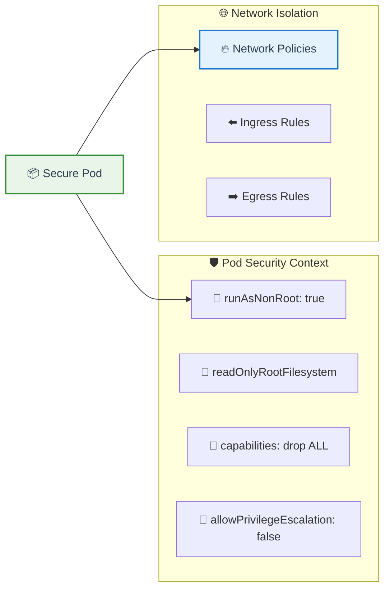

<details>
<summary>💭 <strong>Quick Challenge:</strong> Why does readOnlyRootFilesystem break many apps?</summary>

**Common issues:**
* 📝 Apps writing logs to `/var/log/`
* 📦 Package managers creating `/tmp/` files
* 🔧 Apps modifying config files at runtime
* 🏠 Home directory writes (`~/.cache`, `~/.config`)

**Solutions:**
```yaml
# Mount writable volumes for specific paths
volumeMounts:
- name: tmp
  mountPath: /tmp
- name: logs  
  mountPath: /var/log
- name: cache
  mountPath: /home/app/.cache

volumes:
- name: tmp
  emptyDir: {}
- name: logs
  emptyDir: {}  
- name: cache
  emptyDir: {}
```

**Pro tip:** Test with `readOnlyRootFilesystem: true` in dev first!
</details>

---

## 📍 Slide 12 – 🔒 Kubernetes Secrets & ConfigMaps

* 🔒 **Kubernetes Secrets** = base64 encoded, stored in etcd (⚠️ NOT encrypted by default!)
* 📋 **ConfigMaps** = non-sensitive configuration data
* 🚨 **Secret Security Issues:**
  * 📤 Visible in `kubectl describe pod` output
  * 💾 Stored in etcd unencrypted (unless configured)
  * 👁️ Accessible to anyone with pod read permissions
  * 📜 Logged in various places if not careful
* ✅ **Better Alternatives:**
  * 🏦 **External Secret Operators** (ESO) = sync from Vault/AWS/Azure
  * 🔌 **CSI Secret Store Driver** = mount secrets as files
  * 🔐 **Sealed Secrets** = encrypted secrets safe for Git

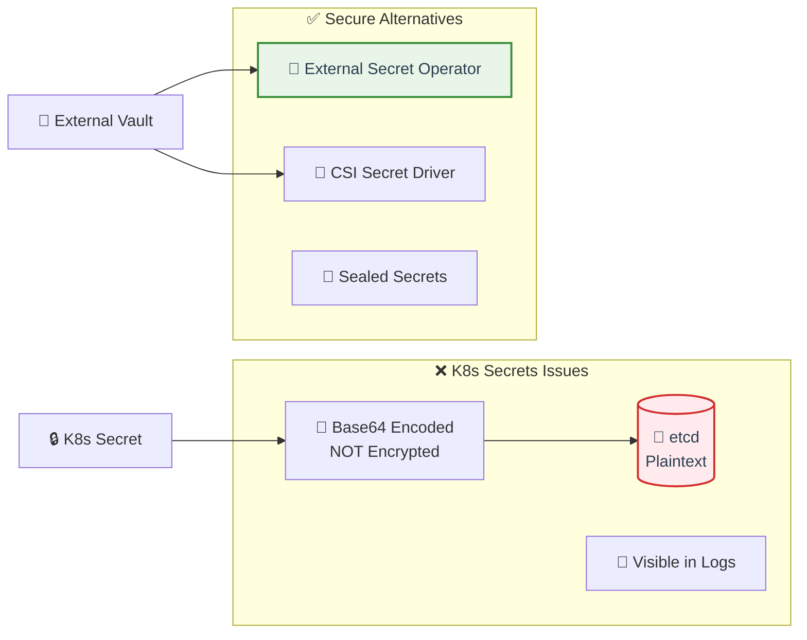

### 🔐 Secret Management Comparison

| Method | Security | Complexity | Git-Safe | Rotation |
|--------|----------|------------|----------|----------|
| 🔒 **K8s Secrets** | ⚠️ Low | Low | ❌ No | Manual |
| 🏦 **External Secret Operator** | ✅ High | Medium | ✅ Yes | Automatic |
| 🔌 **CSI Driver** | ✅ High | Medium | ✅ Yes | Automatic |
| 🔐 **Sealed Secrets** | ✅ Medium | Low | ✅ Yes | Manual |

---

## 📍 Slide 13 – 📊 Kubernetes Auditing & Monitoring

* 📊 **Audit Logging** = records all API server requests (who did what when)
* 🎯 **Audit Levels:**
  * 📝 **Metadata** = request metadata only
  * 📋 **Request** = metadata + request body
  * 📤 **Response** = metadata + request + response bodies
* 🔍 **What to Monitor:**
  * 🚨 Failed authentication attempts
  * 🔑 Secret/ConfigMap access
  * 👑 Privileged pod creation
  * 🌐 Exec/portforward sessions
* 🛠️ **Monitoring Stack**: Prometheus + Grafana + Falco + ELK

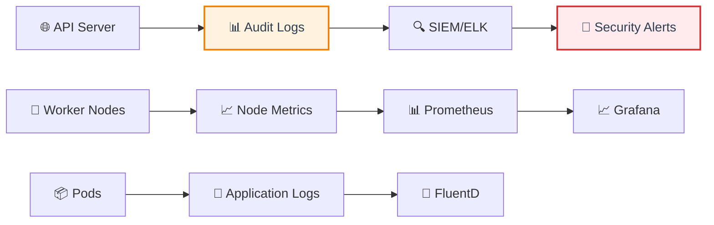

### 📊 Security Metrics Dashboard

| Metric | Normal | Suspicious |
|--------|--------|------------|
| 🔑 **Secret Access/hour** | < 50 | > 200 |
| 🐚 **Exec Sessions/day** | < 10 | > 50 |
| 👑 **Privileged Pods** | 0-2 | > 5 |
| ❌ **Failed Auth/hour** | < 5 | > 20 |
| 📦 **Pod Creation Spikes** | Steady | 10x increase |

<details>
<summary>💭 <strong>Monitoring Question:</strong> How do you detect a cryptocurrency mining attack?</summary>

**Kubernetes-specific:**
* 🚨 Unexpected pod creation in system namespaces
* 📈 Sudden resource quota exhaustion  
* 🔄 Pods restarting due to resource limits
* 🌐 Unknown container images from suspicious registries

**Response:**
1. 🛑 `kubectl delete pod <suspicious-pods>`
2. 🔍 Check audit logs for how pods were created
3. 🔒 Review RBAC permissions
4. 📊 Implement resource quotas and limits
</details>

---

## 🎉 Fun Break: "Kubernetes Secrets Exposed!"

### 🤦‍♂️ **"The Base64 Confusion"**

**Slack conversation:**
```
Junior Dev: "I encrypted our database password!"
Senior Dev: "Great! How?"
Junior Dev: "echo 'password123' | base64"
Senior Dev: "That's... not encryption 😅"
Junior Dev: "But it's unreadable!"
Senior Dev: "echo 'cGFzc3dvcmQxMjM=' | base64 -d"
Junior Dev: "... oh"
```

### 🔍 **"Secret Scanning Memes"**

```
Kubernetes Secrets be like:

Developer: "Our secrets are secure in base64!"
Security Scanner: "I can read that"
Developer: "But it's encoded!"  
Security Scanner: "Here's your plaintext password"
Developer: *surprised Pikachu face*
```

### 🎭 **Interactive K8s Quiz:**

```
What's wrong with this Secret usage?

apiVersion: v1
kind: Pod
spec:
  containers:
  - name: app
    env:
    - name: DB_PASS
      valueFrom:
        secretKeyRef:
          name: db-secret
          key: password
    - name: DEBUG  
      value: "true"  # Logs everything including env vars! 🤦‍♂️

Answer: Debug mode will log environment variables, exposing the secret!

Better: Use mounted secret files instead of env vars when possible.
```

### 💡 **Security Pro Tips:**

```
❌ Don't: kubectl create secret generic mysecret --from-literal=password=123
✅ Do: Use external secret management

❌ Don't: Store secrets in environment variables  
✅ Do: Mount secrets as files when possible

❌ Don't: Log request/response bodies in production
✅ Do: Use metadata-level audit logging for secrets
```

---

🔗 **Kubernetes Security Features Resources:**
* [Pod Security Standards](https://kubernetes.io/docs/concepts/security/pod-security-standards/)
* [Network Policies](https://kubernetes.io/docs/concepts/services-networking/network-policies/)
* [Kubernetes Secrets](https://kubernetes.io/docs/concepts/configuration/secret/)
* [External Secrets Operator](https://external-secrets.io/)
* [Kubernetes Auditing](https://kubernetes.io/docs/tasks/debug-application-cluster/audit/)

## 📂 Group 5: Kubernetes Security Tools & Practices

## 📍 Slide 14 – 🔍 Kubernetes Security Scanning

* 🔍 **Static Analysis Tools:**
  * 🎯 **kube-score** = YAML analysis, best practices scoring
  * 🏹 **kube-hunter** = penetration testing from attacker perspective  
  * ⭐ **Polaris** = configuration validation, security recommendations
  * 📊 **Checkov** = policy-as-code scanning for K8s manifests
* 🏃‍♂️ **Runtime Security:**
  * 🦅 **Falco** = runtime threat detection
  * 🔍 **Sysdig Secure** = comprehensive runtime protection
  * ⚡ **Aqua Security** = container runtime security platform
* 📊 **Compliance Scanning:**
  * ☸️ **kube-bench** = CIS Kubernetes benchmark automation
  * 📋 **Popeye** = cluster sanitizer, finds issues and recommendations

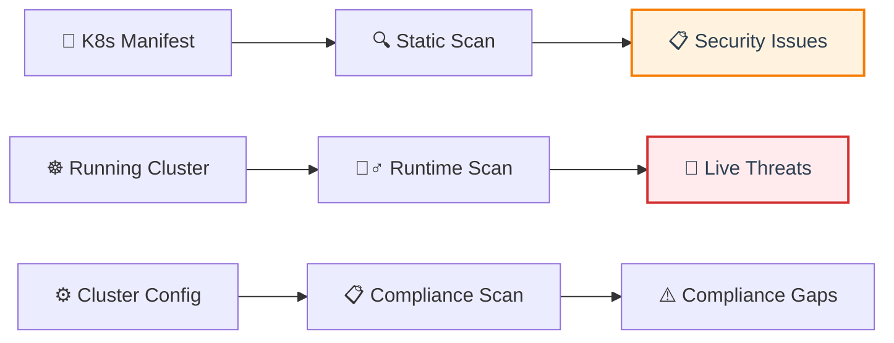

### 🛠️ Quick Tool Comparison

| Tool | Focus | Speed | Difficulty |
|------|-------|-------|------------|
| 🎯 **kube-score** | Best practices | ⚡ Fast | Easy |
| 🏹 **kube-hunter** | Penetration testing | 🐌 Slow | Medium |
| ⭐ **Polaris** | Config validation | ⚡ Fast | Easy |
| ☸️ **kube-bench** | CIS compliance | 🚀 Medium | Easy |

<details>
<summary>💭 <strong>Which tool first?</strong></summary>

**Recommended order:**
1. 🎯 **kube-score** → quick YAML validation  
2. ☸️ **kube-bench** → baseline security check
3. ⭐ **Polaris** → ongoing configuration monitoring
4. 🏹 **kube-hunter** → penetration testing (advanced)

**Start simple, add complexity gradually!**
</details>

---

## 📍 Slide 15 – 🌐 Kubernetes Network Security

* 🔥 **Network Policies** = firewall rules for pods (deny-by-default recommended)
* 🕸️ **CNI Security Features:**
  * 🐋 **Calico** = advanced network policies, encryption
  * 🐝 **Cilium** = eBPF-based security, L7 policies
  * 🌐 **Istio** = service mesh with mTLS, traffic policies
* 🔒 **Security Patterns:**
  * 🚫 **Default deny-all** → explicit allow only required traffic
  * 🏠 **Namespace isolation** → prevent cross-namespace communication  
  * 🔐 **mTLS everywhere** → encrypted pod-to-pod communication
  * 🛡️ **Ingress security** → WAF, rate limiting, SSL termination

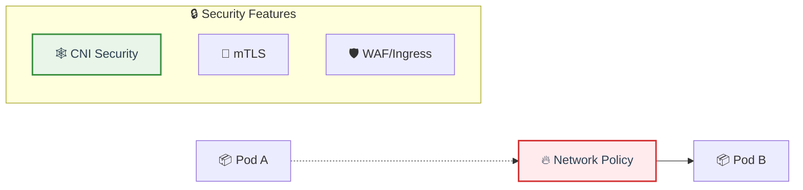

### 🌐 CNI Comparison

| CNI | Security Focus | Complexity | Performance |
|-----|----------------|------------|-------------|
| 🐋 **Calico** | Network policies | Medium | High |
| 🐝 **Cilium** | eBPF L7 security | High | Very High |  
| 🌐 **Istio** | Service mesh mTLS | Very High | Medium |

---

## 📍 Slide 16 – 🏗️ Secure Kubernetes CI/CD Pipelines

* 🚀 **GitOps Security:**
  * 📂 **ArgoCD** = declarative GitOps with RBAC
  * 🌊 **Flux** = GitOps toolkit with security controls
  * 🔒 **Sealed Secrets** = encrypted secrets in Git
* 🏗️ **Pipeline Security:**
  * 📦 **Image signing** (Cosign, Notary v2)
  * 🔍 **Policy enforcement** at deployment time
  * 🎯 **Supply chain attestation** (SLSA, in-toto)
* 🛡️ **Deployment Patterns:**
  * 🔵 **Blue-green** deployments for security updates
  * 🐥 **Canary** releases with security monitoring
  * 📊 **Progressive delivery** with automated rollback

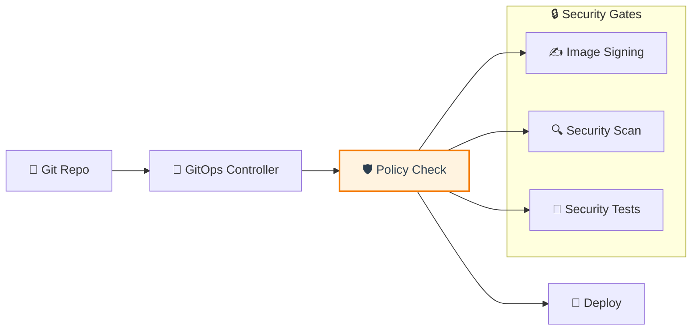

### 📊 Security Metrics

| Metric | Target | Alert |
|--------|--------|-------|
| 🔍 **Images scanned** | 100% | < 95% |
| ✍️ **Signed images** | 100% | < 100% |
| 🚨 **Critical CVEs** | 0 | > 0 |
| ⏱️ **Deployment time** | < 10min | > 15min |

---

## 🎉 Fun Break: "K8s Security Tool Chaos"

### 😅 **"The Tool Overload Syndrome"**

```
Security Engineer's Desktop:
- kube-score ✅
- kube-hunter ✅
- kube-bench ✅  
- Polaris ✅
- Falco ✅
- Trivy ✅
- Snyk ✅
- Checkov ✅

Developer: "Which one do I use?"
Security: "Yes."
```

### 🎭 **Network Policy Memes:**

```
NetworkPolicy be like:

Default: "Everyone can talk to everyone! 🎉"
Security team: "NOPE" *applies default-deny*
Developers: "Nothing works! 😭"
Security team: "Working as intended ✅"
```

### 🔧 **Tool Selection Reality:**

```
Manager: "We need ALL the security tools!"
Budget: "Pick one."
Security team: "kube-bench + Falco"
Manager: "But what about..."
Security team: "KISS principle wins again"
```

---

🔗 **K8s Security Tools Resources:**
* [kube-score](https://github.com/zegl/kube-score)
* [kube-hunter](https://github.com/aquasecurity/kube-hunter)  
* [Polaris](https://github.com/FairwindsOps/polaris)
* [Falco Rules](https://github.com/falcosecurity/rules)
* [Cilium Network Policies](https://docs.cilium.io/en/stable/security/policy/)

## 📂 Group 6: Advanced Topics & Case Studies

## 📍 Slide 17 – 🚨 Kubernetes Attack Scenarios & Defense

* 🎯 **Common Attack Vectors:**
  * 🔓 **Privileged container breakout** → host compromise
  * 🔑 **Service account token abuse** → lateral movement
  * 🌐 **Exposed API server** → cluster takeover
  * 📦 **Malicious images** → supply chain compromise
  * ☁️ **Cloud metadata access** → credential theft
* 🛡️ **MITRE ATT&CK for Containers:**
  * 🎯 **Initial Access** → exposed services, supply chain
  * 🔓 **Privilege Escalation** → privileged containers, hostPath mounts
  * 📡 **Lateral Movement** → service account tokens, network access

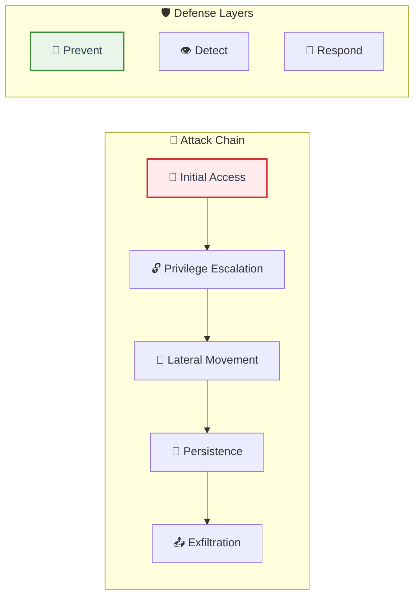

### 🛡️ Defense Matrix

| Attack Vector | Detection | Prevention |
|---------------|-----------|------------|
| 🔓 **Privileged pods** | Falco rules | Pod Security Standards |
| 🔑 **Token abuse** | Audit logs | RBAC least privilege |
| 🌐 **API exposure** | Network monitoring | Network policies |
| 📦 **Malicious images** | Image scanning | Admission controllers |

<details>
<summary>💭 <strong>Attack Scenario:</strong> How would you detect crypto mining?</summary>

**Detection signals:**
* 📊 High CPU usage (>90% sustained)
* 🌐 Connections to mining pools (port 4444, 3333)
* 🔍 Process names: `xmrig`, `ethminer`, `cpuminer`
* 📈 Unusual network traffic patterns

**Falco rule:**
```yaml
- rule: Cryptocurrency Mining
  condition: spawned_process and proc.name in (xmrig, cpuminer, ethminer)
  output: Crypto mining detected (proc=%proc.name)
  priority: CRITICAL
```
</details>

---

## 📍 Slide 18 – 🔮 Future Trends & Security Checklist

* 🔮 **Emerging Trends:**
  * 🤖 **AI-powered threat detection** → behavioral analysis, anomaly detection
  * 🛡️ **Zero-trust containers** → verify everything, trust nothing
  * 📋 **SBOM for containers** → software bill of materials tracking
  * 🔐 **Workload identity** → SPIFFE/SPIRE adoption
  * ☁️ **Confidential computing** → encrypted container workloads
* 🚀 **Next-Gen Security:**
  * 🦀 **WebAssembly (WASM)** → lightweight, secure container alternative
  * 🔗 **Supply chain attestation** → provenance verification
  * 📊 **Policy-as-code evolution** → Git-native security policies

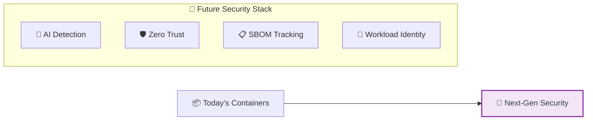

### 🛡️ Container Security Checklist

#### 📦 **Container Images**
- [ ] 🔍 Scan all images for vulnerabilities
- [ ] 🏔️ Use minimal base images (Alpine/Distroless)  
- [ ] 👤 Run as non-root user
- [ ] 🔐 Sign images with Cosign
- [ ] 📋 Generate SBOM for tracking

#### ☸️ **Kubernetes Security**  
- [ ] 🔑 Enable RBAC with least privilege
- [ ] 🛡️ Apply Pod Security Standards
- [ ] 🌐 Implement network policies (default-deny)
- [ ] 📊 Enable audit logging
- [ ] 🔐 Encrypt etcd at rest

#### 🏃‍♂️ **Runtime Security**
- [ ] 🦅 Deploy Falco for threat detection
- [ ] 📈 Monitor resource usage anomalies  
- [ ] 🚫 Block privileged containers
- [ ] 📖 Enable read-only filesystems
- [ ] 🔒 Use seccomp/AppArmor profiles

#### 🔄 **CI/CD Pipeline**
- [ ] 🔍 Scan images in pipeline
- [ ] 🚫 Fail builds on critical CVEs
- [ ] ✍️ Require signed commits/images
- [ ] 🛡️ Validate security policies
- [ ] 📊 Track security metrics

### 📊 Security Maturity Levels

| Level | Description | Focus |
|-------|-------------|-------|
| 🚀 **Level 1** | Basic security | Image scanning, RBAC |
| 🛡️ **Level 2** | Defense in depth | Network policies, admission control |
| 🏆 **Level 3** | Advanced security | Runtime protection, zero-trust |
| 🔮 **Level 4** | Future-ready | AI detection, confidential computing |

### 🎯 Key Takeaways

1. **🔍 Scan everything** → images, configs, runtime behavior
2. **🚫 Default deny** → network policies, RBAC, admission control  
3. **👤 Least privilege** → non-root users, minimal permissions
4. **📊 Monitor continuously** → logs, metrics, anomalies
5. **🔄 Automate security** → policy-as-code, CI/CD integration
6. **📚 Stay updated** → patches, CVEs, security practices
7. **🎯 Plan for incidents** → detection, response, recovery
8. **🛡️ Defense in depth** → multiple security layers

---

## 🎉 Fun Break: "Container Security Evolution"

### 😅 **"The Security Maturity Journey"**

```
2015: "Containers are secure by default!" 😇
2016: "Wait, they share the kernel..." 😰  
2017: "Maybe we need some scanning..." 🔍
2018: "Tesla got crypto-mined via K8s!" 😱
2019: "RBAC ALL THE THINGS!" 🔐
2020: "Supply chain is the new attack vector" 📦
2024: "AI will solve container security" 🤖
2025: "AI is the new attack vector" 🤖💀
```

### 🎭 **Security Reality Check:**

```
Security team: "We've implemented 47 security tools!"
Developer: "My pod won't start..."
Security team: "Working as intended!"
Manager: "Why is our security budget so high?"
Everyone: "..." 

The eternal struggle continues... 😄
```

### 💡 **Container Security Wisdom:**

```
❌ "Security is someone else's job"
✅ "Security is everyone's responsibility"

❌ "We'll add security later"  
✅ "Security is built-in from day one"

❌ "Scanning once is enough"
✅ "Continuous monitoring is essential"

❌ "Default configs are fine"
✅ "Harden everything by default"
```

---

🔗 **Advanced Security Resources:**
* [MITRE ATT&CK Containers](https://attack.mitre.org/matrices/enterprise/containers/)
* [Kubernetes Security Checklist](https://kubernetes.io/docs/concepts/security/security-checklist/)
* [CNCF Cloud Native Security Map](https://github.com/cncf/tag-security/blob/main/security-whitepaper/v2/CNCF_cloud-native-security-whitepaper-May2022-v2.pdf)
* [Container Security Best Practices](https://kubernetes.io/docs/concepts/security/)
* [Falco Community Rules](https://github.com/falcosecurity/rules)

---
