# 📋 Lecture 8 - Software Supply Chain Security: SBOM, Signing & Provenance

## 📂 Group 1: Supply Chain Foundations

## 📍 Slide 1 – 🔗 What is Software Supply Chain Security?

* 🔗 **Software Supply Chain** = everything from source code to production deployment
* 📦 **Not just dependencies** → code, build tools, CI/CD, artifacts, infrastructure
* 🎯 **Core principle:** "Trust but verify every step of the software delivery process"
* 🔥 **Modern reality:** Average application has **200+ dependencies** (direct + transitive)
* 📊 **Statistics (2024):**
  * 88% of organizations experienced supply chain attack attempts
  * 66% of breaches involved third-party software
  * $4.5M average cost of supply chain breach
* 🔗 **Learn more:** [CISA Supply Chain Security](https://www.cisa.gov/supply-chain), [OWASP SCVS](https://scvs.owasp.org/)

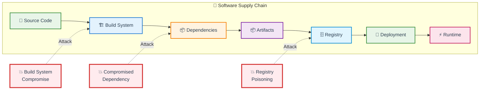

---

### 🌍 Supply Chain Security Scope

* 📝 **Source integrity:** Code repositories, commits, developers
* 🏗️ **Build integrity:** Build systems, tools, environment
* 📦 **Dependency integrity:** Third-party libraries, transitive dependencies
* 🔐 **Artifact integrity:** Compiled binaries, container images, packages
* 🚀 **Deployment integrity:** Infrastructure, configuration, secrets
* ⚡ **Runtime integrity:** Actual running code matches expected

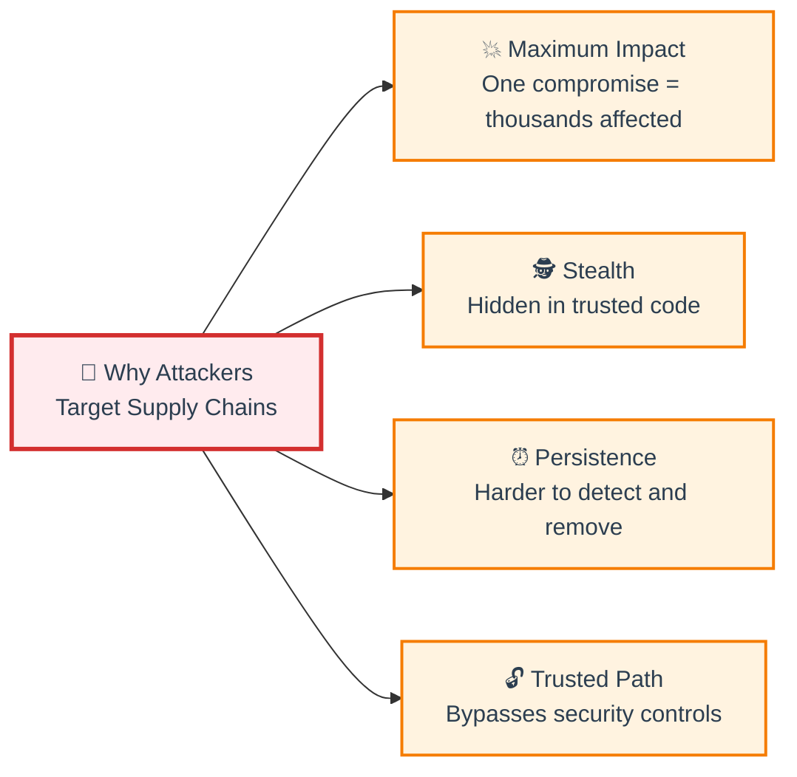

<details>
<summary>💭 <strong>Discussion:</strong> Why is supply chain security harder than traditional security?</summary>

**Key challenges:**

1. 🌐 **Scale:** Hundreds of dependencies, thousands of transitive dependencies
2. 👥 **Trust boundaries:** You trust code written by strangers
3. ⏰ **Time dimension:** Vulnerabilities discovered after deployment
4. 🔄 **Constant change:** New versions, new maintainers, new risks
5. 👁️ **Visibility gaps:** Hard to know what's actually running
6. 🔗 **Transitive trust:** Dependency of dependency of dependency...

**Traditional security:** Protect your code
**Supply chain security:** Protect everyone else's code that you use
</details>

---

## 📍 Slide 2 – 💥 Famous Supply Chain Breaches & Incidents

### 🔥 Timeline of Major Attacks

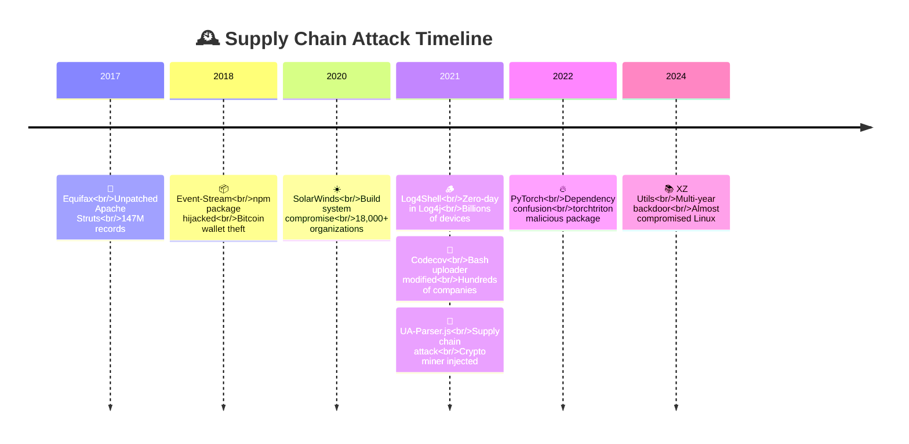

---

### 💥 SolarWinds (2020)

* ☀️ **Target:** SolarWinds Orion platform (IT management software)
* 📅 **Date:** March-December 2020 (9 months undetected)
* 🎯 **Attack method:** Compromised build system, injected SUNBURST backdoor
* 💥 **Impact:**
  * 18,000+ organizations downloaded trojanized update
  * 100+ US companies compromised
  * Multiple US government agencies breached
  * Estimated $100M+ damage
* 🔑 **Key lesson:** **Build systems are critical infrastructure**

```mermaid
flowchart LR
    Attacker[🕵️ APT29<br/>Russian State Actors] -->|1. Compromise| Build[🏗️ SolarWinds<br/>Build System]
    Build -->|2. Inject| Backdoor[💀 SUNBURST<br/>Backdoor]
    Backdoor -->|3. Sign with| Cert[✅ Valid Certificate]
    Cert -->|4. Distribute| Update[📦 Orion Update]
    Update -->|5. Install| Victims[🎯 18,000+<br/>Organizations]
    
    style Attacker fill:#ffebee,stroke:#d32f2f,stroke-width:3px,color:#2c3e50
    style Build fill:#ffcdd2,stroke:#d32f2f,stroke-width:2px,color:#2c3e50
    style Backdoor fill:#b71c1c,stroke:#d32f2f,stroke-width:3px,color:#fff
    style Victims fill:#ffebee,stroke:#d32f2f,stroke-width:2px,color:#2c3e50
```

---

### 🪵 Log4Shell (2021)

* 📦 **Target:** Apache Log4j (ubiquitous Java logging library)
* 📅 **Date:** December 2021 (disclosed)
* 🎯 **Vulnerability:** CVE-2021-44228 (CVSS 10.0 - Critical)
* 💥 **Impact:**
  * Billions of devices affected
  * Used in: Minecraft, iCloud, Steam, Twitter, Amazon, Tesla
  * Exploited within hours of disclosure
  * Still being exploited in 2024
* 🔑 **Key lesson:** **One dependency can break the internet**

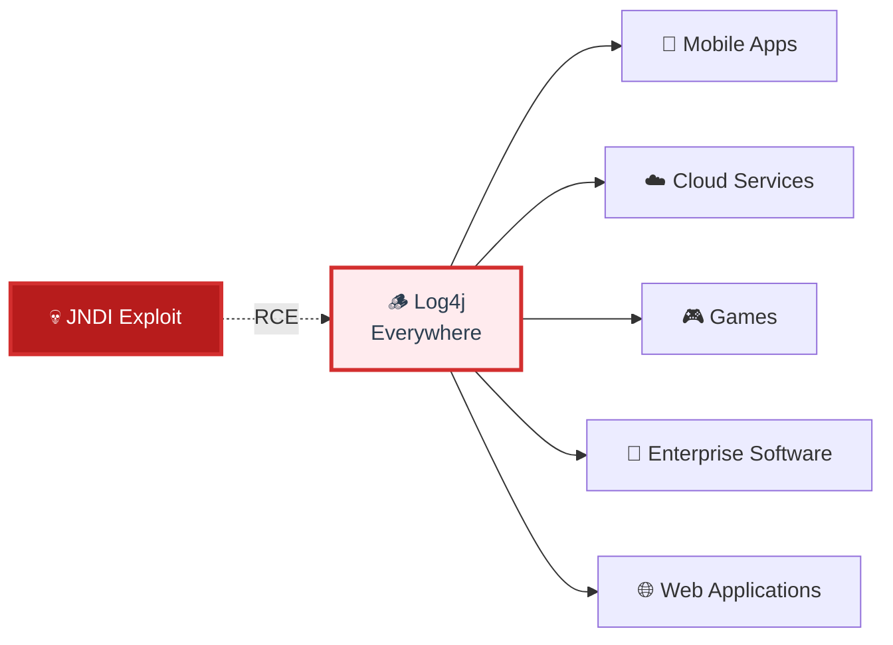

---

### 🎥 Codecov Bash Uploader (2021)

* 🛠️ **Target:** Codecov (code coverage tool used in CI/CD)
* 📅 **Date:** January-April 2021 (compromised for 3 months)
* 🎯 **Attack method:** Modified Bash uploader script to exfiltrate secrets
* 💥 **Impact:**
  * Hundreds of companies affected
  * CI/CD environment variables stolen (AWS keys, tokens)
  * Undetected for months
* 🔑 **Key lesson:** **Security tools can become attack vectors**

---

### 📦 Event-Stream npm (2018)

* 📦 **Target:** event-stream (popular npm package, 2M+ downloads/week)
* 📅 **Date:** September-November 2018
* 🎯 **Attack method:**
  * Original maintainer handed off to attacker
  * Malicious dependency (flatmap-stream) added
  * Targeted Bitcoin wallets
* 💥 **Impact:** Cryptocurrency theft from Copay wallet users
* 🔑 **Key lesson:** **Maintainer trust is critical**

```mermaid
flowchart LR
    Original[👨‍💻 Original<br/>Maintainer] -->|Transfer ownership| Attacker[🕵️ Attacker]
    Attacker -->|Add dependency| Malicious[💀 flatmap-stream<br/>Malicious Package]
    Malicious -->|Included in| EventStream[📦 event-stream<br/>v3.3.6]
    EventStream -->|Installed by| Victims[🎯 2M+ weekly<br/>downloads]
    Victims -->|Steal| Crypto[💰 Bitcoin Wallets]
    
    style Attacker fill:#ffebee,stroke:#d32f2f,stroke-width:3px,color:#2c3e50
    style Malicious fill:#b71c1c,stroke:#d32f2f,stroke-width:3px,color:#fff
```

---

### 📚 XZ Utils Backdoor (2024)

* 🛠️ **Target:** xz/liblzma (compression library in most Linux distros)
* 📅 **Date:** 2021-2024 (multi-year social engineering campaign)
* 🎯 **Attack method:**
  * Attacker spent 2+ years building trust
  * Became co-maintainer through social engineering
  * Injected sophisticated backdoor into build system
  * Targeted SSH authentication in systemd
* 💥 **Impact:** Nearly compromised all major Linux distributions
* 🔍 **Discovery:** Microsoft engineer noticed 500ms SSH slowdown
* 🔑 **Key lesson:** **Long-term social engineering is the new attack vector**

<details>
<summary>💭 <strong>Interactive:</strong> What do these incidents have in common?</summary>

**Common patterns:**

1. ✅ **Trusted software** was weaponized (all were legitimate, popular projects)
2. ⏰ **Long dwell time** (weeks or months before detection)
3. 🎯 **High-value targets** (broad impact, critical infrastructure)
4. 🕵️ **Sophisticated attackers** (nation-states or organized crime)
5. 🔓 **Exploited trust** (signed certificates, trusted maintainers)
6. 📊 **Massive scale** (thousands to millions affected)

**Prevention requires:**
* 🔍 Transparency (SBOMs, provenance)
* ✍️ Signing (Sigstore)
* 🛡️ Monitoring (continuous scanning)
* 📋 Policies (only deploy verified artifacts)
</details>

---

## 📍 Slide 3 – 🎯 Supply Chain Attack Vectors

### 🔥 Attack Vector Categories

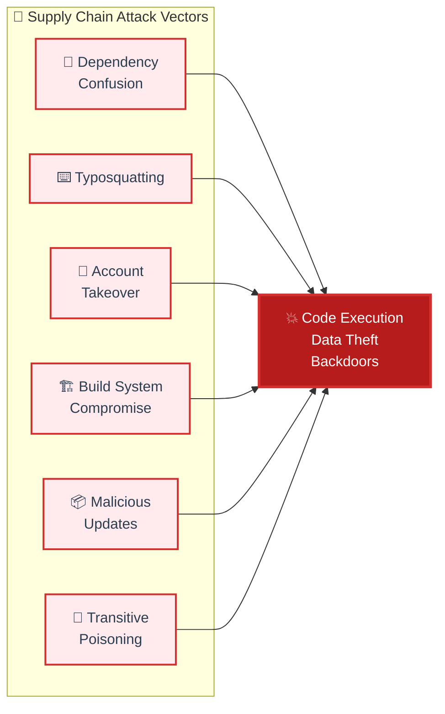

---

### 🔄 Dependency Confusion / Substitution

* 🎯 **Attack:** Trick package manager into installing malicious public package instead of internal one
* 🔑 **How it works:**
  * Company uses internal package: `@company/auth-lib`
  * Attacker publishes public package: `auth-lib` with higher version
  * Package manager prefers public over internal (misconfiguration)
* 💰 **Real case:** Security researcher Alex Birsan earned **$130k in bug bounties** (2021)
* 🎯 **Victims:** Apple, Microsoft, Tesla, Uber, PayPal, and 30+ others

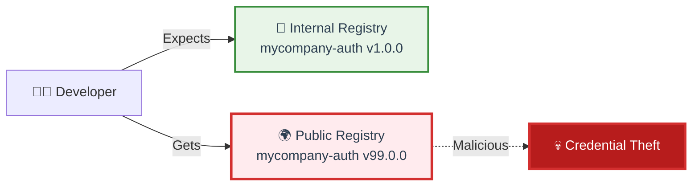

---

### ⌨️ Typosquatting

* 🎯 **Attack:** Register package names similar to popular packages
* 🔑 **Examples:**
  * `reqests` instead of `requests` (Python)
  * `cross-env` vs `crossenv` (npm)
  * `electorn` vs `electron`
  * `lodas` vs `lodash`
* 📊 **Scale:** Over **10,000 typosquatting packages** detected on npm/PyPI
* 💥 **Impact:** Steals credentials, crypto wallets, environment variables

---

### 🔑 Account Takeover

* 🎯 **Attack:** Compromise maintainer accounts, push malicious updates
* 🔑 **Methods:**
  * Stolen credentials (phishing, credential stuffing)
  * No 2FA on maintainer accounts
  * Social engineering
  * Insider threats
* 📦 **Examples:**
  * **Event-Stream:** Maintainer transferred ownership
  * **UA-Parser.js:** Maintainer account compromised, malicious v0.8.0 published
  * **coa/rc packages (npm):** Password theft from maintainer

---

### 🏗️ Build System Compromise

* 🎯 **Attack:** Compromise the build/CI system itself
* 🔑 **SolarWinds method:**
  * Attackers gained access to build environment
  * Injected malicious code during compilation
  * Signed with legitimate certificate
  * Distributed through official update channel
* 💥 **Why devastating:** Bypasses all code review, every build is poisoned
* 🛡️ **Defense:** Hermetic builds, provenance, SLSA framework

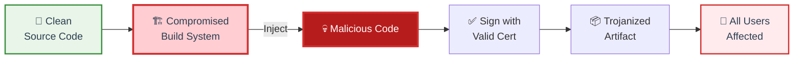

---

### 📦 Malicious Updates to Legitimate Packages

* 🎯 **Attack:** Inject malicious code into new version of trusted package
* 🔑 **After compromise:**
  * Package has legitimate history
  * Developers trust and auto-update
  * Malicious version gets installed automatically
* 📦 **Examples:**
  * **Event-Stream v3.3.6:** Added malicious dependency
  * **Colors.js & faker.js (2022):** Maintainer intentionally broke packages (protest)

---

### 🔗 Transitive Dependency Poisoning

* 🎯 **Attack:** Compromise dependency several levels deep
* 🔑 **Why effective:**
  * Developers only vet direct dependencies
  * Transitive dependencies invisible
  * Average package has 70+ transitive dependencies
* 📊 **Example chain:**
  ```
  Your App
    └── express (direct)
        └── body-parser
            └── qs
                └── side-channel
                    └── 💀 MALICIOUS PACKAGE
  ```

<details>
<summary>💭 <strong>Challenge:</strong> How many dependencies does your project REALLY have?</summary>

**Try this:**

```bash
# Node.js
npm ls --all | wc -l

# Python
pip list | wc -l

# Go
go list -m all | wc -l
```

**You might be shocked!** Most projects have:
* 📦 **10-50 direct dependencies**
* 🔗 **200-1000+ transitive dependencies**
* ❓ **Unknown risk** from dependencies you never heard of

**This is why SBOM and continuous scanning are critical!**
</details>

---

## 📍 Slide 4 – 🛡️ Supply Chain Security Frameworks

### 📋 Major Frameworks Overview

| Framework | Owner | Focus | Maturity |
|-----------|-------|-------|----------|
| 🎯 **SLSA** | Google / OpenSSF | Build integrity, provenance | ✅ Mature |
| 📊 **NIST SSDF** | US NIST | Secure development practices | ✅ Mature |
| 📋 **SBOM** | CISA / NTIA | Software transparency | ✅ Mandatory (US) |
| 🔍 **SCVS** | OWASP | Component verification | 🚧 Emerging |
| 🇪🇺 **CRA** | EU | Product security requirements | 🔜 Coming 2024 |

---

### 🎯 SLSA (Supply Chain Levels for Software Artifacts)

* 🏛️ **Created by:** Google (2021), now part of OpenSSF
* 🎯 **Goal:** Framework for software supply chain integrity
* 📊 **4 levels** (0-4) with increasing security guarantees
* 🔑 **Core concepts:**
  * Build integrity (no tampering)
  * Provenance (who/what/when/how)
  * Non-falsifiable evidence

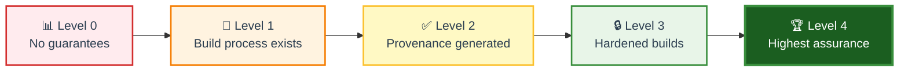

**SLSA Levels:**
* **Level 0:** No requirements (most software today)
* **Level 1:** Build process documented
* **Level 2:** Build service generates signed provenance
* **Level 3:** Build platform is hardened, provenance non-falsifiable
* **Level 4:** Two-party review + hermetic builds

🔗 **Learn more:** [slsa.dev](https://slsa.dev/)

---

### 📊 NIST SSDF (Secure Software Development Framework)

* 🏛️ **Created by:** US National Institute of Standards and Technology
* 🎯 **Goal:** High-level practices for secure software development
* 📋 **4 practice groups:**
  * **PO:** Prepare the Organization
  * **PS:** Protect the Software
  * **PW:** Produce Well-Secured Software
  * **RV:** Respond to Vulnerabilities
* 🔑 **Government mandate:** Required for US federal software procurement
* 🔗 **Reference:** [NIST SP 800-218](https://csrc.nist.gov/Projects/ssdf)

---

### 📋 SBOM (Software Bill of Materials)

* 🏛️ **Mandated by:** US Executive Order 14028 (May 2021), CISA
* 🎯 **Goal:** Transparency - know what's in your software
* 📊 **Two main standards:**
  * **SPDX** (Linux Foundation) - ISO/IEC 5962:2021 standard
  * **CycloneDX** (OWASP) - Security-focused format
* 🔑 **Minimum elements (NTIA):**
  * Supplier name
  * Component name
  * Version
  * Unique identifier
  * Dependency relationships
  * Author of SBOM data
  * Timestamp
* 🔗 **Covered in Lab 4**, will analyze in depth in Lab 8

---

### 🔍 SCVS (Software Component Verification Standard)

* 🏛️ **Created by:** OWASP (2020)
* 🎯 **Goal:** Verification requirements for software components
* 📊 **Three levels:**
  * **Level 1:** Basic verification (inventory, known vulnerabilities)
  * **Level 2:** Intermediate (pedigree, provenance, signing)
  * **Level 3:** Advanced (reproducible builds, continuous monitoring)
* 🔗 **Learn more:** [scvs.owasp.org](https://scvs.owasp.org/)

---

### 🇪🇺 EU Cyber Resilience Act (CRA)

* 🏛️ **Enacted by:** European Union (2024)
* 🎯 **Goal:** Mandatory cybersecurity requirements for products with digital elements
* 📋 **Key requirements:**
  * Security by design
  * Vulnerability disclosure
  * Security updates for product lifetime
  * **SBOM transparency**
* 💰 **Penalties:** Up to €15M or 2.5% of global revenue
* 🔗 **Impact:** Global (any product sold in EU)

<details>
<summary>💭 <strong>Discussion:</strong> Which framework should you adopt?</summary>

**Short answer: ALL OF THEM!** They're complementary, not competing.

**Practical approach:**

1. **Start with SBOM** (required by law, easiest to implement)
   * Generate SBOMs in CI/CD (Lab 4)
   * Use for vulnerability tracking

2. **Adopt SLSA gradually** (incremental security improvements)
   * Start at Level 1 (document your build)
   * Aim for Level 3 (GitHub Actions can achieve this)

3. **Use NIST SSDF as checklist** (comprehensive best practices)
   * Map your processes to NIST practices
   * Identify gaps

4. **Reference SCVS for verification** (what to check)
   * Verify dependencies meet minimum standards
   * Implement continuous monitoring

**They all work together to create defense in depth!**
</details>

---

## 📍 Slide 5 – 📊 Supply Chain Security in DevSecOps Pipeline

### 🔄 Integration Points in SDLC

```mermaid
flowchart LR
    IDE[💻 IDE<br/>Local Dev] -->|Secret scan<br/>Dependency check| Git[📝 Git<br/>Source Control]
    Git -->|Pre-commit hooks<br/>Signed commits| CI[🔄 CI/CD<br/>Build Pipeline]
    CI -->|SCA scan<br/>SBOM generation<br/>Signing| Registry[🗄️ Artifact<br/>Registry]
    Registry -->|Signature verify<br/>Policy check| Deploy[🚀 Deployment]
    Deploy -->|Provenance verify<br/>Admission control| Runtime[⚡ Runtime<br/>Production]
    Runtime -->|Continuous scan<br/>Drift detection| Monitor[📊 Monitoring]
    Monitor -.->|Feedback| IDE
    
    style IDE fill:#e8f5e8,stroke:#388e3c,stroke-width:2px,color:#2c3e50
    style Git fill:#e3f2fd,stroke:#1976d2,stroke-width:2px,color:#2c3e50
    style CI fill:#fff3e0,stroke:#f57c00,stroke-width:2px,color:#2c3e50
    style Registry fill:#f3e5f5,stroke:#7b1fa2,stroke-width:2px,color:#2c3e50
    style Deploy fill:#e1f5fe,stroke:#0288d1,stroke-width:2px,color:#2c3e50
    style Runtime fill:#fce4ec,stroke:#c2185b,stroke-width:2px,color:#2c3e50
    style Monitor fill:#fff9c4,stroke:#fbc02d,stroke-width:2px,color:#2c3e50
```

---

### 🔐 Security Controls by Stage

| Stage | Security Controls | Tools |
|-------|------------------|-------|
| 💻 **IDE** | Dependency vulnerability hints | Snyk, Dependabot alerts |
| 📝 **Git** | Secret scanning, commit signing | Gitleaks, GPG, Sigstore |
| 🔄 **CI/CD** | SCA scan, SBOM generation, signing | Syft, Grype, Cosign |
| 🗄️ **Registry** | Image scanning, policy enforcement | Harbor, Artifactory, Nexus |
| 🚀 **Deploy** | Signature verification, provenance check | Cosign verify, Kyverno |
| ⚡ **Runtime** | Continuous monitoring, drift detection | Falco, Tetragon, Tracee |

---

### 📊 Shift-Left for Dependencies

* ⬅️ **Shift-left principle:** Catch issues as early as possible
* 💰 **Cost of fix increases with time:**
  * **IDE:** Free (instant feedback)
  * **PR:** $10 (code review)
  * **CI/CD:** $100 (build failure)
  * **Staging:** $1,000 (deployment delay)
  * **Production:** $100,000+ (breach, downtime)

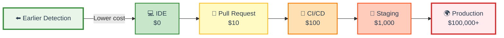

---

### 🛡️ Defense in Depth Strategy

* 🔄 **Multiple layers:** No single tool catches everything
* 🧪 **Continuous testing:** Scan at every stage
* 📊 **Different perspectives:**
  * **SAST:** Analyze source code (covered Lab 5)
  * **SCA:** Analyze dependencies (**this lab**)
  * **Container scan:** Analyze OS packages (covered Lab 7)
  * **DAST:** Test running application (covered Lab 5)
* 🔁 **Feedback loops:** Results inform earlier stages

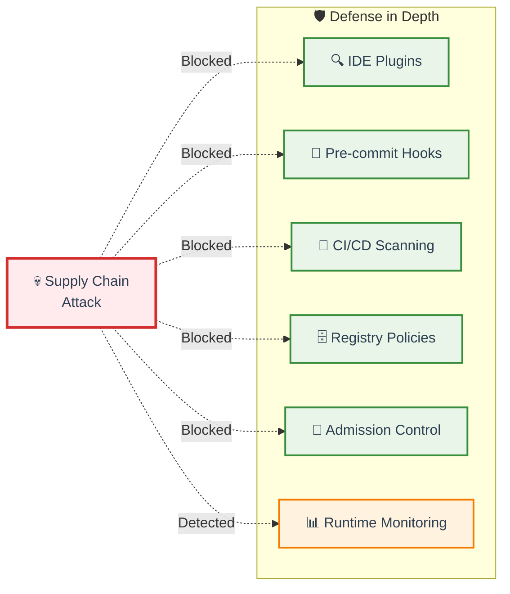

---

### 🎯 Key Takeaways: Integration

* ✅ **Automate everything:** Manual processes don't scale
* ⬅️ **Shift-left aggressively:** Fail fast, fail cheap
* 🔁 **Continuous monitoring:** New vulnerabilities discovered daily
* 🛡️ **Multiple layers:** No single point of failure
* 📊 **Visibility:** SBOM + provenance = transparency
* 🚨 **Policy enforcement:** Automated gates prevent risky deployments

<details>
<summary>💭 <strong>Poll:</strong> What's your biggest supply chain security challenge?</summary>

**Common challenges (audience participation):**

A. 📊 **Visibility** - Don't know what dependencies we have
B. 🔄 **Scale** - Too many dependencies to track manually
C. ⏰ **Speed** - Security slows down development
D. 🧪 **False positives** - Too many irrelevant alerts
E. 📋 **Compliance** - Meeting regulatory requirements
F. 🔧 **Tooling** - Don't know which tools to use
G. 👥 **Culture** - Developers resist security checks

**The good news:** This lab addresses all of these! 🎯
</details>

---

## 🎉 Fun Break: "The Leftpad Incident (2016)"

### 😱 How 11 Lines of Code Broke the Internet

**The Setup:**
* 📦 **leftpad** = tiny npm package (11 lines)
* 🎯 **Purpose:** Pad strings with spaces on the left
* 📊 **Usage:** Dependency of Babel, React, thousands of projects

**What Happened:**
1. 👨‍💻 Developer Azer Koçulu had naming dispute with npm and a company
2. 😤 Got angry and **unpublished ALL his packages** (273 packages)
3. 💥 **leftpad disappeared from npm registry**
4. 🔥 **Thousands of projects broke instantly** worldwide
5. 🌍 Continuous integration systems **failed globally**
6. ⏰ Incident duration: **~3 hours of internet chaos**

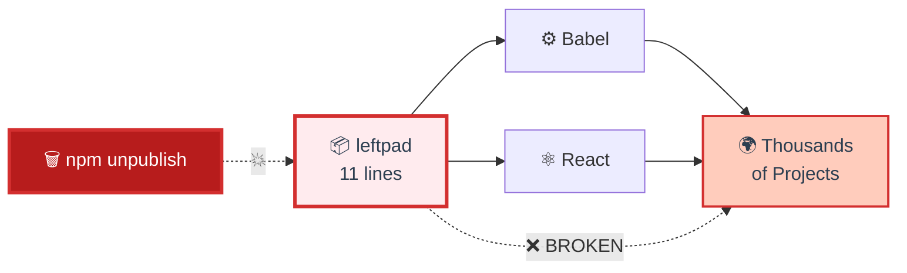

**The Fix:**
* npm **changed their policy** - can't unpublish packages after 24 hours if other packages depend on it
* npm **restored leftpad** manually
* The incident lasted only **2.5 hours** but taught the world about dependency hell

**Memes Born:**
* "How to break the internet with 11 lines"
* "Is your startup based on leftpad?"
* "The butterfly effect is real in software"

**Lessons Learned:**
* 🔗 **Transitive dependencies are risky** (dependencies you don't know about)
* 📦 **Package registries are single points of failure**
* 🛡️ **Dependency pinning is critical** (lockfiles!)
* 🏢 **Consider vendoring** critical dependencies
* 🎯 **SBOM would have helped** - at least you'd know leftpad existed!

**Fun Facts:**
* 📊 leftpad had **millions of downloads per day**
* 💻 The actual code can be **replaced with a one-liner:** `str.padStart()`
* 🎭 npm even created a **leftpad-memorial** page
* 🔒 This incident **directly influenced** modern supply chain security thinking

**The Code That Broke the Internet:**
```javascript
module.exports = leftpad;
function leftpad (str, len, ch) {
  str = String(str);
  ch = ch || ' ';
  var pad = len - str.length;
  return pad > 0 ? new Array(pad + 1).join(ch) + str : str;
}
```

**Modern equivalent (2024):**
```javascript
str.padStart(len, ch);  // Built into JavaScript now!
```

**The tweet that started it all:**
> "I've just unpublished all my modules. kik, npm and bob are shit and I don't want to work with any of them." - @azerbike

**And the world learned:** Even 11 lines of code can be critical infrastructure. 🎯

---

🔗 **Resources for Group 1:**
* [SolarWinds Report (CISA)](https://www.cisa.gov/uscert/ncas/alerts/aa20-352a)
* [Log4Shell Explained](https://www.lunasec.io/docs/blog/log4j-zero-day/)
* [SLSA Framework](https://slsa.dev/)
* [NIST SSDF](https://csrc.nist.gov/Projects/ssdf)
* [CISA SBOM Resources](https://www.cisa.gov/sbom)
* [Leftpad Incident Timeline](https://qz.com/646467/how-one-programmer-broke-the-internet-by-deleting-a-tiny-piece-of-code)

---
## 📂 Group 2: Advanced Dependency Analysis

## 📍 Slide 6 – 🔍 Software Composition Analysis (SCA) Deep Dive

* 🔍 **SCA (Software Composition Analysis)** = automated scanning of third-party components
* 📊 **Reality:** 80-90% of your code is from dependencies (not written by you)
* 🎯 **Purpose:** Identify vulnerabilities, licenses, and risks in dependencies
* 🔑 **Three analysis methods:**
  * 📋 **Manifest parsing** → reads package.json, requirements.txt, pom.xml
  * 🔒 **Lockfile analysis** → most accurate, includes transitive dependencies
  * 🔢 **Binary fingerprinting** → hash-based matching for compiled artifacts
* ⚡ **Modern feature:** Reachability analysis (is vulnerable code actually used?)
* 🔗 **Learn more:** [OWASP Dependency-Check](https://owasp.org/www-project-dependency-check/), [Snyk SCA](https://snyk.io/product/open-source-security-management/)

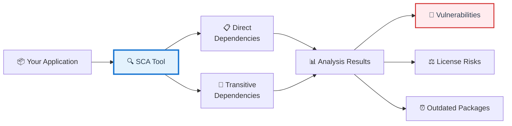

---

### 🔗 Direct vs Transitive Dependencies

* 📦 **Direct:** Dependencies you explicitly declare in manifest
* 🔗 **Transitive:** Dependencies of your dependencies (hidden from you)
* 📊 **Reality check:** 1 direct dependency = 7-10 transitive dependencies on average
* 🎯 **Problem:** Most vulnerabilities hide in transitive dependencies
* ⚠️ **Risk:** You didn't choose them, review them, or know they exist

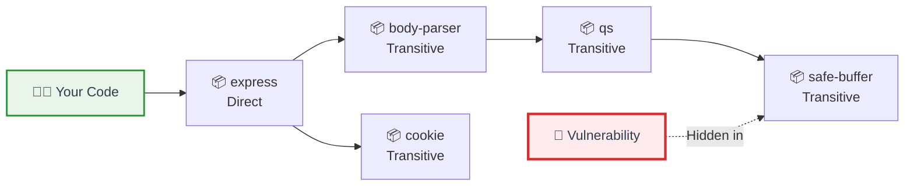

---

### ⚡ Reachability Analysis (Advanced)

* 🎯 **Problem:** Not all vulnerabilities are exploitable in your code
* 🔑 **Question:** Does your code actually call the vulnerable function?
* 📊 **Impact:** Reduces false positives by 70%+
* ✅ **Benefit:** Focus on real risks, not theoretical ones
* 🛠️ **Tools with reachability:** Snyk, GitHub CodeQL (limited), Qwiet AI

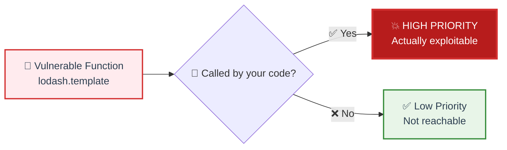

<details>
<summary>💭 <strong>Discussion:</strong> Why don't all tools have reachability analysis?</summary>

**Challenges:**

* 🔬 **Technically complex:** Requires static code analysis + dataflow analysis
* ⏰ **Performance:** Slow to compute (minutes vs seconds)
* 🎯 **Accuracy:** Dynamic features (eval, reflection) break analysis
* 💰 **Cost:** Expensive to build and maintain

**Why it matters:**
* 📊 Average project: **200+ vulnerabilities detected**
* ⚡ With reachability: **Only 60 actually exploitable**
* ✅ Security teams can focus on what matters

**Future:** Reachability analysis becoming standard (AI/ML improvements)
</details>

---

## 📍 Slide 7 – 🗂️ Vulnerability Databases & Tracking

* 🌐 **Multiple databases** track vulnerabilities (not just one source)
* 🔑 **Each database has different coverage and timing**
* 📊 **Aggregation is key:** Use tools that combine multiple sources

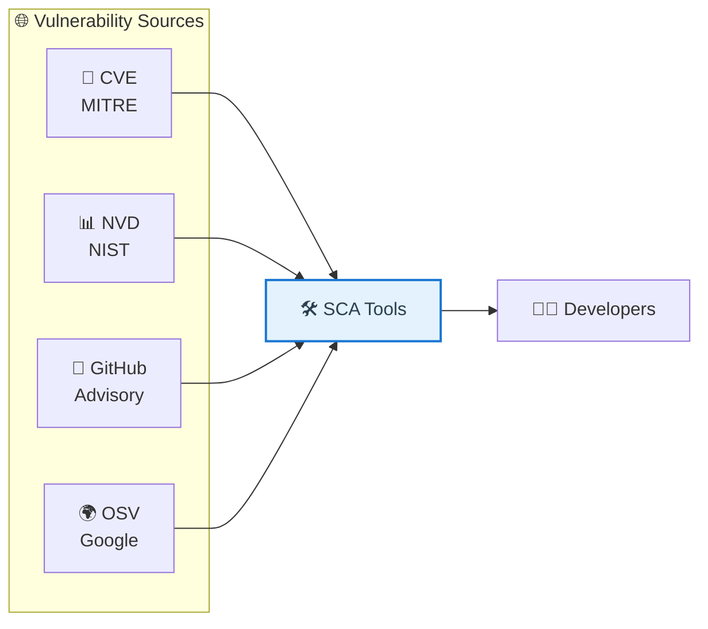

---

### 🔢 CVE (Common Vulnerabilities and Exposures)

* 🏛️ **Managed by:** MITRE Corporation (US DHS funded)
* 📅 **Created:** 1999 (25+ years old!)
* 🎯 **Purpose:** Standardized vulnerability identifiers
* 📋 **Format:** CVE-YEAR-NUMBER (e.g., CVE-2021-44228 = Log4Shell)
* 📊 **Scale:** 200,000+ CVEs, ~25,000 new/year
* 🔗 **Database:** [cve.mitre.org](https://cve.mitre.org/)

---

### 📊 NVD (National Vulnerability Database)

* 🏛️ **Managed by:** US NIST
* 🎯 **Built on:** CVE data + enrichment
* 📊 **Adds:**
  * **CVSS scores** (severity 0-10)
  * **CPE** (affected product identifiers)
  * **CWE** (weakness categories)
  * **Patches and workarounds**
* 🔗 **Database:** [nvd.nist.gov](https://nvd.nist.gov/)

---

### 🐙 GitHub Advisory Database

* 🏛️ **Managed by:** GitHub (Microsoft)
* 🎯 **Developer-friendly:** Integrated with Dependabot
* 📦 **Coverage:** npm, PyPI, Maven, NuGet, RubyGems, Go, Rust
* ✅ **Unique:** Maintainers can publish advisories directly
* 🔔 **Automation:** Auto-alerts repository owners
* 🔗 **Database:** [github.com/advisories](https://github.com/advisories)

---

### 🌍 OSV (Open Source Vulnerabilities)

* 🏛️ **Created by:** Google (2021)
* 🎯 **Innovation:** Distributed database, ecosystem-specific IDs
* 📋 **IDs:** GHSA-xxxx, RUSTSEC-xxxx, GO-xxxx (not just CVE)
* ⚡ **Format:** Machine-readable JSON (automation-friendly)
* 🌐 **Coverage:** Aggregates from multiple sources
* 🔗 **Database:** [osv.dev](https://osv.dev/)

---

### 📊 CVSS Scoring System

* 🎯 **CVSS (Common Vulnerability Scoring System)** = severity rating 0.0-10.0
* 📈 **Current versions:** v3.1 (standard), v4.0 (new, more nuanced)

| Score | Severity | Priority | SLA |
|-------|----------|----------|-----|
| 9.0-10.0 | 🔴 **Critical** | Fix immediately | 24 hours |
| 7.0-8.9 | 🟠 **High** | Fix urgently | 7 days |
| 4.0-6.9 | 🟡 **Medium** | Fix soon | 30 days |
| 0.1-3.9 | 🟢 **Low** | Fix eventually | 90 days |

* 🔗 **Calculator:** [first.org/cvss/calculator](https://www.first.org/cvss/calculator/)

---

### ⚡ EPSS (Exploit Prediction Scoring System)

* 🎯 **Problem:** CVSS = severity, not likelihood of exploitation
* 🔑 **EPSS = probability** vulnerability will be exploited in next 30 days
* 📊 **Score:** 0-100% (e.g., 45% = 45% chance of active exploitation)
* 🤖 **Uses ML:** Trained on real-world exploitation data
* 💡 **Prioritization:** Combine CVSS + EPSS for smarter risk assessment
* 🔗 **Database:** [first.org/epss](https://www.first.org/epss/)

**Example:**
* CVE-2021-44228 (Log4Shell): CVSS 10.0 + EPSS 97% → **DROP EVERYTHING, PATCH NOW**
* CVE-2023-12345: CVSS 9.8 + EPSS 0.3% → High severity but rarely exploited → lower priority

---

### 🚨 CISA KEV (Known Exploited Vulnerabilities)

* 🏛️ **Managed by:** CISA (US Cybersecurity Agency)
* 🎯 **Purpose:** Catalog of vulnerabilities **actively exploited in the wild**
* 🔥 **Rule:** If it's in KEV → patch within 48 hours (US federal mandate)
* 📊 **Size:** 1,000+ actively exploited vulnerabilities
* ⚠️ **Reality:** These are the ones attackers are using RIGHT NOW
* 🔗 **Catalog:** [cisa.gov/known-exploited-vulnerabilities](https://www.cisa.gov/known-exploited-vulnerabilities-catalog)

**Prioritization Framework:**
1. 🔥 **In KEV + High CVSS** → Immediate (drop everything)
2. 🟠 **High CVSS + High EPSS** → This week
3. 🟡 **High CVSS + Low EPSS** → This month
4. 🟢 **Low CVSS** → When convenient

<details>
<summary>💭 <strong>Reality Check:</strong> How to prioritize 500 daily alerts?</summary>

**The Problem:**
* 📊 Average enterprise scans: **500+ vulnerabilities/day**
* 👥 Security team capacity: **~10 fixes/day**
* ❓ Which ones matter?

**Smart Prioritization:**

1. **🔥 Filter by KEV** → Top priority (actively exploited)
2. **⚡ Check reachability** → Unreachable = deprioritize
3. **📊 Combine CVSS + EPSS** → High + High = urgent
4. **🌍 Business context** → Internet-facing > internal tools
5. **🔧 Patch availability** → Available patch = fix now

**Reality:** You'll never fix everything. Focus on what attackers exploit.
</details>

---

## 📍 Slide 8 – 🛠️ Dependency Management Best Practices

### 🔒 Lockfiles Are Mission-Critical

* 📋 **Lockfile purpose:** Pin exact versions of ALL dependencies (transitive included)
* 🎯 **Security benefit:** Reproducible builds prevent supply chain attacks
* ✅ **Golden rule:** Always commit lockfiles to Git
* ⚠️ **Without lockfiles:** Different builds get different dependencies (dangerous!)

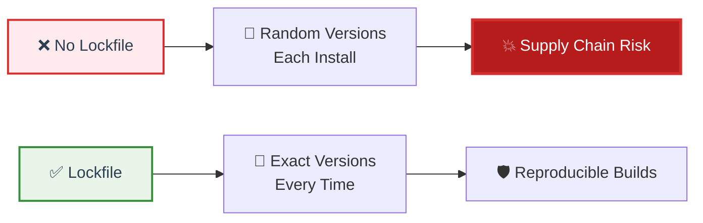

**Lockfiles by ecosystem:**
* 📦 **npm:** package-lock.json, yarn.lock, pnpm-lock.yaml
* 🐍 **Python:** Pipfile.lock, poetry.lock
* ☕ **Maven:** Effectively pom.xml with exact versions
* 🐹 **Go:** go.sum (cryptographic checksums)
* 💎 **Ruby:** Gemfile.lock
* 🦀 **Rust:** Cargo.lock

---

### 📊 Semantic Versioning Strategy

* 📋 **SemVer:** MAJOR.MINOR.PATCH (e.g., 4.18.2)
* 🎯 **Version range strategies:**

| Range | Updates | Risk Level | Use Case |
|-------|---------|------------|----------|
| `4.18.2` | None (exact) | ✅ Lowest | Production (with lockfile) |
| `~4.18.2` | Patch only (4.18.x) | 🟢 Low | Conservative |
| `^4.18.2` | Minor + Patch (4.x) | 🟡 Medium | Common default |
| `*` | Any version | 🔴 **NEVER** | None |

* 🔒 **Best practice:** Use `^` in manifest + lockfile for safety

---

### 🤖 Automated Dependency Updates

* 🔄 **Tools:** GitHub Dependabot, Renovate Bot, Snyk
* 🎯 **Purpose:** Auto-create PRs for dependency updates
* ✅ **Benefits:**
  * Security patches applied automatically
  * Avoid "big bang" updates (update incrementally)
  * Reduce technical debt
* ⚠️ **Requirements:**
  * Good test coverage (catch breaking changes)
  * CI/CD automation (verify updates work)
  * Review process (not blindly merge)

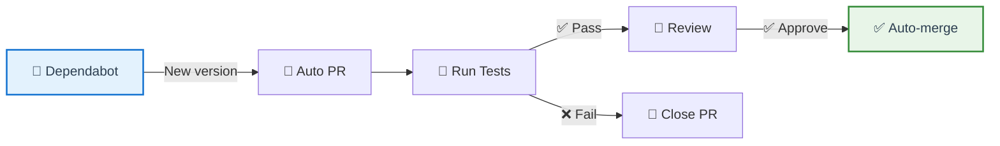

---

### 🏢 Private Package Registries

* 🎯 **Purpose:** Host internal packages + mirror public registries
* 🛡️ **Security benefits:**
  * Control what enters your environment (pre-scan packages)
  * Prevent dependency confusion attacks
  * Survive public registry outages (availability)
  * Audit and logging (who installed what)
* 🛠️ **Popular solutions:**
  * **JFrog Artifactory** (enterprise, $$$)
  * **Sonatype Nexus** (enterprise, $$$)
  * **GitHub Packages** (integrated with GitHub)
  * **Verdaccio** (open-source npm proxy, free)
* 🔗 **Learn more:** [JFrog Artifactory](https://jfrog.com/artifactory/), [Verdaccio](https://verdaccio.org/)

---

### 🗂️ Minimal Dependencies Philosophy

* 🎯 **Principle:** Every dependency = potential vulnerability → minimize them
* 📊 **Reality:**
  * Average npm package: **86 dependencies**
  * Average Java project: **150+ dependencies**
* 🔑 **Strategies:**
  * ❓ Question every new dependency (do you REALLY need it?)
  * 📚 Use standard library instead (native JavaScript vs lodash)
  * 🎯 Import only what you need (tree shaking)
  * 🧹 Regular audits (remove unused dependencies)

**Example:** Do you need a package for this?
* ❌ **leftpad** (11 lines) → ✅ Use `str.padStart()`
* ❌ **is-array** → ✅ Use `Array.isArray()`
* ❌ **is-number** → ✅ Use `typeof x === 'number'`

---

### 📦 Vendoring vs Lockfiles

* 📦 **Vendoring:** Copy dependencies into your repository
* 🔒 **Lockfiles:** Reference dependencies with exact versions

**Lockfiles (recommended for most):**
* ✅ Smaller repository size
* ✅ Easier updates (change one file)
* ✅ Standard practice
* ❌ Requires registry access

**Vendoring (specialized use cases):**
* ✅ Complete control
* ✅ Offline builds
* ✅ Immune to registry outages
* ❌ Large repository size
* ❌ Manual update process

**When to vendor:**
* 🔒 Air-gapped/high-security environments
* 🏭 Embedded systems (no network)
* 📦 Production deployment artifacts

<details>
<summary>💭 <strong>Best Practice:</strong> Hybrid approach</summary>

**Modern strategy:**

* 📝 **Development:** Use lockfiles (fast, convenient)
* 🏗️ **CI/CD:** Use lockfiles + caching
* 🚀 **Production:** Create vendored artifact (self-contained, no runtime dependencies)

**Benefits:**
* ⚡ Fast development
* 🛡️ Production resilience
* 📦 Best of both worlds

**Most teams use lockfiles. Only vendor for production if needed.**
</details>

---

## 📍 Slide 9 – 💻 Hands-On: Advanced SCA Tools

* 🛠️ **Goal:** Compare multiple SCA tools and understand their strengths
* 🎯 **Defense in depth:** Different tools catch different vulnerabilities
* 📊 **No single tool is perfect** (use multiple for best coverage)

### 🔷 Tool Comparison Matrix

| Tool | Cost | Ecosystems | Speed | Strengths | Weaknesses |
|------|------|------------|-------|-----------|------------|
| 🔷 **Snyk** | Freemium | All major | Fast | Reachability, UX | Paid for teams |
| 🦅 **OWASP Dependency-Check** | Free | Java, .NET, npm, Python | Slow | Comprehensive | False positives |
| ⚓ **Grype** | Free | Containers, OS | Very fast | Accurate, fast | Limited app deps |
| 🔷 **Trivy** | Free | Multi-purpose | Very fast | Versatile | Newer tool |
| 📊 **Dependency-Track** | Free | SBOM-based | N/A | Continuous monitor | Needs SBOM input |
| 🐙 **GitHub Dependabot** | Free | npm, PyPI, Maven | Fast | Integrated, auto-fix | GitHub only |

* 🔗 **Resources:** [Snyk](https://snyk.io/), [OWASP DC](https://owasp.org/www-project-dependency-check/), [Grype](https://github.com/anchore/grype), [Trivy](https://trivy.dev/), [Dependency-Track](https://dependencytrack.org/)

---

### 🔷 Snyk: Developer-First SCA

* 🎯 **Focus:** Developer experience + actionable results
* ✅ **Unique features:**
  * Reachability analysis (reduce false positives 70%)
  * Auto-fix PRs with tested upgrades
  * IDE integration (VS Code, IntelliJ)
  * Container + IaC scanning included
* 💰 **Pricing:** Free for individuals, paid for teams
* 🔗 **Website:** [snyk.io](https://snyk.io/)

---

### 🦅 OWASP Dependency-Check

* 🏛️ **Created by:** OWASP (2012)
* 🆓 **Completely free and open-source**
* 📊 **Coverage:** Java (excellent), .NET, npm, Python, Ruby, Go
* 🗄️ **Database:** NVD, npm audit, OSS Index, RetireJS
* ⚠️ **Trade-off:** Slower but more comprehensive
* 🔗 **GitHub:** [github.com/jeremylong/DependencyCheck](https://github.com/jeremylong/DependencyCheck)

---

### ⚓ Grype: Fast Container & Filesystem Scanner

* 🏛️ **Created by:** Anchore (2020)
* 🆓 **Open-source, free**
* 🎯 **Focus:** Container images, filesystems, **SBOMs**
* ⚡ **Speed:** Very fast (local database)
* 📋 **SBOM support:** Can scan SBOMs directly (perfect for Lab 4 integration!)
* 🔗 **GitHub:** [github.com/anchore/grype](https://github.com/anchore/grype)

---

### 🔷 Trivy: Multi-Purpose Scanner

* 🏛️ **Created by:** Aqua Security (2019)
* 🆓 **Open-source, free**
* 🎯 **Scans:** Containers, filesystems, Git repos, IaC, Kubernetes, SBOMs
* ⚡ **Speed:** Extremely fast
* 🌐 **Versatility:** One tool for multiple use cases
* 🔗 **GitHub:** [github.com/aquasecurity/trivy](https://github.com/aquasecurity/trivy)

---

### 📊 Dependency-Track: Continuous SBOM Monitoring

* 🎯 **Purpose:** Continuous monitoring platform for component risks
* 📋 **Input:** Consumes SBOMs (SPDX, CycloneDX)
* 🔄 **Workflow:** Upload SBOM → Continuous scanning → Risk scoring → Alerts
* 📊 **Features:**
  * Portfolio view (all applications in one dashboard)
  * Policy engine (block deployments with violations)
  * Risk trending over time
  * Notifications (Slack, email, webhooks)
* 🆓 **Cost:** Open-source, free
* 🔗 **Website:** [dependencytrack.org](https://dependencytrack.org/)

```mermaid
flowchart LR
    CI[🔄 CI/CD] -->|Upload SBOM| DT[📊 Dependency-Track]
    DT -->|Scan against| DB1[🗄️ NVD]
    DT -->|Scan against| DB2[🗄️ OSV]
    DT -->|Calculate| Risk[📊 Risk Score]
    Risk --> Policy{🛡️ Policy Check}
    Policy -->|✅ Pass| Deploy[🚀 Deploy]
    Policy -->|❌ Fail| Block[🚫 Block + Alert]
    
    style DT fill:#e3f2fd,stroke:#1976d2,stroke-width:3px,color:#2c3e50
    style Deploy fill:#e8f5e8,stroke:#388e3c,stroke-width:2px,color:#2c3e50
    style Block fill:#ffebee,stroke:#d32f2f,stroke-width:2px,color:#2c3e50
```

---

### 🛡️ Defense in Depth: Use Multiple Tools

* 🎯 **Why multiple tools?**
  * Different vulnerability databases (Snyk proprietary vs NVD vs OSV)
  * Different matching algorithms (fewer false negatives)
  * Different strengths (Grype for containers, Snyk for apps)
* 📊 **Reality:** Each tool finds ~80% of vulnerabilities (different 80%!)
* ✅ **Together:** 95%+ coverage

**Recommended combinations:**
* 🆓 **Free stack:** Grype + Trivy + GitHub Dependabot
* 💰 **Paid:** Snyk (primary) + Grype (containers)
* 🏢 **Enterprise:** Snyk + Dependency-Track (continuous monitoring)

<details>
<summary>💭 <strong>Pro Tip:</strong> How to integrate multiple tools?</summary>

**CI/CD Strategy:**

1. **⚡ Fast scans in PR:**
   * Snyk or Grype (5-10 seconds)
   * Fail build on critical/high

2. **📊 Comprehensive scans in CI:**
   * OWASP Dependency-Check (minutes)
   * Trivy (all-in-one)
   * Upload results to Dependency-Track

3. **🔄 Continuous monitoring:**
   * Dependency-Track (SBOM-based)
   * Daily/weekly rescans
   * Alert on new CVEs

4. **🤖 Automated updates:**
   * Dependabot or Renovate
   * Auto-fix PRs

**Don't rely on just one tool!**
</details>

---

## 🎉 Fun Break: "The Great npm Registry Outage (2021)"

### 😱 When JavaScript Stopped Working Globally

**March 2021: The Day the Internet Forgot How to JavaScript**

* 🌍 **npm registry** = single point of failure for JavaScript
* 📊 **Scale:** 13 billion packages downloaded per week
* ⚡ **Outage:** 4 hours offline
* 💥 **Impact:** Every CI/CD pipeline failed globally

```mermaid
flowchart LR
    NPM[☁️ npm Registry] -.->|💥 OFFLINE| X[❌ Down]
    
    Dev[👨‍💻 Developers] --> NPM
    CI[🔄 CI/CD] --> NPM
    Deploy[🚀 Deployments] --> NPM
    
    X -.->|❌| Dev
    X -.->|❌| CI
    X -.->|❌| Deploy
    
    style NPM fill:#ffebee,stroke:#d32f2f,stroke-width:3px,color:#2c3e50
    style X fill:#b71c1c,stroke:#d32f2f,stroke-width:3px,color:#fff
```

**The Chaos:**
* 😱 Developers couldn't install anything
* 🔥 All builds failed worldwide
* 🐦 Twitter exploded: "Is npm down or is it just me?"
* ☕ Productivity increased (couldn't install packages, had to write code)

**The Tweets:**
* "npm is down. Productivity is up. Coincidence?"
* "Breaking: Millions of developers suddenly productive"
* "Just a reminder that the entire JavaScript ecosystem depends on a single server not having a bad day"

**Lessons Learned:**
* 🏢 **Private registries** → Business continuity
* 📦 **Lockfiles + caching** → Survive outages
* 🔄 **Registry mirrors** → Redundancy
* 🎯 **Dependency registries = critical infrastructure**

**Fun Fact:** Stack Overflow traffic increased 300% during outage

---

🔗 **Resources for Group 2:**
* [Snyk Documentation](https://docs.snyk.io/)
* [OWASP Dependency-Check](https://owasp.org/www-project-dependency-check/)
* [Grype GitHub](https://github.com/anchore/grype)
* [Trivy Documentation](https://trivy.dev/)
* [Dependency-Track](https://dependencytrack.org/)
* [CVSS Calculator](https://www.first.org/cvss/calculator/)
* [EPSS Scores](https://www.first.org/epss/)
* [CISA KEV Catalog](https://www.cisa.gov/known-exploited-vulnerabilities-catalog)

---

## 📂 Group 3: SBOM Analysis & Consumption

## 📍 Slide 10 – 📋 SBOM Formats: SPDX vs CycloneDX Deep Dive

* 📋 **Lab 4 recap:** You generated SBOMs → **Now learn to consume them**
* 🔄 **Two standards:** SPDX (license focus) vs CycloneDX (security focus)
* 🎯 **Both are valid** → Choose based on use case (or support both)

```mermaid
flowchart LR
    SPDX[📜 SPDX<br/>Linux Foundation] --> Legal[⚖️ License Compliance<br/>ISO Standard]
    CDX[🔄 CycloneDX<br/>OWASP] --> Security[🛡️ Vulnerability Tracking<br/>DevSecOps]
    
    style SPDX fill:#e8f5e8,stroke:#388e3c,stroke-width:2px,color:#2c3e50
    style CDX fill:#e3f2fd,stroke:#1976d2,stroke-width:2px,color:#2c3e50
```

---

### 📊 Format Comparison

| Feature | SPDX | CycloneDX |
|---------|------|-----------|
| 📅 **Created** | 2010 (14 years) | 2017 (7 years) |
| 🏛️ **Owner** | Linux Foundation | OWASP |
| 🎯 **Focus** | Legal/License | Security/Supply Chain |
| ✅ **Status** | ISO/IEC 5962:2021 | ECMA (pending) |
| 📊 **Formats** | JSON, YAML, XML, RDF, Tag-Value | JSON, XML, Protobuf |
| 🔐 **Vulnerabilities** | External references | Native fields |
| 🔗 **Services** | Limited | First-class support |
| ⚡ **Performance** | Slower (complex) | Faster (lightweight) |
| 🏢 **Best For** | Government, Legal | Security tools, CI/CD |

* 🔗 **Specs:** [spdx.dev](https://spdx.dev/), [cyclonedx.org](https://cyclonedx.org/)

---

### 🔑 When to Use Which

**Use SPDX if:**
* ⚖️ License compliance is priority
* 🏛️ Government/regulatory requirements (NTIA, EU)
* 📦 File-level granularity needed
* 🤝 Cross-organization standardization

**Use CycloneDX if:**
* 🛡️ Security is primary focus
* 🔄 Continuous vulnerability monitoring
* ⚡ Performance matters (CI/CD)
* 🎯 DevSecOps workflows

**Best practice:** Generate both formats (most tools support it)

<details>
<summary>💭 <strong>Can you convert between formats?</strong></summary>

**Yes, but with limitations:**

* ✅ **SPDX → CycloneDX:** Community tools available
* ⚠️ **CycloneDX → SPDX:** Lossy conversion (some fields don't map)
* 🛠️ **Best approach:** Generate both from source

**Most SBOM tools (Syft, Trivy) can output both formats natively.**
</details>

---

## 📍 Slide 11 – 🔎 SBOM Consumption & Auditing

* 🎯 **Problem:** SBOMs are useless unless analyzed and acted upon
* 📊 **SBOM lifecycle:** Generate (Lab 4) → **Analyze (This lab)** → Act → Monitor

```mermaid
flowchart LR
    Lab4[🏗️ Generate<br/>Lab 4] --> Analyze[🔍 Analyze<br/>Find Risks]
    Analyze --> Vulnerabilities[🚨 Vulnerabilities]
    Analyze --> Licenses[⚖️ Licenses]
    Analyze --> Risks[📊 Component Risks]
    
    Vulnerabilities --> Act[⚡ Take Action]
    Licenses --> Act
    Risks --> Act
    
    Act --> Monitor[📈 Continuous<br/>Monitoring]
    Monitor -.->|New CVE| Analyze
    
    style Lab4 fill:#e8f5e8,stroke:#388e3c,stroke-width:2px,color:#2c3e50
    style Analyze fill:#e3f2fd,stroke:#1976d2,stroke-width:3px,color:#2c3e50
```

---

### 🚨 Identifying Risky Components

**Red flags in SBOMs:**

1. **⏰ Outdated packages:**
   * Last updated > 2 years ago
   * No active maintenance

2. **👥 Single maintainer:**
   * "Bus factor" = 1
   * Account takeover risk

3. **📉 Low popularity:**
   * < 100 downloads/week
   * Small community

4. **🔓 Known vulnerabilities:**
   * CVEs in external references
   * High CVSS scores

5. **⚖️ License risks:**
   * AGPL, GPL (copyleft)
   * Unknown/missing licenses

6. **🆕 New packages:**
   * < 6 months old (not battle-tested)
   * Potential typosquatting

---

### 📊 Component Pedigree Tracking

* 🔎 **Pedigree** = origin and history of component
* 🎯 **Key questions:**
  * Who created it?
  * Where did it come from?
  * Has it been modified?
  * Can we verify authenticity?

**SBOM fields for verification:**
* **Supplier:** Who provides the component
* **Download location:** Where obtained
* **Hashes:** Verify integrity (SHA-256)
* **External references:** Source repo, advisories

---

### 🔍 SBOM Validation Tools

* 📋 **NTIA minimum elements:** 7 required fields
* ✅ **Validation tools:**
  * SPDX validation tools
  * CycloneDX CLI validator
  * NTIA conformance checker

**Quality levels:**
* **Basic (40%):** NTIA minimum elements
* **Good (70%):** + licenses, hashes, references
* **Excellent (90%):** + complete dependency graph, vulnerabilities
* **Perfect (100%):** + signed, attested, continuously updated

---

## 📍 Slide 12 – 📊 SBOM Diff Analysis & Change Tracking

* 🔄 **Purpose:** Track dependency changes over time
* 🎯 **Use cases:**
  * Detect new vulnerabilities after updates
  * Audit supply chain changes
  * Drift detection (production vs source)

```mermaid
flowchart LR
    V1[📋 SBOM v1.0] --> Diff{🔍 Diff}
    V2[📋 SBOM v2.0] --> Diff
    
    Diff --> Added[➕ Added: 7]
    Diff --> Removed[➖ Removed: 2]
    Diff --> Updated[🔄 Updated: 15]
    
    Added -.->|Check| Risks[🚨 New Risks?]
    Updated -.->|Check| Fixed[✅ Fixes?]
    
    style Diff fill:#e3f2fd,stroke:#1976d2,stroke-width:3px,color:#2c3e50
    style Risks fill:#ffebee,stroke:#d32f2f,stroke-width:2px,color:#2c3e50
```

---

### 🔍 What to Analyze in Diffs

**➕ Added components:**
* Expected new features?
* Known vulnerabilities?
* Compatible licenses?

**➖ Removed components:**
* Actually removed from code?
* Vulnerabilities addressed?

**🔄 Updated components:**
* Security patches applied?
* Breaking changes?
* New transitive dependencies?

**⚠️ Changed metadata:**
* Supplier changed? (ownership transfer risk)
* Download location changed? (supply chain risk)

---

### 📊 Drift Detection

* 🎯 **Drift** = difference between expected SBOM and actual runtime
* 🔥 **Causes:**
  * Manual production changes
  * Compromised deployment
  * SBOM generation bugs

```mermaid
flowchart LR
    Expected[📋 Expected<br/>From CI/CD] --> Compare{🔍 Compare}
    Actual[⚡ Runtime<br/>Production] --> Compare
    
    Compare -->|Match| Good[✅ No Drift]
    Compare -->|Mismatch| Drift[🚨 INVESTIGATE]
    
    style Expected fill:#e8f5e8,stroke:#388e3c,stroke-width:2px,color:#2c3e50
    style Drift fill:#ffebee,stroke:#d32f2f,stroke-width:3px,color:#2c3e50
```

---

### 📈 Continuous SBOM Monitoring

* 🔄 **Track metrics over time:**
  * Total components (trend)
  * Known vulnerabilities (improving?)
  * License violations
  * Average component age
  * Dependency depth

* 🛠️ **Tool:** Dependency-Track (dashboards, alerts, trends)

<details>
<summary>💭 <strong>When to regenerate SBOMs?</strong></summary>

**Regenerate on:**

1. ✅ **Every build** (CI/CD - best practice)
2. ✅ **Every release** (minimum requirement)
3. ✅ **Dependency updates** (compare before/after)
4. ✅ **Daily/weekly** (catch new CVEs)
5. ✅ **Security incidents** (audit deployed state)

**Store SBOMs alongside artifacts (container registry, S3).**
</details>

---

## 📍 Slide 13 – 💻 Hands-On: SBOM-Driven Vulnerability Analysis

* 🎯 **Goal:** Use Lab 4 SBOMs to find and fix vulnerabilities
* 🔧 **Tools:** Grype, Dependency-Track
* 📊 **Workflow:** SBOM → Scan → Prioritize → Fix → Verify

```mermaid
flowchart LR
    Lab4[📋 Lab 4 SBOM] --> Grype[⚓ Grype Scan]
    Grype --> Report[📊 Vulnerability Report]
    Report --> Prioritize[🎯 Prioritize by CVSS/EPSS]
    Prioritize --> Fix[🔧 Update Dependencies]
    Fix --> Verify[✅ Rescan & Verify]
    
    style Lab4 fill:#e8f5e8,stroke:#388e3c,stroke-width:2px,color:#2c3e50
    style Grype fill:#e3f2fd,stroke:#1976d2,stroke-width:2px,color:#2c3e50
```

---

### ⚓ Task 1: Scan SBOM with Grype

* 📦 **Input:** SBOM from Lab 4 (CycloneDX or SPDX)
* 🔍 **Scan:** `grype sbom:sbom.cdx.json`
* 📊 **Output:** Table of vulnerabilities (name, version, CVE, severity)

---

### 📊 Task 2: Set Up Dependency-Track

* 🐳 **Deploy:** Docker Compose (API server + frontend)
* 📤 **Upload:** SBOM via UI or API
* 📈 **Dashboard:** View risk score, vulnerabilities, policy violations
* 🔔 **Alerts:** Configure Slack/email notifications

---

### 🎯 Task 3: Compare Multiple Tools

* 🔍 **Run:** Grype + Trivy + OWASP Dependency-Check
* 📊 **Compare:** Different tools find different vulnerabilities
* 🎯 **Why?** Different databases, algorithms, coverage
* ✅ **Defense in depth:** Use multiple tools

---

### 🔧 Task 4: Create Fix PR

* 📝 **Branch:** `security/fix-sbom-vulnerabilities`
* 🔄 **Update:** Dependencies to patched versions
* 📋 **Regenerate:** SBOM after fixes
* ✅ **Verify:** Rescan shows reduced vulnerabilities
* 📤 **Submit:** PR with before/after comparison

---

### 🚨 Task 5: Policy Enforcement

* 📋 **Create policy:** Block Critical/High vulnerabilities
* 🛡️ **Enforce:** Fail CI/CD if policy violated
* 🔔 **Alert:** Notify security team
* 📊 **Track:** Policy compliance metrics

---

## 💭 Interactive Challenge: "SBOM Detective"

**Scenario:** Which SBOM has highest risk?

**SBOM A:** react 18.2.0, express 4.18.2, lodash 4.17.21, axios 1.6.0

**SBOM B:** moment 2.29.4, request 2.88.2, lodash 4.17.19, colors 1.4.0

**SBOM C:** left-pad 1.3.0, is-array 1.0.1, is-number 7.0.0, pad-left 2.1.0

<details>
<summary>🔍 Click for answer</summary>

**SBOM B = HIGHEST RISK** 🚨

* moment 2.29.4 → ⚠️ DEPRECATED
* request 2.88.2 → ⚠️ DEPRECATED (since 2020)
* lodash 4.17.19 → 🔴 CVE-2020-8203, CVE-2021-23337 (High)
* colors 1.4.0 → 🔴 Sabotaged by maintainer (2022)

**Score: 9/10 - CRITICAL**

**Lesson:** Old/deprecated packages = high risk!
</details>

---

🔗 **Resources for Group 3:**
* [SPDX Specification](https://spdx.dev/)
* [CycloneDX Specification](https://cyclonedx.org/)
* [Dependency-Track](https://dependencytrack.org/)
* [Grype](https://github.com/anchore/grype)
* [NTIA SBOM Guide](https://www.ntia.gov/sbom)

---

## 📂 Group 4: Artifact Signing & Provenance

## 📍 Slide 14 – ✍️ Code Signing & Artifact Integrity

* ✍️ **Code signing** = cryptographic proof of authenticity and integrity
* 🎯 **Purpose:** Verify artifacts haven't been tampered with
* 🔑 **Traditional approach:** X.509 certificates + private keys
* ⚠️ **Problems with traditional signing:**
  * Key management burden (storage, rotation, revocation)
  * Long-lived keys = high risk if compromised
  * Expensive PKI infrastructure
  * Certificate expiration management

```mermaid
flowchart LR
    Build[🏗️ Build Artifact] --> Sign[✍️ Sign with Key]
    Sign --> Artifact[📦 Signed Artifact]
    Artifact --> Deploy[🚀 Deployment]
    Deploy --> Verify[🔍 Verify Signature]
    Verify -->|✅ Valid| Run[⚡ Run]
    Verify -->|❌ Invalid| Block[🚫 Block]
    
    style Sign fill:#e3f2fd,stroke:#1976d2,stroke-width:2px,color:#2c3e50
    style Run fill:#e8f5e8,stroke:#388e3c,stroke-width:2px,color:#2c3e50
    style Block fill:#ffebee,stroke:#d32f2f,stroke-width:2px,color:#2c3e50
```

---

### 🔑 Why Signing Matters

* 🛡️ **Authenticity:** Proves who built the artifact
* 🔒 **Integrity:** Detects tampering (even 1 byte changed)
* 📜 **Non-repudiation:** Can't deny you signed it
* 🎯 **Trust chain:** Build trust from source to production

**Without signing:**
* 💥 Attacker replaces artifact in registry → deployed to production
* 🕵️ SolarWinds-style build system compromise goes undetected
* ❌ No way to verify artifact authenticity

---

## 📍 Slide 15 – 🔐 Sigstore: Modern Signing Revolution

* 🏛️ **Sigstore** = Linux Foundation project (2021)
* 🎯 **Innovation:** Keyless signing + transparency logs
* 🆓 **Public good infrastructure** (free for all)

### 🔑 Three Pillars of Sigstore

```mermaid
flowchart LR
    subgraph "🔐 Sigstore Ecosystem"
        Cosign[✍️ Cosign<br/>Sign & Verify]
        Fulcio[🔐 Fulcio<br/>Certificate Authority]
        Rekor[📜 Rekor<br/>Transparency Log]
    end
    
    Developer[👨‍💻 Developer] -->|1. Authenticate| Fulcio
    Fulcio -->|2. Short-lived cert| Cosign
    Cosign -->|3. Sign artifact| Signed[📦 Signed Artifact]
    Cosign -->|4. Record in| Rekor
    
    style Cosign fill:#e3f2fd,stroke:#1976d2,stroke-width:2px,color:#2c3e50
    style Fulcio fill:#fff3e0,stroke:#f57c00,stroke-width:2px,color:#2c3e50
    style Rekor fill:#f3e5f5,stroke:#7b1fa2,stroke-width:2px,color:#2c3e50
```

1. **✍️ Cosign:** Sign and verify container images, blobs, SBOMs
2. **🔐 Fulcio:** Free CA issuing short-lived certificates (minutes, not years)
3. **📜 Rekor:** Transparency log (immutable audit trail)

---

### 🔑 Keyless Signing Workflow

* 🎯 **Revolutionary:** No private keys to manage!
* 🔐 **OIDC authentication:** Use GitHub, Google, Microsoft identity
* ⏰ **Short-lived certificates:** Valid for 10 minutes (reduces risk)
* 📜 **Transparency log:** Immutable proof of signing event

**How it works:**
1. Developer authenticates via OIDC (GitHub login)
2. Fulcio issues short-lived certificate
3. Cosign signs artifact with certificate
4. Signature recorded in Rekor (public log)
5. Certificate expires, but log entry proves it existed

**Benefits:**
* ✅ No key storage (nothing to leak!)
* ✅ No key rotation (certs expire automatically)
* ✅ Transparency (all signatures public)
* ✅ Free infrastructure

---

### 🌐 Industry Adoption

* 📦 **npm:** All packages signed with Sigstore (2023+)
* 🐍 **PyPI:** Sigstore signing available
* ☸️ **Kubernetes:** Release artifacts signed
* 🐙 **GitHub:** Actions can sign artifacts
* 💎 **RubyGems:** Sigstore integration in progress

* 🔗 **Website:** [sigstore.dev](https://www.sigstore.dev/)

<details>
<summary>💭 <strong>How is keyless signing secure without keys?</strong></summary>

**Trust model:**

1. **Identity verification:** OIDC proves who you are (GitHub, Google)
2. **Short-lived certificates:** Compromised cert expires in minutes
3. **Transparency log:** Rekor provides non-repudiation (immutable proof)
4. **Certificate chain:** Fulcio CA is trusted root

**Security properties:**
* 🔐 Can't forge signatures (need valid OIDC identity)
* 📜 Can't backdate signatures (Rekor timestamps are immutable)
* ⏰ Can't reuse compromised cert (expires in 10 minutes)

**Trade-off:** Trust Sigstore infrastructure (but it's open, auditable, and run by Linux Foundation)
</details>

---

## 📍 Slide 16 – 📜 Provenance & Build Attestations

* 📜 **Provenance** = metadata about how artifact was built
* 🎯 **Answers:** Who, what, when, where, how
* 🔑 **Prevents:** Supply chain attacks via build manipulation

```mermaid
flowchart LR
    Source[📝 Source Code<br/>github.com/user/repo<br/>commit: abc123] --> Build[🏗️ Build System<br/>GitHub Actions<br/>builder: ubuntu-22.04]
    Build --> Artifact[📦 Artifact<br/>container:v1.0]
    
    Build -.->|Generates| Provenance[📜 Provenance<br/>Signed attestation]
    Provenance -->|Attached to| Artifact
    
    Deploy[🚀 Deployment] -->|Verifies| Provenance
    Deploy -->|If valid| Run[⚡ Run]
    
    style Provenance fill:#f3e5f5,stroke:#7b1fa2,stroke-width:3px,color:#2c3e50
    style Run fill:#e8f5e8,stroke:#388e3c,stroke-width:2px,color:#2c3e50
```

---

### 📊 What's in Provenance?

**SLSA Provenance format includes:**
* **Builder identity:** Who/what performed the build (GitHub Actions, GitLab CI)
* **Source repository:** Git repo URL + commit SHA
* **Build command:** How artifact was built
* **Build timestamp:** When it was built
* **Build materials:** Dependencies used
* **Signing identity:** Who signed the provenance

**Purpose:**
* ✅ Verify artifact came from expected source
* ✅ Detect build system compromises
* ✅ Ensure reproducible builds
* ✅ Audit trail for compliance

---

### 🔐 In-toto Attestations Framework

* 📜 **In-toto** = framework for securing software supply chain steps
* 🎯 **Purpose:** Define and verify supply chain steps
* 📋 **Attestation types:**
  * Build provenance
  * SBOM attestation
  * Vulnerability scan results
  * Code review approval

* 🔗 **Spec:** [in-toto.io](https://in-toto.io/)

---

### 🏆 Reproducible Builds

* 🎯 **Goal:** Same source code → identical binary (bit-for-bit)
* ✅ **Benefit:** Verify binary matches source (no hidden code injection)
* 🔧 **Challenges:**
  * Timestamps in builds
  * Non-deterministic build tools
  * Build environment differences
* 🌐 **Projects:** Debian, Arch Linux, Bitcoin Core use reproducible builds

---

## 📍 Slide 17 – 💻 Hands-On: Signing & Provenance Verification

* 🎯 **Goal:** Sign container images and generate provenance
* 🔧 **Tools:** Cosign, GitHub Actions
* 📊 **Workflow:** Build → Sign → Attest → Verify → Deploy

```mermaid
flowchart LR
    Build[🏗️ Build Image] --> Sign[✍️ Sign with Cosign]
    Sign --> Provenance[📜 Generate Provenance]
    Provenance --> SBOM[📋 Attach SBOM]
    SBOM --> Push[📤 Push to Registry]
    Push --> Deploy[🚀 Deployment]
    Deploy --> Verify[🔍 Verify All]
    Verify -->|✅ Valid| Run[⚡ Run]
    Verify -->|❌ Invalid| Block[🚫 Block]
    
    style Sign fill:#e3f2fd,stroke:#1976d2,stroke-width:2px,color:#2c3e50
    style Verify fill:#fff3e0,stroke:#f57c00,stroke-width:2px,color:#2c3e50
    style Run fill:#e8f5e8,stroke:#388e3c,stroke-width:2px,color:#2c3e50
    style Block fill:#ffebee,stroke:#d32f2f,stroke-width:2px,color:#2c3e50
```

---

### ✍️ Task 1: Sign Container Image with Cosign

* 🔐 **Keyless signing** via GitHub OIDC
* 📦 **Sign:** Container image
* 📜 **Transparency:** Recorded in Rekor

---

### 📜 Task 2: Generate SLSA Provenance

* 🏗️ **Use:** GitHub Actions SLSA generator
* 📋 **Generate:** Build provenance attestation
* ✅ **Achieve:** SLSA Level 3

---

### 📋 Task 3: Attach SBOM as Attestation

* 📦 **Attach:** Lab 4 SBOM to container image
* 🔗 **Link:** SBOM + signature + provenance
* 🎯 **Result:** Complete artifact metadata

---

### 🔍 Task 4: Verify in Deployment

* 🛡️ **Policy:** Only deploy signed + attested images
* ☸️ **Kubernetes:** Use admission controller (Kyverno, OPA Gatekeeper)
* ✅ **Verify:** Signature + provenance before deployment

---

### 🚀 Task 5: CI/CD Integration

* 🔄 **Workflow:** Build → Scan → Sign → Attest → Push → Verify → Deploy
* 🤖 **Automation:** All steps in GitHub Actions
* 📊 **Evidence:** Complete audit trail (SBOM, provenance, signatures)

---

## 🎉 Fun Break: "The XZ Utils Backdoor (2024)"

### 🕵️ The Most Sophisticated Supply Chain Attack Ever

**The Setup:**
* 📦 **xz Utils** = compression library in every Linux distribution
* 🎯 **Target:** SSH authentication via systemd

**The Attack (2-year social engineering):**
1. **2021:** Attacker creates GitHub account, contributes helpful patches
2. **2022:** Gains trust, becomes regular contributor
3. **2023:** Social engineers way to co-maintainer status
4. **2024:** Injects sophisticated backdoor in build system
5. **Discovery:** Microsoft engineer notices 500ms SSH delay

```mermaid
flowchart LR
    Year1[2021<br/>👨‍💻 Contributor] --> Year2[2022<br/>🤝 Trusted Member]
    Year2 --> Year3[2023<br/>⚙️ Co-Maintainer]
    Year3 --> Year4[2024<br/>💀 Backdoor]
    Year4 -.->|Almost| Disaster[🌍 All Linux<br/>Distributions]
    
    Discovery[🔍 Discovery<br/>500ms SSH delay] -.->|Stopped| Year4
    
    style Year4 fill:#ffebee,stroke:#d32f2f,stroke-width:3px,color:#2c3e50
    style Disaster fill:#b71c1c,stroke:#d32f2f,stroke-width:3px,color:#fff
    style Discovery fill:#e8f5e8,stroke:#388e3c,stroke-width:3px,color:#2c3e50
```

**The Sophistication:**
* 🎭 Multi-year social engineering
* 🔧 Hidden in build scripts (not source code!)
* 🕵️ Only activated for specific SSH configurations
* 🌍 Nearly compromised all major Linux distros

**Why it Failed:**
* ⚡ Pure luck (500ms delay noticed)
* ⏰ Discovered before stable release

**Lessons:**
* 📜 **Provenance matters** (build system is critical)
* 🔍 **Build transparency** (know what's in your builds)
* ✍️ **Signing alone isn't enough** (attacker had signing rights!)
* 🎯 **SLSA Level 3+** would have detected this (hermetic builds)

**The Hero:** Andres Freund (Microsoft engineer) noticed the SSH delay

---

🔗 **Resources for Group 4:**
* [Sigstore Documentation](https://docs.sigstore.dev/)
* [Cosign](https://github.com/sigstore/cosign)
* [SLSA Provenance](https://slsa.dev/provenance/)
* [In-toto Framework](https://in-toto.io/)
* [GitHub Actions SLSA Generator](https://github.com/slsa-framework/slsa-github-generator)

---

## 📂 Group 5: Advanced Supply Chain Security

## 📍 Slide 18 – 🎯 SLSA Framework Implementation

* 🏆 **SLSA (Supply Chain Levels for Software Artifacts)** = maturity model for supply chain security
* 📊 **4 levels:** Progressive security guarantees (0-4)
* 🎯 **Goal:** Achieve Level 3 (realistic for most teams)

```mermaid
flowchart LR
    L0[📊 Level 0<br/>No guarantees<br/>Most software today] --> L1[📝 Level 1<br/>Build documented<br/>Basic provenance]
    L1 --> L2[✅ Level 2<br/>Signed provenance<br/>Build service]
    L2 --> L3[🔒 Level 3<br/>Hardened builds<br/>Non-falsifiable]
    L3 --> L4[🏆 Level 4<br/>Two-party review<br/>Hermetic builds]
    
    style L0 fill:#ffebee,stroke:#d32f2f,stroke-width:2px,color:#2c3e50
    style L1 fill:#fff3e0,stroke:#f57c00,stroke-width:2px,color:#2c3e50
    style L2 fill:#fff9c4,stroke:#fbc02d,stroke-width:2px,color:#2c3e50
    style L3 fill:#e8f5e8,stroke:#388e3c,stroke-width:3px,color:#2c3e50
    style L4 fill:#1b5e20,stroke:#388e3c,stroke-width:3px,color:#fff
```

---

### 📋 SLSA Level Requirements

**Level 0:** No requirements (starting point)

**Level 1:** Build process documented
* ✅ Provenance exists (who/what/when/how)

**Level 2:** Build service generates signed provenance
* ✅ Authenticated identity (builder)
* ✅ Tamper-proof provenance

**Level 3:** Hardened build platform
* ✅ Isolated build environment
* ✅ Non-falsifiable provenance
* ✅ **GitHub Actions can achieve this!**

**Level 4:** Hermetic + two-party review
* ✅ Reproducible builds
* ✅ All changes reviewed by 2+ people
* 🎯 Very few projects achieve this

---

### 🚀 Achieving SLSA Level 3 with GitHub Actions

* 🎯 **Good news:** GitHub Actions + SLSA generator = Level 3
* 🔧 **Tools:** slsa-github-generator (official)
* ✅ **Requirements met:**
  * Isolated build (GitHub-hosted runners)
  * Non-falsifiable provenance (signed by GitHub)
  * Build service (GitHub Actions)

* 🔗 **Tool:** [slsa-github-generator](https://github.com/slsa-framework/slsa-github-generator)

<details>
<summary>💭 <strong>Why is Level 4 so hard?</strong></summary>

**Level 4 requirements:**

1. **🔒 Hermetic builds:**
   * No network access during build
   * All inputs declared upfront
   * Reproducible bit-for-bit

2. **👥 Two-party review:**
   * Every change reviewed by 2+ people
   * No self-merge
   * Enforced by platform

**Challenges:**
* 📦 Most build tools fetch dependencies over network
* ⏰ Hermetic builds are slow (can't cache)
* 👥 Small teams struggle with 2-party review

**Who achieves Level 4?**
* 🏛️ Critical infrastructure (Kubernetes, Debian)
* 💰 Well-funded open source (large teams)
* 🔒 High-security environments

**Most teams should aim for Level 3 (practical and effective).**
</details>

---

## 📍 Slide 19 – 🔒 Securing the Build Pipeline

* 🎯 **SolarWinds lesson:** Build systems are critical infrastructure
* 🔥 **If build is compromised:** Every artifact is poisoned
* 🛡️ **Defense:** Harden build systems like production

```mermaid
flowchart LR
    Source[📝 Clean Source] --> Build{🏗️ Build System}
    Build -->|✅ Secure| Safe[📦 Safe Artifact]
    Build -->|💀 Compromised| Poisoned[☠️ Poisoned Artifact]
    
    Poisoned --> Victims[🎯 All Users Affected]
    
    style Build fill:#fff3e0,stroke:#f57c00,stroke-width:3px,color:#2c3e50
    style Poisoned fill:#b71c1c,stroke:#d32f2f,stroke-width:3px,color:#fff
    style Victims fill:#ffebee,stroke:#d32f2f,stroke-width:2px,color:#2c3e50
```

---

### 🔒 Build System Hardening

**🔐 Access control:**
* Least privilege (minimal permissions)
* MFA for all accounts
* Audit logs

**🛡️ Environment isolation:**
* Ephemeral build environments
* No persistent state
* Network segmentation

**📜 Provenance generation:**
* Automatic build attestations
* Signed by build system
* Immutable audit trail

**🔍 Monitoring:**
* Build duration anomalies
* Unexpected network access
* File system changes

---

### 🏗️ Hermetic Builds

* 🎯 **Hermetic** = completely isolated, no external dependencies
* 🔒 **Characteristics:**
  * No network access during build
  * All inputs declared in manifest
  * Reproducible (same inputs → same output)
* ✅ **Benefits:**
  * Can't fetch malicious dependencies
  * Can't exfiltrate secrets
  * Reproducible = verifiable

**Tools:**
* 🐳 Docker (with network disabled)
* 📦 Bazel (hermetic by design)
* 🔧 Nix (functional package manager)

---

### ⚠️ GitHub Actions Security

**🔴 Common mistakes:**

1. **Using `pull_request_target` with untrusted code**
   * 🚨 Allows untrusted PRs to access secrets
   
2. **Not pinning actions by SHA**
   * 🚨 Action maintainer can inject malicious code

3. **Overly permissive `GITHUB_TOKEN`**
   * 🚨 Default permissions too broad

4. **Secrets in build logs**
   * 🚨 Can leak via debug output

**✅ Best practices:**
* Pin actions by commit SHA (not tag)
* Minimal `GITHUB_TOKEN` permissions
* Use `pull_request` (not `pull_request_target`)
* Separate workflows for untrusted code

---

## 📍 Slide 20 – 🚀 Runtime Supply Chain Security

* 🎯 **Problem:** Security doesn't end at deployment
* 🔄 **Continuous:** Monitor supply chain in production
* 🛡️ **Policy enforcement:** Only run verified artifacts

```mermaid
flowchart LR
    Deploy[🚀 Deployment] --> Admission[🛡️ Admission Control]
    Admission -->|Check| Signature{✍️ Signed?}
    Admission -->|Check| Provenance{📜 Provenance?}
    Admission -->|Check| Policy{📋 Policy OK?}
    
    Signature -->|❌ No| Block[🚫 Block]
    Provenance -->|❌ No| Block
    Policy -->|❌ Fail| Block
    
    Signature -->|✅ Yes| Allow[⚡ Allow]
    Provenance -->|✅ Yes| Allow
    Policy -->|✅ Pass| Allow
    
    Allow --> Runtime[📊 Runtime Monitoring]
    
    style Admission fill:#e3f2fd,stroke:#1976d2,stroke-width:3px,color:#2c3e50
    style Block fill:#ffebee,stroke:#d32f2f,stroke-width:2px,color:#2c3e50
    style Allow fill:#e8f5e8,stroke:#388e3c,stroke-width:2px,color:#2c3e50
```

---

### 🛡️ Kubernetes Admission Controllers

* 🎯 **Purpose:** Enforce policies at deployment time
* 🔧 **Tools:**
  * **Kyverno** (Kubernetes-native, easy YAML policies)
  * **OPA Gatekeeper** (powerful, Rego policies)
  * **Cosign Policy Controller** (signature verification)

**Example policies:**
* ✅ Only deploy signed images
* ✅ Require valid SLSA provenance
* ✅ Block images with critical vulnerabilities
* ✅ Enforce SBOM attestation

---

### 📊 Runtime Drift Detection

* 🎯 **Drift** = production doesn't match expected SBOM
* 🔍 **Detection methods:**
  * Compare runtime SBOM vs build SBOM
  * Monitor for unexpected processes
  * File integrity monitoring
* 🚨 **Alert:** Unauthorized changes

---

### 🔄 Continuous Supply Chain Monitoring

**Monitor for:**
* 🚨 New CVEs in deployed components
* 📊 SBOM changes (drift)
* ⚠️ Policy violations
* 🔄 License compliance

**Tools:**
* Dependency-Track (SBOM monitoring)
* Falco (runtime security)
* Tetragon (eBPF-based monitoring)

---

### 📊 Supply Chain Security Metrics

**Track:**
* 📈 % artifacts signed
* 📜 % artifacts with provenance
* 📋 % SBOMs generated
* 🎯 SLSA level distribution
* ⏰ Mean time to patch vulnerabilities
* 📊 Policy compliance rate

**Goal:** Continuous improvement

<details>
<summary>💭 <strong>Complete Supply Chain Security Checklist</strong></summary>

**✅ Development:**
* Lockfiles committed
* Dependency updates automated
* Pre-commit secret scanning

**✅ Build:**
* SBOM generated
* Artifacts signed (Cosign)
* Provenance generated (SLSA)
* Vulnerability scanning

**✅ Registry:**
* Image scanning on push
* Policy enforcement
* SBOM storage

**✅ Deployment:**
* Signature verification
* Provenance verification
* Admission control policies

**✅ Runtime:**
* Continuous monitoring
* Drift detection
* New CVE alerts

**Goal:** Defense in depth at every stage
</details>

---

## 🎉 Fun Break: "The Dependency Confusion Gold Rush (2021)"

### 💰 How One Researcher Made $130K Finding a New Attack

**February 2021: Alex Birsan discovers dependency confusion**

**The Attack:**
1. Companies use internal packages: `@company/auth-lib`
2. Package manager checks: internal registry → public npm
3. Public npm has higher version → **installs public package!**
4. Attacker publishes malicious `company-auth-lib` v99.0

```mermaid
flowchart LR
    Dev[👨‍💻 Developer<br/>npm install @company/auth] --> Check{📦 Package Manager}
    Check -->|Check| Internal[🏢 Internal Registry<br/>v1.0.0]
    Check -->|Check| Public[🌍 Public npm<br/>v99.0.0 💀]
    Check -->|Higher version!| Install[📥 Installs Public]
    
    Install --> Compromised[💀 Company Compromised]
    
    style Public fill:#ffebee,stroke:#d32f2f,stroke-width:3px,color:#2c3e50
    style Compromised fill:#b71c1c,stroke:#d32f2f,stroke-width:3px,color:#fff
```

**The Gold Rush:**
* 🔍 Alex targets 35+ companies
* 📦 Publishes "security research" packages
* 💰 Companies pay bug bounties: **$130,000 total**
* 🎯 Victims: Apple, Microsoft, Tesla, Uber, PayPal, Netflix

**The Impact:**
* 🔥 Thousands of companies vulnerable
* 📋 Package managers add protections
* 🏢 Companies create private registries

**The Fix:**
* 🔒 Namespace scoping (`@company/` on private registry)
* 🛡️ Registry priority configuration
* 📦 Internal package allowlisting

**Lesson:** Supply chain attacks are profitable (for attackers AND researchers)

---

## 📊 Summary: Key Takeaways

### ✅ Core Principles

* 🔗 **Modern software = complex supply chains** (200+ dependencies)
* 📋 **SBOMs provide transparency** (Lab 4: generate → Lab 8: analyze)
* 🔍 **SCA tools find vulnerabilities** (use multiple tools)
* ✍️ **Signing ensures authenticity** (Sigstore makes it easy)
* 📜 **Provenance proves secure builds** (SLSA framework)
* 🤖 **Automation is essential** (too complex for manual tracking)
* 🔄 **Continuous monitoring catches new threats** (Dependency-Track)
* 🚨 **Policy enforcement prevents risky deployments** (admission controllers)

---

### 🎯 Practical Actions

**🏗️ This week:**
1. Generate SBOMs in CI/CD (if not from Lab 4)
2. Scan with Grype or Trivy
3. Sign one artifact with Cosign

**📈 This month:**
1. Set up Dependency-Track
2. Generate provenance attestations
3. Create security policies

**🚀 This quarter:**
1. Achieve SLSA Level 3
2. Automate dependency updates
3. Continuous supply chain monitoring

---

### 🔗 Essential Resources

**📚 Frameworks:**
* [SLSA](https://slsa.dev/)
* [NIST SSDF](https://csrc.nist.gov/Projects/ssdf)
* [OWASP SCVS](https://scvs.owasp.org/)

**✍️ Signing:**
* [Sigstore](https://www.sigstore.dev/)
* [Cosign](https://github.com/sigstore/cosign)

**📋 SBOM:**
* [SPDX](https://spdx.dev/)
* [CycloneDX](https://cyclonedx.org/)

**🛠️ Tools:**
* [Syft](https://github.com/anchore/syft)
* [Grype](https://github.com/anchore/grype)
* [Dependency-Track](https://dependencytrack.org/)

**🗄️ Databases:**
* [OSV](https://osv.dev/)
* [NVD](https://nvd.nist.gov/)
* [CISA KEV](https://www.cisa.gov/known-exploited-vulnerabilities-catalog)

---