# 📊 Lecture 9 - Monitoring, Compliance & Improvement: Security Operations & Maturity

## 📂 Group 1: Security Observability

## 📍 Slide 1 – 📊 Security Monitoring in DevSecOps

* 📊 **Security monitoring** = continuous visibility into security posture across SDLC
* 🎯 **Shift:** Reactive (after breach) → Proactive (before exploit)
* 💰 **Cost of delayed detection:**
  * Average breach detection time: **207 days** (IBM 2024)
  * Cost per day undetected: **$1.2M+**
  * Early detection (< 30 days) saves **$1M on average**
* 🔥 **Famous delayed detections:**
  * **SolarWinds (2020):** 9 months undetected → 18,000 organizations compromised
  * **Equifax (2017):** 76 days undetected → 147M records stolen
  * **Target (2013):** 19 days with alerts ignored → $18M settlement
* 🔗 **Learn more:** [IBM Cost of Data Breach Report](https://www.ibm.com/security/data-breach), [Ponemon Cost of Cyber Crime](https://www.ponemon.org/)

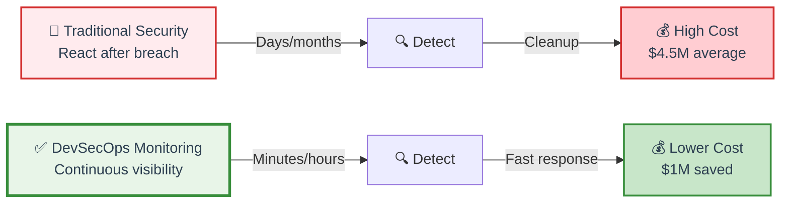

---

### 🔄 Monitoring as Feedback Loop

* 🎯 **Purpose:** Learn and improve continuously
* 📊 **Cycle:** Monitor → Detect → Respond → Analyze → Improve → Monitor
* ✅ **Benefits:**
  * Catch issues earlier in SDLC
  * Validate security controls work
  * Measure improvement over time
  * Evidence for compliance

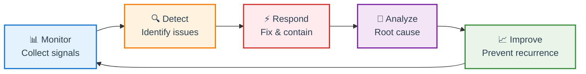

---

### 🎯 Why Continuous Monitoring Matters

* ⏰ **New vulnerabilities discovered daily:**
  * Average: **50+ CVEs per day**
  * Your dependencies get new CVEs after deployment
  * Zero-days emerge (Log4Shell, Heartbleed)
* 🔄 **Configuration drift:**
  * Production changes without approval
  * Unauthorized deployments
  * Expired certificates
* 🚨 **Runtime threats:**
  * Exploitation attempts
  * Unusual network activity
  * Privilege escalation

**Without monitoring:** You're flying blind 🙈

<details>
<summary>💭 <strong>Discussion:</strong> What's worse - no monitoring or alert fatigue?</summary>

**No monitoring:**
* ❌ Breaches go undetected for months
* ❌ No evidence for compliance
* ❌ Can't measure improvement

**Alert fatigue:**
* ⚠️ Real alerts ignored (signal-to-noise problem)
* ⚠️ Teams become desensitized
* ⚠️ Critical alerts missed in noise

**The Answer:** Neither! You need **smart monitoring**:
* ✅ Focus on high-signal alerts (reduce noise)
* ✅ Automate responses where possible
* ✅ Context-aware alerting (not everything is Critical)
* ✅ Regular tuning (remove false positives)

**Key metric:** Alert signal-to-noise ratio should be > 80% actionable
</details>

---

## 📍 Slide 2 – 🔍 What to Monitor: Logs, Metrics, Traces

* 📊 **Observability = Logs + Metrics + Traces** (three pillars)
* 🎯 **Monitoring = subset of observability** (predefined dashboards/alerts)
* 🔑 **Security observability:** Apply three pillars to security signals

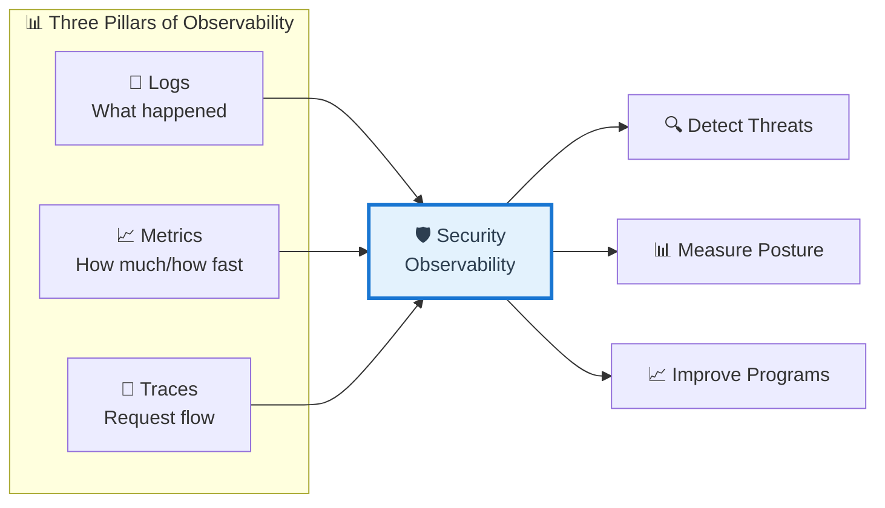

---

### 📝 Logs: What Happened

* 🎯 **Security logs to collect:**
  * **Authentication logs** (who logged in, failed attempts)
  * **Authorization logs** (who accessed what, permission denials)
  * **Audit logs** (configuration changes, policy updates)
  * **Security tool outputs** (scan results, alerts)
  * **Pipeline logs** (build failures, security gate blocks)
  * **Application logs** (errors, exceptions, suspicious patterns)
* 🔍 **Use cases:**
  * Incident investigation (what happened?)
  * Compliance evidence (audit trail)
  * Anomaly detection (unusual patterns)
* ⚠️ **Challenge:** Log volume (terabytes/day in large orgs)

---

### 📈 Metrics: How Much / How Fast

* 🎯 **Security metrics to track:**
  * **Vulnerability counts** (total, by severity)
  * **Detection times** (MTTD - Mean Time to Detect)
  * **Response times** (MTTR - Mean Time to Respond)
  * **Deployment frequency** (with security gates)
  * **Security test coverage** (% of code scanned)
  * **Policy violations** (count, trends)
  * **False positive rate** (alert accuracy)
* 🔍 **Use cases:**
  * Trend analysis (improving or degrading?)
  * SLA tracking (meeting targets?)
  * Capacity planning (security team workload)
* ✅ **Advantage:** Time-series data enables predictions

---

### 🔗 Traces: Request Flow

* 🎯 **Security-relevant traces:**
  * **API call chains** (which services talked to which)
  * **Authentication flows** (token passing, validation)
  * **Data access patterns** (which user accessed sensitive data)
  * **Dependency calls** (external API usage)
* 🔍 **Use cases:**
  * Lateral movement detection (attacker pivoting)
  * Privilege escalation tracking
  * Data exfiltration paths
  * Understanding blast radius
* 🛠️ **Tools:** OpenTelemetry, Jaeger, Zipkin (with security context)

---

### 🛡️ Security-Specific Monitoring Needs

**Beyond traditional observability:**

* 🚨 **Vulnerability trends:**
  * New vulnerabilities discovered
  * Vulnerability backlog growth
  * Fix rates by severity
* 🔄 **Deployment security gates:**
  * % deployments blocked
  * Reasons for blocks
  * Override frequency
* ❌ **Failed security scans:**
  * Which scans failed
  * Failure patterns
  * Recurrence of same issues
* 📋 **Policy violations:**
  * Which policies violated most
  * By team/service
  * Trends over time
* ⏱️ **Incident response:**
  * Response times by severity
  * Escalation patterns
  * Resolution effectiveness

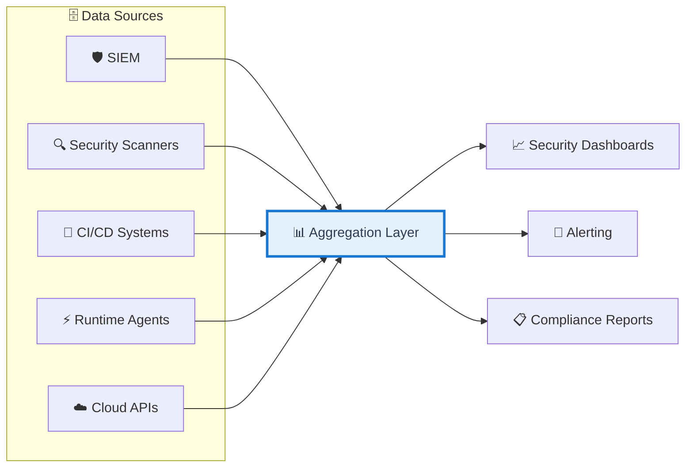

<details>
<summary>💭 <strong>Question:</strong> Should security use the same observability stack as operations?</summary>

**Arguments for sharing:**
* ✅ Correlated data (security + performance together)
* ✅ Cost savings (one platform)
* ✅ Developer familiarity (one tool to learn)
* ✅ Easier incident response (unified view)

**Arguments for separation:**
* ⚠️ Access control (security data is sensitive)
* ⚠️ Retention requirements (compliance needs longer retention)
* ⚠️ Security-specific features (threat intel, CVSS scoring)
* ⚠️ Performance (security logs are high-volume)

**Best Practice:** Hybrid approach
* 🎯 Use shared observability platform (Datadog, Splunk, ELK)
* 🔒 Add security-specific overlays (security dashboards, RBAC)
* 📊 Integrate security tools (feed data into observability platform)
* 🛡️ Separate retention/access for sensitive security data

**Modern trend:** Security observability built into platform (not separate)
</details>

---

## 📍 Slide 3 – 🛠️ Security Monitoring Tools & Platforms

* 🎯 **Tool categories:** SIEM, dashboards, vulnerability platforms, CSPM, observability
* 🔑 **No single tool does everything** → integrated ecosystem
* 📊 **Choose based on:** Scale, budget, existing tools, team skills

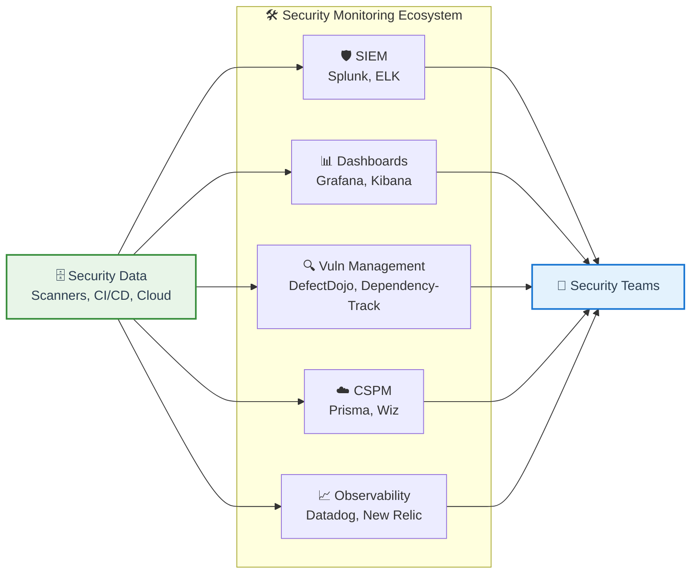

---

### 🛡️ SIEM (Security Information and Event Management)

* 🎯 **Purpose:** Centralized log aggregation, correlation, alerting
* 🔑 **Core capabilities:**
  * Log collection from multiple sources
  * Real-time correlation (detect patterns)
  * Alerting and incident management
  * Long-term retention (compliance)
  * Threat intelligence integration
* 🛠️ **Popular platforms:**
  * **Splunk** (enterprise, expensive, powerful)
  * **ELK Stack** (Elasticsearch, Logstash, Kibana - open-source)
  * **QRadar** (IBM, enterprise)
  * **Azure Sentinel** (cloud-native, Microsoft)
  * **Sumo Logic** (SaaS, modern)
* ⚠️ **Challenge:** High cost (license + storage), complex setup
* 🔗 **Resources:** [Splunk](https://www.splunk.com/), [Elastic Security](https://www.elastic.co/security)

---

### 📊 Security Dashboards

* 🎯 **Purpose:** Visualize security metrics and trends
* 🔑 **Dashboard types:**
  * **Executive dashboard** (high-level, risk scores)
  * **Manager dashboard** (team metrics, SLAs)
  * **Engineer dashboard** (detailed vulnerabilities, remediation)
* 🛠️ **Popular tools:**
  * **Grafana** (open-source, flexible, integrates everything)
  * **Kibana** (part of ELK stack)
  * **Datadog** (SaaS, modern UI)
  * **Tableau/PowerBI** (for compliance reporting)
* ✅ **Best practice:** Different dashboards for different audiences
* 🔗 **Resources:** [Grafana](https://grafana.com/), [Kibana](https://www.elastic.co/kibana)

---

### 🔍 Vulnerability Management Platforms

* 🎯 **Purpose:** Aggregate, deduplicate, track vulnerabilities
* 🔑 **Core capabilities:**
  * Import from multiple scanners (SAST, DAST, SCA)
  * Deduplication (same vuln from multiple tools)
  * Risk scoring and prioritization
  * Workflow management (assign, track, verify)
  * Reporting and metrics
* 🛠️ **Popular platforms:**
  * **DefectDojo** (open-source, developer-friendly)
  * **Dependency-Track** (SBOM-based, open-source)
  * **ThreadFix** (commercial, enterprise)
  * **Jira + plugins** (many teams use issue trackers)
* ✅ **Integration:** Should integrate with CI/CD and dashboards
* 🔗 **Resources:** [DefectDojo](https://www.defectdojo.org/), [Dependency-Track](https://dependencytrack.org/)

---

### ☁️ CSPM (Cloud Security Posture Management)

* 🎯 **Purpose:** Monitor cloud configuration compliance
* 🔑 **What it monitors:**
  * Misconfigured resources (public S3 buckets)
  * IAM overpermissions (too many admin accounts)
  * Network security (open security groups)
  * Compliance violations (CIS benchmarks)
  * Configuration drift (unauthorized changes)
* 🛠️ **Popular platforms:**
  * **Prisma Cloud** (Palo Alto, multi-cloud)
  * **Wiz** (modern, developer-friendly)
  * **Orca Security** (agentless)
  * **AWS Security Hub** (AWS-native)
  * **Azure Defender** (Azure-native)
  * **Open-source:** Prowler, ScoutSuite, CloudSploit
* 📊 **Covered in:** Lab 6 (IaC Security)
* 🔗 **Resources:** [Prowler](https://github.com/prowler-cloud/prowler), [Wiz](https://www.wiz.io/)

---

### 📈 Observability Platforms with Security

* 🎯 **Modern trend:** Unified observability + security
* 🔑 **Platforms adding security features:**
  * **Datadog** (APM + security monitoring)
  * **New Relic** (observability + vulnerability management)
  * **Dynatrace** (performance + runtime security)
  * **Elastic** (observability + SIEM in one)
* ✅ **Advantage:** Correlated security + performance data
* 📊 **Use case:** See security issues alongside performance issues
* 🔗 **Resources:** [Datadog Security](https://www.datadoghq.com/product/security-platform/), [Elastic Observability](https://www.elastic.co/observability)

---

### 🏗️ Building Your Security Monitoring Stack

**Typical evolution:**

**Stage 1 (Small teams):**
* 📊 Grafana + Prometheus (metrics)
* 📝 ELK or Loki (logs)
* 🔍 DefectDojo or Jira (vulnerabilities)

**Stage 2 (Growth):**
* ➕ Add SIEM (Splunk or Elastic Security)
* ➕ Add CSPM (cloud-specific tools)
* ➕ Integrate security tools into observability

**Stage 3 (Enterprise):**
* 🏢 Commercial unified platform (Datadog, Splunk)
* 🔄 Full automation (API integrations)
* 🤖 AI/ML for anomaly detection

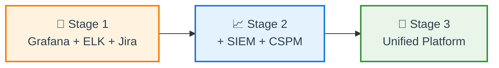

<details>
<summary>💭 <strong>Best Practice:</strong> Start simple, grow as needed</summary>

**Avoid the trap:** Buying expensive enterprise SIEM on day 1

**Better approach:**

**Month 1:**
* ✅ Start with free tools (Grafana, ELK)
* ✅ Focus on key metrics (vulnerabilities, deployment frequency)
* ✅ Manual processes are OK initially

**Month 3:**
* ✅ Automate data collection (CI/CD integration)
* ✅ Add basic alerting (critical vulns, failed deployments)
* ✅ Create team dashboards

**Month 6:**
* ✅ Evaluate commercial tools (if free tools limiting)
* ✅ Add advanced features (anomaly detection, correlation)
* ✅ Integrate threat intelligence

**Month 12:**
* ✅ Mature monitoring program
* ✅ Evidence-based tool decisions
* ✅ Proven ROI before big investments

**Key insight:** Your monitoring needs will change as you grow. Build for now, plan for future.
</details>

---

🔗 **Resources for Group 1:**
* [IBM Cost of Data Breach Report](https://www.ibm.com/security/data-breach)
* [NIST Cybersecurity Framework: Detect Function](https://www.nist.gov/cyberframework/detect)
* [Grafana Security Dashboards](https://grafana.com/grafana/dashboards/?search=security)
* [DefectDojo](https://www.defectdojo.org/)
* [Elastic Security](https://www.elastic.co/security)
* [OpenTelemetry Security](https://opentelemetry.io/)

---

## 📂 Group 2: Security Metrics & KPIs

## 📍 Slide 4 – 📈 Security Metrics vs Vanity Metrics

* 📊 **Metric** = quantifiable measurement of security program effectiveness
* 🎯 **KPI (Key Performance Indicator)** = metric tied to business objectives
* ⚠️ **Vanity metric** = looks impressive but doesn't drive decisions
* 🔑 **Goal:** Measure what matters, not what's easy to count

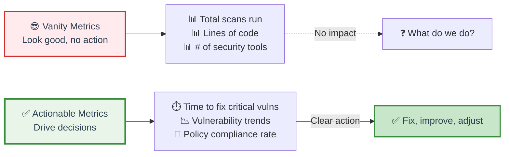

---

### 😎 Vanity Metrics (Avoid These)

**Look impressive but don't help:**

* ❌ **Total number of scans run** (doesn't mean code is secure)
* ❌ **Lines of code scanned** (quantity ≠ quality)
* ❌ **Number of security tools deployed** (tool sprawl ≠ security)
* ❌ **Total vulnerabilities found** (without context of severity/age)
* ❌ **Number of security meetings** (meetings ≠ action)
* ❌ **Security training completion rate** (completion ≠ behavior change)

**Why they're bad:**
* 🎯 No actionable insight (what should we do?)
* 📊 Can be gamed (inflate numbers without improving security)
* 💼 Create false confidence (high numbers ≠ secure)

---

### ✅ Actionable Metrics (Use These)

**Drive real decisions:**

* ✅ **Mean Time to Remediate (MTTR)** → Are we getting faster?
* ✅ **Vulnerability backlog trend** → Growing or shrinking?
* ✅ **Deployment security gate pass rate** → Quality improving?
* ✅ **Critical vulnerability age** → Old vulns still open?
* ✅ **False positive rate** → Are alerts useful?
* ✅ **Policy compliance rate** → Meeting standards?
* ✅ **Security test coverage** → Blind spots?

**Why they're good:**
* 🎯 Clear action (if metric is bad, we know what to fix)
* 📊 Tied to business impact (reduce risk, improve speed)
* 📈 Show trends (improving or degrading?)

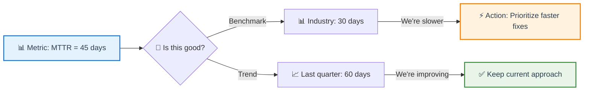

---

### 📏 SMART Criteria for Security Metrics

* 📊 **Specific:** Clear definition (no ambiguity)
* 📐 **Measurable:** Quantifiable (numbers, not feelings)
* 🎯 **Achievable:** Realistic targets (not impossible goals)
* 🔗 **Relevant:** Tied to business objectives (reduce risk, enable speed)
* ⏰ **Time-bound:** Defined timeframe (monthly, quarterly)

**Example:**

**❌ Bad metric:** "Improve security"
* Not specific, not measurable, no timeframe

**✅ Good metric:** "Reduce MTTR for critical vulnerabilities from 45 days to 30 days by Q3 2024"
* Specific (MTTR, critical vulns)
* Measurable (45 → 30 days)
* Achievable (33% improvement)
* Relevant (faster fixes = lower risk)
* Time-bound (Q3 2024)

---

### 📊 Leading vs Lagging Indicators

* 🔮 **Leading indicators:** Predict future outcomes (proactive)
* 📈 **Lagging indicators:** Measure past results (reactive)

| Type | Examples | Use Case |
|------|----------|----------|
| 🔮 **Leading** | • Security test coverage<br/>• Pre-commit scan adoption<br/>• Training completion | Predict future security posture |
| 📈 **Lagging** | • Vulnerabilities found in prod<br/>• Breach incidents<br/>• MTTR | Measure past performance |

**Best practice:** Track both
* 🔮 Leading → Prevent problems
* 📈 Lagging → Validate improvements

<details>
<summary>💭 <strong>Warning:</strong> Goodhart's Law in Security</summary>

**Goodhart's Law:** "When a measure becomes a target, it ceases to be a good measure"

**Security examples:**

**Metric:** Number of vulnerabilities fixed per sprint
* 🎯 **Goal:** Increase fixes
* 🚨 **Gaming:** Team fixes low-severity vulns, ignores critical ones
* 💥 **Result:** High numbers, low security

**Metric:** Security scan pass rate
* 🎯 **Goal:** Clean scans
* 🚨 **Gaming:** Disable strict rules, mark issues as false positives
* 💥 **Result:** Green dashboards, vulnerable code

**Metric:** Training completion rate
* 🎯 **Goal:** 100% completion
* 🚨 **Gaming:** Click through without learning
* 💥 **Result:** Certificates issued, no behavior change

**How to avoid:**
* ✅ Use multiple metrics (can't game all)
* ✅ Focus on outcomes, not activities
* ✅ Regular audits of metric quality
* ✅ Combine quantitative + qualitative assessment

**Remember:** Metrics should serve security, not the other way around
</details>

---

## 📍 Slide 5 – ⏱️ Time-Based KPIs: MTTD, MTTR, MTTA

* ⏰ **Time is money** in security (literally)
* 🎯 **Four critical time-based KPIs:** MTTD, MTTR, MTTA, Dwell Time
* 📊 **Track trends:** Are we getting faster?

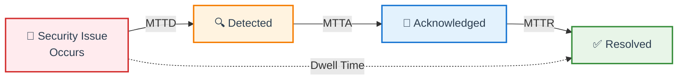

---

### 🔍 MTTD (Mean Time to Detect)

* 🎯 **Definition:** Average time from issue occurrence → detection
* 📊 **Formula:** Sum of detection times / Number of incidents
* ⏰ **Industry benchmark:**
  * **Best-in-class:** < 1 hour
  * **Good:** < 24 hours
  * **Average:** 24-72 hours
  * **Poor:** > 1 week
* 🔑 **Improvements:**
  * Continuous scanning (not scheduled)
  * Real-time alerting (not daily reports)
  * Automated detection (no manual review)
  * Better tooling (reduce false negatives)

**Why it matters:**
* ⏰ Faster detection = smaller blast radius
* 💰 Every hour counts (cost escalates quickly)
* 🎯 Measure effectiveness of monitoring

---

### ⚡ MTTR (Mean Time to Respond/Resolve)

* 🎯 **Definition:** Average time from detection → resolution
* 📊 **Formula:** Sum of resolution times / Number of incidents
* ⏰ **SLAs by severity:**

| Severity | Target MTTR | Example |
|----------|-------------|---------|
| 🔴 **Critical** | < 24 hours | Remote code execution in production |
| 🟠 **High** | < 7 days | SQL injection in API |
| 🟡 **Medium** | < 30 days | Outdated library with CVE |
| 🟢 **Low** | < 90 days | Info disclosure, low impact |

* 🔑 **Improvements:**
  * Automated remediation (Dependabot, auto-patching)
  * Prioritization (fix critical first)
  * Clear ownership (who fixes what)
  * Runbooks (standardized procedures)

**Why it matters:**
* ⏰ Faster fixes = lower risk exposure
* 📊 Measure team responsiveness
* 🎯 SLA compliance

---

### 👀 MTTA (Mean Time to Acknowledge)

* 🎯 **Definition:** Average time from detection → someone starts working on it
* 📊 **Formula:** Sum of acknowledgment times / Number of incidents
* ⏰ **Target:** < 1 hour for critical issues
* 🔑 **Improvements:**
  * Clear escalation paths (who's on-call?)
  * Good alerting (right person, right channel)
  * Reduce alert fatigue (fewer false positives)
  * Incident response playbooks

**Why it matters:**
* ⏰ Shows organizational responsiveness
* 📊 Identifies process bottlenecks (alerts ignored?)
* 🚨 High MTTA = alerts not working

---

### 🕵️ Dwell Time (Attacker Dwell Time)

* 🎯 **Definition:** Time from initial compromise → detection
* ⏰ **Industry benchmarks:**
  * **2024 average:** 16 days (IBM)
  * **Ransomware:** 5-7 days
  * **Nation-state:** 200+ days (SolarWinds = 9 months)
* 🔥 **Why critical:**
  * Longer dwell time = more damage
  * Attackers establish persistence
  * Data exfiltration happens slowly
* 🔑 **Improvements:**
  * Runtime monitoring (detect anomalies)
  * Deception technology (honeypots)
  * Behavioral analysis (unusual patterns)
  * Threat hunting (proactive search)

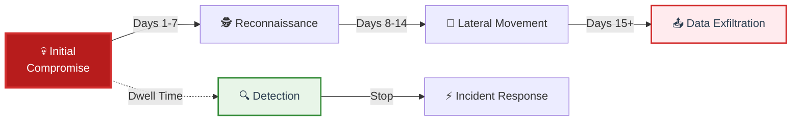

---

### 📊 Time-Based KPI Dashboard Example

**Tracking over time:**

| Metric | Q1 2024 | Q2 2024 | Target | Trend |
|--------|---------|---------|--------|-------|
| **MTTD** | 48 hrs | 24 hrs | < 24 hrs | 📉 Improving |
| **MTTA** | 2 hrs | 1.5 hrs | < 1 hr | 📉 Improving |
| **MTTR (Critical)** | 5 days | 3 days | < 2 days | 📉 Improving |
| **MTTR (High)** | 15 days | 12 days | < 7 days | 📉 Improving |
| **Dwell Time** | 21 days | 18 days | < 10 days | 📉 Improving |

✅ **All metrics improving** → Security program maturing

<details>
<summary>💭 <strong>Discussion:</strong> What's more important - MTTD or MTTR?</summary>

**It depends on context!**

**MTTD matters more when:**
* 🚨 Active breaches (every minute counts)
* 🏃‍♂️ Fast-moving threats (ransomware, worms)
* 💰 High-value targets (financial, healthcare)
* 🔍 You have good detection but slow response

**MTTR matters more when:**
* 📊 Known vulnerability backlog (need to clear it)
* 🔧 Complex remediation (patches, code changes)
* 👥 Limited team capacity (can't do everything)
* ⚡ You detect quickly but fix slowly

**Best answer:** Both matter!
* 🎯 **MTTD** determines how long attacker has undetected
* 🎯 **MTTR** determines how long vulnerability exists after detection

**Optimization strategy:**
1. First: Improve MTTD (detect threats faster)
2. Then: Improve MTTR (fix faster)
3. Continuously: Reduce both

**Real-world priority:**
* Critical issues: MTTD < 1 hour, MTTR < 24 hours
* High issues: MTTD < 24 hours, MTTR < 7 days
</details>

---

## 📍 Slide 6 – 📊 Program Health KPIs

* 🎯 **Beyond time:** Other KPIs that measure security program effectiveness
* 📈 **Categories:** Coverage, quality, compliance, efficiency

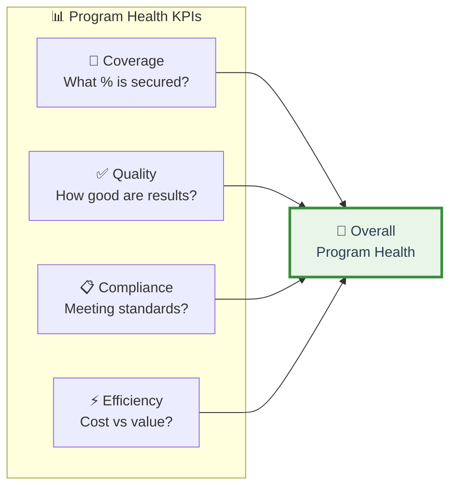

---

### 📐 Coverage Metrics

* 🎯 **Security test coverage:**
  * % of codebase scanned by SAST
  * % of APIs tested by DAST
  * % of dependencies scanned by SCA
  * % of infrastructure scanned (IaC)
* **Target:** > 80% coverage
* **Blind spots:** Code without security testing = high risk

**Formula:**
```
Coverage = (Lines scanned / Total lines) × 100%
```

* 📊 **Deployment security gate coverage:**
  * % of deployments going through security gates
  * % of services with automated security tests
* **Target:** 100% of production deployments

---

### ✅ Quality Metrics

* 🎯 **False positive rate:**
  * % of alerts that are not real issues
  * **Formula:** False positives / Total alerts × 100%
  * **Target:** < 20% false positive rate
  * **High FP rate:** Alert fatigue, ignored alerts

* 📊 **Deployment security gate pass rate:**
  * % of builds passing security gates on first try
  * **Low pass rate:** Quality issues, rushed code
  * **High pass rate:** Good security practices

* 🔄 **Vulnerability recurrence rate:**
  * % of fixed vulnerabilities that reappear
  * **Formula:** Recurring vulns / Total fixed × 100%
  * **Target:** < 5% recurrence
  * **High recurrence:** Root cause not addressed

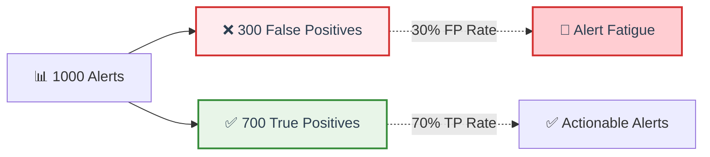

---

### 📋 Compliance Metrics

* 🎯 **Policy compliance rate:**
  * % of deployments meeting security policies
  * **Target:** > 95% compliance
  * **Violations:** Track what policies are violated most

* ⏰ **Remediation SLA compliance:**
  * % of vulnerabilities fixed within SLA
  * **By severity:** Track separately (critical vs low)
  * **Target:** 90% for critical, 80% for high

* 📊 **Audit findings:**
  * Number of findings in compliance audits
  * **Trend:** Should decrease over time
  * **Severity:** Critical findings should be zero

**Example tracking:**

| Policy | Compliance Rate | Violations This Month |
|--------|----------------|-----------------------|
| No secrets in code | 98% | 12 |
| Container images signed | 95% | 34 |
| SBOM generated | 100% | 0 |
| Critical vulns < 24hr | 85% | 8 |

---

### ⚡ Efficiency Metrics

* 💰 **Cost per vulnerability found:**
  * Security tool costs / Vulnerabilities found
  * **Lower is better** (but don't compromise coverage)

* 👥 **Security team velocity:**
  * Vulnerabilities triaged per week
  * Vulnerabilities fixed per week
  * **Trend matters:** Improving or stagnating?

* 🤖 **Automation rate:**
  * % of security tasks automated
  * **Target:** > 70% automated
  * **Manual work:** Should be for high-value activities

* 📊 **Mean time between failures (MTBF):**
  * Average time between security incidents
  * **Higher is better** (fewer incidents)

---

### 🎯 Vulnerability-Specific Metrics

**Covered in Lecture 10, but related:**

* 📊 **Vulnerability backlog:**
  * Total open vulnerabilities (trend)
  * By severity (critical, high, medium, low)
  * **Growing backlog:** Problem

* ⏰ **Vulnerability age:**
  * Average age of open vulnerabilities
  * **Critical vulns:** Should be < 7 days old
  * **Old vulns:** Technical debt

* 📈 **Vulnerability introduction rate:**
  * New vulnerabilities found per sprint/release
  * **High rate:** Quality issues
  * **Trend:** Should stabilize or decrease

* 📉 **Vulnerability fix rate:**
  * Vulnerabilities fixed per sprint/release
  * **Should exceed introduction rate**

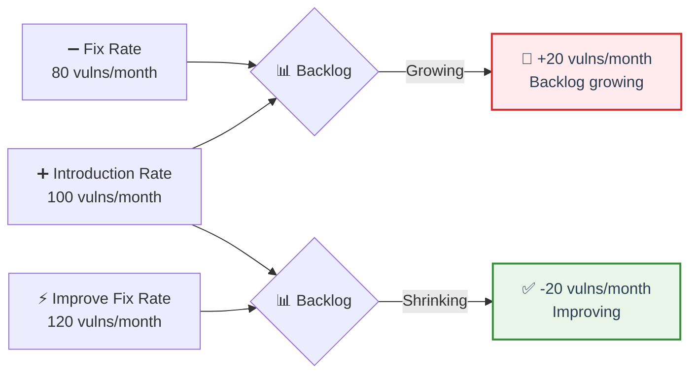

<details>
<summary>💭 <strong>Pro Tip:</strong> Balance quantity and quality metrics</summary>

**Common mistake:** Focus only on quantity
* ❌ "We fixed 500 vulnerabilities this quarter!"
* ❓ But were they the right ones? Were they actually fixed? Did new ones appear?

**Better approach:** Combine metrics
* ✅ Fixed 500 vulnerabilities (quantity)
* ✅ 90% were High/Critical (quality)
* ✅ Recurrence rate < 5% (sustainability)
* ✅ Backlog decreased 20% (progress)

**Dashboard structure:**

**Quantity metrics:**
* Total vulnerabilities found/fixed
* Scan coverage
* Tests run

**Quality metrics:**
* False positive rate
* Recurrence rate
* SLA compliance

**Impact metrics:**
* MTTR by severity
* Backlog trend
* Risk score trend

**All three together = complete picture**
</details>

---

## 📍 Slide 7 – 💻 Hands-On: Building Security Dashboards

* 🎯 **Goal:** Turn metrics into visual insights
* 📊 **Audience matters:** Different dashboards for different roles
* 🛠️ **Tools:** Grafana, Kibana, Datadog (covered in Slide 3)

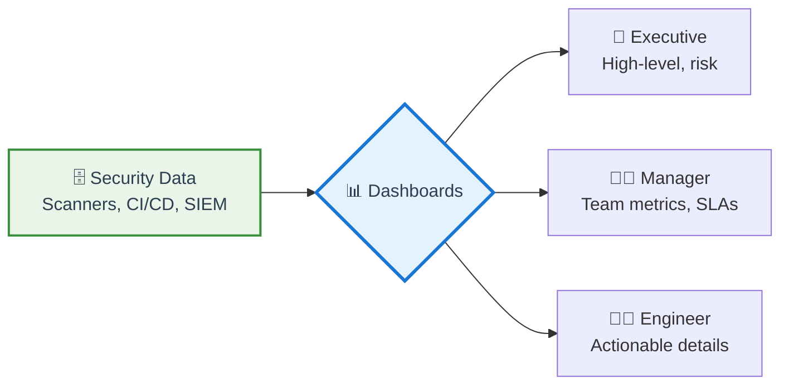

---

### 👔 Executive Dashboard

**Purpose:** At-a-glance security posture

**Key elements:**
* 🎯 **Risk score trend** (improving or degrading?)
* 📊 **Critical vulnerability count** (must be near zero)
* ⏰ **MTTR for critical issues** (meeting SLAs?)
* 📋 **Compliance status** (red/yellow/green)
* 💰 **Security incidents this quarter** (count and cost)
* 📈 **Trend lines** (quarter-over-quarter comparison)

**Design principles:**
* 🚦 Red/Yellow/Green indicators (traffic light)
* 📉 Simple trend lines (up/down arrows)
* 🔢 Big numbers (easy to read from distance)
* ⏱️ Updated daily (no stale data)

**Avoid:**
* ❌ Too many metrics (< 8 KPIs)
* ❌ Technical jargon (use business language)
* ❌ Detailed vulnerability lists

---

### 👨‍💼 Manager Dashboard

**Purpose:** Team performance and SLA tracking

**Key elements:**
* ⏰ **Time-based KPIs:** MTTD, MTTR, MTTA by team
* 📊 **Backlog by severity:** Trend over time
* 📋 **SLA compliance:** % meeting targets
* 👥 **Team velocity:** Vulns fixed per sprint
* 🔄 **Deployment gate metrics:** Pass/fail rates
* 🚨 **Alert volume:** Are alerts actionable?

**Design principles:**
* 📅 Weekly/monthly views (operational timeframe)
* 📊 Comparison charts (team vs team, sprint vs sprint)
* 🎯 Threshold indicators (SLA targets marked)
* 🔍 Drill-down capability (click for details)

---

### 👨‍💻 Engineer Dashboard

**Purpose:** Actionable vulnerability details

**Key elements:**
* 🚨 **My assigned vulnerabilities:** Sorted by severity
* ⏰ **Age indicators:** How old is each issue?
* 📊 **Source:** Which scanner found it?
* 🔧 **Remediation guidance:** How to fix
* 📈 **Trend for my services:** Getting better or worse?
* 🔄 **Recent scans:** Latest results

**Design principles:**
* ✅ Actionable (click to open ticket/PR)
* 🎯 Filtered view (only relevant to me)
* 🔔 Real-time updates (no refresh needed)
* 📱 Mobile-friendly (view on the go)

**Avoid:**
* ❌ Aggregated metrics (too high-level)
* ❌ Historical data (focus on current)

---

### 🎨 Dashboard Design Best Practices

**Layout:**
* 📐 **F-pattern:** Most important top-left
* 🎯 **Grouping:** Related metrics together
* 🌈 **Color coding:** Consistent (red = bad, green = good)
* ⚡ **Performance:** Load in < 2 seconds

**Visualization types:**

| Metric Type | Best Visualization |
|-------------|-------------------|
| **Single value** | Gauge, big number |
| **Trend over time** | Line chart, area chart |
| **Comparison** | Bar chart, column chart |
| **Distribution** | Histogram, pie chart |
| **Status** | Table, heatmap |

**Refresh rates:**
* 🔴 **Critical dashboards:** Real-time (< 1 min)
* 🟡 **Operational:** Every 5-15 minutes
* 🟢 **Strategic:** Daily

---

### 🛠️ Data Sources for Dashboards

**Common integrations:**

* 🔍 **Vulnerability scanners:**
  * Snyk, Trivy, Grype (via API)
  * DefectDojo (centralized)
  
* 🔄 **CI/CD systems:**
  * GitHub Actions (workflow runs)
  * GitLab CI (pipeline status)
  * Jenkins (build metrics)
  
* ☁️ **Cloud providers:**
  * AWS Security Hub
  * Azure Defender
  * GCP Security Command Center
  
* 📊 **SIEM platforms:**
  * Splunk, ELK (query APIs)
  
* 📋 **Issue trackers:**
  * Jira, GitHub Issues (vulnerability tickets)

**Data collection methods:**
* 🔌 **Direct API:** Query tools directly
* 📤 **Push model:** Tools send data to dashboard
* 🗄️ **Data warehouse:** Centralized metrics database (recommended)

---

### 📊 Example Grafana Setup

**Architecture:**

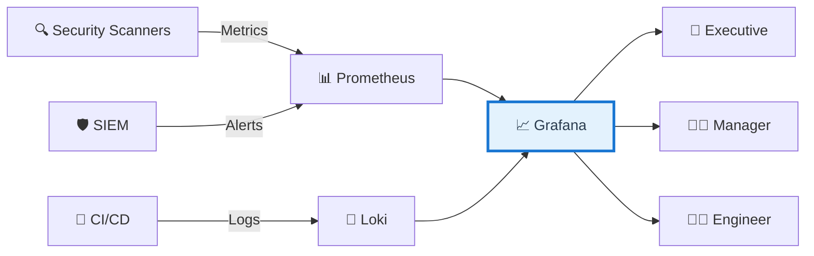

**Prometheus exporters:**
* 🔍 Custom exporters for security tools
* 📊 Metrics: vulnerability counts, scan durations, MTTR
* ⏰ Scrape interval: 30-60 seconds

**Grafana panels:**
* 📈 Time-series (MTTR trend)
* 📊 Bar gauge (vulnerability counts by severity)
* 🎯 Stat panel (big numbers with thresholds)
* 📋 Table (vulnerability list)

---

### 🚀 Implementation Roadmap

**Week 1: Foundation**
* ✅ Define key metrics (5-10 KPIs)
* ✅ Identify data sources
* ✅ Set up Grafana/Kibana

**Week 2: Data Collection**
* ✅ Connect data sources
* ✅ Create Prometheus exporters (if needed)
* ✅ Validate data accuracy

**Week 3: Dashboard Development**
* ✅ Build executive dashboard
* ✅ Build manager dashboard
* ✅ Build engineer dashboard

**Week 4: Rollout**
* ✅ Share dashboards with teams
* ✅ Gather feedback
* ✅ Iterate and improve

**Ongoing:**
* 🔄 Weekly review of metrics
* 📊 Monthly dashboard tuning
* 🎯 Quarterly metric review (add/remove KPIs)

<details>
<summary>💭 <strong>Common Mistakes to Avoid</strong></summary>

**1. Too many metrics (dashboard clutter)**
* ❌ 50 metrics on one dashboard
* ✅ 5-8 key metrics per dashboard

**2. No context (numbers without meaning)**
* ❌ "45 vulnerabilities"
* ✅ "45 vulnerabilities (down from 60 last week)"

**3. Stale data (nobody trusts it)**
* ❌ Updated weekly
* ✅ Updated hourly/daily

**4. One dashboard for everyone**
* ❌ Same view for CEO and engineer
* ✅ Different dashboards for different roles

**5. No actionability (pretty but useless)**
* ❌ Can only view metrics
* ✅ Click to drill down, create tickets, investigate

**6. Ignoring mobile (everyone has phones)**
* ❌ Only works on desktop
* ✅ Responsive design

**7. No alerting (passive monitoring)**
* ❌ Must check dashboard manually
* ✅ Alerts sent to Slack/email when thresholds crossed

**Remember:** Dashboard is a tool, not a goal. Focus on driving decisions, not pretty charts.
</details>

---

## 🎉 Fun Break: "When Metrics Go Wrong"

### 📊 Goodhart's Law: The Cobra Effect

**The Original "Cobra Effect" (Delhi, British India):**
* 🐍 Problem: Too many cobras in Delhi
* 💡 Solution: Government pays bounty for dead cobras
* 🎯 Result: People start breeding cobras to kill for bounty
* 💥 Outcome: More cobras than before!

**Security Metrics Edition:**

**Metric:** "Number of vulnerabilities fixed per month"
* 🎯 **Target:** Increase fixes to 500/month
* 📊 **Result:** Team fixes hundreds of "info" severity issues, ignores critical ones
* 💥 **Outcome:** Dashboard looks green, critical vulns unfixed for months

**Metric:** "100% test coverage"
* 🎯 **Target:** All code must have tests
* 📊 **Result:** Developers write meaningless tests that always pass
* 💥 **Outcome:** 100% coverage, 0% actual security validation

**Metric:** "Zero security gate failures"
* 🎯 **Target:** All builds pass security gates
* 📊 **Result:** Teams lower security gate thresholds or disable checks
* 💥 **Outcome:** Green pipelines, vulnerable code in production

**Metric:** "Reduce security incidents to zero"
* 🎯 **Target:** No incidents reported
* 📊 **Result:** Teams stop reporting incidents (bad for career)
* 💥 **Outcome:** Zero reported incidents, many unreported breaches

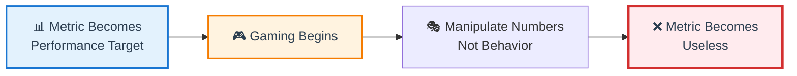

---

### 🛡️ How to Prevent Gaming

**1. Use multiple metrics (can't game them all)**
* ✅ Vulnerabilities fixed + MTTR + recurrence rate
* ❌ Just count of vulnerabilities fixed

**2. Focus on outcomes, not activities**
* ✅ Reduction in production incidents
* ❌ Number of security scans run

**3. Measure what you can't easily manipulate**
* ✅ Customer-reported security issues
* ❌ Self-reported compliance scores

**4. Regular audits**
* ✅ Sample vulnerabilities to verify fixes are real
* ✅ Review code to verify tests are meaningful

**5. Qualitative + quantitative**
* ✅ Metrics + peer reviews + incident retrospectives
* ❌ Metrics alone

**6. Transparent goals**
* ✅ "Improve security posture" (outcome)
* ❌ "Hit these exact numbers" (output)

---

### 💡 Real-World Gaming Examples

**Case 1: The "False Positive" Epidemic**
* 🎯 Metric: Reduce open vulnerability count
* 🎮 Gaming: Mark everything as "false positive" or "won't fix"
* 📊 Dashboard: 95% vulnerabilities resolved!
* 💥 Reality: Nothing actually fixed, just hidden

**Case 2: The Test Coverage Illusion**
* 🎯 Metric: 80% code coverage required
* 🎮 Gaming: Write tests that call functions but assert nothing
* 📊 Dashboard: 85% coverage achieved!
* 💥 Reality: Tests pass even with vulnerabilities

**Case 3: The Quick Fix Trap**
* 🎯 Metric: MTTR < 24 hours for critical
* 🎮 Gaming: Mark critical as "mitigated" (not actually fixed), downgrade severity
* 📊 Dashboard: 100% SLA compliance!
* 💥 Reality: Critical vulnerabilities still exploitable

**Lessons:**
* 🎯 Metrics should help, not hurt
* 👁️ Trust but verify
* 🔄 Continuously refine metrics
* 🧠 Use judgment, not just dashboards

---

### 🤔 The Right Way to Use Metrics

**Metrics are:**
* ✅ Conversation starters (not conversation enders)
* ✅ Indicators (not absolute truth)
* ✅ Tools for improvement (not punishment)

**Metrics are NOT:**
* ❌ Performance review scores
* ❌ Targets to hit at all costs
* ❌ Replacement for judgment

**Golden rule:** "If a metric becomes a target, prepare to change the metric"

---

🔗 **Resources for Group 2:**
* [SANS Security Metrics Guide](https://www.sans.org/white-papers/55/)
* [OWASP Security Metrics](https://owasp.org/www-community/Security_Metrics)
* [Google SRE Book - Monitoring](https://sre.google/sre-book/monitoring-distributed-systems/)
* [Grafana Dashboards](https://grafana.com/grafana/dashboards/)
* [IBM Cost of Data Breach Report](https://www.ibm.com/security/data-breach)
* [Goodhart's Law Explained](https://en.wikipedia.org/wiki/Goodhart%27s_law)

---
## 📂 Group 3: Compliance Frameworks

## 📍 Slide 8 – ⚖️ Compliance Basics for Developers

* ⚖️ **Compliance** = meeting legal/regulatory requirements
* 💰 **Non-compliance cost:** Fines (€20M+), lawsuits, lost business
* 🔑 **Key insight:** Compliance ≠ security (overlap ~70%)
* 🎯 **Compliance:** Minimum baseline (point-in-time audits)
* 🛡️ **Security:** Continuous improvement (real-time protection)

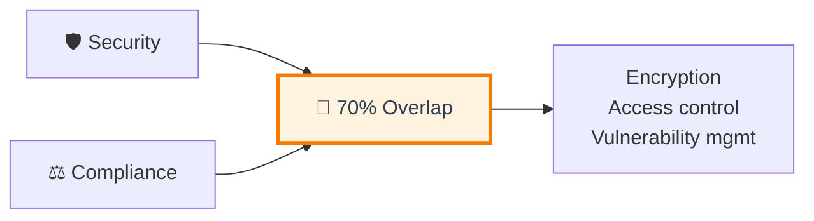

**Developer responsibilities:**
* 🔐 Encrypt sensitive data (at rest, in transit)
* 🔑 Access control (authentication, authorization)
* 📋 Audit logs (who accessed what)
* 🗑️ Data deletion (GDPR "right to be forgotten")
* 🚨 Breach notification (within 72 hours)

---

## 📍 Slide 9 – 🇪🇺 GDPR Essentials

* 🇪🇺 **GDPR:** EU data privacy regulation (applies globally if you have EU users)
* 💰 **Penalty:** €20M or 4% revenue (whichever higher)
* 📅 **Effective:** May 2018

**Key principles:**
* 📊 Data minimization (collect only what's needed)
* 🔐 Privacy by design (build privacy in from start)
* ⏰ Storage limitation (don't keep forever)
* ✅ User consent (explicit opt-in)

**User rights (must implement):**
* 📥 Right to access (export my data)
* ✏️ Right to rectification (correct my data)
* 🗑️ Right to erasure (delete my data)
* 📤 Right to portability (transfer my data)

**Technical requirements:**
* 🔒 Encryption mandatory (at rest, in transit)
* 📋 Audit logs (track all access)
* 🚨 Breach notification within 72 hours
* 🔗 [GDPR Official](https://gdpr.eu/)

---

## 📍 Slide 10 – 🏛️ NIST Cybersecurity Framework

* 🏛️ **NIST CSF:** US risk management framework (voluntary but widely adopted)
* 🎯 **5 Functions:** Identify → Protect → Detect → Respond → Recover

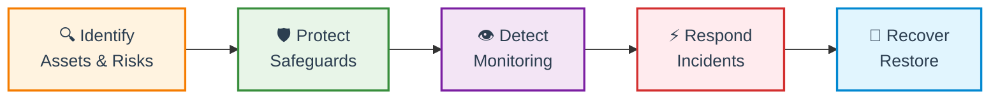

**DevSecOps mapping:**
* 🔍 Identify: SBOM, threat modeling, asset inventory
* 🛡️ Protect: SAST/DAST, IaC security, secrets management
* 👁️ Detect: Vulnerability scanning, SIEM, monitoring
* ⚡ Respond: Incident response, automated rollback
* 🔄 Recover: Backup/restore, disaster recovery

* 🔗 [NIST CSF](https://www.nist.gov/cyberframework)

---

## 📍 Slide 11 – 🌐 ISO 27001 Basics

* 🌐 **ISO 27001:** International standard for ISMS (Information Security Management System)
* 🏆 **Certification-based:** Requires external audit
* 📋 **Structure:** PDCA cycle (Plan-Do-Check-Act) + 93 security controls

**Annex A domains (14 categories):**
* Access control, cryptography, operations security
* Secure development, supplier relationships, incident management

**Certification timeline:**
* ⏰ Preparation: 6-12 months
* 💰 Cost: $15K-$50K
* 🔄 Renewal: Every 3 years

**Why organizations pursue:**
* 🤝 Customer trust (global recognition)
* 💼 Required for some contracts
* 🌍 Accepted worldwide

* 🔗 [ISO 27001](https://www.iso.org/isoiec-27001-information-security.html)

---

## 📍 Slide 12 – 💳 Other Key Frameworks (Quick Overview)

| Framework | Scope | Geography | Key Requirement |
|-----------|-------|-----------|-----------------|
| 💳 **PCI-DSS** | Payment cards | Global | Protect cardholder data, quarterly scans |
| 📊 **SOC 2** | SaaS/Cloud | US | Trust Service Criteria (Security + optional) |
| 🏥 **HIPAA** | Healthcare | US | Protect PHI, encryption, audit logs |
| 🏛️ **FedRAMP** | Federal cloud | US Gov | NIST 800-53 controls (12-18 months) |

**Quick decision guide:**
* Accept credit cards → **PCI-DSS** (required)
* SaaS company, US customers → **SOC 2**
* Healthcare data → **HIPAA** (required)
* International sales → **ISO 27001**
* US government → **FedRAMP**

---

## 🎉 Fun Break: "The $746M Mistake"

**Amazon's Record GDPR Fine (2021):**
* 🎯 Violation: Targeted advertising without proper consent
* 💰 Fine: €746M (largest ever)
* 🤔 Amazon: "We disagree" (still under appeal)

**Meta's $1.2B Fine (2023):**
* 🎯 Violation: EU-US data transfers without safeguards
* 😱 Response: Threatened to leave Europe

**Lessons:**
* ✅ Cookie consent must be real (reject as easy as accept)
* ✅ Data deletion must be permanent (not soft delete)
* ✅ Privacy policy must be clear (not legalese)
* ❌ Don't ignore regulators

**Developer reality:**
* Before GDPR: `DELETE FROM users`
* After GDPR: 500 lines of cascade deletion code

---

🔗 **Resources for Group 3:**
* [GDPR Official](https://gdpr.eu/)
* [NIST CSF](https://www.nist.gov/cyberframework)
* [ISO 27001](https://www.iso.org/isoiec-27001-information-security.html)
* [PCI-DSS](https://www.pcisecuritystandards.org/)
* [SOC 2](https://www.aicpa.org/interestareas/frc/assuranceadvisoryservices/sorhome)

---
## 📂 Group 3: Compliance Frameworks

## 📍 Slide 8 – ⚖️ Compliance Basics for Developers

* ⚖️ **Compliance** = meeting legal, regulatory, and industry standards
* 🎯 **Why it matters:** Fines, lawsuits, lost business, reputation damage
* 🔑 **Key insight:** Compliance ≠ security (but ~70% overlap)

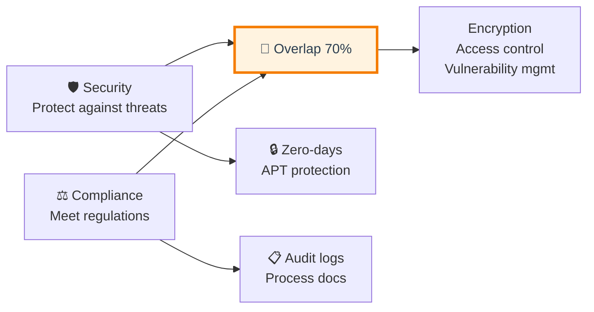

---

### 💰 The Cost of Non-Compliance

**Major penalties:**
* 🇪🇺 **GDPR:** €20M or 4% revenue (Amazon: €746M fine)
* 💳 **PCI-DSS:** $500K/month
* 🏥 **HIPAA:** $1.5M/year (Anthem: $16M settlement)

**Beyond fines:**
* 📉 Stock price drop (avg 7.5% after breach)
* 🤝 Customer churn (31% switch providers)
* 💼 Executive liability

---

### 🎯 Compliance vs Security Differences

| Aspect | Compliance | Security |
|--------|-----------|----------|
| **Goal** | Meet minimum standards | Protect against threats |
| **Timing** | Point-in-time (audits) | Continuous (real-time) |
| **Approach** | Checkbox (yes/no) | Risk-based (prioritize) |
| **Verification** | External auditors | Internal testing |
| **Focus** | Process + documentation | Technical controls |

**Warning:** You can be compliant but insecure!
* ✅ Pass all compliance checks
* 🚨 Still get breached (if only doing minimum)

---

### 👨‍💻 Developer Responsibilities

**What you must implement:**

* 🔐 **Data protection:**
  * Encrypt sensitive data (at rest + in transit)
  * Use TLS 1.2+, AES-256

* 🔑 **Access control:**
  * Authentication (MFA for sensitive access)
  * Authorization (RBAC, least privilege)
  * Session management

* 📋 **Audit logging:**
  * Log security events (who, what, when)
  * Tamper-proof logs (immutable)
  * Retention (7+ years for some regulations)

* 🗑️ **Data lifecycle:**
  * Retention policies (keep for required time)
  * Secure deletion (GDPR "right to be forgotten")
  * Data minimization (collect only necessary)

* 🚨 **Breach response:**
  * Detection mechanisms
  * Notification workflows (72-hour deadline)
  * Incident documentation

---

### 🤖 Compliance Automation in DevSecOps

**Shift-left compliance:**
* 🔍 Pre-commit: Secret scanning, license checks
* 🔄 CI/CD: Policy enforcement (OPA, Sentinel)
* 📊 Runtime: Continuous compliance monitoring

**Benefits:**
* ⏰ Catch issues early (dev vs production)
* 💰 Reduce audit costs (automated evidence)
* 📈 Continuous compliance (not annual)

* 🔗 **Resources:** [GDPR Developer Guide](https://www.smashingmagazine.com/2017/07/privacy-by-design-framework/)

<details>
<summary>💭 <strong>Common Question:</strong> "Do startups need compliance?"</summary>

**YES, if you:**
* 🌍 Have EU users → GDPR (regardless of company location)
* 💳 Accept credit cards → PCI-DSS
* 🏥 Handle health data → HIPAA
* 🏢 Sell to enterprises → SOC 2 often required

**Strategy:**
1. **Now:** Security best practices (encryption, access control)
2. **When customers ask:** Formal compliance programs
3. **For sales:** Certifications (ISO 27001, SOC 2)

**Build compliance in from day 1** (cheaper than retrofitting)
</details>

---

## 📍 Slide 9 – 🇪🇺 GDPR (General Data Protection Regulation)

* 🇪🇺 **GDPR:** EU regulation protecting citizen data privacy
* 📅 **Effective:** May 25, 2018
* 🌍 **Applies to:** ANY company processing EU residents' data (global reach)
* 💰 **Penalty:** €20M or 4% global revenue (whichever higher)
* 🎯 **Core principle:** Privacy by design and by default
* 🔗 **Learn more:** [GDPR Official](https://gdpr.eu/)

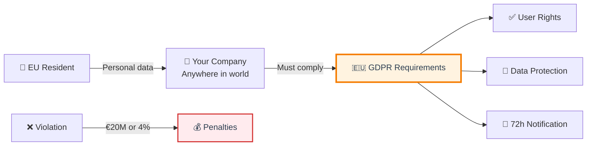

---

### 📋 GDPR Key Principles

* 🎯 **Lawfulness & transparency:** Clear privacy policy, no hidden collection
* 🎯 **Purpose limitation:** Use data only for stated purposes
* 🎯 **Data minimization:** Collect only what's necessary
* 🎯 **Accuracy:** Keep data up-to-date, allow corrections
* 🎯 **Storage limitation:** Delete after retention period
* 🎯 **Integrity & confidentiality:** Security measures mandatory

---

### 👤 User Rights (Must Implement)

**Technical implementations required:**

* ✅ **Right to access:** Export user data (JSON/CSV format)
* ✅ **Right to rectification:** Edit profile/data functionality
* ✅ **Right to erasure:** Delete account + all data permanently
* ✅ **Right to portability:** Transfer data to competitor
* ✅ **Right to object:** Opt-out of processing (e.g., marketing)

**Response time:** 30 days maximum

```mermaid
flowchart LR
    User[👤 User Request] --> Actions{📋 Required Actions}
    
    Actions --> Export[📤 Export Data]
    Actions --> Correct[✏️ Correct Data]
    Actions --> Delete[🗑️ Delete Data]
    
    Delete --> Cascade[🔄 Cascade Delete<br/>All tables]
    Delete --> Backups[💾 Remove from<br/>Backups]
    Delete --> Logs[📋 Anonymize<br/>Audit logs]
    
    style Actions fill:#e3f2fd,stroke:#1976d2,stroke-width:2px,color:#2c3e50
    style Delete fill:#ffebee,stroke:#d32f2f,stroke-width:2px,color:#2c3e50
```

---

### 🔐 Technical Requirements for Developers

**1. Encryption (mandatory):**
* At rest: AES-256 for databases/files
* In transit: TLS 1.2+ for all connections
* Pseudonymization where possible

**2. Access control:**
* RBAC with least privilege
* MFA for admin access
* Audit all PII access

**3. Consent management:**
* Explicit opt-in (no pre-checked boxes)
* Granular consent (separate for each purpose)
* Easy withdrawal mechanism
* Log consent timestamps

**4. Breach notification:**
* Detect breaches (monitoring + alerts)
* Notify DPA within 72 hours
* Notify users if high risk
* Document: what, when, impact, response

---

### ⏰ GDPR Breach Timeline

```mermaid
flowchart LR
    Breach[💥 Breach] -->|0-24h| Assess[🔍 Assess<br/>Impact]
    Assess -->|24-48h| Contain[🛑 Contain]
    Contain -->|48-72h| Notify[📢 Notify DPA]
    
    Assess -->|If high risk| Users[👥 Notify Users<br/>Immediately]
    
    Notify -->|Late?| Fine[💰 Penalty]
    
    style Breach fill:#ffebee,stroke:#d32f2f,stroke-width:3px,color:#2c3e50
    style Notify fill:#fff3e0,stroke:#f57c00,stroke-width:2px,color:#2c3e50
```

---

### ✅ GDPR Implementation Checklist

**Development:**
* ☐ Encrypt all PII (at rest + transit)
* ☐ Implement user data export (machine-readable)
* ☐ Implement permanent deletion (cascade all tables)
* ☐ Consent management (opt-in/opt-out)
* ☐ Access controls (RBAC + MFA)
* ☐ Audit logging (track PII access)

**Operations:**
* ☐ Privacy policy published (plain language)
* ☐ Cookie consent (if applicable)
* ☐ Breach detection monitoring
* ☐ Incident response plan
* ☐ Data retention policy (auto-delete)

<details>
<summary>💭 <strong>GDPR Myth:</strong> "Small companies are exempt"</summary>

**FALSE:** GDPR applies to ALL companies with EU users

**Reality:**
* ✅ Penalties may be lower for SMBs
* ✅ But compliance is still required
* ✅ DPAs consider: size, intent, cooperation

**Example:**
* Small company ($1M revenue): €40K fine (4% of revenue)
* Big Tech ($100B revenue): €20M fine (capped)

**Pro tip:** Build privacy in early, cheaper than retrofitting
</details>

---

## 📍 Slide 10 – 🏛️ NIST Cybersecurity Framework

* 🏛️ **NIST CSF:** US framework for managing cybersecurity risk
* 📅 **Created:** 2014 (updated 2018, 2.0 in 2024)
* 🎯 **Voluntary** but widely adopted (especially US gov contractors)
* 🔑 **Focus:** Risk management, not compliance checklist
* 🔗 **Learn more:** [NIST CSF](https://www.nist.gov/cyberframework)

```mermaid
flowchart LR
    NIST[🏛️ NIST CSF] --> F1[🔍 Identify]
    NIST --> F2[🛡️ Protect]
    NIST --> F3[👁️ Detect]
    NIST --> F4[⚡ Respond]
    NIST --> F5[🔄 Recover]
    
    style NIST fill:#e3f2fd,stroke:#1976d2,stroke-width:3px,color:#2c3e50
```

---

### 📋 Five Functions

**🔍 Identify:** Understand assets, risks, priorities
* Asset management (inventory systems, data)
* Risk assessment (threats, vulnerabilities)
* Supply chain (third-party risks)

**🛡️ Protect:** Implement safeguards
* Access control (authentication, authorization)
* Data security (encryption, DLP)
* Secure SDLC (SAST/DAST)

**👁️ Detect:** Find security events quickly
* Continuous monitoring (security events)
* Anomaly detection (baseline deviations)

**⚡ Respond:** Take action on incidents
* Response planning (IR procedures)
* Mitigation (contain, eliminate)
* Post-incident analysis (lessons learned)

**🔄 Recover:** Restore services
* Recovery planning (restore operations)
* Improvements (update plans)

---

### 🗺️ DevSecOps Mapping to NIST

```mermaid
flowchart LR
    subgraph DevSecOps
        SBOM[📋 SBOM]
        SAST[🔍 SAST/DAST]
        Scan[🔍 Vuln Scanning]
        IR[🚨 Incident Response]
        DR[🔄 DR Testing]
    end
    
    SBOM --> Identify[🔍 Identify]
    SAST --> Protect[🛡️ Protect]
    Scan --> Detect[👁️ Detect]
    IR --> Respond[⚡ Respond]
    DR --> Recover[🔄 Recover]
    
    style DevSecOps fill:#e8f5e8,stroke:#388e3c,stroke-width:2px,color:#2c3e50
```

**Practical examples:**
* **Identify:** SBOM generation, asset inventory
* **Protect:** IaC security scanning, secret management
* **Detect:** SIEM integration, continuous scanning
* **Respond:** Automated rollback, blameless post-mortems
* **Recover:** Backup/restore testing, DR drills

---

### 🎯 Implementation Tiers

| Tier | Name | Characteristics |
|------|------|-----------------|
| **Tier 1** | Partial | Ad-hoc, reactive, no formal processes |
| **Tier 2** | Risk Informed | Policies exist, inconsistent implementation |
| **Tier 3** | Repeatable | Formal policies, regular updates |
| **Tier 4** | Adaptive | Continuous improvement, predictive |

**Most organizations:** Tier 2-3 (Tier 4 is rare)

<details>
<summary>💭 <strong>NIST CSF vs NIST SSDF</strong></summary>

**NIST CSF (Cybersecurity Framework):**
* 🎯 Scope: Entire organization
* 👔 Audience: Executives, CISOs
* 📋 Structure: 5 functions

**NIST SSDF (Secure Software Development):**
* 🎯 Scope: Software development only
* 👨‍💻 Audience: Developers, DevOps
* 📋 Structure: 4 practice groups
* 🔗 Covered in: Lab 8 (supply chain)

**Use both:** CSF for strategy, SSDF for tactics
</details>

---

## 📍 Slide 11 – 🌐 ISO 27001 Information Security Management

* 🌐 **ISO 27001:** International standard for ISMS
* 🏆 **Certification-based:** Requires external audit
* 🎯 **Focus:** Process-driven security management
* 🌍 **Recognition:** Global (accepted worldwide)
* 🔗 **Learn more:** [ISO 27001](https://www.iso.org/isoiec-27001-information-security.html)

```mermaid
flowchart LR
    Plan[📋 Plan<br/>Risk assessment] --> Do[⚙️ Do<br/>Implement]
    Do --> Check[🔍 Check<br/>Audit]
    Check --> Act[⚡ Act<br/>Improve]
    Act --> Plan
    
    style Plan fill:#e3f2fd,stroke:#1976d2,stroke-width:2px,color:#2c3e50
    style Do fill:#e8f5e8,stroke:#388e3c,stroke-width:2px,color:#2c3e50
    style Check fill:#fff3e0,stroke:#f57c00,stroke-width:2px,color:#2c3e50
    style Act fill:#f3e5f5,stroke:#7b1fa2,stroke-width:2px,color:#2c3e50
```

---

### 📋 Structure

**Requirements (Clauses 4-10):**
* Context and leadership
* Risk assessment and treatment
* Implementation and operation
* Performance evaluation
* Continual improvement

**Annex A: 93 Security Controls**
* 14 domains (choose based on risk assessment)
* Examples: Access control, cryptography, operations security, secure development

---

### 🔐 Key Domains for Developers

| Domain | Controls | DevSecOps Examples |
|--------|----------|-------------------|
| **Access Control** | Authentication, privileges | RBAC, MFA, IAM |
| **Cryptography** | Encryption, keys | TLS, secrets management |
| **Operations** | Change mgmt, backups | CI/CD, backup procedures |
| **Development** | Secure SDLC, testing | SAST/DAST, code review |
| **Suppliers** | Third-party security | Supply chain (Lab 8) |
| **Incidents** | Response procedures | IR playbooks |

---

### 🏆 Certification Process

```mermaid
flowchart LR
    Gap[📋 Gap Analysis] --> Implement[⚙️ Implement<br/>6-12 months]
    Implement --> Audit[🔍 External Audit]
    Audit --> Cert{✅ Pass?}
    Cert -->|Yes| Certificate[🎖️ Certificate]
    Cert -->|No| Fix[🔧 Fix]
    Fix --> Audit
    
    Certificate --> Annual[🔄 Annual<br/>Surveillance]
    Annual -.->|3 years| Recert[🔄 Recertify]
    
    style Certificate fill:#e8f5e8,stroke:#388e3c,stroke-width:3px,color:#2c3e50
```

**Timeline & Cost:**
* ⏰ Preparation: 6-12 months
* 💰 Cost: $15K-$50K (audits + consulting)
* 🔄 Maintenance: Annual surveillance audits
* 📅 Renewal: Every 3 years

---

### 💼 Why Organizations Pursue ISO 27001

**Benefits:**
* 🤝 Customer trust (global recognition)
* 💼 Competitive advantage (required for some RFPs)
* 🌐 International sales (accepted in EU, Asia)
* 📋 Reduces audits (one cert vs many customer audits)

**Not for everyone:**
* 💰 Expensive for SMBs (consider SOC 2 instead)
* ⏰ Time-consuming
* 📋 Bureaucratic overhead

<details>
<summary>💭 <strong>ISO 27001 vs SOC 2</strong></summary>

| Aspect | ISO 27001 | SOC 2 |
|--------|-----------|-------|
| **Recognition** | Global | Primarily US |
| **Certificate** | Yes | No (report only) |
| **Cost** | Higher ($15K-$50K) | Lower ($10K-$30K) |
| **Timeline** | 6-12 months | 3-6 months |
| **Best for** | International, EU sales | US SaaS companies |

**Choose based on:** Customer requirements
</details>

---

## 📍 Slide 12 – 💳 Other Key Frameworks (Overview)

### Quick Comparison

| Framework | Applies When | Key Requirement | Penalty |
|-----------|-------------|-----------------|---------|
| 💳 **PCI-DSS** | Accept credit cards | Protect cardholder data | $500K/month |
| 📊 **SOC 2** | SaaS provider | Trust Service Criteria | Lost sales |
| 🏥 **HIPAA** | Healthcare data (US) | Protect PHI, encryption | $1.5M/year |
| 🏛️ **FedRAMP** | US gov cloud | NIST 800-53 controls | No access |

---

### 💳 PCI-DSS (Payment Card Industry)

**12 Requirements (grouped):**
* 🔐 Secure network (firewalls, no defaults)
* 🔐 Protect cardholder data (encrypt storage + transmission)
* 🔐 Vulnerability management (secure development, anti-virus)
* 🔐 Access control (restrict access, unique IDs)
* 🔐 Monitor networks (logs, testing)
* 🔐 Security policy (documented, maintained)

**Developer focus:**
* Never store full card numbers (tokenize)
* Use payment gateway APIs
* Follow OWASP Top 10

---

### 📊 SOC 2 (Service Organization Control)

**Trust Service Criteria:**
* **Security** (required): Protection from unauthorized access
* **Availability** (optional): System uptime
* **Processing Integrity** (optional): Accurate processing
* **Confidentiality** (optional): Confidential data protected
* **Privacy** (optional): Personal info protected

**Types:**
* **Type I:** Controls exist (point-in-time)
* **Type II:** Controls work over 6-12 months

**Timeline:** 6-12 months, $10K-$30K

---

### 🏥 HIPAA (Healthcare - US)

**Technical Safeguards:**
* 🔑 Access control (unique IDs, auto-logoff)
* 📋 Audit logs (all PHI access tracked)
* 🔐 Encryption (PHI at rest + transit)
* 🔒 Integrity controls (prevent alteration)

**Key:** BAA (Business Associate Agreement) required with vendors

---

### 🏛️ FedRAMP (Federal Cloud - US)

**Authorization Levels:**
* **Low:** Public data
* **Moderate:** CUI (most common)
* **High:** National security

**Reality:**
* ⏰ 12-18 months authorization
* 💰 $100K-$500K cost
* 🎯 Only for US federal sales

---

## 🎉 Fun Break: "The €746M Cookie"

### 💰 Biggest GDPR Fines

**Top 3:**
1. **Amazon:** €746M (2021) - Targeted ads without consent
2. **Meta:** €1.2B (2023) - Illegal EU-US data transfers
3. **Google:** €90M (2021) - Cookie consent dark patterns

**Common violations:**
* 🍪 Cookie reject harder than accept
* 📧 Marketing without consent
* 🗑️ Not deleting data (soft delete ≠ deleted)
* 🔓 Poor security (unencrypted databases)

**Lessons:**
* ✅ Consent must be real (reject = easy as accept)
* ✅ Deletion must be permanent (overwrite data)
* ✅ Privacy policy must be clear (plain language)
* ✅ Cooperate with regulators (reduces fines)

**Developer reality:**
* Before GDPR: `DELETE FROM users WHERE id = ?`
* After GDPR: 500 lines cascade deletion + backups + logs

---

🔗 **Resources for Group 3:**
* [GDPR Official](https://gdpr.eu/)
* [NIST CSF](https://www.nist.gov/cyberframework)
* [ISO 27001](https://www.iso.org/isoiec-27001-information-security.html)
* [PCI-DSS](https://www.pcisecuritystandards.org/)
* [SOC 2](https://www.aicpa.org/interestareas/frc/assuranceadvisoryservices/sorhome)
* [HIPAA Security Rule](https://www.hhs.gov/hipaa/for-professionals/security/index.html)

---

## 📂 Group 4: Security Maturity Models

## 📍 Slide 13 – 🎯 Security Maturity Model Concepts

* 🎯 **Maturity model** = framework to assess and improve security practices
* 📊 **Purpose:** Benchmark current state, plan improvements, track progress
* 🔑 **Not compliance:** Maturity = continuous improvement, Compliance = pass/fail

```mermaid
flowchart LR
    Level0[📊 Level 0<br/>Ad-hoc] --> Level1[📋 Level 1<br/>Initial]
    Level1 --> Level2[⚙️ Level 2<br/>Managed]
    Level2 --> Level3[🎯 Level 3<br/>Defined]
    Level3 --> Level4[📈 Level 4<br/>Measured]
    Level4 --> Level5[🏆 Level 5<br/>Optimized]
    
    style Level0 fill:#ffebee,stroke:#d32f2f,stroke-width:2px,color:#2c3e50
    style Level1 fill:#fff3e0,stroke:#f57c00,stroke-width:2px,color:#2c3e50
    style Level2 fill:#fff9c4,stroke:#fbc02d,stroke-width:2px,color:#2c3e50
    style Level3 fill:#e8f5e8,stroke:#388e3c,stroke-width:2px,color:#2c3e50
    style Level4 fill:#e3f2fd,stroke:#1976d2,stroke-width:2px,color:#2c3e50
    style Level5 fill:#1b5e20,stroke:#388e3c,stroke-width:3px,color:#fff
```

---

### 📊 Typical Maturity Levels

| Level | Name | Characteristics | Example |
|-------|------|-----------------|---------|
| **0** | Non-existent | No practices | No security testing |
| **1** | Initial/Ad-hoc | Reactive, inconsistent | Manual security reviews |
| **2** | Managed | Documented, repeatable | Some automated scans |
| **3** | Defined | Standardized, organization-wide | Security in all CI/CD |
| **4** | Measured | Quantified, metrics-driven | MTTR tracked, improving |
| **5** | Optimized | Continuous improvement, predictive | AI-driven, proactive |

**Most organizations:** Level 2-3 (Level 5 is rare)

---

### 🎯 Why Use Maturity Models?

**Benefits:**
* 📊 **Objective assessment:** Where are we now?
* 🗺️ **Roadmap planning:** Where should we go?
* 📈 **Progress tracking:** Are we improving?
* 💼 **Executive communication:** Show maturity to leadership
* 🤝 **Benchmarking:** Compare to industry peers

**Use cases:**
* Gap analysis (what's missing?)
* Budget justification (why invest in security?)
* Team planning (prioritize improvements)
* Customer requirements (prove security maturity)

---

### ⚖️ Maturity vs Compliance

**Maturity Model:**
* 🎯 Goal: Continuous improvement
* 📊 Focus: How well do you do things
* 📈 Assessment: Levels 0-5
* 🔄 Frequency: Ongoing self-assessment
* 💡 Outcome: Improvement roadmap

**Compliance:**
* 🎯 Goal: Meet minimum requirements
* 📋 Focus: Do you meet standards
* ✅ Assessment: Pass/fail
* 📅 Frequency: Annual/periodic audits
* 🏆 Outcome: Certificate/attestation

**Both are important:**
* Compliance = floor (minimum)
* Maturity = ceiling (excellence)

<details>
<summary>💭 <strong>Common Mistake:</strong> Focusing only on maturity level numbers</summary>

**Wrong approach:**
* "We must reach Level 4 in all practices!"
* Spreads resources thin
* Level 4 everywhere = expensive

**Right approach:**
* "We need Level 4 in critical areas, Level 2 in others"
* Focus on what matters most
* Risk-based prioritization

**Example:**
* **Authentication:** Level 4 (critical)
* **Code signing:** Level 3 (important)
* **Security awareness:** Level 2 (basic)
* **Physical security:** Level 1 (cloud-native company)

**Strategy:** Mature what matters, maintain minimum elsewhere
</details>

---

## 📍 Slide 14 – 🦅 OWASP SAMM (Software Assurance Maturity Model)

* 🦅 **OWASP SAMM:** Framework for software security maturity
* 🎯 **Focus:** Software security practices (not entire org)
* 📊 **Structure:** 5 business functions, 15 practices, 3 maturity levels
* 🆓 **Free:** Open-source model with tools
* 🔗 **Learn more:** [OWASP SAMM](https://owaspsamm.org/)

```mermaid
flowchart LR
    SAMM[🦅 OWASP SAMM] --> Gov[🏛️ Governance]
    SAMM --> Design[📐 Design]
    SAMM --> Impl[⚙️ Implementation]
    SAMM --> Verif[✅ Verification]
    SAMM --> Ops[🔄 Operations]
    
    style SAMM fill:#e3f2fd,stroke:#1976d2,stroke-width:3px,color:#2c3e50
```

---

### 📋 SAMM Structure: 5 Business Functions

**🏛️ Governance:**
* Strategy & Metrics (define security goals)
* Policy & Compliance (document standards)
* Education & Guidance (train teams)

**📐 Design:**
* Threat Assessment (identify risks)
* Security Requirements (define what's needed)
* Security Architecture (design secure systems)

**⚙️ Implementation:**
* Secure Build (build securely)
* Secure Deployment (deploy securely)
* Defect Management (track and fix)

**✅ Verification:**
* Architecture Analysis (review design)
* Requirements-driven Testing (test requirements)
* Security Testing (automated + manual)

**🔄 Operations:**
* Incident Management (respond to incidents)
* Environment Management (secure infrastructure)
* Operational Enablement (support teams)

---

### 📊 Maturity Levels in SAMM

**Each practice has 3 levels (0-3):**

| Level | Description | Example: Security Testing |
|-------|-------------|---------------------------|
| **0** | No practice | No security testing |
| **1** | Initial | Manual security reviews, ad-hoc |
| **2** | Managed | Automated SAST/DAST in CI/CD |
| **3** | Defined | Comprehensive testing, metrics, continuous improvement |

**Assessment result:** Scorecard showing current maturity per practice

---

### 🗺️ SAMM Roadmap Generation

**Process:**
1. **Current state:** Assess all 15 practices (self-assessment)
2. **Target state:** Define desired maturity (risk-based)
3. **Gap analysis:** Identify gaps (current vs target)
4. **Roadmap:** Prioritize improvements (phases)
5. **Implement:** Execute roadmap (quarterly iterations)
6. **Measure:** Track progress (re-assess regularly)

```mermaid
flowchart LR
    Assess[📊 Assess<br/>Current State] --> Target[🎯 Define<br/>Target State]
    Target --> Gap[🔍 Gap<br/>Analysis]
    Gap --> Roadmap[🗺️ Build<br/>Roadmap]
    Roadmap --> Implement[⚙️ Implement<br/>Improvements]
    Implement --> Measure[📈 Measure<br/>Progress]
    Measure -.->|Iterate| Assess
    
    style Roadmap fill:#e3f2fd,stroke:#1976d2,stroke-width:3px,color:#2c3e50
```

---

### 🎯 SAMM for DevSecOps Teams

**Most relevant practices:**

| SAMM Practice | DevSecOps Mapping |
|---------------|-------------------|
| **Secure Build** | SAST/DAST in CI/CD, secret scanning |
| **Secure Deployment** | IaC security, container scanning |
| **Security Testing** | Automated security tests, DAST |
| **Defect Management** | Vulnerability tracking, MTTR |
| **Threat Assessment** | Threat modeling (Lab 2) |
| **Security Requirements** | Security stories, acceptance criteria |

**Tool:** [SAMM Toolbox](https://owaspsamm.org/assessment/) (online self-assessment)

<details>
<summary>💭 <strong>SAMM Quick Start:</strong> Where to begin?</summary>

**Priority order for DevSecOps:**

**Phase 1 (First 3 months):**
1. **Security Testing (Verification):** Add SAST/DAST to CI/CD
2. **Defect Management (Implementation):** Track vulnerabilities
3. **Secure Build (Implementation):** Secret scanning, dependency checks

**Phase 2 (Months 4-6):**
4. **Secure Deployment (Implementation):** IaC scanning
5. **Threat Assessment (Design):** Basic threat modeling
6. **Strategy & Metrics (Governance):** Define security KPIs

**Phase 3 (Months 7-12):**
7. **Security Requirements (Design):** Security in user stories
8. **Education & Guidance (Governance):** Security training
9. **Incident Management (Operations):** IR playbooks

**Don't try to do everything at once!** Focus on high-impact, low-effort practices first.
</details>

---

## 📍 Slide 15 – 📊 BSIMM (Building Security In Maturity Model)

* 📊 **BSIMM:** Data-driven maturity model (descriptive, not prescriptive)
* 🏢 **Based on:** Real companies (120+ organizations studied)
* 🎯 **Shows:** What others are doing (not what you should do)
* 📅 **Updated:** Annually with new data
* 🔗 **Learn more:** [BSIMM](https://www.bsimm.com/)

**Key difference from SAMM:**
* SAMM: "Here's what to do" (prescriptive)
* BSIMM: "Here's what others do" (descriptive)

---

### 📋 BSIMM Structure

**4 Domains, 12 Practices:**

**🏛️ Governance:**
* Strategy & Metrics
* Compliance & Policy
* Training

**📊 Intelligence:**
* Attack Models
* Security Features & Design
* Standards & Requirements

**🔧 SSDL Touchpoints:**
* Architecture Analysis
* Code Review
* Security Testing

**🚀 Deployment:**
* Penetration Testing
* Software Environment
* Configuration Management & Vulnerability Management

---

### 📊 BSIMM Activities

**Each practice has activities (119 total):**
* Classified by maturity level
* Shows prevalence (% of companies doing it)

**Example: Code Review practice**
* **Level 1:** Ad-hoc code reviews (75% of companies)
* **Level 2:** Automated SAST in CI/CD (60%)
* **Level 3:** AI-assisted code review (25%)

**Insight:** "If 60% of companies do X, maybe we should too"

---

### 🎯 BSIMM vs SAMM Comparison

| Aspect | BSIMM | SAMM |
|--------|-------|------|
| **Approach** | Descriptive (what others do) | Prescriptive (what to do) |
| **Data** | Real company data | Community best practices |
| **Cost** | Free (report) | Free (open-source) |
| **Updates** | Annual | Ongoing |
| **Best for** | Benchmarking | Improvement roadmap |
| **Use case** | "Are we behind peers?" | "How to improve?" |

**Use both:**
* BSIMM: Benchmark against industry
* SAMM: Build improvement roadmap

<details>
<summary>💭 <strong>BSIMM Insight:</strong> What top performers do differently</summary>

**Top 10% of BSIMM companies:**

**They do MORE of:**
* 🤖 Automation (CI/CD security fully automated)
* 📊 Metrics (track everything, data-driven)
* 🎓 Training (regular security training for all)
* 🔄 Testing (multiple types: SAST, DAST, IAST, pentests)

**They do LESS of:**
* 📋 Manual processes (minimal manual reviews)
* 🎯 Ad-hoc security (everything is systematic)
* 🔥 Firefighting (proactive, not reactive)

**Key insight:** Maturity = automation + measurement + consistency
</details>

---

## 📍 Slide 16 – 🚀 DevSecOps Maturity Assessment

* 🚀 **DevSecOps maturity:** Specific to DevSecOps practices
* 🎯 **Dimensions:** Culture, process, automation, technology
* 📊 **Levels:** Similar to general maturity (0-5)

```mermaid
flowchart LR
    subgraph "🚀 DevSecOps Maturity Dimensions"
        Culture[👥 Culture &<br/>Organization]
        Process[📋 Process &<br/>Governance]
        Auto[🤖 Automation &<br/>Integration]
        Tech[🛠️ Technology &<br/>Tools]
    end
    
    Culture --> Maturity[🎯 Overall<br/>Maturity]
    Process --> Maturity
    Auto --> Maturity
    Tech --> Maturity
    
    style Maturity fill:#e8f5e8,stroke:#388e3c,stroke-width:3px,color:#2c3e50
```

---

### 📊 Maturity Levels by Dimension

**👥 Culture & Organization:**

| Level | Characteristics |
|-------|-----------------|
| **1** | Security is afterthought, separate team |
| **2** | Security awareness growing, some collaboration |
| **3** | Security champions in teams, shared responsibility |
| **4** | Security embedded in culture, everyone owns it |
| **5** | Security as enabler, competitive advantage |

**📋 Process & Governance:**

| Level | Characteristics |
|-------|-----------------|
| **1** | No security processes, manual reviews |
| **2** | Basic security policies, ad-hoc reviews |
| **3** | Documented secure SDLC, consistent processes |
| **4** | Optimized processes, continuous improvement |
| **5** | Predictive, risk-adaptive processes |

**🤖 Automation & Integration:**

| Level | Characteristics |
|-------|-----------------|
| **1** | No automation, manual security tasks |
| **2** | Some automated scans (weekly/monthly) |
| **3** | Security in CI/CD, automated gates |
| **4** | Full automation, auto-remediation |
| **5** | AI-driven, self-healing systems |

**🛠️ Technology & Tools:**

| Level | Characteristics |
|-------|-----------------|
| **1** | No security tools |
| **2** | Basic scanners (SAST or DAST) |
| **3** | Multiple tools (SAST, DAST, SCA, IaC) |
| **4** | Integrated platform, centralized dashboards |
| **5** | Unified observability, AI/ML-powered |

---

### 🎯 Self-Assessment Exercise

**Quick maturity check (answer for your organization):**

**Culture:**
* ❓ Do developers view security as their responsibility? (Yes = Level 3+)
* ❓ Are there security champions in each team? (Yes = Level 3+)

**Process:**
* ❓ Is secure SDLC documented and followed? (Yes = Level 3+)
* ❓ Are security requirements part of every user story? (Yes = Level 3+)

**Automation:**
* ❓ Do all builds run security scans? (Yes = Level 3+)
* ❓ Are security gates automated in CI/CD? (Yes = Level 3+)

**Technology:**
* ❓ Do you have SAST, DAST, and SCA? (Yes = Level 3+)
* ❓ Is vulnerability data centralized? (Yes = Level 3+)

**Result:**
* Mostly No: Level 1-2 (building foundation)
* Half Yes: Level 2-3 (making progress)
* Mostly Yes: Level 3-4 (mature program)

---

### 🗺️ Maturity Progression Path

**Typical journey:**

```mermaid
flowchart LR
    Start[🌱 Level 1<br/>6 months] --> L2[📈 Level 2<br/>6 months]
    L2 --> L3[🎯 Level 3<br/>12 months]
    L3 --> L4[🏆 Level 4<br/>18 months+]
    
    Start -.->|Tools| T1[Add SAST/DAST]
    L2 -.->|Automation| T2[CI/CD integration]
    L3 -.->|Culture| T3[Security champions]
    L4 -.->|Optimization| T4[Metrics-driven]
    
    style Start fill:#fff3e0,stroke:#f57c00,stroke-width:2px,color:#2c3e50
    style L3 fill:#e8f5e8,stroke:#388e3c,stroke-width:2px,color:#2c3e50
    style L4 fill:#1b5e20,stroke:#388e3c,stroke-width:2px,color:#fff
```

**Timeline:** 2-3 years from Level 1 to Level 4 (realistic)

---

### 💡 Improvement Strategies by Current Level

**If you're at Level 1:**
* 🎯 Focus: Add basic tooling (SAST, secret scanning)
* ⏰ Timeline: 6 months to reach Level 2
* 💰 Investment: Tools + training

**If you're at Level 2:**
* 🎯 Focus: Automate in CI/CD, add security gates
* ⏰ Timeline: 6-12 months to reach Level 3
* 💰 Investment: CI/CD integration, process docs

**If you're at Level 3:**
* 🎯 Focus: Metrics, culture, advanced automation
* ⏰ Timeline: 12-18 months to reach Level 4
* 💰 Investment: Dashboards, training, optimization

**If you're at Level 4:**
* 🎯 Focus: Innovation, predictive, AI/ML
* ⏰ Timeline: Ongoing
* 💰 Investment: R&D, advanced tools

<details>
<summary>💭 <strong>Realistic Expectations:</strong> How long does maturity take?</summary>

**Startup (< 50 people):**
* Year 1: Level 1 → Level 2 (tools + basics)
* Year 2: Level 2 → Level 3 (automation + process)
* Year 3+: Level 3 → Level 4 (maturity + culture)

**Enterprise (1000+ people):**
* Year 1: Assess current state (varies by team)
* Year 2-3: Standardize across org (reach Level 3)
* Year 4+: Optimize and innovate (Level 4)

**Key factors:**
* 💰 Budget (tools, headcount)
* 👥 Leadership support (cultural change)
* 🎓 Team skills (training needed)
* 📊 Starting point (Level 0 vs Level 2)

**Don't rush:** Sustainable maturity > quick wins
</details>

---

## 📂 Group 5: Continuous Improvement

## 📍 Slide 17 – 🔄 Feedback Loops & Security Improvement

* 🔄 **Continuous improvement:** Core DevSecOps principle
* 📊 **Feedback loops:** Measure → Analyze → Improve → Measure
* 🎯 **Goal:** Get better over time (security + speed)

```mermaid
flowchart LR
    Measure[📊 Measure<br/>Metrics, KPIs] --> Analyze[🔍 Analyze<br/>Root causes]
    Analyze --> Improve[⚡ Improve<br/>Fix, optimize]
    Improve --> Validate[✅ Validate<br/>Did it work?]
    Validate --> Measure
    
    style Measure fill:#e3f2fd,stroke:#1976d2,stroke-width:2px,color:#2c3e50
    style Improve fill:#e8f5e8,stroke:#388e3c,stroke-width:3px,color:#2c3e50
```

---

### 📊 Types of Feedback Loops

**🔄 Short-term (daily/weekly):**
* Developer gets scan results in IDE
* PR blocked by security gate
* Alert triggers immediate investigation

**📅 Medium-term (sprint/monthly):**
* Sprint retrospectives (security topics)
* Monthly security metrics review
* Vulnerability backlog trends

**📈 Long-term (quarterly/annual):**
* Maturity assessment (SAMM/BSIMM)
* Program effectiveness review
* Strategic adjustments

---

### 🚨 Post-Incident Reviews (Blameless Post-Mortems)

**Purpose:** Learn from incidents without blame

**Process:**
1. **Document:** What happened (timeline)
2. **Analyze:** Why it happened (root causes)
3. **Identify:** What could prevent recurrence
4. **Implement:** Action items (fix, improve)
5. **Share:** Lessons learned (org-wide)

**Key rule:** No blame, focus on systems/process

**Example questions:**
* 🤔 Why wasn't this caught in scanning?
* 🤔 Why did it take X days to detect?
* 🤔 What process failed?
* 🤔 How can we prevent this category?

```mermaid
flowchart LR
    Incident[🚨 Security<br/>Incident] --> Document[📋 Document<br/>What happened]
    Document --> RCA[🔍 Root Cause<br/>Analysis]
    RCA --> Actions[⚡ Action Items<br/>Fix, improve]
    Actions --> Implement[✅ Implement<br/>Changes]
    Implement --> Share[📢 Share<br/>Lessons Learned]
    
    Share -.->|Prevent| Future[🛡️ Future<br/>Incidents]
    
    style Incident fill:#ffebee,stroke:#d32f2f,stroke-width:2px,color:#2c3e50
    style Implement fill:#e8f5e8,stroke:#388e3c,stroke-width:2px,color:#2c3e50
```

---

### 📈 Security Retrospectives

**Sprint retrospective with security focus:**

**What went well? 🟢**
* All PRs passed security gates
* MTTR decreased from 5 to 3 days
* New SAST tool reduced false positives

**What needs improvement? 🟡**
* 3 critical vulnerabilities missed by scanners
* Manual secret scanning slowed deployment
* Security training attendance low

**Action items: ⚡**
* Add Grype for container scanning
* Automate secret scanning in pre-commit
* Make security training during work hours

**Retrospective frequency:** Every sprint (2 weeks)

---

### 🎯 Setting Improvement Goals (SMART)

**Example goals:**

**❌ Vague goal:** "Improve security"

**✅ SMART goal:** "Reduce MTTR for critical vulnerabilities from 5 days to 2 days by Q3 2024"
* Specific: MTTR for critical vulns
* Measurable: 5 days → 2 days
* Achievable: 60% reduction
* Relevant: Lower risk exposure
* Time-bound: Q3 2024

**More examples:**
* "Increase security test coverage from 60% to 80% by Q2"
* "Achieve 100% automated security scans in CI/CD by Q4"
* "Reduce false positive rate from 30% to 15% in 6 months"

---

### 🏆 Gamification & Security Champions

**Security champions program:**
* 👥 One per team (volunteers)
* 🎓 Extra training (security experts)
* 🤝 Liaison between security and dev teams
* 📊 Track security metrics for their team

**Gamification ideas:**
* 🏆 Leaderboards (most vulns fixed, fastest MTTR)
* 🎖️ Badges (clean scans, security contributions)
* 🎁 Rewards (swag, recognition, bonuses)
* 🎮 CTF competitions (capture the flag)

**Goal:** Make security engaging, not punishing

<details>
<summary>💭 <strong>Warning:</strong> Gamification done wrong</summary>

**Bad gamification:**
* 🏆 Reward quantity over quality (fix 100 low vulns, ignore critical)
* 📊 Public shaming (worst team rankings)
* 💰 High-stakes rewards (creates perverse incentives)

**Good gamification:**
* 🎯 Reward meaningful metrics (MTTR, recurrence rate)
* 🤝 Team-based, not individual (collaboration)
* 🎉 Recognition, not just rewards (celebrate wins)
* 📈 Progress tracking (improvement over time)

**Remember:** Metrics + rewards = gaming risk (Goodhart's Law from Group 2!)
</details>

---

## 📍 Slide 18 – 🤖 Compliance as Code & Automation

* 🤖 **Compliance as Code:** Automate compliance checks and evidence
* 🎯 **Goal:** Continuous compliance (not annual audits)
* 📊 **Benefits:** Faster audits, reduced costs, always compliant

```mermaid
flowchart LR
    Traditional[📋 Traditional<br/>Annual audit<br/>Manual evidence] -->|Slow| Cost1[💰 High cost<br/>3-6 months prep]
    
    Automated[🤖 Compliance<br/>as Code<br/>Automated evidence] -->|Fast| Cost2[💰 Low cost<br/>Always ready]
    
    style Traditional fill:#ffebee,stroke:#d32f2f,stroke-width:2px,color:#2c3e50
    style Automated fill:#e8f5e8,stroke:#388e3c,stroke-width:3px,color:#2c3e50
```

---

### 📋 Policy as Code Tools

**Popular frameworks:**

**🎯 Open Policy Agent (OPA):**
* Write policies in Rego language
* Enforce in CI/CD, Kubernetes, cloud
* Example: "Block deployments with critical vulns"

**🔒 HashiCorp Sentinel:**
* Policy engine for Terraform
* Enforce before infrastructure changes
* Example: "Require encryption for all databases"

**🛠️ Cloud-specific:**
* AWS Config Rules (automated compliance checks)
* Azure Policy (enforce resource standards)
* GCP Organization Policy (centralized governance)

---

### 🤖 Automated Compliance Checks

**Examples:**

**Infrastructure compliance:**
* All S3 buckets must be private (scan daily)
* All databases must be encrypted (enforce in IaC)
* No security groups with 0.0.0.0/0 (block in CI/CD)

**Application compliance:**
* No secrets in code (pre-commit hook)
* All APIs require authentication (automated test)
* PII must be encrypted (data validation)

**Operational compliance:**
* All logins logged (SIEM integration)
* Failed logins trigger alerts (automated)
* Logs retained for 7 years (automated retention)

---

### 📊 Automated Evidence Collection

**Traditional audit:**
* 📋 Auditor: "Show me access control logs for Q2"
* 👨‍💻 You: "Let me dig through systems for 2 weeks..."

**Automated audit:**
* 📋 Auditor: "Show me access control logs for Q2"
* 🤖 System: "Here's the automated report (generated in 5 seconds)"

**What to automate:**
* 📊 Security scan reports (daily)
* 📋 Policy compliance status (real-time dashboard)
* 🔐 Access logs (centralized, queryable)
* 🔄 Change logs (Git commits, deployments)
* 🎓 Training completion (automated tracking)

```mermaid
flowchart LR
    Systems[💻 Systems &<br/>Tools] -->|Automated| Evidence[📊 Evidence<br/>Repository]
    
    Evidence --> Report1[📋 SOC 2 Report]
    Evidence --> Report2[📋 ISO 27001 Audit]
    Evidence --> Report3[📋 PCI-DSS Scan]
    Evidence --> Report4[📋 GDPR Compliance]
    
    style Evidence fill:#e3f2fd,stroke:#1976d2,stroke-width:3px,color:#2c3e50
```

---

### 🔄 Continuous Compliance Monitoring

**Shift from:**
* 📅 Annual audit (point-in-time snapshot)
* ✅ Pass or fail

**Shift to:**
* 📊 Continuous monitoring (real-time)
* 📈 Trending compliance (always improving)

**Implementation:**
* 🔄 Daily compliance scans (infrastructure, code)
* 📊 Real-time dashboard (compliance status)
* 🚨 Alerts on drift (unauthorized changes)
* 📈 Trend analysis (improving or degrading?)

**Benefits:**
* ✅ Always audit-ready
* ⏰ Faster audit process (evidence ready)
* 💰 Lower audit costs (less manual work)
* 🛡️ Catch issues faster (don't wait for annual audit)

<details>
<summary>💭 <strong>Example:</strong> AWS Config for Continuous Compliance</summary>

**AWS Config Rules (automated compliance):**

**Rule 1: S3 buckets must be private**
* Check: Every hour
* Action: Alert if public bucket found
* Remediation: Auto-fix (set to private)

**Rule 2: EC2 instances must have encryption**
* Check: On launch
* Action: Block if not encrypted
* Evidence: Report of all checks (automated)

**Rule 3: IAM users must have MFA**
* Check: Daily
* Action: Alert if MFA disabled
* Evidence: Compliance dashboard (real-time)

**Result:**
* Continuous compliance (not annual)
* Automated evidence (auditor-ready)
* Faster remediation (hours, not months)

**Similar tools:** Azure Policy, GCP Organization Policy, Chef InSpec
</details>

---

🔗 **Resources for Groups 4 & 5:**
* [OWASP SAMM](https://owaspsamm.org/)
* [BSIMM](https://www.bsimm.com/)
* [Open Policy Agent](https://www.openpolicyagent.org/)
* [AWS Config Rules](https://docs.aws.amazon.com/config/)
* [Chef InSpec](https://www.inspec.io/)
* [Toyota Production System](https://en.wikipedia.org/wiki/Toyota_Production_System)
* [Blameless Post-Mortems](https://sre.google/sre-book/postmortem-culture/)

---